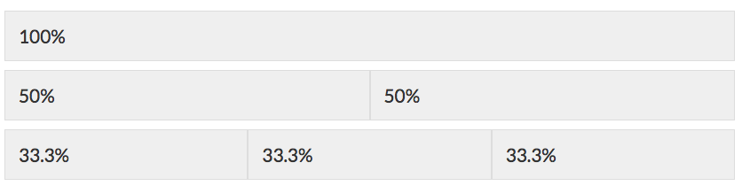
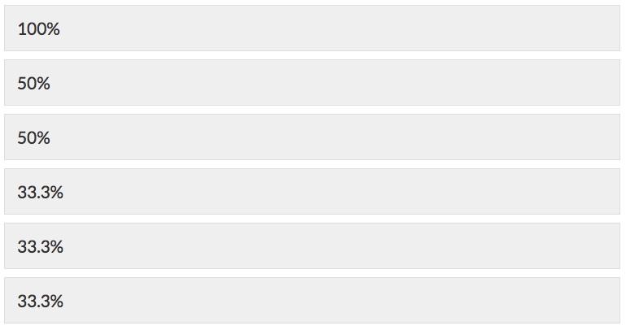
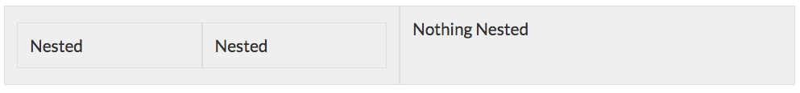
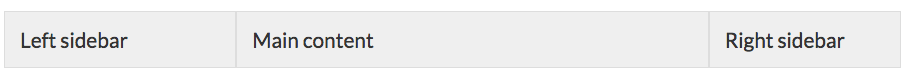
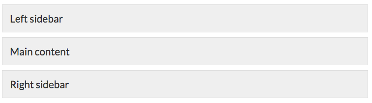
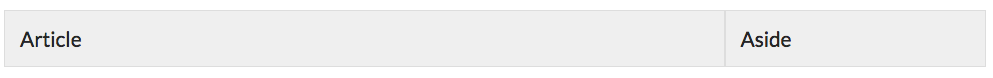

The flexbox layout module is good news for web developers everywhere. [The part where all major browsers now support it](http://caniuse.com/#feat=flexbox) is even better news. A lot of fantastic resources, documentation and tutorials have sprung up lately. [Solved by Flexbox](https://philipwalton.github.io/solved-by-flexbox/) is one of my favorites.

In the past I used very simple CSS float grids for website templating, but Flexbox is even better, and much simpler. In this quick tutorial, I will show you how to create an extremely simple, infinitely scalable responsive grid.

## The Demo

See the Pen [Easiest Flex Grid Ever](http://codepen.io/taniarascia/pen/rOLEGe/).

We have semantic options for naming the tags and classes, but I'll start off with a simple row and column based naming structure, in the vein of [Bootstrap](http://getbootstrap.com/css/#grid), [Foundation](http://foundation.zurb.com/docs/components/grid.html), [Skeleton](http://getskeleton.com), and just about every other CSS framework.

> Note that I'm only writing about the functional code. For the examples, I've added borders and background colors to the grid to make it easier to understand.

## The CSS

With only two classes - `.row` and `.column` - we can create an infinite, equally spaced grid.

```css
.row {
  display: flex;
  flex-direction: row;
  flex-wrap: wrap;
}

.column {
  flex-basis: 100%;
}

@media screen and (min-width: 800px) {
  .column {
    flex: 1;
  }
}
```

[A Guide to Flexbox](https://css-tricks.com/snippets/css/a-guide-to-flexbox/) by Chris Coyier explains Flexbox in detail. For this grid, we only use a few flex properties.

- `display: flex` defines a flex container.
- `flex-direction: row` determines the direction of each child in a flex container as left-to-right.
- `flex-wrap: wrap` will allow a multi-line flex.
- `flex-basis: 100%` specifies the initial main size of a flex item (100%).

I have my mobile breakpoint set to 800px. This grid can become more complicated and have more breakpoints, but I like to have just one for mobile/tablet (small screens) and one for desktop/laptop (large screens). Using `min-width` media queries is optimal for mobile first layout design.

The way this is set up, each column will have 100% width on mobile, and wrap down to the next column. On desktop, all the colums will be contained to a single line.

## The HTML

In a framework like Bootstrap, the grid is based on 12 columns. A 50% width column would be written something like `col-md-6`. This is much simpler.

First, create a row.

```html
<div class="row"></div>
```

Inside that row, insert a column.

```html
<div class="row">
  <div class="column">
    <!-- 100% width -->
  </div>
</div>
```

This will give you one 100% wide column. Add another column.

```html
<div class="row">
  <div class="column">
    <!-- 50% width -->
  </div>
  <div class="column">
    <!-- 50% width -->
  </div>
</div>
```

The width of each column is 100% divided by the number of columns within the flex container (`.row`). Predictably, adding another with divide once again.

```html
<div class="row">
  <div class="column">
    <!-- 33.33% width -->
  </div>
  <div class="column">
    <!-- 33.33% width -->
  </div>
  <div class="column">
    <!-- 33.33% width -->
  </div>
</div>
```

So far, we have equally dividing columns.

### Large Screen View



### Small Screen View



Also, the grid is infinitely nestable.



But that's only so useful. What if you want a [Holy Grail](http://alistapart.com/article/holygrail) layout? Or a main content with a sidebar?

Well, on the small screen view, it's still going to look the same - you still want each section to be full width. On desktop, it will be slightly different. Going with the Holy Grail example, say I want a main left sidebar that's 25% width, an advertisement sidebar on the right that's 20% width, and the 55% as the main content?

The class names can be anything, but I'm just going to name them after the percents for simplicity.

```html
<div class="row">
  <div class="column _25">
    25% Left Sidebar
  </div>
  <div class="column _55">
    55% Main Content
  </div>
  <div class="column _20">
    20% Right Sidebar
  </div>
</div>
```

The only thing that needs to be added is the `flex` property inside of your `min-width` media query.

```css
@media screen and (min-width: 800px) {
  ._25 {
    flex: 2.5;
  }
  ._55 {
    flex: 5.5;
  }
  ._20 {
    flex: 2;
  }
}
```

### Large Screen View



### Small Screen View



Finally, you're going to want to wrap the entire grid inside of a container so your content doesn't stretch to 3000 pixels wide on an iMac.

```html
<div class="container">
  <!-- rows and columns -->
</div>
```

```css
.container {
  max-width: 1200px;
  margin: 0 auto;
}
```

### Semantics

Everybody loves HTML5 semantics. Why stick with divs upon divs when we have some semantically named classes we can use instead? Rows and columns are _great_ for quick template design, but once it comes down to the final code, you want something cleaner. [Read all about HTML5 semantic tags](https://developer.mozilla.org/en-US/docs/Web/HTML/Element) if you're not overly familiar.

#### HTML

```html
<main>
  <section>
    <article>
      Article
    </article>
    <aside>
      Aside
    </aside>
  </section>
</main>
```

`main` is the `.container` div. The `main` tag is only meant to be used once in a document. `section` has replaced the `.row`. `article` and `aside` are two different `.column` classes.

#### CSS

```css
main {
  max-width: 1200px;
  margin: 0 auto;
}
section {
  display: flex;
  flex-direction: row;
  flex-wrap: wrap;
}
article,
aside {
  flex-basis: 100%;
}
@media screen and (min-width: 800px) {
  aside {
    flex: 2.5;
  }
  article {
    flex: 7.5;
  }
}
```



And now you have a perfectly functional, semantic layout based on flexbox!
