You know HTML, CSS, and JavaScript. You can make beautiful websites. Maybe you've heard about WordPress, but aren't entirely sure how to implement it, or why you might need it. Maybe a client asked for WordPress, but you're not really familiar with it. Maybe you've worked with it before, but don't know how to make your own theme from scratch. Whatever the case, this article is for you.

#### Prerequisites

All you need to start is a website. Any website will do. You don't need to know any PHP, or have any prior experience with WordPress. Your website can be custom, or built on Bootstrap/some other framework.

You _do_ need to know how to set up a local server environment. Fortunately, if you don't know how, [I wrote a short, sweet article](http://www.taniarascia.com/local-environment) about getting set up with one. It will only take a few minutes, so go ahead and do that first.

#### Goals

- Install WordPress locally
- Take an existing HTML website and convert it into a custom WordPress theme

#### Parts

I've made additional tutorials to add on to this one.

- [**Part 2**](/wordpress-from-scratch-part-two/) - Pagination, Comments, Single Post, Functions, & Custom Posts (intermediate)
- [**Part 3**](/wordpress-part-three-custom-fields-and-metaboxes/) - Custom Posts, Custom Fields and Meta Boxes (advanced)

## What can WordPress do for me?

WordPress was originally built as a blogging platform, but is now what is known as a [CMS](https://en.wikipedia.org/wiki/Content_management_system) - Content Management System.

Any website that you intend to make updates to can benefit from a CMS. If it's a blog, you want to be able to add posts. If it's a restaurant website, you want to be able to add and update menus. If it's a company website, you want to be able to update prices, packages, and so on.

If someone is paying you to make a website, it's because they don't know how or don't have time to deal with code. It needs to be as simple as possible for the client. WordPress can help with all this and more.

## Getting started: The design

I can't stress enough how much it doesn't matter what you use for your design - Bootstrap, Foundation, Skeleton, custom CSS. The point is that you have a website and you like how it looks.

I'm going to take an existing simple starter template and convert it into WordPress for this article.


[Bootstrap Blog Template](http://getbootstrap.com/examples/blog/)

This is one of the default themes on [Bootstrap's official website](http://getbootstrap.com).

I have conveniently set up a [GitHub repository of the code](https://github.com/taniarascia/bootstrapblog) that you can pull to a local directory and follow along with me.

> Don't know how to use Git/GitHub? You can remedy that by [reading my Getting Started with Git article](http://www.taniarascia.com/getting-started-with-git/). If you just want to get started without dealing with Git, just create a directory on your computer with [index.html](https://github.com/taniarascia/bootstrapblog/blob/master/index.html) and [blog.css](https://github.com/taniarascia/bootstrapblog/blob/master/blog.css) and you're ready to go.

## Installing WordPress

There are plenty of articles out there about how to install WordPress. They make the process seem long and scary, and the first time you do it, it can definitely be a bit confusing. [Here is the official guide to getting set up](http://codex.wordpress.org/Installing_WordPress).

Since we're using a [local server and MAMP](http://www.taniarascia.com/local-environment), I already know you have all the prerequisites to installation, and FTP is not necessary.

#### Create a place for WordPress to live

Make an empty directory on your computer somewhere, and point your localhost or virtual host to that directory.

#### Download WordPress

Go to [the WordPress download page](https://wordpress.org/download/) and download the latest version of WordPress.

#### Unzip WordPress

Unzip WordPress and place the contents of the folder into your directory.

#### Create a database

> Update 2017: The latest versions of MAMP do not come with phpMyAdmin preinstalled. Instead, you'll download [SequelPro](https://www.sequelpro.com/) on a Mac, or [SQLYog](https://github.com/webyog/sqlyog-community/wiki/Downloads) on Windows, both free programs. To enter the database after downloading, login to the host `locahost` (or 127.0.0.1), with username `root` and password `root`. The rest of the instructions will be the same.

Now, if you go to your local server in the browser, assuming the servers are on and everything is pointed to the right direction, you'll get this message.

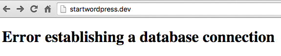

You'll learn to love that message. In MAMP, click `Open WebStart page`. Find this near the top:

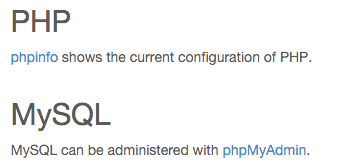

Click on phpMyAdmin. Click `Databases > create database`. I'm going to call mine **startwordpress**. That's all you need to do in phpMyAdmin!

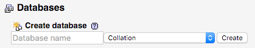

### Configure WordPress

Alright, final step. Find `wp-config-sample.php` in your directory.

[It will look exactly like this.](https://gist.github.com/taniarascia/3dd96c03b0107947d617)

Don't be nervous. Change the database name, username, and password, from this:

<div class="filename">wp-config.php</div>

```php
/** The name of the database for WordPress */
define('DB_NAME', 'database_name_here');
/** MySQL database username */
define('DB_USER', 'username_here');
/** MySQL database password */
define('DB_PASSWORD', 'password_here');
```

to this:

<div class="filename">wp-config.php</div>

```php
/** The name of the database for WordPress */
define('DB_NAME', 'startwordpress');
/** MySQL database username */
define('DB_USER', 'root');
/** MySQL database password */
define('DB_PASSWORD', 'root');
```

Find this:

```php
$table_prefix  = 'wp_';
```

And change it to literally anything else with numbers and letters. For security. `xyz_` or `735hjq9`\_, etc.

```php
$table_prefix  = 'xyz77_';
```

Go to [https://api.wordpress.org/secret-key/1.1/salt](https://api.wordpress.org/secret-key/1.1/salt/) and replace the entire 'put your unique phrase here' with that generated code.

Save the file as **wp-config.php** in your directory.

Now, when you go back to your website and refresh, you should see this screen.

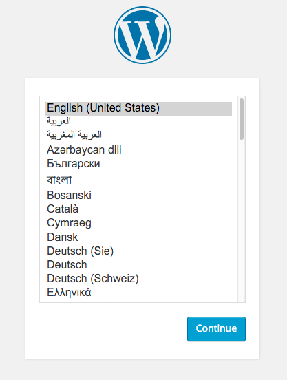

You'll have to input a few things - username, password, e-mail address, and then you're done. Congratulations, you have successfully installed WordPress! You will be redirected to **/wp-login.php**, where you can input your credentials to log into the backend. If you go to your main URL, You will see the default WordPress blog and "Hello, World!" post.

## Creating your custom theme

Outside of configuring WordPress, almost everything you do in WordPress will be in the `wp-content` folder; everything else is core code, and you don't want to mess with that.

From this point on, [the WordPress Codex](https://codex.wordpress.org/) and [StackOverflow](http://stackoverflow.com/) will become your best friends. I'll show you how to build a basic theme, but how you choose to customize your themes beyond that is totally up to you.

In Finder, follow the path of **wp-content > themes** to arrive at your themes folder. You'll see the WordPress default themes - **twentyfifteen**, **twentyfourteen**, **twentythirteen** - and **index.php**. Create a new directory for your theme; I called mine **startwordpress**.

> A WordPress theme needs only two files to exist - **style.css** and **index.php**.

In your custom theme folder, create **style.css**. It simply contains a comment that alerts WordPress that a theme exists here. Change the name, author, description, and so on.

style.css

```css
/*
Theme Name: Start WordPress
Author: Tania Rascia
Description: Bootstrap Blog template converted to WordPress
Version: 0.0.1
Tags: bootstrap
*/
```

Remember [the Bootstrap blog source code](https://github.com/taniarascia/bootstrapblog) from earlier in the article? Move those two files - `index.html` and `blog.css` - to your custom theme folder. Rename `index.html` to `index.php`.

Your theme has now been created. Go to the WordPress dashboard, and click on `Appearance > Themes`. You'll see the theme in the collection with all the default themes.

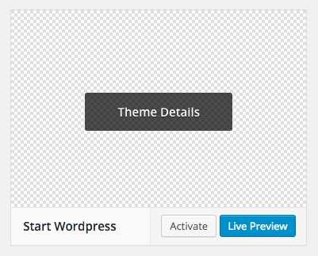

Activate the theme and go back to your main URL. Yep, it's that simple. You've technically created a custom theme already. Of course, it doesn't do anything yet beyond what a static HTML site can do, but you're all set up now.

There is one thing you might notice - `blog.css` is not being loaded. Bootstrap's main CSS and JS files are loading via [CDN](https://en.wikipedia.org/wiki/Content_delivery_network), but my local css file isn't loading. Why?

My local URL may be `startwordpress.dev`, but it's really pulling from `wp-content/themes/startwordpress`. If I link to blog.css with `<link href="blog.css">`, it tries to load `startwordpress.dev/blog.css`, which does not exist. **Learn right now that you can never link to anything in a WordPress page without some PHP.**

> Note: Chrome no longer allows `.dev` local URLs. This example will use `.dev`, but you can use `.test` or something else of your choice.

Fortunately, this is easily remedied. There's a few ways to do this, but I'll show you the easiest way to start.

Locate where you linked to the CSS stylesheet in the head of **index.php**. This is what it looks like **right now**, but we'll have to change it.

```html
<link href="blog.css" rel="stylesheet" />
```

We need to tell it to dynamically link to the themes folder. Replace the above code with the below code.

```php
<link href="<?php echo get_bloginfo('template_directory'); ?>/blog.css" rel="stylesheet">
```

If you reload the page, you'll see that CSS is now loading in. If it is not loading in, please do a hard refresh. The concept will be the same for images, javascript, and most other files you have in the themes folder, except PHP files.

If you were not successfully able to get the CSS to load, click on "View Source" and find the path of your CSS file in the code. It should be **startwordpress.dev/wp-content/themes/startwordpress/blog.css**. Make sure **blog.css** is saved in the correct location.

> Note that this is not the most correct way to load scripts into your site. It's the easiest to understand and it works, so it's how we'll do it for now.

## Dividing your page into sections

Right now, everything is in **index.php**. But obviously we want the header, footer and sidebar on all the pages to be the same, right? (Maybe some pages will have slight customization, but that comes later.)

We're going to divide **index.php** into four sections - **header.php**, **footer.php**, **sidebar.php** and **content.php**.

Here's the original [index.php](https://gist.github.com/taniarascia/9d36fd3de51fd7d99f38). Now we start cutting and pasting.

Everything from `<!DOCTYPE html>` to the main blog header will be in the header file. The header usually contains all the necessary head styles and the top navigation to the website. **The only addition I will make to the code is adding `<?php wp_head(); ?>` right before the closing `</head>`**.

<div class="filename">header.php</div>

```php
<!DOCTYPE html>
<html lang="en">

<head>
  <meta charset="utf-8">
  <meta http-equiv="X-UA-Compatible" content="IE=edge">
  <meta name="viewport" content="width=device-width, initial-scale=1">
  <meta name="description" content="">
  <meta name="author" content="">

  <title>Blog Template for Bootstrap</title>
  <link href="https://maxcdn.bootstrapcdn.com/bootstrap/3.3.5/css/bootstrap.min.css" rel="stylesheet">
  <link href="<?php echo get_bloginfo( 'template_directory' );?>/blog.css" rel="stylesheet">
  <!-- HTML5 shim and Respond.js for IE8 support of HTML5 elements and media queries -->
  <!--[if lt IE 9]>
      <script src="https://oss.maxcdn.com/html5shiv/3.7.2/html5shiv.min.js"></script>
      <script src="https://oss.maxcdn.com/respond/1.4.2/respond.min.js"></script>
    <![endif]-->
  <?php wp_head();?>
</head>

<body>

  <div class="blog-masthead">
    <div class="container">
      <nav class="blog-nav">
        <a class="blog-nav-item active" href="#">Home</a>
        <a class="blog-nav-item" href="#">New features</a>
        <a class="blog-nav-item" href="#">Press</a>
        <a class="blog-nav-item" href="#">New hires</a>
        <a class="blog-nav-item" href="#">About</a>
      </nav>
    </div>
  </div>

  <div class="container">

    <div class="blog-header">
      <h1 class="blog-title">The Bootstrap Blog</h1>
      <p class="lead blog-description">The official example template of creating a blog with Bootstrap.</p>
    </div>
```

Same deal for the footer as the header. It will include whatever visible footer you have, your JS links (for now) and `<?php wp_footer(); ?>` right before `</body>`. Since I included the `.container` div in the header, I'm going to close it in the footer.

<div class="filename">footer.php</div>

```php
</div> <!-- /.container -->

    <footer class="blog-footer">
      <p>Blog template built for <a href="http://getbootstrap.com">Bootstrap</a> by <a href="https://twitter.com/mdo">@mdo</a>.</p>
      <p>
        <a href="#">Back to top</a>
      </p>
    </footer>

    <script src="https://ajax.googleapis.com/ajax/libs/jquery/1.11.3/jquery.min.js"></script>
    <script src="https://maxcdn.bootstrapcdn.com/bootstrap/3.3.5/js/bootstrap.min.js"></script>
  <?php wp_footer(); ?>
  </body>
</html>
```

Most websites, especially blogs, will have a side area for including content such as archives, tags, category, ads, and whatnot. (Content removed for brevity.)

<div class="filename">sidebar.php</div>

```html
<div class="col-sm-3 col-sm-offset-1 blog-sidebar">
  <div class="sidebar-module sidebar-module-inset">
    <h4>About</h4>
    <p>
      Etiam porta <em>sem malesuada magna</em> mollis euismod. Cras mattis consectetur purus sit
      amet fermentum. Aenean lacinia bibendum nulla sed consectetur.
    </p>
  </div>
  <div class="sidebar-module">
    <h4>Archives</h4>
    <ol class="list-unstyled">
      <li><a href="#">March 2014</a></li>
      <!-- More archive examples -->
    </ol>
  </div>
  <div class="sidebar-module">
    <h4>Elsewhere</h4>
    <ol class="list-unstyled">
      <li><a href="#">GitHub</a></li>
      <li><a href="#">Twitter</a></li>
      <li><a href="#">Facebook</a></li>
    </ol>
  </div>
</div>
<!-- /.blog-sidebar -->
```

If the sidebar is where all the secondary information goes, the content is where all the articles and main content of the website go. (Content removed for brevity.)

<div class="filename">content.php</div>

```html
<div class="blog-post">
  <h2 class="blog-post-title">Sample blog post</h2>
  <p class="blog-post-meta">January 1, 2014 by <a href="#">Mark</a></p>

  <p>
    This blog post shows a few different types of content that's supported and styled with
    Bootstrap. Basic typography, images, and code are all supported.
  </p>
  <hr />

  <!-- the rest of the content -->
</div>
<!-- /.blog-post -->
```

#### Index

The index file should be pretty sparse now. In fact, it should only be this:

```html
<div class="row">
  <div class="col-sm-8 blog-main"></div>
  <!-- /.blog-main -->
</div>
<!-- /.row -->
```

Now we're going to add everything back in. Here's your new `index.php`.

<div class="filename">index.php</div>

```php
<?php get_header(); ?>
	<div class="row">
		<div class="col-sm-8 blog-main">
			<?php get_template_part( 'content', get_post_format() ); ?>
		</div> <!-- /.blog-main -->
		<?php get_sidebar(); ?>
	</div> <!-- /.row -->
<?php get_footer(); ?>
```

Even if you've never used PHP before, this code is all very self explanatory. `get_header();`, `get_sidebar();` and `get_footer();` are all functions that look for their respective .php files and insert the code. Of course, they all go inside their own `<?php ?>` tags to let the server know to parse them as HTML. The content function is slightly different, but it does the same thing.

If you re-load your URL, your entire site is now loaded, just as before. You will notice a top bar if you're logged in to the back end.

## Main Settings

Before we start pulling in posts and pages, we need to configure some main settings of WordPress. For example, my title right now is "The Bootstrap Blog", hard coded in HTML. I want the `<title>` and `<h1>` of my site to be changeable through the back end.

In your dashboard, go to `Settings > General`. Set your title.

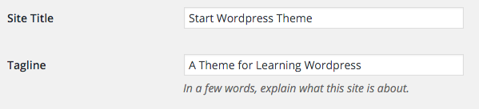

In **header.php**, change the contents of the title tag and main h1 tag to this code:

```php
<?php echo get_bloginfo( 'name' ); ?>
```

And the description to this one.

```php
<?php echo get_bloginfo( 'description' ); ?>
```

Finally, I want the title to always take me back to the main blog page. `bloginfo('wpurl');` is the code that will do that.

```php
<a href="<?php echo get_bloginfo( 'wpurl' );?>"><!-- site title --></a>
```

Here's the full code in case you're confused.

```php
<div class="blog-header">
  <h1 class="blog-title"><a href="<?php echo get_bloginfo( 'wpurl' );?>"><?php echo get_bloginfo( 'name' ); ?></a></h1>
  <p class="lead blog-description"><?php echo get_bloginfo( 'description' ); ?></p>
</div>
```

We've _finally_ made the first dynamic change to the page. The front end should reflect what you put in your settings.


Now go to **Settings > Permalinks**. By default, WordPress is set to **Day and name**, which is a really ugly URL structure. Click on **Post name** and apply the changes.

## The Loop

The most exciting part is being able to dynamically insert content, and in WordPress we do that with [The Loop](https://codex.wordpress.org/The_Loop). It's the most important function of WordPress. All of your content is generated through a loop.

In the dashboard, if you click on Posts, you will see a "Hello, world!" post in there by default. Our goal is to display that post in the blog.

The Loop itself is quite simple.

```php
<?php if ( have_posts() ) : while ( have_posts() ) : the_post(); ?>

  <!-- contents of the loop -->

<?php endwhile; endif; ?>
```

It explains itself - IF there are posts, WHILE there are posts, DISPLAY the post. Anything inside the loop will be repeated. For a blog, this will be the post title, the date, the content, and comments. Where each individual post should end is where the loop will end. We're going to add the loop to `index.php`.

Here's your new index file.

index.php

```php
<?php get_header(); ?>
	<div class="row">
		<div class="col-sm-8 blog-main">

			<?php
			if ( have_posts() ) : while ( have_posts() ) : the_post();
        get_template_part( 'content', get_post_format() );
			endwhile; endif;
			?>

		</div> <!-- /.blog-main -->

		<?php get_sidebar(); ?>
	</div> <!-- /.row -->
<?php get_footer(); ?>
```

The only thing inside your loop is **content.php**, which will contain the contents of one single post. So open **content.php** and change the contents to this:

```php

<div class="blog-post">
	<h2 class="blog-post-title"><?php the_title(); ?></h2>
	<p class="blog-post-meta"><?php the_date(); ?> by <a href="#"><?php the_author(); ?></a></p>

 <?php the_content(); ?>

</div><!-- /.blog-post -->
```

It's amazingly simple! `the_title();` is the title of the blog post, `the_date();` shows the date, `the_author();` the author, and `the_content();` is your post content. I added another post to prove at the loop is working.

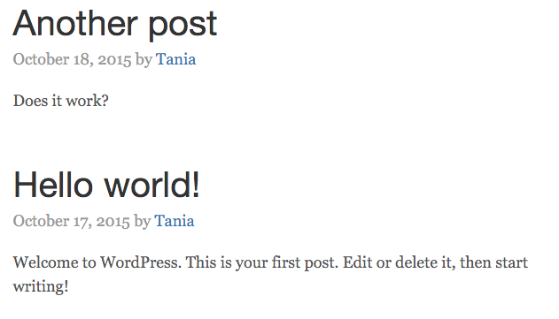

Awesome. Let's make the sidebar dynamic, as well. There should be a description and archive list in the sidebar. In the dashboard, I'm going to edit my user description to say "Front end web developer and professional nerd."

Delete all the `<li>`s under **Archives** and change it to this code.

<div class="filename">sidebar.php</div>

```php
<h4>Archives</h4>
<ol class="list-unstyled">
	<?php wp_get_archives( 'type=monthly' ); ?>
</ol>
```

For my description, I'm going to pull in metadata from my user account.

```php
<h4>About</h4>
<p><?php the_author_meta( 'description' ); ?> </p>
```

Now this content is being pulled in dynamically as well.

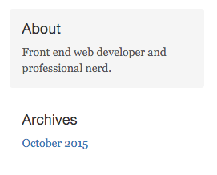

Here's my blog so far.

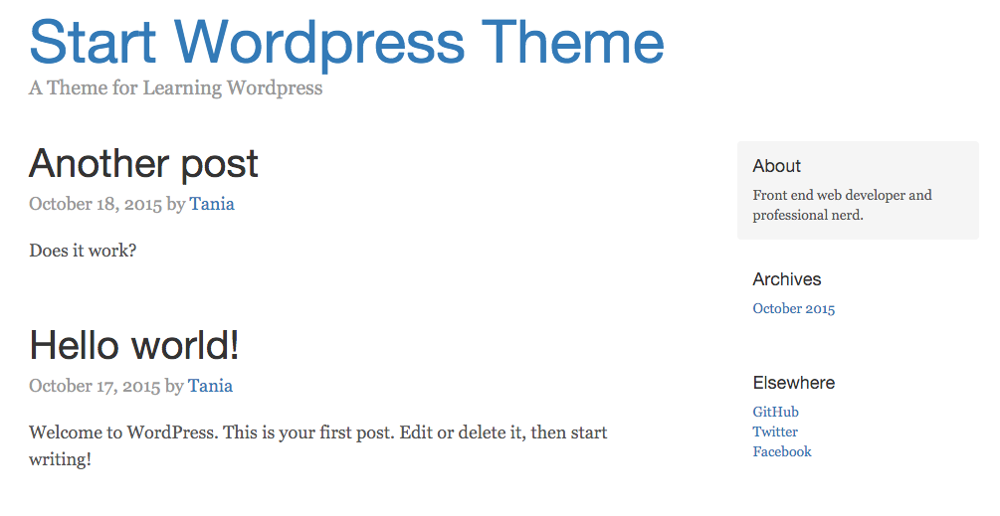

### Menu and Pages

Okay. Now we know how to make a blog, and edit some sidebar content. Only one main aspect of this page remains - the navigation, and where it leads. Well, there are two main aspects to WordPress - **Posts** and **Pages**. They're very similar in that they both use the Loop. However, pages are where you put content that isn't a blog post. This is where the CMS aspect of WordPress comes in - each individual page can be as customized as you want.

In the dashboard, I added a page so we can see two. First, we're going to edit the navbar so that the links lead to the pages. Back in **header.php**, find and change this code.

header.php

```php
<div class="blog-masthead">
	<div class="container">
		<nav class="blog-nav">
			<a class="blog-nav-item active" href="#">Home</a>
			<?php wp_list_pages( '&title_li=' ); ?>
		</nav>
	</div>
</div>
```

`wp_list_pages();` will list all the pages you have in an unordered list. `'title_li='` is telling the code not to add a "Pages" title before the list. Unfortunately for us, this looks terrible; the original blog.css has the links coded in `a` tags, not `li` tags.

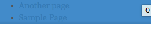

Fortunately, this is a very easy fix. I'm just going to apply the style from one to the other. Add this to **blog.css**

blog.css

```css
.blog-nav li {
  position: relative;
  display: inline-block;
  padding: 10px;
  font-weight: 500;
}
.blog-nav li a {
  color: #fff;
}
```

Now it should show up correctly. However, if the CSS is _not_ applying, please **View the source** of your HTML output and find out what the URL of your CSS is. It should be `startwordpress.dev/wp-content/themes/startwordpress/blog.css`. Make sure to do a **hard refresh**.

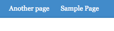

Much better.

##### Pages

I want the pages to have a different layout than the blog posts; I don't want sidebars on them. Think of `index.php` as the blog-index and `page.php` as the page-index. I'm going to create `page.php`, which will be very similar to the index except have a full 12-wide grid instead of an 8-wide content and 4-wide sidebar.

page.php

```php

<?php get_header(); ?>

	<div class="row">
		<div class="col-sm-12">

			<?php
if ( have_posts() ) : while ( have_posts() ) : the_post();

	get_template_part( 'content', get_post_format() );

endwhile; endif;
			?>

		</div> <!-- /.col -->
	</div> <!-- /.row -->

<?php get_footer(); ?>
```

When I click on my sample page, the layout is now different than the blog post layout.

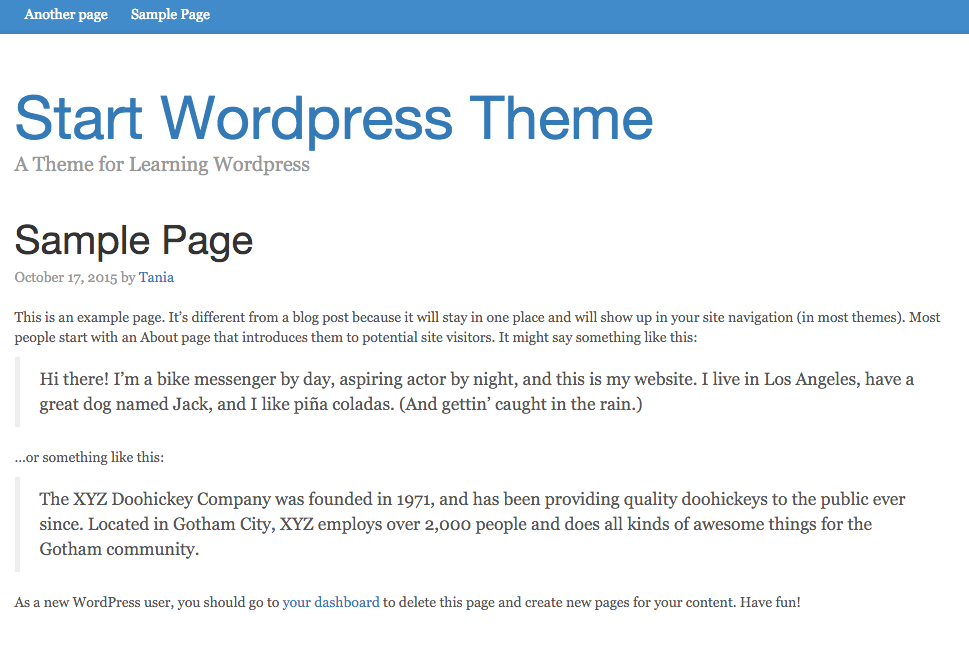

## Conclusion

There is much, much more to learn about WordPress. I sincerely hope this article opened a world of possibilities to you. Now you know that any website can be converted into a WordPress theme - without using plugins, widgets, or someone else's theme.

If something was unclear, please let me know. If I've posted any blatantly incorrect information, please let me know! Any feedback is _greatly appreciated!_ My aim was to make the article I wish I had in front of me when I first started learning how to use WordPress and PHP.

If you would like to know how to migrate this local instance to a live server, view this small tutorial:

- [Migrating WordPress](http://www.taniarascia.com/migrating-a-wordpress-site-to-a-live-server/)
- [In part two](http://www.taniarascia.com/wordpress-from-scratch-part-two), I discuss additional functionality for WordPress, such as paginaton, comments, functions, custom post types, and more. [In part three](http://www.taniarascia.com/wordpress-part-three-custom-fields-and-metaboxes/), I go over how to create custom fields and metaboxes.
