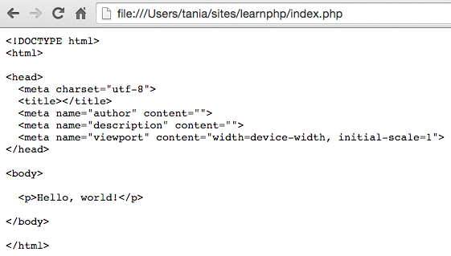
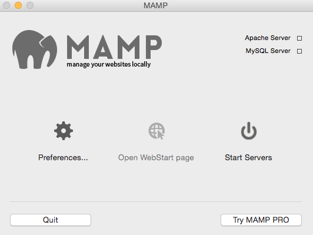
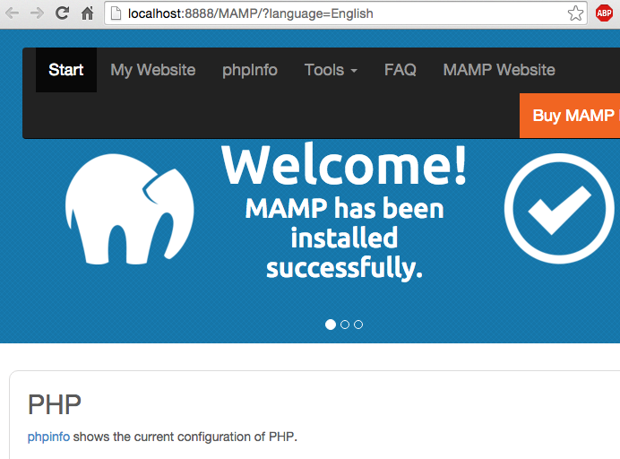
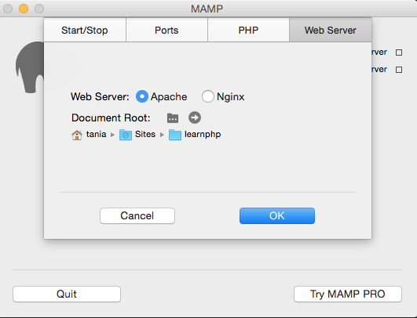
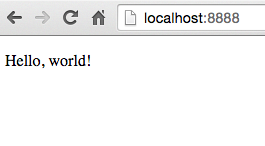
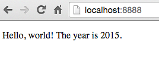

My early experiences with web design and development only involved the front end - HTML, CSS and some JavaScript. As long as I had a browser, I was set. Eventually as a web developer, you get to a point where you need to implement PHP or some other back-end language. Maybe you need to install Wordpress or some other CMS, but you have no idea how to do that or what it entails. Whatever the case, it's impossible to be a serious developer without knowing how to work with a server.

The best way to get used to working on a server is to set up a local environment on your computer. If you know HTML, CSS, and JavaScript, but have never used PHP offline, this tutorial is for you.

#### Goals

- Set up a local "LAMP Stack" style environment - `http://localhost:8888`
- Be able to run multiple servers, or "virtual hosts" - `http://custom-host.dev`

> If you would like to learn how to set up a local environment with Vagrant and VirtualBox instead, [visit this article](/what-are-vagrant-and-virtualbox-and-how-do-i-use-them/).

## A Little About PHP

Any HTML file can be a PHP file. Take any `.html` file you have right now and save it as a `.php` file and try to open it. What happens?

I just did this with a basic HTML skeleton. If I had saved the file as `index.html`, all I would see is "Hello, world!". However, I saved it as `index.php` and this is what I got.



Okay...it looks like the browser is treating my PHP file as a text file. All it's doing is spitting the code right back at me. Well, that's completely useless. How do I get it to start interpreting the code?

That's where the [LAMP stack](<https://en.wikipedia.org/wiki/LAMP_(software_bundle)>) comes in. **LAMP** stands for **L**inux, **A**pache, **M**ySQL, **P**HP(/Python/Perl). It's an open source bundle of software applications that creates a dynamic web server environment. There is also MAMP and WAMP, for Mac and Windows, respectively.

To get PHP to start working, we don't need to understand how it works, anymore than you need to understand how an internal combustion engine works to drive a car. All I want at this point is my `index.php` to start interpreting code and markup.

There are two parts to this process: part one is getting your local environment set up in the first place; part two is setting up virtual hosts so you can access multiple local environments at once.

## Part 1: Setting up a Local Environment

There are complicated ways to go about installing each component of the LAMP stack one by one - or you can download a program that does it for you. You can think of it as the difference between building your own computer from parts or buying one that's already put together. They both get you to the same end point, but perhaps you want extreme amounts of control or customizability. Well, we don't.

Whether you have a PC or a Mac, just [download MAMP](https://www.mamp.info/en/downloads/) and install it on your computer.

Once the installation is complete and you open it, you end up at a screen like this.



Now click on `Start Servers`. If you're not in the administrator account, you might be prompted for the admin password. Once it's glowing green, everything is good to go. MAMP should open the WebStart page in a new tab in your browser. If not, you can click on `Open WebStart page` and it should take you to a page like this.



If you got a page like this, congratulations. You now have a local server and can run all the PHP you want. Go to `Preferences > Web Server`. Click on the folder next to document root and choose the directory you decided to place your PHP file in from earlier. Mine was `sites/learnphp`.



Now I'm going to go to `http://localhost:8888` in my browser. What happens?



It's rendering the code! PHP is being parsed by all that stuff in the LAMP stack, and outputting regular HTML. But, we only had HTML to begin with. I want some sort of proof that this was all worth it. What's something simple that HTML can't do that PHP can?

> Note for Windows users: the URL will simply be `localhost`, without the :8888.

The absolute beauty of PHP is that it can be inserted anywhere into HTML. Anything that goes inside the opening tag of `<?php` and the closing tag of `?>` work it's magic on your server and return HTML.

I'm going to change my "Hello, world!".

```php
<p>Hello, world! The year is <?php echo date('Y'); ?>.</p>

```

The code `<?php echo date('Y'); ?>` uses a date function to find the year. The HTML interpreted is just "2015".



That concludes the scope of this article - learning how to set up a local server environment and being able to run PHP.

## Part 2: Setting Up Virtual Hosts

In the next part, I'm going to show you how to have a multi-environment setup.

[Setting up virtual hosts](http://www.taniarascia.com/setting-up-virtual-hosts)
