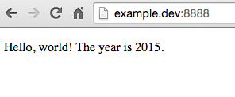
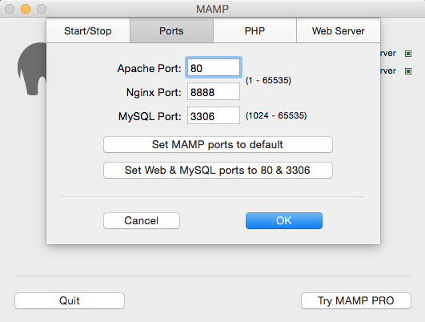
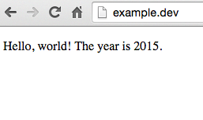

Did you read about [how to set up a local server environment](http://www.taniarascia.com/local-environment), or do you already know how to do that? The next step is setting up [virtual hosts](https://httpd.apache.org/docs/2.2/vhosts/). I've found most - if not all - of the resources and tutorials about setting up virtual hosts to be lacking. I'm going to set it up for the first time on the laptop I'm on, so I'll be able to guarantee every step.

At this point, MAMP is set up, and going to `http://localhost:8888` will take you to the document root you set.

## Allow virtual hosts

### Mac

In Finder, go to `Applications > MAMP > conf > apache > httpd.conf` and open the file with your text editor.

Find this line:

```apacheconf
# Virtual hosts
#Include /Applications/MAMP/conf/apache/extra/httpd-vhosts.conf
```

Uncomment the code by removing the [hash symbol](https://en.wiktionary.org/wiki/octothorpe).

```apacheconf
# Virtual hosts
Include /Applications/MAMP/conf/apache/extra/httpd-vhosts.conf
```

### Windows

In File Explorer, go to **C:/ > MAMP > conf > apache > httpd.conf** and open the file with your text editor.

Find this line:

```apacheconf
# Virtual hosts
    #Include conf/extra/httpd-vhosts.conf
```

Uncomment the code.

```apacheconf
# Virtual hosts
Include conf/extra/httpd-vhosts.conf
```

## Allow SymLink Override

Find this line in that same `httpd.conf` file.

```apacheconf
<Directory />
    Options Indexes FollowSymLinks
    AllowOverride None
</Directory>
```

You're going to change **None** to **All**.

```apacheconf
<Directory />
  Options Indexes FollowSymLinks
  AllowOverride All
</Directory>
```

## 3. Add the virtual host path

First of all, open MAMP, and ensure the document root is **Applications > MAMP > htdocs**. This is the default, but if you've been using localhost, you may have moved it.

All the way at the end of the **extra/httpd-vhosts.conf** file, you're going to place a code that signifies a virtual host and specifies the path. Place this code at the end of the document.

```apacheconf
<VirtualHost *:80>
  ServerName example.dev
  DocumentRoot "/path/to/directory"
</VirtualHost>
```

Change the `DocumentRoot` to wherever your PHP project is located. This is my path, but yours will of course be different.

> As of 2017, Chrome no longer allows `.dev` domain endings for local websites. Consider using `.test` instead.

### Mac

```apacheconf
DocumentRoot "/Users/tania/sites/learnphp"
```

### Windows

```apacheconf
DocumentRoot "C:/Users/tania/sites/learnphp"
```

> Make sure to restart the servers on MAMP after making any changes! If you don't reset the server to apply the changes, nothing will work even though you know you've done everything right. Trust me, I've done that too many times.

## Allow your computer to recognize your local domain

### Mac

Open the Terminal application. It doesn't matter if you don't know how to use Terminal or the command line; you only need to follow strict commands right now. (However, please read [this guide](/how-to-use-the-command-line-for-apple-macos-and-linux/) when you decide to learn it!)

Type this in Terminal.

```bash
sudo pico /etc/hosts
```

You will be prompted for your password. Then a scary screen will come up that looks like this.

```terminal
##
# Host Database
#
# localhost is used to configure the loopback interface
# when the system is booting.  Do not change this entry.
##
127.0.0.1       localhost
255.255.255.255 broadcasthost
::1             localhost
fe80::1%lo0     localhost

127.0.0.1       example.dev
```

You are actually editing a text based file. At this point, I'm just going to keep pressing the down arrow until I reach the end of the list. At the next line, I will type my new server name after `127.0.0.1`, which is the computer's local address.

```bash
127.0.0.1 example.dev
```

Now press ctrl + o - Not cmd + o - to save the file. Press enter to confirm. And press ctrl + x to exit.

### Windows

If Notepad is open, close out of it. This time right click on Notepad and select "Open as Administrator". Open this file in Notepad:

```bash
C:\WINDOWS\system32\drivers\etc\hosts
```

At the bottom of the file, type the name of your virtual host.

```bash
127.0.0.1 example.dev
```

> At this point, the Window's installation of Virtual Hosts is complete! Go to example.dev in your browser. Make an index.php file with the contents `<?php echo 'Hello, world!' ?>` and place it in the directory to test.

## Remove :8888 from custom server URL

Almost done! After restarting your MAMP server, you can go to `http://example.dev:8888` and it will take you to your path.



That's pretty good. But, I want to make this perfect. I want to remove the :8888 from the end of the URL.

Back in the **httpd.conf** file, find these two instances (they won't be next to each other):

```apacheconf
Listen 8888
ServerName localhost:8888
```

And change them to this:

```apacheconf
Listen 80
ServerName localhost:80
```

Save the file. Finally, in MAMP, `Preferences > Ports`, change the ports to 80, 8888, and 3306.



Restart your servers and try `http://example.dev` in your browser.



And now it works! You can repeat the code as many times as you want, for as many virtual hosts as you want.

```apacheconf
<VirtualHost *:80>
  ServerName website1.dev
  DocumentRoot "path/to/website1"
</VirtualHost>

<VirtualHost *:80>
  ServerName website2.dev
  DocumentRoot "path/to/website2"
</VirtualHost>
```

If the above example doesn't work, try removing `:80` from the VirtualHosts tag, as this seemed to fix the problem for anyone having an issue.