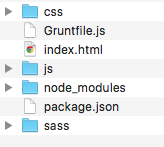

You've probably heard of [Grunt](http://gruntjs.com/), the JavaScript task runner that runs on [Node.js](https://nodejs.org/en/). Maybe you've tried to get it up and running, but got lost or confused during setup. Maybe you know of it, but aren't sure how it can be useful or if it's worth the time invested. 

I'm going to show you how Grunt can be useful, and I'm not going to throw command lines at you and assume what you might already have installed. I'll let you know exactly what you need to install, and in what order, to start optimizing your workflow.

#### Prerequisities

- Ability to make a website with HTML, CSS, and JavaScript.
- A very basic knowledge of the [command line](/how-to-use-the-command-line-for-apple-macos-and-linux/).

If you think you can follow along without reading that, here are the most important commands, and all you need to know to get started.

- `pwd` **Print Working Directory** – shows the exact directory you're working in.
- `ls` **List Directories** – lists all the files and folders in your current directory.
- `cd` **Change Directory** – change to another directory.

#### Goals

- Understand enough about Node.js to get Grunt up and running
- Create a [Sass](http://sass-lang.com/) project
- Utilize Grunt to compile multiple Sass files into one CSS file, apply prefixes, and minify.
- Minify your JavaScript.
- Run one command that will watch your entire directory for changes

## What is a task runner?

[Grunt](http://gruntjs.com/) and [Gulp](http://gulpjs.com/) are currently the two most popular JavaScript task runners. The purpose of a task runner is to automate all your processes so you don't have to think about them.

For us, this is going to be compiling our CSS preprocessor - Sass in this case, but the steps are the same for [LESS](http://lesscss.org/) - apply [vendor prefixes](https://developer.mozilla.org/en-US/docs/Glossary/Vendor_Prefix) for cross-browser compatibility, and [minify the CSS](https://developers.google.com/speed/pagespeed/service/MinifyCSS) for speed. We'll also be minifying JavaScript.

## What is Node.js?

JavaScript is, and has always been, a [client-side](https://en.wikipedia.org/wiki/Client-side_scripting) programming language, which means it's processed by the browser. With the advent of Node.js, JavaScript can also be used as a [server-side](https://en.wikipedia.org/wiki/Server-side_scripting) language. Grunt runs in this environment.

## How about npm?

Ah, [npm](https://www.npmjs.com/) - Node Pacakage Manager. Don't let this be a source of confusion for you. Npm is just the package manager for Node.js, which just means it's the tool to connect to the giant repository containing all the Node.js programs, plugins, modules and so on. Use the `npm` command to install everything that runs on Node.js.

> The most important thing to learn about npm is the difference between local and global installs. Understand right now that _you can't do everything globally with npm!_ I cannot stress this enough. It was the basis of all my confusion when I was learning.

## Local vs. Global

There has to be a local and global version of npm - it's just the way it is. Don't fight it. What does that mean? It means we're going to install Grunt CLI globally - so I can run grunt in the command line at any time - and all the plugins and packages will go into local installs. If I'm working on mypersonalblog.com and clientwebsite.com, they both need their own npm install. I'm sorry. This is not a simple concept to understand at first. I certainly didn't.

The command for local npm is `npm`, and the command for global npm is `npm -g`. Anything we do with `-g` affects your whole computer, and any regular `npm` command will only affect the current working directory.

## Installation

Here are all the steps to get everything up and running.

### Install Ruby

Sass runs on Ruby, so we need to have that installed. The [Ruby programming language](<https://en.wikipedia.org/wiki/Ruby_(programming_language)>) is already preinstalled on OSX. You can check this by opening Terminal and typing `ruby -v` to check the Ruby version number you have installed.

```
ruby -v
```

```terminal
Ruby 2.0.0p645 (2015-04-13 revision 50299) [universal.x86_64-darwin15]
```

> If you use a lot of Ruby, [RVM (Ruby Version Manager)](https://rvm.io/) is recommended. I don't, so I don't care. You probably don't need to, either.

### Install Sass

You can also run `sass -v` to see if you have Sass installed already. If not, install it now.

```bash
sudo gem install sass
```

```terminal
Fetching: sass-3.4.19.gem (100%)
Successfully installed sass-3.4.19
Parsing documentation for sass-3.4.19
Installing ri documentation for sass-3.4.19
1 gem installed
```

### Install XCode

XCode is a free download from the app store. You can check if you have XCode installed already by typing `make` in the Terminal. After you download it, install Command Line Tools: **Preferences > Downloads > Command Line Tools**. This is necessary for the next step. (Note: This step is no longer necessary as of 2017 - Homebrew will install XCode Command Line Tools for you.)

### Install Homebrew

[Homebrew](http://brew.sh/) is a useful program for installing other programs. So meta. Type this into the command line.

```bash
/usr/bin/ruby -e "$(curl -fsSL https://raw.githubusercontent.com/Homebrew/install/master/install)"
```

Follow the steps - you'll have to agree to installing brew and enter your password. You can type `brew doctor` to verify that Homebrew has been successfully installed.

### Install Node.js

We're going to use Homebrew to install Node.js.

```bash
brew install node
```

### Install Grunt CLI globally

Finally, we can install Grunt. We're not actually installing Grunt, but the Grunt command line interface (CLI). This basically just allows your computer to recognize the `grunt` command at all times. However, without a local install, you can't actually use Grunt.

```bash
npm install -g grunt-cli
```

Here's the good news: everything you just did, you won't have to do again. Node.js is installed, Homebrew, XCode, Sass, Ruby. Maybe you'll have to update them every now and then, but the point is that you have them. This is going to help with a lot of installations in the future.

Everything from here on out is going to have to be done on a project-by-project basis.

### Create package.json in a local directory

Alright, now we start learning the Grunt and npm specifics. Any project that runs on Node.js requires a package.json. If you've never seen or used a [JSON](https://en.wikipedia.org/wiki/JSON) (JavaScript Object Notation) file before, don't be too concerned. It's basically JavaScript.

[There's a lot to know about package.json](https://docs.npmjs.com/files/package.json), but you can figure that out as you go along.

Go to your local directory. Mine is `Users/tania/sites/startgrunt`. Here's the Terminal command I'll use to move to that directory.

```bash
cd sites/startgrunt
```

Create a file and save it as package.json.

```js
{
  "name": "startgrunt",
  "version": "0.0.1",
  "description": "Learning Grunt and Sass",
  "license": "MIT",
  "devDependencies": {
    "grunt": "~0.4.5",
    "grunt-contrib-sass": "latest",
    "grunt-postcss": "latest",
    "autoprefixer": "latest",
    "grunt-contrib-cssmin": "latest",
    "grunt-contrib-uglify": "latest",
    "grunt-contrib-watch": "latest"
  }
}
```

The first several entries are self-explanatory. `name` is the name of your project; you can give it a `version` number, `description` and a `license` to cover all your legal bases.

`devDependencies` are the plugins your project depends on to function. Package.json is very cool, because you can define them all here, and when you install npm, it will install all of your plugins along with it. I'm putting the current version of Grunt, which is 0.4.5. I'm just going to tell it to install the latest version of each individual plugin. I'm sure there might be a specific case where you'd want to install a specific, older version, but I can't see why we would do that in this situation.

The packages we're installing:

- [grunt-contrib-**sass**](https://github.com/gruntjs/grunt-contrib-sass) - compile Sass to CSS
- [grunt-**postcss**](https://github.com/nDmitry/grunt-postcss) - apply several post-processors to your CSS using PostCSS
- [**autoprefixer**](https://github.com/postcss/autoprefixer) - add-on to PostCSS
- grunt-contrib-**cssmin** - minify CSS
- [grunt-contrib-**uglify**](https://github.com/gruntjs/grunt-contrib-uglify) - minify files with UglifyJS
- [grunt-contrib-**watch**](https://github.com/gruntjs/grunt-contrib-watch) - run predefined tasks whenever watched file patterns are added, changed or deleted

So, what if I created my package.json and installed npm but forgot to include postcss? Or decide later I want to add a new plugin to my project? No problem. This will be the code.

```bash
npm install --save-dev grunt-postcss
```

### Create a local npm install in a local directory

Now you'll create your local npm install, which will create a folder called `node_modules` in your directory. That folder will contain Grunt and all the Grunt plugins.

```bash
npm install
```

```terminal
npm WARN package.json startgrunt@0.0.1 No repository field.
npm WARN package.json startgrunt@0.0.1 No README data
```

This might come up, which doesn't matter. Grunt wants you to have a README.md and a repository set. You can choose to create one and add it to your package.json, but it's not required. Here's the code for that.

```js
"repository": {
    "type": "git",
    "url": "https://github.com/taniarascia/startgrunt.git"
}
```

Terminal will go through and install all the plugins, and then you'll have your **node_modules** folder all set and ready to go.

## Creating your Gruntfile

Everything that Grunt will do is to be defined by you in **Gruntfile.js**. This will be the final step in your Grunt process.

There are four parts: loading grunt, defining your tasks, loading the plugins, and registering the tasks.

### Load Grunt

First, load Grunt. You don't even have to think about this one; just paste it at the top.

```js
module.exports = function (grunt) {
	grunt.initConfig({
		pkg: grunt.file.readJSON('package.json'),
	});
```

## Tasks

Tasks come next. We'll get to the tasks after I explain the rest of the basic setup.

### Load Grunt Plugins

With the loadNpmTasks functions, we'll be loading in all the plugins we installed earlier with package.json. I won't load the PostCSS add-ons here, as they go in the individual task.

```js
// Load Grunt plugins
grunt.loadNpmTasks('grunt-contrib-sass')
grunt.loadNpmTasks('grunt-postcss')
grunt.loadNpmTasks('grunt-contrib-cssmin')
grunt.loadNpmTasks('grunt-contrib-uglify')
grunt.loadNpmTasks('grunt-contrib-watch')
```

### Register Grunt tasks

Finally, register your task. The `'default'` task is what will run when you type `grunt` into the command line in your local project. The only task I'm going to run is `'watch'`, because all the rest of my plugins will compile into that task. Close all your brackets at the end of the file.

```js
	// Register Grunt tasks
    	grunt.registerTask('default', ['watch']);
    };
```

Here is your compiled `Gruntfile.js` skeleton.

```js
// Load Grunt
module.exports = function(grunt) {
  grunt.initConfig({
    pkg: grunt.file.readJSON('package.json'),
    // Tasks
  })
  // Load Grunt plugins
  grunt.loadNpmTasks('grunt-contrib-sass')
  grunt.loadNpmTasks('grunt-postcss')
  grunt.loadNpmTasks('grunt-contrib-cssmin')
  grunt.loadNpmTasks('grunt-contrib-uglify')
  grunt.loadNpmTasks('grunt-contrib-watch')

  // Register Grunt tasks
  grunt.registerTask('default', ['watch'])
}
```

## Project Setup

The project setup is going to be very simple. We just want to make sure it _works._ The specifics can come later. I'm just going to make an **index.html** that links to **css/style.min.css** and **js/script.min.js**. I'm going to make two Sass files to compile into one minified CSS file, and minify my script.js as well.

Here's the directory setup.



Any Sass file (which has a **.scss** extension) is valid CSS, you're good to go here even if you don't know any Sass yet. [The Sass Guide](http://sass-lang.com/guide) is a great introduction.

In my **sass** directory, I'm going to make these two files.

**sass/\_base.scss** - setting variables.

```scss
// Variables

$header-size: 2em;
$font-color: #343434;
$content-width: 1200px;
```

**sass/style.scss** - importing variables and setting styles.

```scss
@import 'base';

main {
  max-width: $content-width;
  margin: 0 auto;
  color: $font-color;
  display: flex;
  h1 {
    font-size: $header-size;
  }
}
```

**src/script.js** - alert on button click.

```js
;(function($) {
  $(function() {
    $('button').click(function() {
      alert('jQuery alert!')
    })
  })
})(jQuery)
```

**index.html** - putting it all together.

```html
<!DOCTYPE html>
<html>
  <head>
    <meta charset="utf-8" />
    <title>Start Grunt</title>
    <meta name="viewport" content="width=device-width, initial-scale=1" />
    <link href="css/style.min.css" rel="stylesheet" />
  </head>

  <body>
    <main>
      <h1>Start Grunt</h1>
      <p>Hello, world!</p>

      <button>Press me</button>
    </main>

    <script src="https://ajax.googleapis.com/ajax/libs/jquery/2.1.4/jquery.min.js"></script>
    <script src="js/script.min.js"></script>
  </body>
</html>
```

## Grunt Tasks

We're going to set up all the tasks. Anytime you see an asterisk, it means "apply to any file" in that directory.

### Sass

I'm going to tell the Sass plugin to take any file in the **sass** directory, and compile it into the same named file in the **css** directory. I'm turning off the "sourcemap" option, because I don't need it.

> **src** will always be your source file location for development.
> **dist** or **dest**, for distribution or destination, is where the final production file ends up.

```js
sass: {
  dist: {
    options: {
      sourcemap: 'none'
    },
    files: [{
      expand: true,
      cwd: 'sass',
      src: ['**/*.scss'],
      dest: 'css',
      ext: '.css'
  }]
  }
},
```

### PostCSS

I'm going to pull in autoprefixer to add vendor prefixes and minify my CSS. I'm also turning off the maps here.

```js
postcss: { // Begin Post CSS Plugin
  options: {
    map: false,
    processors: [
  require('autoprefixer')({
        browsers: ['last 2 versions']
      })
]
  },
  dist: {
    src: 'css/style.css'
  }
},
```

### CSSMin

CSSMin to minify CSS files.

```js
cssmin: { // Begin CSS Minify Plugin
  target: {
    files: [{
      expand: true,
      cwd: 'css',
      src: ['*.css', '!*.min.css'],
      dest: 'css',
      ext: '.min.css'
}]
  }
},
```

### UglifyJS

UglifyJS to minify JavaScript files.

```js
uglify: { // Begin JS Uglify Plugin
  build: {
    src: ['src/*.js'],
    dest: 'js/script.min.js'
  }
},
```

### Watch

Here's the most important task of all (in my opinion) - the watch task. Everything that I've previously told Grunt to do, I will now stick into a single command. When I run this command, Grunt will watch for any file changes and apply all the plugins.

```js
watch: { // Compile everything into one task with Watch Plugin
  css: {
    files: '**/*.scss',
    tasks: ['sass', 'postcss', 'cssmin']
  },
  js: {
    files: '**/*.js',
    tasks: ['uglify']
  }
}
```

Here's your completed Gruntfile.js.

```js
// Load Grunt
module.exports = function(grunt) {
  grunt.initConfig({
    pkg: grunt.file.readJSON('package.json'),

    // Tasks
    sass: {
      // Begin Sass Plugin
      dist: {
        options: {
          sourcemap: 'none',
        },
        files: [
          {
            expand: true,
            cwd: 'sass',
            src: ['**/*.scss'],
            dest: 'css',
            ext: '.css',
          },
        ],
      },
    },
    postcss: {
      // Begin Post CSS Plugin
      options: {
        map: false,
        processors: [
          require('autoprefixer')({
            browsers: ['last 2 versions'],
          }),
        ],
      },
      dist: {
        src: 'css/style.css',
      },
    },
    cssmin: {
      // Begin CSS Minify Plugin
      target: {
        files: [
          {
            expand: true,
            cwd: 'css',
            src: ['*.css', '!*.min.css'],
            dest: 'css',
            ext: '.min.css',
          },
        ],
      },
    },
    uglify: {
      // Begin JS Uglify Plugin
      build: {
        src: ['src/*.js'],
        dest: 'js/script.min.js',
      },
    },
    watch: {
      // Compile everything into one task with Watch Plugin
      css: {
        files: '**/*.scss',
        tasks: ['sass', 'postcss', 'cssmin'],
      },
      js: {
        files: '**/*.js',
        tasks: ['uglify'],
      },
    },
  })
  // Load Grunt plugins
  grunt.loadNpmTasks('grunt-contrib-sass')
  grunt.loadNpmTasks('grunt-postcss')
  grunt.loadNpmTasks('grunt-contrib-cssmin')
  grunt.loadNpmTasks('grunt-contrib-uglify')
  grunt.loadNpmTasks('grunt-contrib-watch')

  // Register Grunt tasks
  grunt.registerTask('default', ['watch'])
}
```

## Run grunt command

In the root of your directory, run this command in Terminal.

```bash
grunt
```

You'll get this response.

```terminal
Running "watch" task
Waiting...
```

Now save a file in your **sass** directory.

```terminal
>> File "sass/_base.scss" changed.
Running "sass:dist" (sass) task

Running "postcss:dist" (postcss) task
>> 1 processed stylesheet created.

Running "cssmin:target" (cssmin) task
>> 1 file created. 100 B ? 72 B

Done, without errors.
```

And save the JavaScript file in your **src** directory.

```terminal
>> File "src/script.js" changed.
Running "uglify:build" (uglify) task
>> 1 file created.
```

That was a lot of steps. No wonder you didn't want to do this before.

I've [set up a GitHub repository](https://github.com/taniarascia/startgrunt) of the project for you to play with.

- [View source on GitHub](https://github.com/taniarascia/startgrunt)
