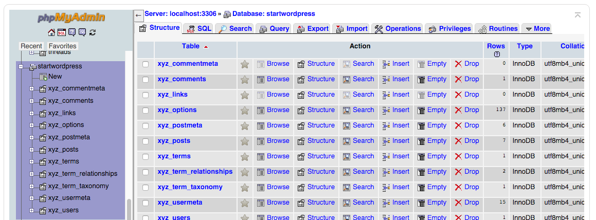
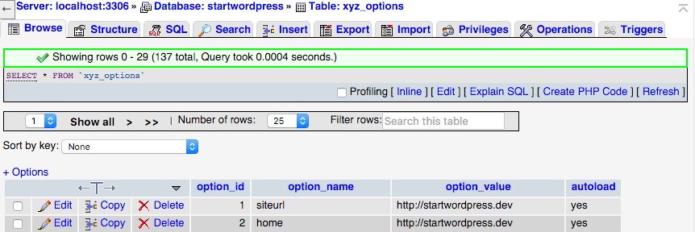
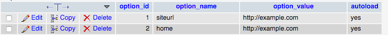
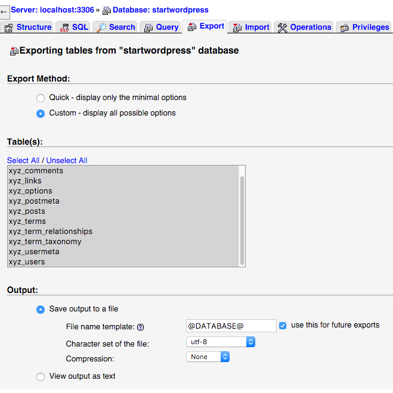
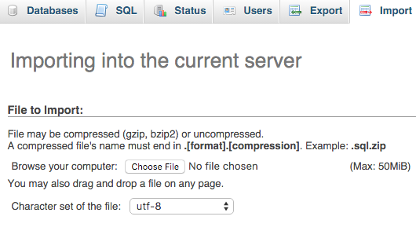

If you already know [how to set up a local server](http://taniarascia.com/local-environment) and get WordPress up and running, migrating to a live server is extremely simple. We'll avoid the dreaded "Error establishing a database connection" once and for all.

#### Prerequisites

- A local WordPress install
- A web server that supports PHP and MySQL

#### Goal

- Migrate WordPress from a local to live server

> Note that this tutorial doesn't cover all use cases, but is a foundation for transferring a simple website. Certain plugins and functions might require more specific migration steps, which can be found [in the WordPress codex](https://codex.wordpress.org/Moving_WordPress).

## Migrating WordPress

So, you already have a WordPress site set up, and you just want to push it to your server. You can do this through [Git and SSH](http://www.taniarascia.com/getting-started-with-git/), but for the sake of simplicity I'm just going to use [(S)FTP](https://en.wikipedia.org/wiki/File_Transfer_Protocol).

### Export your database to the live server

You may have been using phpMyAdmin in MAMP for your database needs. You could also be using a program such as [SequelPro](http://www.sequelpro.com/) for Mac, or [SQLYog](https://www.webyog.com/) on Windows. Chances are, your host has phpMyAdmin access, or a similar open source GUI, so I would recommend using that to start.

Open phpMyAdmin in MAMP, and click on the database you have WordPress installed in. Mine was **startwordpress**.



Click on the \_options table. Your prefix may vary. The default is `wp_options`, but in my case it's `xyz_options`.

At the top, click on **Browse**.



You will need to change two rows in the table - **siteurl** and **home**. Sometimes they're right next to each other, and sometimes you have to look for them. In this case, they're conveniently located right next to each other.

I had my URL set to **http://startwordpress.dev** while I was working on it in MAMP. Now I'll point it at my server, **http://example.com**.



Your local site will no longer work at this point. You can change the values back and it will work again. Now that that's set, go back to your database and click **Export** at the top. Select **Custom**, **Save output to a file**.

> Note that if your server is running an old version of MySQL, you might have to change "Database system or older MySQL server to maximize output compatibility with:" and set NONE to MYSQL40.



Select **Go** at the bottom, and **yourdatabase.sql** will download.

### Import your database to the live server

Find phpMyAdmin in your server. It should look basically the same as the MAMP version. Create a new database, and this time you're going to choose **Import**. Choose file and import **yourdatabase.sql**.

Where your server lists the information for FTP, it will also list your user and password for MySQL. You need a user to connect to MySQL, so make sure to find this information. If you haven't created a user before, find out where to do this and create one.



### Upload your files to the server

This one is easy if you've ever uploaded any sort of file to a server. You'll just use a program like [FileZilla](https://filezilla-project.org/) or [Transmit](https://panic.com/transmit/). Copy all the files over to the directory you want it to show up in. Usually it's called public on a web server.

### Change your WordPress configuration.

Before, you created a file called **wp-config.php** in the root of the WordPress install. For your local version, it looked like this:

```php
/** The name of the database for WordPress */
    define('DB_NAME', 'startwordpress');
    /** MySQL database username */
    define('DB_USER', 'root');
    /** MySQL database password */
    define('DB_PASSWORD', 'root');
```

On your live server, change these three options to match your live server database, user and password.

```php
/** The name of the database for WordPress */
    define('DB_NAME', 'startwordpress');
    /** MySQL database username */
    define('DB_USER', 'dbusername');
    /** MySQL database password */
    define('DB_PASSWORD', 'dbpassword');
```

> `define('DB_HOST', 'localhost');` will most likely remain the same, but some hosts create a different host for databases.

Now if you go to your URL, it should all be loading properly! Load the WordPress backend, click **Settings > Permalinks** and update permalinks.

### Update permissions

In FTP, migrate to your **wp-uploads** folder, and change the permissions to "666". This will allow you to upload media.

### Find and replace URLs in database

If you have some posts where you refer to links by URL, you might have to change them. The [Better Search Replace](https://wordpress.org/plugins/better-search-replace/) plugin is a wonderful tool that allows you to search your entire database for instances of a "string", and replace them.

Be sure to backup your database before applying any changes.
