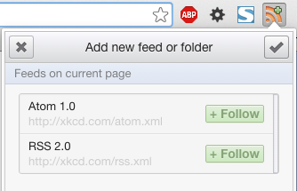
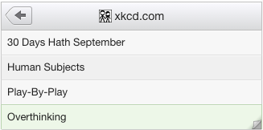
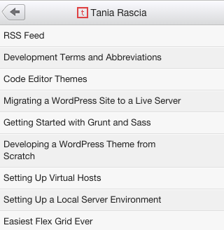
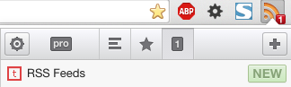

I've always seen RSS feed buttons all over the web, but I didn't understand what they were for or how to use them until now. You might think a simple Google search would clear it up, but most of the hits are woefully out of date.

[Google explains RSS in "Feed 101"](https://support.google.com/feedburner/answer/79408?hl=en) - except they link to [Google Reader](http://www.google.com/reader/about/), which happens to be discontinued.

Surely [WhatIsRSS.com](http://www.whatisrss.com/) would be the definitive source, but it's also a host of broken links.

Let's clear up a few things.

## What is RSS?

[RSS](https://en.wikipedia.org/wiki/RSS) is **Rich Site Summary**, or **Really Simple Syndication**.

The concept? You don't have time to visit each and every blog and website you like every day to find out if they've updated their content. Subscribe to a feed, and your feed reader will alert you every time a new post is added.

RSS Feeds are displayed as an XML file.

## How can I follow RSS Feeds?

Simple. If you use Chrome, install and enable the [RSS Feed Reader](https://chrome.google.com/webstore/detail/rss-feed-reader/pnjaodmkngahhkoihejjehlcdlnohgmp?hl=en) extension. Firefox has a [Simple RSS Reader](https://addons.mozilla.org/en-US/firefox/addon/simple-rss-reader-srr/) extension as well.

The feed reader can sometimes detect if there's a feed on the website you're currently at, in which case a `+` will appear on the icon. For example, I went to [xkcd.com](http://xkcd.com), and two feeds appeared in my Chrome reader - Atom and RSS. It doesn't really matter which one you follow. I chose RSS to keep it consistent.

Now XKCD shows up in my list of feeds, and I can see the most recent posts. When a new post is added, it will alert me.

If the feed reader can't detect the site, you can easily manually add it. Note the handy RSS button in the top right of this blog. Click on it, and you'll be taken to [http://taniarascia.com/feed](http://www.taniarascia.com/feed/). This takes you to an awful, unreadable XML file.

The feed reader can now detect the website, add indicated by the `+` on the icon. You can choose to press `+ Follow`, or manually paste the URL (`taniarascia.com/feed`) into "Add feed".

Now you'll see an overview of the last several posts, and if you click on them you'll be taken to that particular post page.

## How will I get alerted?

Here is how the alert showed up after I made this blog post.

### How can I add an RSS feed to my blog?

If you have WordPress, and your permalinks are set to "Post name", simply add `/feed` to your URL, and that's your feed. If you don't have WordPress, [WikiHow](http://www.wikihow.com/Create-an-RSS-Feed) has a good article on the different ways to create feeds.

## Conclusion

Is this the only way to view RSS Feeds? Absolutely not. But it's simple, and it works. You're most likely going to be on your browser every day, and you can choose to check if there are any new feeds or not. You can also have feeds sent to your e-mail or view them in feed reading websites, but this seems to be the simplest and most effective way to me. If you use RSS feeds in a different way, let me know!
