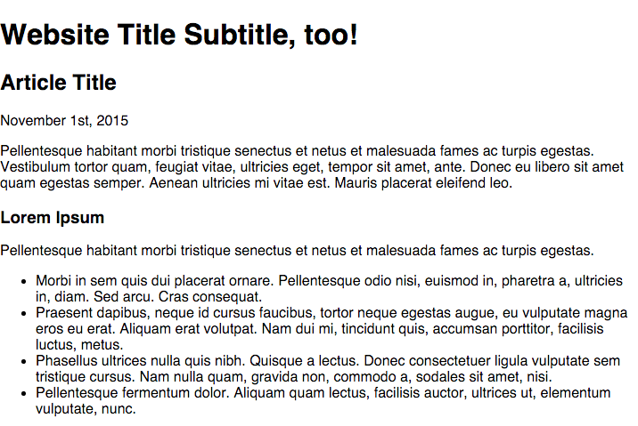
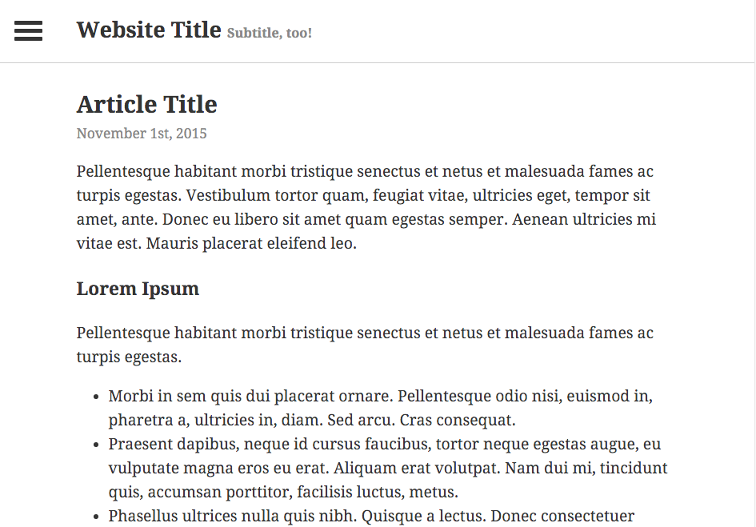
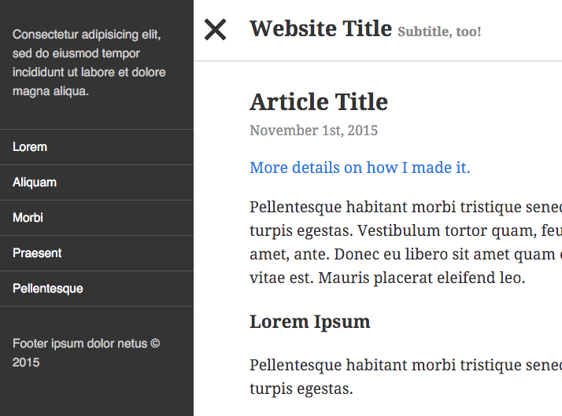

One of the more minimalist approaches to responsive navigation is the off canvas navigation method. This method utilizes the ubiquitous three-line hamburger menu, which prompts a sidebar to slide out when toggled. [Lanyon](http://lanyon.getpoole.com/) theme for Poole is a popular, simple example of the slide-out off canvas navigation.

Today I'm going to recreate the Lanyon theme. This theme is responsive and very simple, so it's good starting point for a blog or small website project.

## Main Page Layout

Before recreating any layout, it's important to note the main features of the design. Here are the main aspects that we'll be building on:

- A single, center-aligned column
- An equally aligned header
- A hamburger menu that is only sticky on desktop view

This will only take me a few minutes to recreate. It's not going to be exactly the same, but it will follow the same design pattern. First I'll create the layout, then add in the hamburger icon.

### The Demo

See the Pen [Off Canvas Navigation with CSS3 Transitions](http://codepen.io/taniarascia/pen/QjBwpB/)

```html
<main>
  <header>
    <div class="container">
      <h1>Website Title <span>Subtitle, too!</span></h1>
    </div>
  </header>
  <article>
    <h2>Article Title</h2>
    <time>November 1st, 2015</time>
    <p>Content</p>
  </article>
</main>
```

Here's our completely unstyled page, on a base of [Normalize.css](https://necolas.github.io/normalize.css/).



I created a `main` tag, because all the main content of my website will be contained within that tag, as mandated by HTML5 semantic standards. I also applied some basic styling to the entire document, such as Google's [Droid Serif](https://www.google.com/fonts/specimen/Droid+Serif) font.

The header has a full width bottom border, but fixed content width width a vertically centered title. I apply top and bottom padding to the header and a bottom border.

```css
header {
  border-bottom: 1px solid #cdcdcd;
  padding: 40px 0;
}
```

I'll place the header content in a container div.

```css
.container {
  max-width: 750px;
  margin: 0 auto;
  padding: 0 20px;
}
```

Now the content will never exceed 750px, but will shrink with the viewport, be centered and have some padding.

The website title is centered on mobile, but left-aligned on desktop. I like to utilize mobile first design, and use `min-width` `@media` queries. I'll remove the `margin` and `line-height` so that the padding of the `header` determines the location of the `h1`

```css
h1 {
  font-size: 1em;
  text-align: center;
  margin: 0;
  line-height: 0;
}

@media screen and (min-width: 900px) {
  h1 {
    font-size: 1.4em;
    text-align: left;
  }
}
```

The subtitle is hidden on mobile.

```css
h1 span {
  display: none;
}

@media screen and (min-width: 900px) {
  h1 span {
    display: inline;
    font-size: 0.6em;
    color: #898989;
  }
}
```

The `article` class is exactly the same as the container div, but it wouldn't make sense to use the same tag. In the header, the div was used for containment, but here the blog post is the article.

```css
article {
  max-width: 750px;
  margin: 0 auto;
  padding: 0 20px;
}
```

The layout is now complete, except for the navigation toggle button. I'm going to utilize [Elijah Manor's CSS Animated Hamburger Icon](http://codepen.io/elijahmanor/pen/Igpoe), but you can use any hamburger method you'd like.

I'll place this code directly below the `main` tag of the HTML.

```html
<a id="nav-toggle" href="#!" class="position"><span></span></a>
```

I copied the code directly from Elijah's pen, and only changed the color. Here's the code:

```css
#nav-toggle {
  cursor: pointer;
  padding: 10px 35px 16px 0px;
}

#nav-toggle span,
#nav-toggle span:before,
#nav-toggle span:after {
  cursor: pointer;
  border-radius: 1px;
  height: 5px;
  width: 35px;
  background: #343434;
  position: absolute;
  display: block;
  content: '';
}

#nav-toggle span:before {
  top: -10px;
}

#nav-toggle span:after {
  bottom: -10px;
}

#nav-toggle span,
#nav-toggle span:before,
#nav-toggle span:after {
  transition: all 200ms ease-in-out;
}

#nav-toggle.active span {
  background-color: transparent;
}

#nav-toggle.active span:before,
#nav-toggle.active span:after {
  top: 0;
}

#nav-toggle.active span:before {
  transform: rotate(45deg);
}

#nav-toggle.active span:after {
  transform: rotate(-45deg);
}
```

This method requires jQuery to function. The jQuery simply toggles the `.active` class, which rotates the `span` lines. I'm not going to use the same code that's in Elijah's pen - I'm going to simplify it and combine it with the navigation jQuery.

You'll notice that I added a `.position` class to the icon. I want the icon to be fixed to the top left corner on desktop, but not on mobile. I'll achieve this by setting the icon's position to `absolute` on mobile, and `fixed` on destkop. I also want to set a `z-index` to ensure it's always clickable.

```css
.position {
  position: absolute;
  top: 28px;
  left: 20px;
  z-index: 2;
}
@media screen and (min-width: 900px) {
  .position {
    position: fixed;
  }
}
```

At this point, the website's layout is complete, and all that remains is adding in the navigation.



## Adding in the Navigation

I originally learned how to implement the Off Canvas Navigation from [this tutorial on scotch.io](https://scotch.io/tutorials/off-canvas-menus-with-css3-transitions-and-transforms), written by [Nicholas Cerminara](https://twitter.com/nickforthought). It's a very concise, well-written article that I'd recommend reading to gain a deeper understanding of CSS transitions. My method is going to be similar, but I'll have to do a few things differently to ensure that the sidebar is fixed. I'll also be simplifying the code as much as possible.

I'm adding an `aside` class, where the slide-out menu will reside.

```html
<body>
  <aside></aside>
  <main>
    <!-- The rest of the site -->
  </main>
</body>
```

We want to prevent horizontal scroll when the the sidebar is toggled.

```css
body {
  overflow-x: hidden;
}
```

All of our content is contained to `main`. I've placed an easing `transition` to allow for a smooth toggle. It's position is absolute, with `left: 0`.

```css
main {
  width: 100%;
  position: absolute;
  left: 0;
  transition: 0.3s ease all;
}
```

We need to make the `aside` fixed, and make sure the `width` and `left` cancel each other out.

```css
aside {
  width: 300px;
  height: 100%;
  position: fixed;
  top: 0;
  left: -300px;
  background: #343434;
  transition: 0.3s ease all;
}
```

I'll also go back and add an easing transition to my `.position` class from earlier, which is where the nav-toggle button lives.

```css
.position {
  transition: 0.3s ease all;
}
```

Finally, I'm going to add the CSS that will be toggled with JavaScript in just a moment.

```css
.show-nav aside,
.show-nav .position,
.show-nav main {
  transform: translateX(250px);
}
.show-nav article {
  padding: 0 80px;
}
.show-nav .position {
  position: fixed;
}
```

## Animating with jQuery

The final step is to animate everything with jQuery. As always, I like to define jQuery first, and initiate code when the document is ready.

```js
;(function($) {
  // Define jQuery
  $(function() {
    // DOM Ready
    // All scripts go here
  })
})(jQuery)
```

Two things need to happen when the hamburger icon is clicked:

1. The `.active` class needs to be toggled, animating the icon
2. The menu needs to slide out and push all the content to the right

First, we'll animate the menu icon.

```js
// Toggle navigation
      $('#nav-toggle').click(function() {
        this.classList.toggle("active");
```

Then we'll activate the `.show-nav` class.

```js
// If sidebar is visible:
      if ($('body').hasClass('show-nav')) {
        // Hide sidebar
          $('body').removeClass('show-nav');
      } else { // If sidebar is hidden:
          $('body').addClass('show-nav'); // Display sidebar
      }
    });
```

The jQuery is easy to follow. When you click the navigation, if the sidebar is visible, hide it. If it's hidden, show it. In the CSS, we're just changing the left positioning of the elements, with some transitions for easing.

The `main`, `aside`, and `.fixed` elements all get pushed 250 pixels to the right. I've also added some additional padding to the `article` class to ensure there's enough space for the fixed toggle button.

Now we have a fully functioning off canvas slide out navigation. All that remains is to style the `aside`.

For this entire site, I've been using [HTML Ipsum](http://html-ipsum.com/), which is a lorem ipsum generator created by Chris Coyier. I just copied the HTML from generic nav. The CSS is just some simple styling. This would look a lot nicer nested in SCSS or LESS, but I'll leave that up to you.

```css
aside {
  /* The rest of the code from above */
  font-size: 0.8em;
  font-family: sans-serif;
  font-weight: 300;
}
aside p {
  color: #cdcdcd;
  padding: 20px;
}
aside nav ul {
  margin: 0;
  padding: 0;
}
aside nav ul li:first-of-type {
  border-top: 1px solid #565656;
}
aside nav ul li {
  border-bottom: 1px solid #565656;
}
aside nav ul li a {
  padding: 10px 20px;
  display: block;
  color: #fff;
  text-decoration: none;
}
aside nav ul li a:hover {
  background: #454545;
}
```



That concludes the tutorial! The key at this point is to use what you've learned and be creative with it. Also, don't forget to [add vendor prefixes](https://github.com/postcss/autoprefixer) to your code.

- [View Demo](http://codepen.io/taniarascia/pen/QjBwpB)
