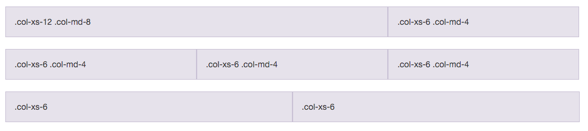
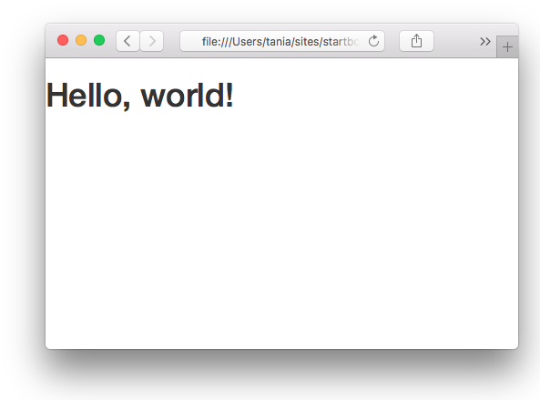
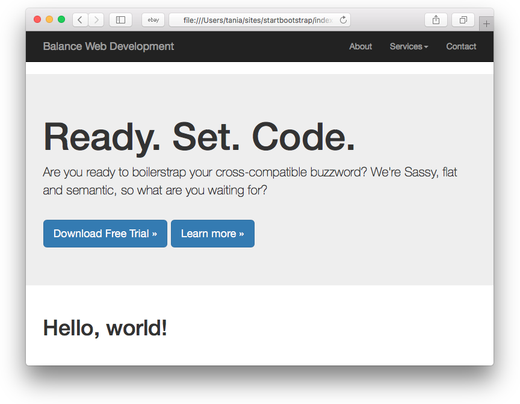
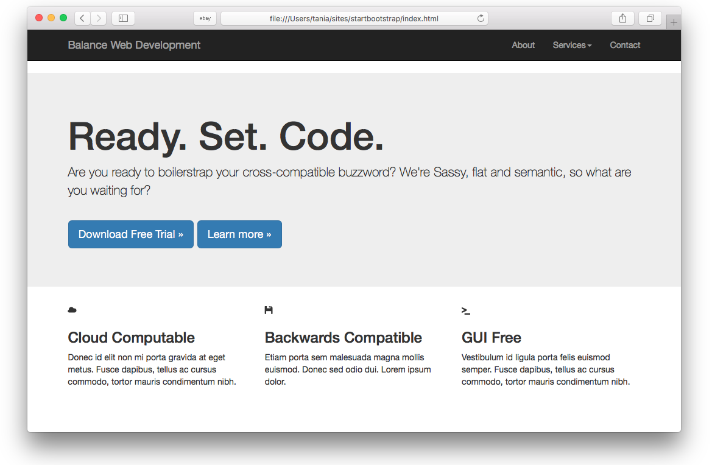
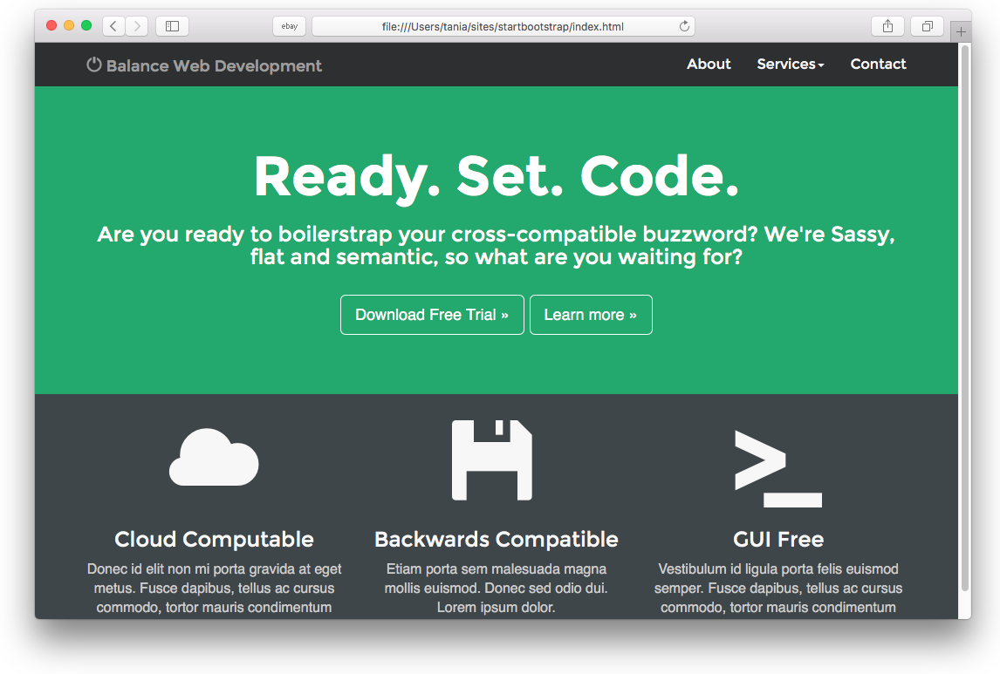

If you have any sort of interest in web development, you've likely heard of [Bootstrap](http://getbootstrap.com/). According to the official website, **Bootstrap is the most popular HTML, CSS, and JS framework for developing responsive, mobile first projects on the web.** Sounds great! Now how do I use it?

It would be easy to send you over to their [Getting Started](http://getbootstrap.com/getting-started/) page and call it a day. Their setup guide is indeed a host of useful information - links to CDNs, explanations on how to install with Bower, npm, and Composer, information on integration with Autoprefixer and LESS, a bunch of templates, licenses, and translations - but it is certainly not a step by step guide to getting started (which very well might be in the spirit of autodidactism).

When I discovered Bootstrap a few years ago, responsive design was still gaining in popularity, and not necessarily the expected norm. Having only ever made websites from scratch, I was a little confused about the entire concept of a framework. I'd imagine it's even more confusing for beginners who are now expected to learn responsive design concepts and Bootstrap and JavaScript libraries, in addition to HTML, CSS and JS.

This guide is meant as a first look into Bootstrap for beginners, so won't be going into LESS and Sass integration, which are more intermediate/advanced concepts. While it's written for the current, stable version Bootstrap 3, the concepts will remain the same for future versions.

#### Goals

- Learn what a front-end framework is and how it can be useful
- Understand how to properly include Bootstrap's CSS and JavaScript and begin customizing

#### Prerequities

- Basic knowledge and understanding of HTML and CSS

## What is Bootstrap?

Bootstrap can be boiled down to three main files:

- [bootstrap.css](https://github.com/twbs/bootstrap/blob/master/dist/css/bootstrap.css) - a CSS framework
- [bootstrap.js](https://github.com/twbs/bootstrap/blob/master/dist/js/bootstrap.js) - a JavaScript/jQuery framework
- [glyphicons](http://getbootstrap.com/components/#glyphicons) - a font (an icon font set)

Additionally, Bootstrap requires [jQuery](https://jquery.com/) to function. jQuery is an extremely popular and widely used JavaScript library, that both simplifies and adds cross browser compatibility to JavaScript.

Everything else you might happen across while studying the Bootstrap documentation - Grunt, Gulp, Sass, LESS, bower, npm, etc - is not necessary to get started with Bootstrap. These are task runners, preprocessors, installation aids, and package managers, so don't be discouraged if you don't know how to use any of them yet.

## Why is a framework important? Do I need to use one?

You absolutely don't _need_ to use a framework - I recently wrote an article called [You Don't Need a Framework: Understanding the Fundamentals of Responsive Design](http://www.taniarascia.com/you-dont-need-a-framework/), which I would recommend reading if you want to learn more about responsive design. However, frameworks are very popular and have many benefits, so it's important to learn how to work with them.

Some of the ways that frameworks can help you:

- Prevent repetition between projects
- Utilize responsive design to allow your website to adapt to various screen sizes - mobile, desktop, and everything in between
- Add consistency to design and code between projects and between developers
- Quickly and easily prototype new designs
- Ensure cross-browser compatibility

Generally, every web project you work on will need to be responsive and work properly on all the major browsers, and likely have some fallbacks for older browsers. Bootstrap has [a huge open source community](https://github.com/twbs/bootstrap) that works on covering this so you don't have to. Additionally, when multiple developers all know the same system, they can work in better harmony - and it also makes it easier for newcomers on a project to get up to speed.

[The grid](https://getbootstrap.com/examples/grid/) is probably one of the most essential aspects of the framework. It's the basis on which the entire layout is created. Beyond that, Bootstrap's [core CSS](https://getbootstrap.com/css/) will also add helpful styling to forms, tables, buttons, lists, and images, as well as fully functioning navigation bars, while the [core JavaScript](https://getbootstrap.com/javascript/) will add helpful code for creating modals, carousels, alerts, popups, dropdowns, and accordions.



Let's begin!

## Building a Basic Template with Bootstrap

Bootstrap comes with [a few very simple examples](https://getbootstrap.com/getting-started/#examples) to start from, but it's just as easy to start from "scratch", so that's what we'll do. First, I'll use only Bootstrap to lay out the foundation, then we'll add our own custom style on top to make something fun and trendy.

Step one is to [download Bootstrap](http://getbootstrap.com/getting-started/#download). The zip file will come with **css**, **fonts**, and **js** directories. Unzip that and save the files in some directory. Bootstrap doesn't come with any HTML, but they have a "Hello, World!" page to start on the documentation, so we'll use that as **index.html**.

### Hello, World!

```html
<!DOCTYPE html>
<html lang="en">
  <head>
    <meta charset="utf-8" />
    <meta http-equiv="X-UA-Compatible" content="IE=edge" />
    <meta name="viewport" content="width=device-width, initial-scale=1" />
    <title>Bootstrap 101 Template</title>
    <link href="css/bootstrap.min.css" rel="stylesheet" />
    <!--[if lt IE 9]>
      <script src="https://oss.maxcdn.com/html5shiv/3.7.2/html5shiv.min.js"></script>
      <script src="https://oss.maxcdn.com/respond/1.4.2/respond.min.js"></script>
    <![endif]-->
  </head>
  <body>
    <h1>Hello, world!</h1>

    <script src="https://ajax.googleapis.com/ajax/libs/jquery/1.11.3/jquery.min.js"></script>
    <script src="js/bootstrap.min.js"></script>
  </body>
</html>
```

Easy enough to start. We have our basic `doctype`, `html`, `head` and `body` tags. The `meta name="viewport"` tag is particularly important for responsive design - it ensures that your website has a 1:1 ratio with the viewport (screen size).

Beyond that, we're just adding Bootstrap core CSS in the `<head>`...

```html
<link href="css/bootstrap.min.css" rel="stylesheet" />
```

jQuery via Google CDN before the closing `</body>` tag...

```html
<script src="https://ajax.googleapis.com/ajax/libs/jquery/1.11.3/jquery.min.js"></script>
```

and Bootstrap core JavaScript.

```html
<script src="js/bootstrap.min.js"></script>
```

> Bootstrap JavaScript and custom JavaScript _must_ go below jQuery to function! Additionally, we can link to jQuery via Google's URL because it reduces load on our live server, but you can [download it](https://jquery.com/download/) if you want to work locally.

Well, that's all you need to get started with Bootstrap! Let's check out our awesome new site.



...great!

### Navigation Bar

Although we have nothing, in no time at all we can get copying and pasting from the docs and have a nice, functioning website. First and foremost, we add in the quintessential Bootstrap top navigation bar. I made a simplified version of their [navbar example](http://getbootstrap.com/components/#navbar). Place this code right below your opening `<body>` tag.

```html
<nav class="navbar navbar-inverse navbar-static-top">
  <div class="container">
    <div class="navbar-header">
      <button
        type="button"
        class="navbar-toggle collapsed"
        data-toggle="collapse"
        data-target="#bs-example-navbar-collapse-1"
        aria-expanded="false"
      >
        <span class="sr-only">Toggle navigation</span>
        <span class="icon-bar"></span>
        <span class="icon-bar"></span>
        <span class="icon-bar"></span>
      </button>
      <a class="navbar-brand" href="#">Balance Web Development</a>
    </div>
    <div class="collapse navbar-collapse" id="bs-example-navbar-collapse-1">
      <ul class="nav navbar-nav navbar-right">
        <li><a href="#">About</a></li>
        <li class="dropdown">
          <a
            href="#"
            class="dropdown-toggle"
            data-toggle="dropdown"
            role="button"
            aria-haspopup="true"
            aria-expanded="false"
            >Services<span class="caret"></span
          ></a>
          <ul class="dropdown-menu">
            <li><a href="#">Design</a></li>
            <li><a href="#">Development</a></li>
            <li><a href="#">Consulting</a></li>
          </ul>
        </li>
        <li><a href="#">Contact</a></li>
      </ul>
    </div>
  </div>
</nav>
```


It seems like a confusing mess, but it's not so complicated. In the first line, I'm defining the entire bar as a `navbar`, choosing a dark color scheme with `navbar-inverse`, and electing to use `navbar-static-top`, as opposed to a fixed (sticky) header.

```html
<nav class="navbar navbar-inverse navbar-static-top"></nav>
```

A `container` sets a `max-width` on the content within your full-width navbar.

```html
<div class="container"></div>
```

The `navbar-header` class contains the "brand" information, where you can put your logo or company name. We're making a website for fictional tech company **Balance Web Development** (well, it's better than [their old site!](http://taniarascia.github.io/balancewebdev/1996/)).

The `button` is hidden on desktop, and becomes a dropdown hamburger menu on mobile (each `<span class="icon-bar">` is a line in the hamburger).

```html
<div class="navbar-header">
  <button
    type="button"
    class="navbar-toggle collapsed"
    data-toggle="collapse"
    data-target="#bs-example-navbar-collapse-1"
    aria-expanded="false"
  >
    <span class="sr-only">Toggle navigation</span>
    <span class="icon-bar"></span>
    <span class="icon-bar"></span>
    <span class="icon-bar"></span>
  </button>
  <a class="navbar-brand" href="#">Balance Web Development</a>
</div>
```

The rest of the code is a right-aligned unordered list that servers as both our desktop and mobile menu.

### Jumbotron Header

I decided I want one of those big, space-wasting, attention-grabbing headers, which is called a `jumbotron` in Bootstrap terms. Not much to see here, just a `jumbotron` with a `container` and some copy.

```html
<div class="jumbotron">
  <div class="container">
    <h1>Ready. Set. Code.</h1>
    <p>
      Are you ready to boilerstrap your cross-compatible buzzword? We're Sassy, flat and semantic,
      so what are you waiting for?
    </p>
    <br />
    <p>
      <a class="btn btn-primary btn-lg" href="#" role="button">Download Free Trial »</a>
      <a class="btn btn-primary btn-lg" href="#" role="button">Learn more »</a>
    </p>
  </div>
</div>
```

There's some extra space we don't want, but I want to see how far Bootstrap can get us without overriding styles. As you can see, we already have a pretty nice, adaptable layout without having written a single line of CSS.



### Grid

The last thing I'll do is add in some main content, which will be in the form of a grid. Grids are rows...

```html
<div class="row"></div>
```

that contain columns.

```html
<div class="row">
  <div class="col-md-6"></div>
  <div class="col-md-6"></div>
</div>
```

Bootstrap works on a 12-column system, so as long as you add up to 12, you're golden. The above example will contain two 50% width columns (6/12), which will stack on mobile and become 100% width.

```html
<div class="container">
  <div class="row">
    <div class="col-md-4">
      <span class="glyphicon glyphicon-cloud" aria-hidden="true"></span>
      <h3>Cloud Computable</h3>
      <p>
        Donec id elit non mi porta gravida at eget metus. Fusce dapibus, tellus ac cursus commodo,
        tortor mauris condimentum nibh.
      </p>
    </div>
    <div class="col-md-4">
      <span class="glyphicon glyphicon-floppy-disk" aria-hidden="true"></span>
      <h3>Backwards Compatible</h3>
      <p>Etiam porta sem malesuada magna mollis euismod. Donec sed odio dui. Lorem ipsum dolor.</p>
    </div>
    <div class="col-md-4">
      <span class="glyphicon glyphicon-console" aria-hidden="true"></span>
      <h3>GUI Free</h3>
      <p>
        Vestibulum id ligula porta felis euismod semper. Fusce dapibus, tellus ac cursus commodo,
        tortor mauris condimentum nibh.
      </p>
    </div>
  </div>
</div>
```

Here you can see I have three four-of-twelve columns, and as 3 x 4 = 12, everything works out.

### Icons

I've also added in a few [glyphicons](http://getbootstrap.com/components/#glyphicons) for decoration. **Glyphicons** is the built-in icon set that comes with Bootstrap. If you don't load your fonts, or if you move them to a different directory, these icons won't work.

```html
<span class="glyphicon glyphicon-floppy-disk" aria-hidden="true"></span>
```

Using a glyphicon will always be that same code, and only the `glyphicon-floppy-disk` class will change.

I am now satisfied with the foundation of my layout.



## Adding Custom Styles to Bootstrap

Not bad for getting this far without touching a line of style. It's professional, responsive, and browser friendly. It's definitely not creative or unique, though. After laying down a foundation, you'll want to add your own personal design.

If you know LESS or Sass, you can play around in [Bootstrap's extensive customization area](http://getbootstrap.com/customize/) and download your own version of Bootstrap. We happen to be using "vanilla CSS", which is CSS without a preprocessor. Fortunately, you can just add an additional stylesheet below Bootstrap's core

> Don't modify the Bootstrap core - you're much better off overriding the existing styles.

```html
<link href="css/bootstrap.min.css" rel="stylesheet" />
<link href="css/custom.css" rel="stylesheet" />
<link
  href="https://fonts.googleapis.com/css?family=Montserrat:400,700"
  rel="stylesheet"
  type="text/css"
/>
```

I added a link to a Google font called [Montserrat](https://www.google.com/fonts#UsePlace:use/Collection:Montserrat). If you've never used a Google Font before, all you have to do is add the font stylesheet to your `head` and change the `font-family` of your desired element.

Now we finally begin styling. In just a few minutes, I'll be able to transform my boring, generic Bootstrap layout into a fun, flat layout. First, I'm going to get rid of that pesky space between the navbar and the jumbotron.

```css
.navbar {
  margin-bottom: 0;
}
```

A few simple styles to the main tags. I'm loading in the Montserrat font on the entire page, I've made the headers bold, and I've made the background dark and the text light.

```css
body {
  background: #3e4649;
  color: #f7f7f7;
  font-family: 'Montserrat', sans-serif;
}
h1,
h2 {
  font-weight: bold;
}
p {
  font-size: 16px;
  color: #cdcdcd;
}
```

I'm going to make the jumbotron green and centered.

```css
.jumbotron {
  background: #27a967;
  color: white;
  text-align: center;
}
.jumbotron p {
  color: white;
  font-size: 26px;
}
```

I'm going to turn the buttons into "ghost buttons", which are buttons that are transparent with a border. I'm also adding a margin so they'll stack properly on mobile.

```css
.btn-primary {
  color: #fff;
  background-color: transparent;
  border-color: white;
  margin-bottom: 5px;
}
.btn-primary:hover {
  color: #27a967;
  background-color: white;
  border-color: white;
}
```

I'm going to make the navbar a different shade of dark, make the links lighter, and change the background color on hover.

```css
.navbar-inverse {
  background: #2e2f31;
  border: 0;
}
.navbar-inverse .navbar-nav li a {
  color: #f7f7f7;
  font-size: 16px;
}
.navbar-inverse .navbar-nav li a:hover {
  background: #27a967;
}
```

The dropdown menu has its own classes, so I'm also going to change the background color on these and add a little padding.

```css
.dropdown-menu {
  background: #2e2f31;
  border-radius: 0;
  border: 0;
}
.dropdown-menu li a {
  padding: 10px;
}
.navbar-inverse .navbar-nav .dropdown-menu li a:hover {
  background: #2c463c;
}
```

Back in my HTML, I'm going to wrap a `section` tag around my grid, and call it `call-to-action`. I'm also going to create a `glyphicon-large` class and add it to each icon `span`.

```html
<section class="call-to-action">
  <!-- .rows and .columns -->
  <span class="glyphicon glyphicon-cloud glyphicon-large" aria-hidden="true"></span>
  <!-- /.rows and .columns -->
</section>
```

The final touches to my code are going to be centering the bottom call-out, adding `margin-bottom` to the `p` tags so they stack properly on mobile, and making my glyphicons bigger.

```css
.call-to-action {
  text-align: center;
}
.call-to-action p {
  margin-bottom: 30px;
  font-family: sans-serif;
}
.glyphicon-large {
  font-size: 100px;
}
```



With one small page worth of code, I've completely transformed my layout. From here, you can be much more creative.

Of course, I also put the demo up as a [Codepen.](http://codepen.io/taniarascia/pen/yYQYpO#0)

## Conclusion

Hopefully you learned a bit about Bootstrap and frameworks from this tutorial. This is hardly scratching the surface of what Bootstrap is capable of - but you can take it from here. The documentation is enormous, and if ever you can't figure out how to do something, chances are a quick Google search will point you in the right direction.

I would encourage you to play around and make your own framework for personal projects to aid in your understanding of responsive design.
