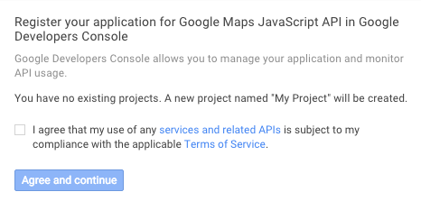
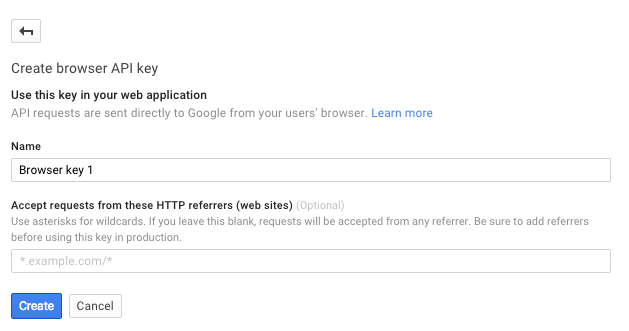
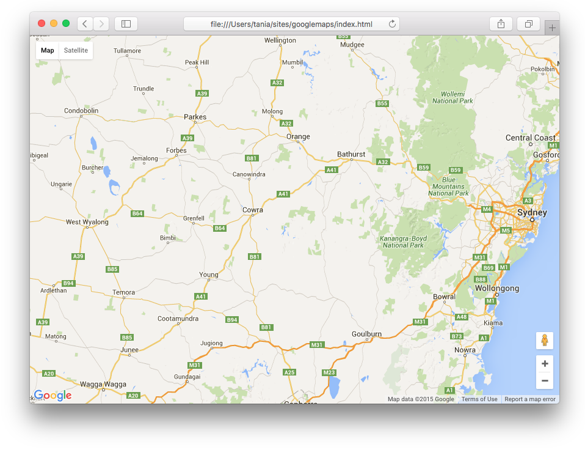
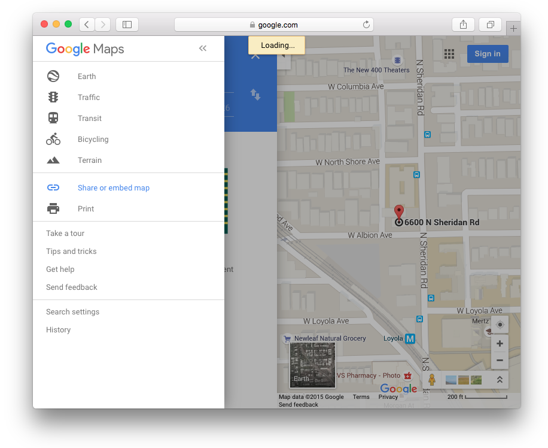
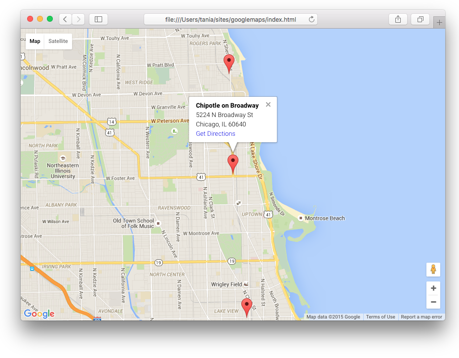

I was working on making a locations page for a multi-location restaurant concept. The overwhelming trend currently is to include a Google map with a marker for each location.

Huge companies that have locations all over the globe have massive map databases and much different hurdles to overcome - being able to search by town or zip code, Wi-fi availability, hours, and so on.

For my particular project, I only had a few needs:

- Include a map on my page
- Show a marker for each location
- Each marker shows the address and can provide directions

In order to do this, I was going to need [Google Maps APIs](https://developers.google.com/maps/?hl=en), a part of [Google Developers](https://developers.google.com/).

My biggest misconception with Google Maps APIs before looking into them is that you're embedding Google Maps as we know it into the site. I thought that by simply including a marker for the location, all the information would pop up in the sidebar, such as address and a search bar for directions.

This turned out not to be the case - you get the map, but simply including a marker does not lead to any of the expected actions. I figured out something that worked for me, and I'm going to write about the steps I took in case anyone is struggling in a similar situation.

> API stands for Application Program Interface. For web development, this usually means a third-party software that you can embed into your website.

## Get a Google Maps Javascript API Key

Google Maps APIs come in a few flavors - Android, iOS, Web, and Web services. Simply embedding a map into your site with a few markers falls under the web category, which is known as Google Maps Javascript.

The first step is to [ get an API key.](https://developers.google.com/maps/documentation/javascript/)

You'll have to agree to their terms and services.



They'll want you to give it a name and decide on any restrictions. If you place no restrictions on it, anyone can use it and use up your quota. The Maps are only free up to a certain point.



After that, it'll pop up with some super-secure looking string of characters, and now you have a key.

> An API key grants a developer access to an API.

Now that I have a key, I can begin implementing Google Maps into my site.

## Embed a Map Into Your Site

The [documentation for Google Maps APIs](https://developers.google.com/maps/documentation/javascript/tutorial) is extensive. They have a pretty good "Hello, World!", or getting started guide. It's important to make sure everything is set up correctly before you can move on to attempting more advanced concepts.

As with anything interactive on the web, there are three components - HTML, CSS, and JavaScript. The example on the site puts everything into one file, but we'll just start off dividing them into three separate files, since that's how you'll have your project set up in reality.

### HTML

I have a regular HTML5 document, linking to a CSS stylesheet and JS script. The map will be contained in the `<div id="map"></div>`. Of course, you must replace `YOUR_API_KEY` with the key from the previous step.

```html
<!DOCTYPE html>
<html>
  <head>
    <meta charset="utf-8" />
    <meta name="viewport" content="width=device-width, initial-scale=1" />
    <title>Google Maps APIs</title>

    <link href="style.css" rel="stylesheet" />
  </head>

  <body>
    <div id="map">
```

    <script src="script.js"></script>
    <script
      async
      defer
      src="https://maps.googleapis.com/maps/api/js?key=YOUR_API_KEY&callback=initMap"
    ></script>
  </body>
</html>
```

### CSS

The CSS provided by Google is for a full screen map. I'm putting it in `style.css`.

```css
html,
body {
  height: 100%;
  margin: 0;
  padding: 0;
}
#map {
  height: 100%;
}
```

The `html` and `body` classes need to have 100% height, as well as the `map` id. Setting the margin and padding to 0 resets the browser.

This code is fine, but I would prefer setting something along the lines of `height: 60vh` to the `map` id. `60vh` would equal 60% viewport height, so would therefore take up 60% of the available screen real estate. This way, a user would be able to easily scroll past the map to whatever additional content you have. For the sake of this article, I'll just leave it at 100%, because I have no additional content.

At this point, you're finished with HTML and CSS as far as it pertains to the map.

### JavaScript

I'm going to insert Google's starting example here in `script.js`.

```js
var map

function initMap() {
  map = new google.maps.Map(document.getElementById('map'), {
    center: {
      lat: -34.397,
      lng: 150.644,
    },
    zoom: 8,
  })
}
```

I'm declaring the `map` variable, initiating the map with the `initMap()` function, and placing the Google Map into my CSS map id inside the `map` variable.

The `center` is deciding where the map should be centered (Sydney, New South Wales, Australia) and `zoom` decides how far in it will be zoomed.

Now you should have a functioning map.



## Customizing the Map

I have a map, but it doesn't do anything specific yet. You can zoom in and out, toggle between street and satellite view, and click-and-drag the map.

I wanted to add a marker, so I [looked at the Markers page](https://developers.google.com/maps/documentation/javascript/markers) on the documentation. However, adding a marker does just that - and nothing else. I then moved on to [Info Windows](https://developers.google.com/maps/documentation/javascript/infowindows), which is adding details to a marker. I thought the pop up might have whatever information Google Maps has on the area, but an Info Window only contains your own content.

The [Google Places API Web Service](https://developers.google.com/places/web-service/) seems to integrate a bit more with the Google Maps database, but is also far more difficult to implement, so I stuck to the Google Maps Javascript API for my project.

In my search for a simple, effective way to include multiple markers with addresses and information, I found this [excellent post on StackOverflow](http://stackoverflow.com/questions/3059044/google-maps-js-api-v3-simple-multiple-marker-example). I can't take credit for this solution. It's a very flexible bit of code that really helped me out on my project.

### Goal

Let's define a goal and then make it happen.

- I'm going to use [Chipotle](http://chipotle.com/) for my example.
- The location will be Chicago.
- I'm going to pretend that only three Chipotle locations exist, but more might come.
- Each location will have a popup with name, address, a link to directions

For this I'm going to need to know the addresses of the locations as well as the latitude and longitude. [Get Lat Long from Address](http://www.latlong.net/convert-address-to-lat-long.html) is an amazing self-explanatory resource I found and used.

### Locations

Here are my three locations.

- **Broadway**
- 5224 N Broadway St, Chicago, IL 60640
- (41.976816, -87.659916)

- **Belmont**
- 1025 W Belmont Ave, Chicago, IL 60657
- (41.939670, -87.655167)

- **Sheridan**
- 6600 N Sheridan Rd, Chicago, IL 60626
- (42.002707, -87.661236)

The other thing I want is a URL that leads to getting directions to this location. For that, I simply went to [Google Maps](http://maps.google.com), typed in the address I wanted, and clicked on **Get Directions**. I can now get a link to the map at this point, so I click **Share or Embed Map** and get the URL.



Now I have everything I need to build my custom map. First I'll call that initMap function.

```js
function initMap() {
  // More
}
```

Then I'll make an object for each location. Each object is a variable that will contain the info box, latitude and longitude.

```js
var broadway = {
  info:
    '<strong>Chipotle on Broadway</strong><br>\
    	5224 N Broadway St<br> Chicago, IL 60640<br>\
    	<a href="https://goo.gl/maps/jKNEDz4SyyH2">Get Directions</a>',
  lat: 41.976816,
  long: -87.659916,
}
```

`info` is a string in which I've written the name and address of my location, as well as a link to directions on Google Maps. Adding a `\` at the end of a string line allow you to continue writing it on the next line.

I've also created objects for `belmont` and `sheridan`.

Now I'm going to create an array in a variable called `location` that contains `info`, `lat`, and `long`.

```js
var locations = [
  [broadway.info, broadway.lat, broadway.long, 0],
  [belmont.info, belmont.lat, belmont.long, 1],
  [sheridan.info, sheridan.lat, sheridan.long, 2],
]
```

I'm going to call the map the same way as I did in the "Hello, World!" example. I'm going to `zoom` to 13 because all my locations are close together, and `center` it on the latitude for Broadway, since it's the middle location.

```js
var map = new google.maps.Map(document.getElementById('map'), {
  zoom: 13,
  center: new google.maps.LatLng(41.976816, -87.659916),
  mapTypeId: google.maps.MapTypeId.ROADMAP,
})
```

With the final bit of code, the amount of markers and info windows will dynamically update based on our `locations` variable.

```js
var infowindow = new google.maps.InfoWindow({})

var marker, i

for (i = 0; i < locations.length; i++) {
  marker = new google.maps.Marker({
    position: new google.maps.LatLng(locations[i][1], locations[i][2]),
    map: map,
  })

  google.maps.event.addListener(
    marker,
    'click',
    (function(marker, i) {
      return function() {
        infowindow.setContent(locations[i][0])
        infowindow.open(map, marker)
      }
    })(marker, i)
  )
}
```

Here is the final, complete JavaScript.

```js
function initMap() {
  var broadway = {
    info:
      '<strong>Chipotle on Broadway</strong><br>\
    	5224 N Broadway St<br> Chicago, IL 60640<br>\
    	<a href="https://goo.gl/maps/jKNEDz4SyyH2">Get Directions</a>',
    lat: 41.976816,
    long: -87.659916,
  }

  var belmont = {
    info:
      '<strong>Chipotle on Belmont</strong><br>\
    	1025 W Belmont Ave<br> Chicago, IL 60657<br>\
    	<a href="https://goo.gl/maps/PHfsWTvgKa92">Get Directions</a>',
    lat: 41.93967,
    long: -87.655167,
  }

  var sheridan = {
    info:
      '<strong>Chipotle on Sheridan</strong><br>\r\
    	6600 N Sheridan Rd<br> Chicago, IL 60626<br>\
    	<a href="https://goo.gl/maps/QGUrqZPsYp92">Get Directions</a>',
    lat: 42.002707,
    long: -87.661236,
  }

  var locations = [
    [broadway.info, broadway.lat, broadway.long, 0],
    [belmont.info, belmont.lat, belmont.long, 1],
    [sheridan.info, sheridan.lat, sheridan.long, 2],
  ]

  var map = new google.maps.Map(document.getElementById('map'), {
    zoom: 13,
    center: new google.maps.LatLng(41.976816, -87.659916),
    mapTypeId: google.maps.MapTypeId.ROADMAP,
  })

  var infowindow = new google.maps.InfoWindow({})

  var marker, i

  for (i = 0; i < locations.length; i++) {
    marker = new google.maps.Marker({
      position: new google.maps.LatLng(locations[i][1], locations[i][2]),
      map: map,
    })

    google.maps.event.addListener(
      marker,
      'click',
      (function(marker, i) {
        return function() {
          infowindow.setContent(locations[i][0])
          infowindow.open(map, marker)
        }
      })(marker, i)
    )
  }
}
```

Now all of our locations are on the map with their respective info box.



I've put this project up on GitHub - all you would have to do is insert your own API key.

- [View on GitHub](https://github.com/taniarascia/googlemaps)
