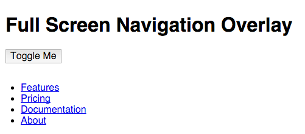

One current trend in navigation styles that you may have seen is the full screen navigation overlay. With this type of navigation, toggling the navigation will overlay the menu across the entire screen. Codrops did a [really nice set of demos](http://tympanus.net/Development/FullscreenOverlayStyles/) with full screen overlay styles last year. I wanted to demonstrate a very simple version of the overlay using jQuery. Of course, it's responsive as well, and you can [view the demo on CodePen](http://codepen.io/taniarascia/pen/yYrXRG).

## HTML

The HTML is easy. I have all of my content in a `main` wrapper, and my navigation in an `aside`. The navigation is a normal unordered list.

```html
<aside>
  <div class="outer-close toggle-overlay">
    <a class="close"><span></span></a>
  </div>
  <nav>
    <ul>
      <li><a href="#!">Features</a></li>
      <li><a href="#!">Pricing</a></li>
      <li><a href="#!">Documentation</a></li>
      <li><a href="#!">About</a></li>
    </ul>
  </nav>
</aside>
```



For now, everything is visible, but we'll be using CSS and jQuery to hide and show the menu.

## jQuery

The jQuery is even easier. As always, I prefer to define and call jQuery, and wrap the rest of my code within.

```js
;(function($) {
  $(function() {
    // The rest of the code
  })
})(jQuery)
```

After that, I'll just be adding a click event to the `toggle-overlay` class, which will toggle `open` on the `aside`.

```js
;(function($) {
  $(function() {
    $('.toggle-overlay').click(function() {
      $('aside').toggleClass('open')
    })
  })
})(jQuery)
```

## CSS/SCSS

There's a bit more to the CSS, but the basic functionality is simple enough. This next line of CSS is all you need to make the code function, and from there you can add your own styles.

```css
aside {
  position: fixed;
  width: 100%;
  height: 100%;
  top: 0;
  left: 0;
  background: linear-gradient(200deg, #27156e, #6a2a88, #9f4981);
  transition: all 0.5s ease;
  z-index: 2;
  opacity: 0;
  visibility: hidden;
}
.open {
  opacity: 1;
  visibility: visible;
}
```

My navigation is in the `aside`, but you can just as easily put it in a `div`, `section`, or whatever you want. Since I want it to take up the whole screen, I'm making it `fixed` with a width and height of `100%`. Setting the top and left positions to `0` ensures that it takes up the whole space.

The background was my choice of a `linear-gradient`, but of course you can use anything. I've set a smooth `transition`, and a `z-index` of 2 to ensure that the content of the `aside` is always on top.

The next two lines are the only that change between states. `aside` is set to `visibility: hidden` and `opacity: 0`, and when the `open` class is applied, it becomes `visible` with full `opacity`.

## Demo

Here is the demo of the code, with additional styles applied.

See the Pen [yYrXRG](http://codepen.io/taniarascia/pen/yYrXRG/).

## Additional Styles

## Close button

The close button is `fixed`, with a `z-index` of 3, just to ensure it always appears above the overlay. The `span` setup is the same as from [the responsive dropdown navigation bar](http://taniarascia.com/responsive-dropdown-navigation-bar) tutorial, except it's not animated. I find this method easier than loading a font icon set or using a unicode letter.

I'm using SCSS for these stylings, as nesting makes the code a lot more manageable.

```scss
.close {
  position: fixed;
  top: 40px;
  right: 60px;
  color: white;
  z-index: 3;
  cursor: pointer;
  font-family: sans-serif;
  span,
  span:before,
  span:after {
    border-radius: 4px;
    height: 5px;
    width: 35px;
    background: white;
    position: absolute;
    display: block;
    content: '';
  }
  span {
    background: transparent;
  }
  span:before {
    transform: rotate(45deg);
  }
  span:after {
    transform: rotate(-45deg);
  }
}
```

## Unordered list menu using flexbox

To ensure that my menu looks good no matter the size of the viewport, I'm using the `flex` property. The `nav` tag is my flex container.

I declare a flex container with `display: flex`. By setting the `flex-direction` to column, I'm ensuring that the content is stacking vertically. `justify-content` will ensure that anything nested inside of the flex container will be vertically aligned. I've set the height to `95vh`, which is 95% of the viewport height.

```scss
nav {
	text-align: center;
	height: 95vh;
	display: flex;
	flex-direction: column;
	justify-content: center;

```

Any time you use an unordered list for a menu, you'll be removing the `list-style` and extra space.

```scss
ul {
	margin: 0;
	padding: 0;
	list-style: none;
```

The `li`s inside the navigation are the nested flex items. I've set them to have a `line-height` of `20vh` to ensure they're centered vertically. I set it to 95/20 instead of 100/25 to give a little extra room.

```scss
li {
	align-items: center;
	flex: 1;
	line-height: 20vh;

```

The `a` is a block-level element, with a transition. I've set the font-size to 1.5em for mobile, but also added a `min-width` media query to increase the font size on desktop.

```scss
a {
	font-size: 1.5em;
	transition: all 0.5s ease;
	display: block;
	text-decoration: none;
	color: rgba(255, 255, 255, .5);
```

The final bit of code I have adds an animated underline to the `a` elements. This effect is inspired by [Tobias Ahlin](http://tobiasahlin.com/blog/css-trick-animating-link-underlines/)'s "Animating Link Underlines" article. Here's the completed menu code.

```scss
nav {
  text-align: center;
  height: 95vh;
  display: flex;
  flex-direction: column;
  justify-content: center;
  ul {
    margin: 0;
    padding: 0;
    list-style: none;
    li {
      align-items: center;
      flex: 1;
      line-height: 20vh;
      a {
        font-size: 1.5em;
        transition: all 0.5s ease;
        display: block;
        text-decoration: none;
        color: rgba(255, 255, 255, 0.5);
        &:hover {
          color: rgba(255, 255, 255, 0.9);
          transform: scale(1.1);
          &:before {
            visibility: visible;
            transform: scaleX(1);
          }
        }
        &:before {
          content: '';
          position: absolute;
          width: 50%;
          height: 2px;
          bottom: 0;
          left: 25%;
          background: white;
          visibility: hidden;
          transform: scaleX(0);
          transition: all 0.3s ease-in-out 0s;
        }
      }
    }
  }
}
@media screen and (min-width: 600px) {
  nav ul li a {
    font-size: 3em;
  }
}
```

In order to ensure the span is large enough to register a click event on mobile, we also have to use the `outer-close` class to create a larger area.

```css
.outer-close {
  position: absolute;
  right: 0;
  top: 0;
  width: 85px;
  height: 85px;
  cursor: pointer;
}
```

I hope this simple bit of code inspires some possibilities for creative full screen overlay styles for you.

- [View demo](http://codepen.io/taniarascia/pen/yYrXRG)
