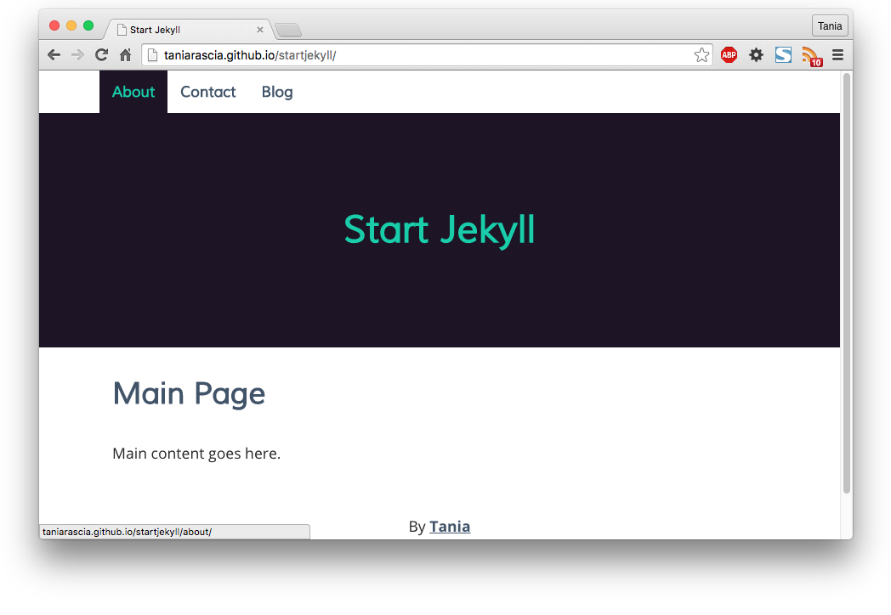
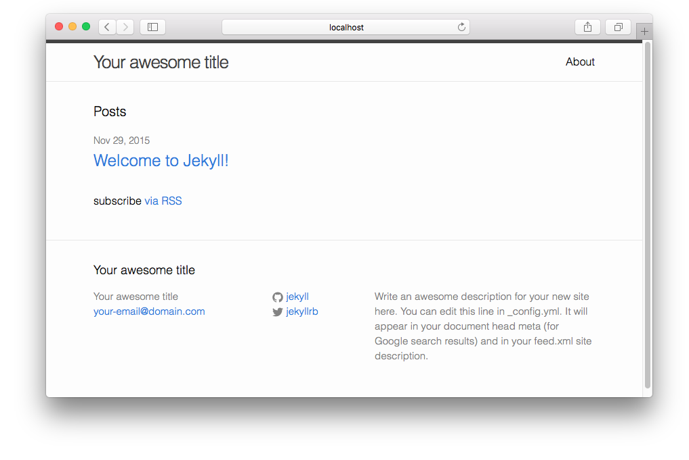

[Jekyll](https://jekyllrb.com/) is a static site generator that runs on the Ruby programming language. You may have heard of Jekyll or static site generators, but don't know how or where to get started. This guide is intended to be a complete tutorial, and require no additional resources to get you up and running with Jekyll.

While Jekyll is advertised as a blogging platform, it can be used for static websites as well, much like WordPress. Jekyll harnesses the power of [markdown](https://daringfireball.net/projects/markdown/), which makes writing HTML much easier and more efficient. Additionally, Jekyll has Sass built in, and if you've never used a CSS preprocessor, it's a great time to learn. If you already know how to use Sass, you'll feel right at home.

This is what the website we make will look like:



- [View Demo](http://taniarascia.github.io/startjekyll/) 
- [View on GitHub](http://github.com/taniarascia/startjekyll/)

#### Prerequisites

- Basic knowledge of HTML and CSS
- [Basic command line knowledge](/how-to-use-the-command-line-for-apple-macos-and-linux/)
- A GitHub account

If you don't have a basic knowledge of command lines and Git, please read [the getting started with Git](http://www.taniarascia.com/getting-started-with-git/) article. This will cover everything you need to know to get started with using Git and the command line.

#### Goals

- Learn what a static site generator is
- Install Jekyll
- Create a custom website running on Jekyll and Sass
- Deploy a Jekyll site to GitHub pages

Additionally, this tutorial is currently Mac only. If I get a request to do a Windows tutorial, I'll look into it, but until then, you must be running OSX for this tutorial to be effective.

## What is a static site generator?

A static site generator builds a website using plain HTML files. When a user visits a website created by a static site generator, it is loaded no differently than if you had created a website with plain HTML. By contrast, a dynamic site running on a server side language, such as PHP, must be built every time a user visits the site.

You can treat a static site generator as a very simple sort of CMS (content management system). Instead of having to include your entire header and footer on every page, for example, you can create a header.html and footer.html and load them into each page. Instead of having to write in HTML, you can write in Markdown, which is much faster and more efficient.

Here are some of the main advantages of static site generators over dynamic sites:

- **Speed** - your website will perform much faster, as the server does not need to parse any content. It only needs to read plain HTML.
- **Security** - your website will be much less vulnerable to attacks, since there is nothing that can be exploited server side.
- **Simplicity** - there are no databases or programming languages to deal with. A simple knowledge of HTML and CSS is enough.
- **Flexibility** - you know exactly how your site works, as you made it from scratch.

Of course, dynamic sites have their advantages as well. The addition of an admin panel makes for ease of updating, especially for those who are not tech-savvy. Generally, a static site generator would not be the best idea for making a CMS for a client. Static site generators also don't have the possibility of updating with real time content. It's important to understand how both work to know what would work best for your particular project.

## Installing Jekyll

We're going to install Jekyll locally before deploying anything to GitHub pages.

### Install Command Line Tools

Open Terminal. Check to see if you have XCode Command Line Tools installed by typing `gcc -v`. At this point, it will prompt you to install if you don't. Or run this code to install:

```bash
xcode-select --install
```

### Install Ruby

Ruby should come pre-installed on all OSX computers. You can check if Ruby is installed by running `ruby -v`. It should return with Ruby version 2.0.0 or higher.

ruby 2.0.0p645 (2015-04-13 revision 50299) [universal.x86_64-darwin15]

If for some reason you're running a lower version, you can update.

```bash
sudo gem install ruby
```

> If you plan on using Ruby for more purposes, it might be advisable to install [Ruby Version Manager](https://rvm.io/). Otherwise, the above commands are perfectly fine.

### Install Bundler

Bundler is a package manager that will aid you in installing all the Jekyll dependencies.

```bash
sudo gem install bundler
```

Successfully installed bundler-1.10.6
Parsing documentation for bundler-1.10.6
1 gem installed

### Create Gemfile

Create a directory, and add a file called **Gemfile**. The file doesn't contain an extension. Type the following contents into the file and save it.

```ruby
gem 'github-pages'
source 'https://rubygems.org'
```

In Terminal, run this command in the directory that contains the Gemfile:

```bash
bundle install
```

This command should run for a while. It might ask you for your sudo password, or for you to run `sudo bundle install`. When it's finished, it will say something like this:

Bundle complete! 1 Gemfile dependency, 55 gems now installed.

### Install Jekyll

Great! Now that that's finished, you can successfully install Jekyll. I'm going to call my project **startjekyll**

```bash
jekyll new startjekyll
```

```terminal
New jekyll site installed in /Users/tania/Sites/startjekyll.
```

Move to the new directory.

```bash
cd startjekyll
```

And initialize a new Git repository.

```bash
git init
```

```terminal
Initialized empty Git repository in /Users/tania/Sites/startjekyll/.git/
```

At this point, all the setup is complete. In your project directory, run the following code:

```bash
jekyll serve
```

This command runs a "watch" on the entire server. Changes made to any files (except the configuration file!) will be compiled into static HTML.

Now go to the url `http://localhost:4000`. You will see this page.



Congratulations, you've just installed Jekyll! If you type CTRL + C in Terminal, it will end the running process and the site will no longer be served to localhost. Simply run `jekyll serve` again and it will come back up.

## Creating a Jekyll theme

With Jekyll, we'll be able to process SCSS (Sass) files into CSS (**.scss** -> **.css**), and Markdown into HTML (**.md** -> **.html**). No additional task runners or Terminal commands are required!

There are a few important things to know about the Jekyll file system.

- The "distribution" folder is called **\_site**. This is what the static site generator generates! **Never** place any files in that folder; they will be deleted and overwritten.
- The **\_sass** folder is for Sass partials. Every file in here should begin with an underscore, and it will compile into the **css** folder.
- Any file or folder placed into the main directory will compile into the **\_site** directory as-is.

There is more to know, but we'll learn along the way.

> I'm going to go through all the files from here on out. If you'd rather clone the Git repository, you can [view it here](https://github.com/taniarascia/startjekyll). All the files in the repo will be the same as what I display here.

## Configuration

In the main directory, there's a file called **\_config.yml**. It looks like this:

```yaml
# Site settings
title: Your awesome title
email: your-email@domain.com
description: > # this means to ignore newlines until "baseurl:"
  Write an awesome description for your new site here. You can edit this
  line in _config.yml. It will appear in your document head meta (for
  Google search results) and in your feed.xml site description.
baseurl: '' # the subpath of your site, e.g. /blog/
url: 'http://yourdomain.com' # the base hostname & protocol for your site
twitter_username: jekyllrb
github_username: jekyll

# Build settings
markdown: kramdown
```

Pretty obvious. There are two important things to know about the config file:

- Changes made to **\_config.yml** will not be watched by `jekyll serve`. You must restart and reserve Jekyll after any config changes.
- All indentation is mandatory and must be made with two spaces, or else the file will not work.

I'm going to make a few changes to the configuration.

```yaml
# Site Settings
title: Start Jekyll
email: taniarascia@gmail.com
description: >
  A guide to getting started with Jekyll.
baseurl: ''
url: 'http://localhost:4000'
twitter_username: taniarascia
github_username: taniarascia
# Build Settings
sass:
  sass_dir: _sass
include: ['_pages']
kramdown:
  input: GFM
```

I changed the base URL to **http://localhost:4000**. This will be for the dev configuration. I'm declaring `_sass` as the sass directory, to ensure the Sass compiles correctly. I'm adding `include: ['_pages']` so that custom pages will be organized into their own directory, and `input: GFM` will allow Github Flavored Markdown.

## Customizing your Jekyll Theme

The default styles try to be basic, but they're still far too stylized for my liking. We're going to override all the styles and make them much more simple. You can turn off the Jekyll serve at this point and just start saving files. We'll go from top to bottom alphabetically.

I'm using my own name as an example, but obviously change everything to match you.

### \_includes

In Jekyll, **\_includes** are files that should show up on every page - header, footer, etc.

#### footer.html

```html
<footer>
	<p>By <a href="http://taniarascia.com">Tania</p>
</footer>
```

#### head.html

Any `head` metadata.

```html
<head>
  <meta charset="utf-8" />
  <meta http-equiv="x-ua-compatible" content="ie=edge" />
  <meta name="viewport" content="width=device-width, initial-scale=1" />

  <title>{{ page.title }}{{ site.title }}</title>

  <link rel="stylesheet" href="{{ "/css/main.css" | prepend: site.baseurl }}">
  <link
    rel="canonical"
    href="{{ page.url | replace:'index.html','' | prepend: site.baseurl | prepend: site.url }}"
  />
  <link
    href="https://fonts.googleapis.com/css?family=Open+Sans:400,300,700,800,600"
    rel="stylesheet"
    type="text/css"
  />
  <link
    href="https://fonts.googleapis.com/css?family=Muli:400,300"
    rel="stylesheet"
    type="text/css"
  />
</head>
```

#### header.html

Your navigation and header. I will dynamically load all pages into the navigation bar, except for the blog page, which I will load manually.

```html
<aside>
	<div class="container">
		<nav>
			<ul>
 
<li><a href="{{ page.url | prepend: site.baseurl }}">{{ page.title }}</a></li>
 
<li><a href="{{ "/blog" | prepend: site.baseurl }}">Blog</a></li>
			</ul>
			</li>
			</ul>
		</nav>
	</div>
</aside>

<header>
	<h1><a href="{{ site.baseurl }}">{{ site.title }}</a></h1>
</header>
```

### \_layouts

The layout that your content will conform to.

#### default.html

```html
<!DOCTYPE html>
<html>
  

  <body>
    
    <main>
      <article>
        {{ content }}
      </article>
      
    </main>
  </body>
</html>
```

#### page.html

```html
--- 
layout: default 
---

<h2>{{ page.title }}</h2>

{{ content }}
```

All the dashes at the top are **mandatory**. If you don't include them, the website won't work properly. For pages and posts, the default layout gets loaded, plus any additional layout information you desire.

#### post.html

Same as the page, but with date and author metadata.

```html
--- 
layout: default 
---

<h2>{{ page.title }}</h2>
<time
  >{{ page.date | date: "%b %-d, %Y" }} • {{ page.author }} • {{ page.meta }}</time
>

{{ content }}
```

### \_pages

The default Jekyll website does not come with a **\_pages** directory, but I like to include it so the main directory stays clean.

#### 01_about.md

Now we're creating the markdown files. Prepending them with a number ensures that they appear in the order you specify.

```markdown
---

layout: page
title: About
permalink: /about/
---

About content goes here.

* A list item
* Another list item
```

#### 02_contact.md

```markdown
---

layout: page
title: Contact
permalink: /contact/
---

Contact content goes here.

My e-mail is [email@something.com](mailto:email@something.com).
```

### \_posts

I'm going to leave the post exactly as it is.

Delete about.md from the main directory, since we've put it in the **\_pages** directory.

### index.html

**index.html** in the main directory will be the main page of the site.

```html
--- 
layout: default 
---

<h2>Main Page</h2>

Main content goes here.
```

### blog

Create a new directory called **blog**. Inside, create an **index.html**. This will be the main blog page that will contain all your posts.

```html
---
layout: default
---

<h4>blog</h4>

		<time>{{ post.date | date: "%b %-d, %Y" }}</time>
		<h3><a href="{{ post.url | prepend: site.baseurl }}">{{ post.title }}</a></h3>


<p>subscribe <a href="{{ "/feed.xml" | prepend: site.baseurl }}">via RSS</a></p>
```

### css

The **css** directory in the root should contain one file - **main.scss**. Edit it to contain the following:

```scss
---
# Front matter comment to ensure Jekyll properly reads file.
---
@import
	"base",
  "layout",
  "syntax-highlighting"
```

Leave the top part exactly as is.

### \_sass

The absolute last directory that we need to edit - the sass partials. Create each of these files in the `_sass` directory.

#### \_base.scss

Variables, mixins, and resets will go here.

```scss
$content-width: 800px;
$main: #19ccaa;
$font-style: 'Open Sans', sans-serif;
$font-color: #262626;
$link-color: #425469;
$link-hover-color: $main;
$heading-font: 'Muli', sans-serif;
$heading-font-color: #425469;
$light: #e7edf4;
$header: #1d1425;

*,
*::before,
*::after {
  -webkit-box-sizing: border-box;
  -moz-box-sizing: border-box;
  box-sizing: border-box;
}
```

#### \_syntax-highlighting.scss

Simply remove this line from the file:

```scss
@extend %vertical-rhythm;
```

#### \_layout.scss

All my styles will go in here. I made a simple, responsive website that doesn't rely on any frameworks.

```scss
body {
  margin: 0;
  color: $font-color;
  font-family: $font-style;
  font-size: 1.1em;
  line-height: 1.6;
  -webkit-font-smoothing: antialiased;
}
h1,
h2,
h3 {
  font-weight: 600;
  color: $heading-font-color;
  font-family: $heading-font;
  line-height: 1.5;
}
h1 {
  color: $main;
  font-size: 2.5em;
  a,
  a:visited {
    text-decoration: none;
    color: $main;
  }
}
h2 {
  font-size: 2em;
}
a,
a:visited {
  color: $link-color;
  text-decoration: underline;
  font-weight: bold;
}
a:hover {
  color: $link-hover-color;
  text-decoration: underline;
}
header {
  background: $header;
  padding: 0px 15px;
  text-align: center;
  margin: 50px 0 0;
  height: 50vh;
  display: flex;
  justify-content: center;
  align-items: center;
}
main {
  padding: 0 15px;
  max-width: $content-width;
  margin: 0 auto;
}
time {
  color: #898989;
}
.container {
  max-width: $content-width;
  margin: 0 auto;
}

/* Aside */

aside {
  position: fixed;
  top: 0;
  left: 0;
  background: #fff;
  width: 100%;
  z-index: 2;
  border-bottom: 1px solid lighten($light, 30%);
  box-shadow: 0px 1px 1px RGBA(4, 25, 54, 0.1);
  nav {
    float: left;
    max-width: 800px;
    margin: 0 auto;
    ul {
      margin: 0;
      padding: 0;
      list-style: none;
      li {
        float: left;
        position: relative;
        a {
          text-decoration: none;
          display: block;
          padding: 15px;
          font-family: 'Muli', sans-serif;
          line-height: 20px;
          margin-bottom: -1px;
          box-shadow: 0;
          &:hover,
          &:active {
            background: $header;
            text-decoration: none;
            color: $main;
          }
        }
      }
    }
    &:after {
      content: '';
      display: table;
      clear: both;
    }
  }
}
footer {
  text-align: center;
  padding: 40px;
}
```

## Serve Jekyll

At this point, all the files are ready and jekyll can be served.

```bash
jekyll serve
```

If you inserted all the code exactly as above, the sass partials will compile into the main.scss. All the rest of the files will write to **\_site** site, which is the distribution folder.

Server running... press ctrl-c to stop.

If I make a change to any of the sass files, they should compile.

```terminal
Regenerating: 1 file(s) changed at 2015-11-30 ...done in 0.090263 seconds.
Regenerating: 1 file(s) changed at 2015-11-30 ...done in 0.120487 seconds.
```

## Pushing Jekyll site to GitHub pages

Create an empty repository in GitHub. Mine is **startjekyll**, so the Git repo URL is `https://github.com/taniarascia/startjekyll`.

There is one change that needs to be made in order to have one site for both your local Jekyll and the live GitHub pages.

Duplicate your **\_config.yml** and call it **\_config_dev.yml**.

Leave the **\_config_dev.yml** as is, and change **\_config.yml** for the live site.

```yaml
baseurl: "/startjekyll"
url: "https://taniarascia.github.io"
```

Now, when you want to work on the site locally, you will run the following command:

```bash
jekyll serve --config _config.yml,_config_dev.yml
```

And it will load the information from the dev config.

Serve your Jekyll one last time to ensure all the final changes have been updated. Here are the commands to push the site to GitHub pages:

```bash
git remote add origin https://github.com/taniarascia/startjekyll.git
```

Add the GitHub repository.

```bash
git checkout -b gh-pages
```

Ensures that you're on the `gh-pages` branch, not `master`.

```bash
git add .
```

Track all files.

```bash
git commit -am "Initial commit"
```

Commit all files.

```bash
git push origin gh-pages
```

Push all files to **gh-pages** branch.

At this point, you should be able to open up [taniarascia.github.io/startjekyll](http://taniarascia.github.io/startjekyll), and it should be your Jekyll project! Without using any external task runners (like Grunt or Gulp), you can now work on the Sass files on your website, and serve up markdown files in place of HTML.

From here, it will be very easy to customize Jekyll to your liking. I purposefully kept every page as simple as possible, using semantic HTML5 tags. I sincerely hope this guide helped get you up and running with Jekyll. I documented all the steps along the way to ensure that the Sass will compile properly, and you won't have issues being on the right branch to push to GitHub pages.

If you came across any trouble or confusion, please let me know and I'll improve the tutorial.
