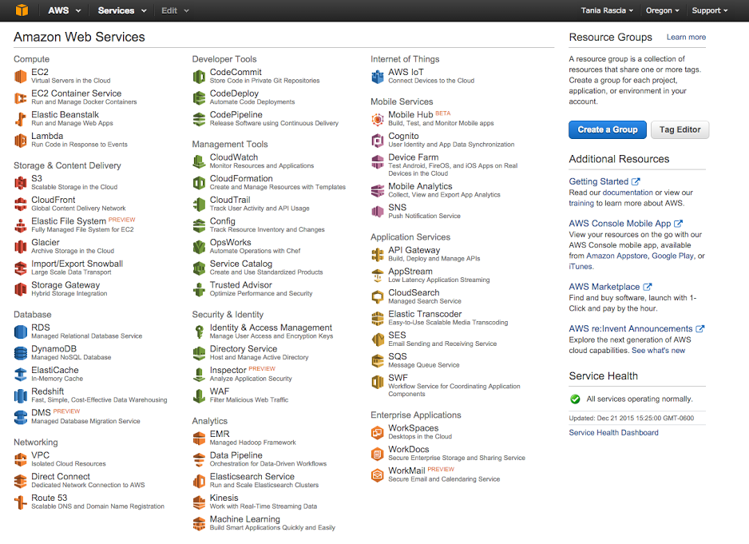
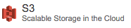
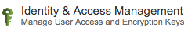
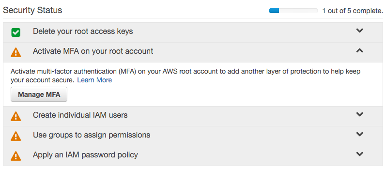
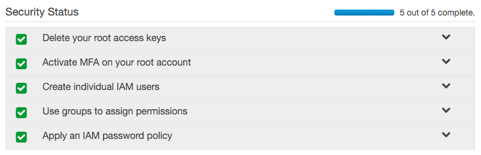
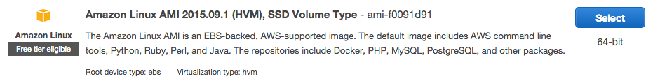
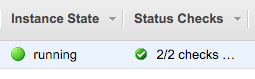
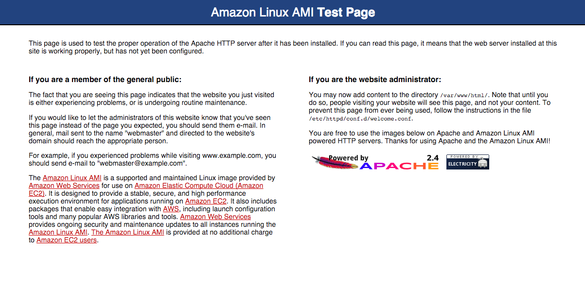
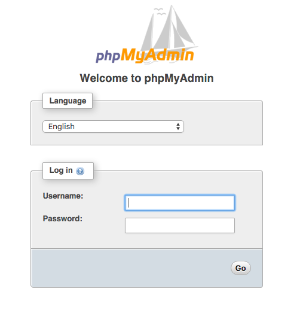

Amazon Web Services, or AWS, is a set of web services provided by Amazon.com. If you're looking for web hosting through AWS and have only had experience with managed hosting services before, there's a lot to learn. In this tutorial, I'm going to highlight some of the most important features and services of AWS.

AWS is a veritable alphabet soup of acronyms, so I highly suggest you give [AWS in Plain English](https://www.expeditedssl.com/aws-in-plain-english) a read through before attempting to tackle the beast.

The way I go about setting up a server is far from the only way to do it, but it will be a complete guide. [The AWS Documentation](https://aws.amazon.com/documentation/) is absolutely massive, so you should be able to find any additional information there.

#### Prerequisites

- **Basic command line knowledge** - if you've never used the command line before, trying to set up AWS will be a bit terrifying. I would recommend reading through the first few chapters of [The Command Line Crash Course](http://learnpythonthehardway.org/book/appendixa.html) and getting comfortable before moving on to AWS.
- **Ability to set up a website** - you should already know HTML and CSS, and have set up a live website at some point.

#### Goals

- Make an AWS account and learn about the key services
- Configure AWS Security
- Set up and configure virtual server
- Set up a LAMP stack (Linux, Apache, MySQL, PHP)
- Set up virtual hosts

## Where Things are Located In Linux

This will come in handy as you read the article.

- **Public HTML** - `/var/www/html`
- **Apache Configuration** - `/etc/httpd/conf/httpd.conf`
- **Hosts** - `/etc/hosts`
- **phpMyAdmin Configuration** - `etc/httpd/conf.d/phpMyAdmin.conf`
- **SSH Configuration** - `/etc/ssh/sshd_config`

## Making an AWS Account

Here's the good news - AWS is free for a year, so you can run through this or any tutorial to get an idea of how it all works, regardless of whether or not you want to use it.

Go to [Amazon Web Services](https://aws.amazon.com/) and sign up for an account. If you already have an Amazon.com account for something else (Kindle, buying stuff online) it will be the same account. You'll choose the Basic (free) account, be prompted for your credit card and phone number, they'll call you to confirm, and you're in.

No opening preamble - here's the dashboard.



## Key AWS Services

There are currently 53 services, with more being added all the time, but you most likely won't even use close to half of them. I'll take a moment to highlight the absolute most essentials.


An **EC2** instance (_Elastic Compute Cloud_) is a virtual server in the cloud. You have complete control over the server, what gets installed on it, the configuration, and so on. Since we're setting up LAMP, Apache, MySQL and PHP are going to be installed on a Linux EC2 instance.



Amazon **S3** (_Simple Storage Service_) is a static file storage service. It's like a simple web interface for FTP, in which you can host static files and also host static websites - so images, HTML, CSS, JavaScript, PDFs, mp3s, and so on, but nothing that requires a server. S3 containers are known as buckets.



**IAM** (_Identity & Access Management_) will contain all the settings and security configuration your for your account.

There are many, many useful services here, but we should be able to get started with just these three.

## Securing Your Account

A good idea when first creating your account is adding some additional layers of security. Go to **IAM** on the dashboard.



### Activate MFA (Multi Factor Identification) on Your Root Account

Download Google Authenticator on your phone, and click **Manage MFA**. Select **Virtual MFA Device**. You'll scan a QR code with the Google Authenticator app. Type the random numbers that pop up into the input, and your device will be associated with the account. Now no one can log in to your root account without also having your phone.

### Create Individual IAM Users

Go to **Users** and **Create User**. Make a username for yourself. User Security Credentials will also be generated when you create the user, so save or download the **Access Key ID** and **Secret Access Key** they give you. At some point, these will come in handy, so it's a good idea to make them right off the bat. Create a password for your user under **Security Credentials**.

Reason for users, according to AWS:

> Create IAM users and give them only the permissions they need. Do not use your AWS root account for day-to-day interaction with AWS, because the root account provides unrestricted access to your AWS resources.

### Create Groups

At this point, I'm going to go to **Groups**, create a group called **Developer**, and grant **AdministratorAccess**. Obviously, if you had a bigger team, you could allow access only to certain services, but since it's just me, I'm going to give it full access.

### Create a Password Policy

In **Account Settings**, you can set a password policy (or leave it as is), and your security setup is complete.



### Create an Account Alias

Finally, how do we log in with the user we just created? You'll notice at the top of the IAM dashboard, there's a horrible link:

**IAM users sign-in link:**
https://stuff.signin.aws.amazon.com/console

Change it to something you'll remember. Log out of your account, and go to https://your-alias.signin.aws.amazon.com/console. From here, you'll log in with the credentials of the user you created before - you should no longer log in as root user.

Hopefully you feel pretty secure at this point, so we can finally move on.

## Setting up an EC2 Instance

We're going to set up a Linux EC2 instance. The default settings for a Linux server do not allow access via password - they use Key Pairs. If you want to change that later you can (although it's not recommended), but it's necessary to generate a key pair to begin.

### Generate Key Pair

Go to **EC2**, and click on **Key Pairs**. Generate a key pair, and call it whatever you want. **Your_Key.pem** will get saved to your downloads folder. Move the pem file from your **Downloads** folder to your **.ssh** directory, located in your main user directory. The whole URL to your pem file should be:

```bash
~/.ssh/Your_Key.pem
```

You can technically move this file anywhere, it doesn't need to be located in the **.ssh** directory to function.

### Create a VPC

An instance requires a **VPC** (_Virtual Private Cloud_). Your region might contain a default VPC - mine did. You can check this by going to the **EC2 dashboard** and checking the settings on the right side for **Default VPC**. If it doesn't exist, [set one up](http://docs.aws.amazon.com/AWSEC2/latest/UserGuide/get-set-up-for-amazon-ec2.html#create-a-vpc).

### Create Security Group

In the **EC2 dashboard**, click on **Security Groups**. You will see one already created by default, but we'll make a new one to get accustomed to it.

Set a name (such as _username_SG_region_) and apply it to the default VPC (should be the only one).

On **Inboard**, add rule:

- **Type**: HTTP
- **Source**: Anywhere (0.0.0.0/0)
- **Type**: HTTPS
- **Source**: Anywhere (0.0.0.0/0)
- **Type**: SSH
- **Source**: My IP

You can select the **My IP** option, or type "whats my ip" in Google to get your IP and type it in. These rules are telling the EC2 instance to allow inbound access to the internet (0.0.0.0/0) but only allow SSH access from your IP. You can technically set SSH access to the internet as well, just know that it's a reduction in security.

## Launching an EC2 Instance

The setup for creating an EC2 instance is complete, so now we can launch. Go to **Instances**. It will tell you there are no instances set up, so click **Launch Instance**.

This will launch a quick start guide.

### Choose an AMI

An AMI (_Automated Machine Image_) is a template for an instance. Later you can save your completed instance and launch new ones based on your configuration with an AMI. For now, we're going to use the first option on the list, which is an Amazon Linux AMI.



### Choose Instance Type

Different instance types will provide different specs for CPU, memory, performance, and so on. The free-tier instance type is **t2.micro**, so select that and click **Next - Configure Instance Details**.

### Configure Instance Details

**Number of Instances**: 1
**Network**: Default VPC
**Auto-assign Public IP**: Disable (we'll set an elastic IP in a second)
**IAM Role**: Create New IAM Role - you don't need to do this, but you can't set a role after you create an instance, so I'm going to create a role and give it AmazonEC2FullAccess.
**Shutdown Behavior**: Stop

You can protect against accidental termination if you'd like.

You can skip past **Add Storage** and **Tag Instance** for now.

### Configure Security Group

Select the security group you created before, with full HTTP and HTTPS access, and SSH access only from your IP.

**Review and Launch** then **Launch**. You will be prompted to enter a key pair, which will be the one you created earlier. Accept the terms and launch.

## Connecting to an EC2 Instance

Back in the **EC2 dashboard**, if you go to **Instances** you'll see the new instance set up with all your specs. It takes a few minutes to initialize.

You can right-click on the empty space under **Name** and set a name to your instance. This is how it will look when it's ready.



### Create an Elastic IP

Earlier I didn't create a public IP for the instance. Now I'm going to go to **Elastic IPs**. Click **Allocate New Address**. Under **Actions**, select **Associate Address** and apply it to the instance you just created.

> An Elastic IP will remain yours even if you shut down the instance, while a regular public IP won't.

Now we can SSH into our instance and start installing services. Open **Terminal**. Find your "Public DNS" in your instance description. It will look something like ec2-00-00-00-00.us-region-0.compute.amazonaws.com.

The default user for AWS Linux is **ec2-user**. At this point, many people attempt to SSH to the server with the following:

```bash
ssh ec2-user@PublicDNS
```

The authenticity of host "xxx" can't be established.
ECDSA key fingerprint is "xxx".
Are you sure you want to continue connecting? (yes/no)

At this point, you will enter:

```bash
yes
```

Warning: Permanently added "xxx" to list of known hosts.
Permission denied (publickey).

As I mentioned before, the default settings for Linux require a public and private key match to log in, not password authentication. Now type the following:

```bash
chmod 400 ~/.ssh/Your_key.pem
```

Permissions need to be set to 400 before you can use the key.

```bash
ssh -i ~/.ssh/Your_Key.pem ec2-user@PublicDNS
```

And you're in!

```terminal

       __|  __|_  )
       _|  (     /   Amazon Linux AMI
      ___|\___|___|

https://aws.amazon.com/amazon-linux-ami/2015.09-release-notes/
```

First thing you can do is update the packages.

```bash
sudo yum update -y
```

You will install all the security packages that have come out for AWS since the AMI was launched. Now your instance is secure and up to date.

If you've never used Linux, **yum** is _Yellowdog Updater, Modified_, and it's the primary package manager for Linux. You can easily install many services through yum.

With one command, you can install Apache, MySQL, and PHP.

```bash
sudo yum install -y httpd24 php56 mysql55-server php56-mysqlnd
```

You can also install them one at a time - `yum install httpd24` installs Apache 2.4, `yum install php56` install PHP 5.6, etc.

If you simply ran `yum install php`, you would end up installing PHP 5.3, the default version of PHP, which came out in 2009. I'd prefer the instance to be more up to date, so I'm using the AWS LAMP stack recommendations.

Now start Apache.

```bash
sudo service httpd start
```

And make sure it starts on each boot.

```bash
sudo chkconfig httpd on
```

Paste the URL of the Public DNS into your browser, and you'll get this:



I'm also going to install **git** because it will come in handy.

```bash
sudo yum install git
```

Start MySQL. Later, you might decide to use RDS (_Relational Database Service_) for your database needs, but for now we can install MySQL on the server.

```bash
sudo service mysqld start
```

Now we'll configure MySQL safely according to the AWS specifications.

```bash
sudo mysql_secure_installation
```

It will prompt you for the root password, which is blank, so press enter. You'll type `y` about 5 times until the configuration is complete.

Prompt MySQL to load on boot.

```bash
sudo chkconfig mysqld on
```

Install phpMyAdmin.

```bash
sudo yum-config-manager --enable epel
    sudo yum install -y phpMyAdmin
```

Edit the phpMyAdmin configuration file.

Find this:

```apacheconf
<Directory /usr/share/phpMyAdmin/>
  <IfModule !mod_authz_core.c>
    # Apache 2.2
    Order Deny,Allow
    Allow from All
    Allow from 127.0.0.1
    Allow from ::1
  </IfModule>
</Directory>
```

If you want to be able to access phpMyAdmin from any IP, change it to this:

```apacheconf
Order Allow,Deny
Allow from All
```

The preferred security method would be to add your IP to the bottom of the list and leave the other settings as is.

```apacheconf
Allow from YOUR_IP
```

Also modify this configuration.

```apacheconf
<RequireAny>
  #Require ip 127.0.0.1
  #Require ip ::1
  Require all granted
</RequireAny>
```

phpMyAdmin should work now when you go to http://PublicDNS/phpmyadmin.



You can login with **root** and the password you set earlier.

### Create a new user

Let's create a new user so we're not using the default **ec2-user**. Log in as sudo (root) user.

```bash
sudo su
```

Create user. I'll call it **your-user**.

```bash
useradd your-user
```

Set a password for the new user.

```bash
passwd your-user
```

Enter the password twice.

Now, if I'm using SFTP as well as SSH, I'll want to be able to access the Public HTML folder (`/var/www/html`) with my user. You can't `sudo` in SFTP, so we'll need to assign a group to the `www` directory as well as the new user.

### Modify New User Permissions

Create a `www` group.

```bash
groupadd www
```

Add group to new user.

```bash
usermod -a -G www your-user
```

Run the following commands.

```bash
chown -R root:www /var/www

chmod 2775 /var/www

find /var/www -type d -exec sudo chmod 2775 {} +

find /var/www -type f -exec sudo chmod 0664 {} +
```

Now user **your-user** will be able to write in the `www` directory.

### Give New User SSH Access

Open a new local Terminal window. Run this command to get the public key from your pem file.

```bash
ssh-keygen -y
```

When it prompts you for the URL, `~/ssh/Your_Key.pem` won't work. Instead, write out the full path.

```bash
/Users/you/.ssh/Your_Key.pem
```

Now the public key should come up. It will start with `ssh-rsa` and include a long string. Save it.

Back in your AWS Instance Terminal, change users to the new one you created.

```bash
sudo su - your-user
```

You'll be in the `/home/your-user` directory. Make a directory for your public key to live and set the proper permissions.

```bash
mkdir .ssh
chmod 700 .ssh
```

Create `authorized_keys` and give it the proper permissions.

```bash
touch .ssh/authorized_keys
chmod 600 .ssh/authorized_keys
```

Add the public key to the `authorized_keys` configuration.

```bash
nano .ssh/authorized_keys
```

Paste the keys, CTRL + O, Enter, CTRL + X` to save and exit.

Now **your-user** has permissions to SSH into your instance!

### Give User Sudo Access

An easy way to give your new user sudo access is to run this command as root:

```bash
sudo usermod -aG wheel your-user
```

```bash
visudo
```

Press i on the keyboard to enter Insert Mode. Find `# %wheel ALL=(ALL) ALL` and uncomment it (remove the #). Save and exit by pressing exit, and typing `:wq!` plus enter.

### SFTP into Instance

If you want to SFTP into the instance, you can use the same Server (Public DNS) and username (your-user), and select key instead of password, linking to Your_Key.pem.

### So you want SSH and SFTP access without using a keypair?

It's possible to enter SSH and SFTP with a password instead of a keyfile. This way you can access the server on any computer without special credentials. Obviously, this is usually advised against, but here's how to do it.

Back in the Security Groups, ensure that SSH has access from (0.0.0.0/0), and not just your IP.

Edit the SSH configuration file with `nano /etc/ssh/sshd_config`. Find `#PasswordAuthentication yes` and uncomment. There might be another PasswordAuthentication below it, make sure it's set to yes.

Restart SSH by running `sudo /etc/init.d/sshd restart`. Now you can log in from any IP with the command `ssh your-user@PublicDNS`, it will prompt you for a password, and you will be entered.

## Setting Up Virtual Hosts

Your public html folder is located in `/var/www/html`. Anything that is visible to the public should be located there. I've created a folder through SFTP called `example`. I'm also going to create a `000` folder, to be the localhost directory.

Edit the Apache configuration file.

```bash
nano /etc/httpd/conf/httpd.conf
```

Find `AllowOverride None` in `<Directory "/var/www/html">` and change to `AllowOverride All`.

Add virtual hosts by adding this to the bottom of the file.

```apacheconf
NameVirtualHost *:80

<VirtualHost *:80>
    ServerName localhost
    DocumentRoot /var/www/html/000
</VirtualHost>

<VirtualHost *:80>
  ServerName www.example.com
  ServerAlias example.com *.example.com
  DocumentRoot /var/www/html/example
</VirtualHost>
```

Save and exit. Now edit the hosts file.

```bash
nano /etc/hosts
```

And add as many hosts as you want.

```js
127.0.0.1    dev.example.com
127.0.0.1    example.com
```

Remember to run `service httpd restart` after any Apache configuration change.

This will send the Public DNS to the `000` folder, and `example.com` and any related subdomain to the `example` folder.

You can create `index.php` in the `000` folder, and make it something simple to ensure php is functioning, and the localhost directive is pointing to the right place.

```php
<?php echo '<h1>AWS Linux</h1>'; ?>
```


Easy enough.

Maybe you already have a DNS located somewhere that you can make a test with. I'm going to make `dev.example.com` point to AWS. I can do this by going to my host, finding the DNS settings, and creating a DNS Resource Record.

- **Name**: dev.example.com
- **Type**: CNAME
- **TTL**: 300
- **Target**: PublicDns

If you don't have a DNS or host already around that you can play around with, **Route 53** on the AWS dashboard is where they take care of all DNS related entries.


## Transferring Files to EC2

At this point, I have SFTP set up, so I can transfer files over the old fashioned way, with Transmit or Coda. But I'm going to do something even easier, and pull the code from a Git repo, since it's already up there.

```bash
git init
git remote add origin https://repo.git
git pull origin master
```

Now when I go to my site, all my files are there and the site is live.

## Conclusion

You should have been able to run through this entire article without once referring to StackOverflow or Google to look up a command or explanation. If that's not the case, then I need to revise and improve the article.

Hopefully some of the aspects of setting up a server in AWS have been clarified, and you feel excited to explore more of AWS. If this article provides helpful, I'll look into making guides for setting up static hosting with AWS, databases in the cloud with RDS, setting up WordPress, setting up a CDN with CloudFront, load balancing multiple instances, and so on.
