In part one of the tutorial series [Developing a WordPress Theme From Scratch](http://www.taniarascia.com/developing-a-wordpress-theme-from-scratch/), we learned what WordPress is, what it can do, and how to do the following:

- Set up a local **Apache, MySQL, PHP** (\*AMP) environment
- Install WordPress on your local server
- Take an existing static HTML & CSS site and make it into a custom WordPress theme
- Divide your theme into sections (**index.php**, **header.php**, **footer.php**, **sidebar.php**, and **content.php**)
- Use The Loop to make **posts** and **pages**
- Migrate local WordPress site to a live server

We created this theme using [Bootstrap](http://getbootstrap.com), and more specifically the official [generic blog template](https://getbootstrap.com/examples/blog/). While the theme could use custom CSS or any framework, I went with Bootstrap so that we can focus on creating the theme's function without worrying about the style.

Here is what the theme looked like at the end of the last article:

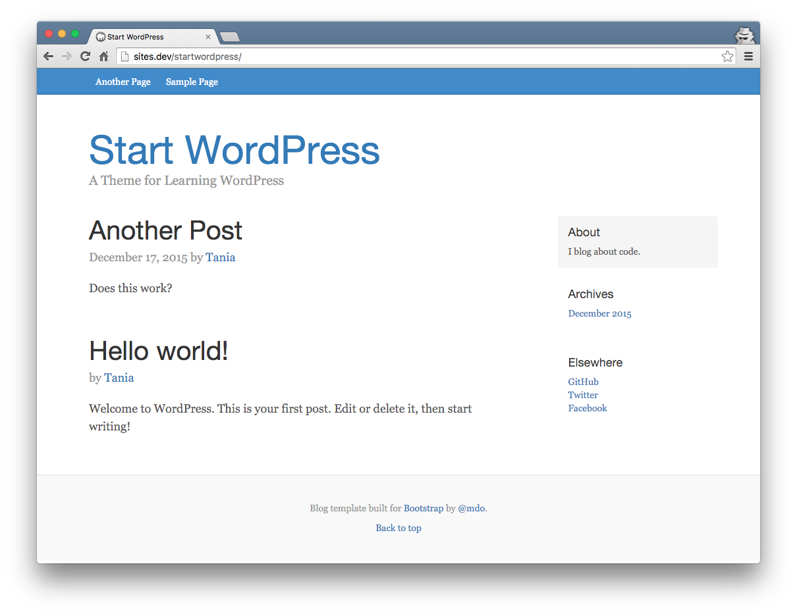

Very simple, but it effectively demonstrates how to use the WordPress Loop to display content dynamically.

In this article, we're going to go through more essential WordPress theming techniques.

#### Prerequisites

- Basic knowledge of HTML and CSS
- Ability set up WordPress and make a basic theme ([covered in part one](http://www.taniarascia.com/developing-a-wordpress-theme-from-scratch/))

#### Goals

- Create individual post pages - **single.php**
- Add pagination
- Include comments
- Learn how to use **functions.php**
- Properly enqueue stylesheets and scripts
- Create global custom fields
- Create custom post types

First, I'm going to start off by adding individual blog posts and pagination.

> Make sure before starting this article you go to **Settings > Permalinks**. By default, WordPress is set to **Day and name**. Change this to **Post name**.

## Individual Post Pages

In the last article, we made header, footer, sidebar, content, and page files. Now we're going to make **single.php**, which is an individual post page. It's going to be an exact duplicate of **page.php**, except I'm going to change `'content'` to `'content-single'`.

```php
<?php get_header(); ?>

	<div class="row">
		<div class="col-sm-12">

			<?php
if ( have_posts() ) : while ( have_posts() ) : the_post();
	get_template_part( 'content-single', get_post_format() );
endwhile; endif;
			?>

		</div> <!-- /.col -->
	</div> <!-- /.row -->

<?php get_footer(); ?>
```

Now you'll create **content-single.php**, which is a duplicate of **content.php**.

```php
<div class="blog-post">
	<h2 class="blog-post-title"><?php the_title(); ?></h2>
	<p class="blog-post-meta"><?php the_date(); ?> by <a href="#"><?php the_author(); ?></a></p>
	<?php the_content(); ?>
</div><!-- /.blog-post -->
```

So now you can see that **index.php** is pulling in **content.php**, and **single.php** is pulling in **content-single.php**.

Going back to the original **content.php**, we have the title of each article.

```php
<h2 class="blog-post-title"><?php the_title(); ?></h2>
```

Using `the_permalink()`, we're going to link to the single page.

```php
<h2 class="blog-post-title"><a href="<?php the_permalink(); ?>"><?php the_title(); ?></a></h2>
```

Now you have a blog posts on the main page that are linking individual blog post page.

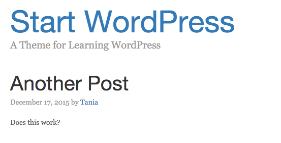

Finally, we'll want to change `the_content()` to `the_excerpt()` on **content.php**. The excerpt will only show the first 55 words of your post, instead of the entire contents.

```php
<?php the_excerpt(); ?>
```

## Pagination

[In the original Bootstrap blog example](http://getbootstrap.com/examples/blog/), there is pagination to be able to click through multiple pages if you have many blog posts.

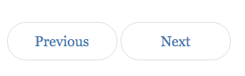

Currently, your **index.php** file looks like this.

```php
<?php get_header(); ?>

	<div class="row">
		<div class="col-sm-8 blog-main">

			<?php
			if ( have_posts() ) : while ( have_posts() ) : the_post();
				get_template_part( 'content', get_post_format() );
			endwhile; endif; ?>

		</div>	<!-- /.blog-main -->
		<?php get_sidebar(); ?>
	</div> 	<!-- /.row -->

<?php get_footer(); ?>
```

If you'll notice, the loop has `if` and `while`, then later `endif` and `endwhile`. To insert pagination, we'll have to put it after the `endwhile` but before the `endif`. This means that it won't repeat for each loop, but will only show up once based on posts.

[Pagination](https://codex.wordpress.org/Pagination) links are called like this:

```php
<?php next_posts_link( 'Older posts' ); ?>
<?php previous_posts_link( 'Newer posts' ); ?>
```

In **index.php**, between `endwhile;` and `endif;`, I'm going to place this code. Make sure to open and close the `<?php ?>` tags.

```php
<nav>
	<ul class="pager">
		<li><?php next_posts_link( 'Previous' ); ?></li>
		<li><?php previous_posts_link( 'Next' ); ?></li>
	</ul>
</nav>
```

By default, 10 posts will show up on a page before it will link to another page. For testing purposes, I'm going to go to **Settings > Reading** and change **Blog pages show at most** to 1.

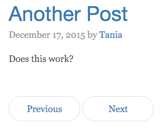

Now we have functioning pagination.

## Comments

One of the biggest advantages WordPress and server based content management systems have over static site generators is the ability to include comments without using a third party. (However, static site generators have many more advantages - [I have an article on setting up Jekyll](http://www.taniarascia.com/make-a-static-website-with-jekyll/) if you're interested in learning how to use them.)

Comments seem complicated to set up, but it doesn't have to be hard at all. First, we're going to go back to **single.php** and enable the comments.

Right now, the code looks like this.

```php
if ( have_posts() ) : while ( have_posts() ) : the_post();
	get_template_part( 'content-single', get_post_format() );
endwhile; endif;
```

We're going to change it to look like this.

```php
if ( have_posts() ) : while ( have_posts() ) : the_post();
	get_template_part( 'content-single', get_post_format() );

	if ( comments_open() || get_comments_number() ) :
		comments_template();
	endif;

endwhile; endif;
```

This is just telling the single post to display the comments template. Now we'll create **comments.php**.

```php
<?php if ( post_password_required() ) {
	return;
} ?>
	<div id="comments" class="comments-area">
		<?php if ( have_comments() ) : ?>
			<h3 class="comments-title">
<?php
printf( _nx( 'One comment on "%2$s"', '%1$s comments on "%2$s"', get_comments_number(), 'comments title'),
	number_format_i18n( get_comments_number() ), get_the_title() );
?>
			</h3>
			<ul class="comment-list">
<?php
wp_list_comments( array(
	'short_ping'  => true,
	'avatar_size' => 50,
) );
?>
			</ul>
		<?php endif; ?>
		<?php if ( ! comments_open() && get_comments_number() && post_type_supports( get_post_type(), 'comments' ) ) : ?>
			<p class="no-comments">
<?php _e( 'Comments are closed.' ); ?>
			</p>
		<?php endif; ?>
		<?php comment_form(); ?>
	</div>
```

Comments are not the simplest part of WordPress theming, but I've managed to reduce it down to a small enough code block.

First, we're setting functionality to prevent users from posting comments if you've set your settings to password protected comments (`post_password_required()`). Then we're creating a comments div, and if there are comments (`have_comments()`), it will display how many comments there are on the post (`get_comments_number()`), followed by the list of comments (`wp_list_comments()`). If the comments are closed (`! comments_open()`), it will let you know; at the end will be the form to submit a comment (`comment_form()`).

Without adding any styles, here is how the functioning single blog post looks.

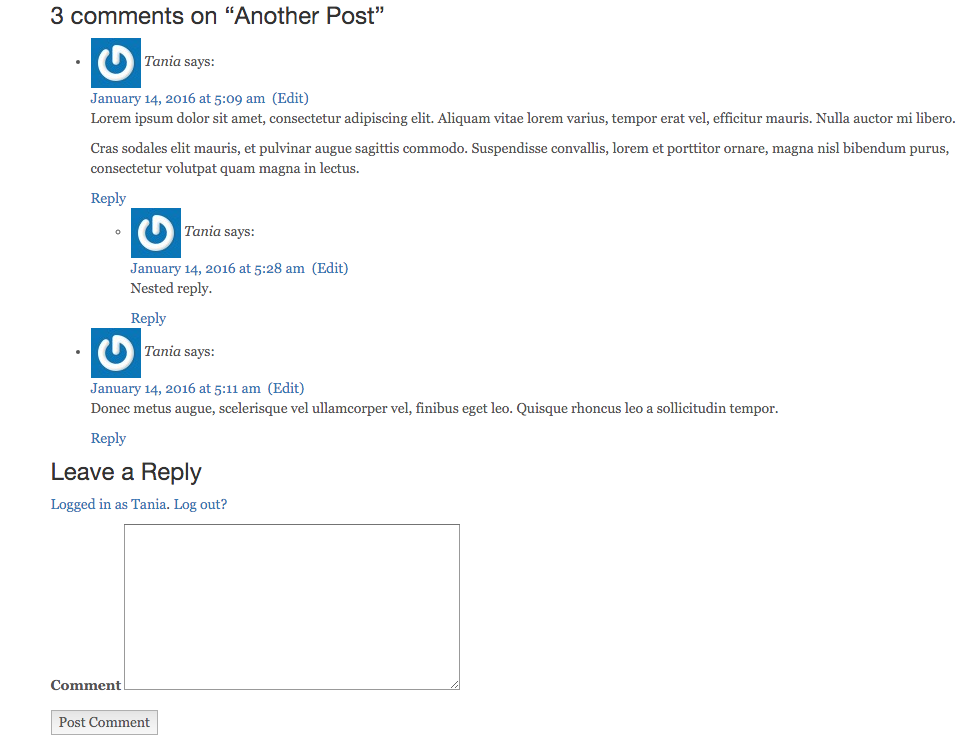

Obviously the styles aren't quite there yet, but I don't want to focus on that in this article. Remove the `list-style` on the `ul`s, add some padding and margins and possibly some borders and background colors, and you'll have a much prettier comment setup.

Of course, you might want to show how many comments there are or link to the comments from the main page. You can do that with this code inserted into **content.php**.

```php
<a href="<?php comments_link(); ?>">
	<?php
	printf( _nx( 'One Comment', '%1$s Comments', get_comments_number(), 'comments title', 'textdomain' ), number_format_i18n( 		get_comments_number() ) ); ?>
</a>
```

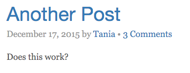

Now that we have pagination, blog posts, and comments set up, we can move on to functions.

## Using and Understanding the WordPress Functions File

Located in your theme directory, you can create a file called [functions.php](https://codex.wordpress.org/Functions_File_Explained). You can use `functions.php` to add functionality and change defaults throughout WordPress. Plugins and custom functions are basically the same - any code you create can be made into a plugin, and vice versa. The only difference is that anything you place in your theme's functions is only applied while that theme is actively selected.

> I have a [README on GitHub of useful WordPress functions](https://github.com/taniarascia/wp-functions), which might come in handy the more you use them.

**functions.php** seems complicated, but it's mostly made up of a bunch of code blocks that, simplified, look like this:

```php
function custom_function() {
	//code
}
add_action( 'action', 'custom_function');
```

So, we're creating our custom function, and adding it in based on [action references](https://codex.wordpress.org/Plugin_API/Action_Reference). Within this file, you can pretty much change or override anything in WordPress.

Let's go ahead and make **functions.php** and place it in our theme directory.

Since it's a PHP file, it needs to be begin with the opening PHP tag. It doesn't need a closing tag; pure PHP files don't need closing tags.

```php
<?php
```

> Eventually, you can insert these types of functions into your own custom plugin that can be used across many themes, but for now we'll learn how to do it in the theme specific file.

## Enqueue Scripts and Stylesheets

By the end of the last article, I was incorrectly linking to my CSS and JavaScript in the header and footer, respectively. This should be done through the functions file.

First, delete the links to the stylesheets and scripts that you have in your header and footer. They're no longer going to be hard coded into the theme.

I'm going to make **css**, **js** and **images** directories in the root of my theme. So here's what I have:

- **css**

  - bootstrap.min.css
  - blog.css

- **js**
  - bootstrap.min.js

Now here's the first code block we're going to put in **functions.php**:

```php
// Add scripts and stylesheets
function startwordpress_scripts() {
	wp_enqueue_style( 'bootstrap', get_template_directory_uri() . '/css/bootstrap.min.css', array(), '3.3.6' );
	wp_enqueue_style( 'blog', get_template_directory_uri() . '/css/blog.css' );
	wp_enqueue_script( 'bootstrap', get_template_directory_uri() . '/js/bootstrap.min.js', array( 'jquery' ), '3.3.6', true );
}

add_action( 'wp_enqueue_scripts', 'startwordpress_scripts' );
```

In order for these to properly be inserted into your theme, `<?php wp_head(); ?>` needs to be placed before the closing `</head>` tag, and `<?php wp_footer(); ?>` before the closing `</body>` tag.

By common WordPress convention, I'm naming my script after my theme (`startwordpress_scripts()`). `wp_enqueue_style` is for inserting CSS, and `wp_enqueue_script` for JS. After that, the array contains the ID, location of the file, an additional array with required depenedencies (such as jQuery), and the version number.

Now we have jQuery, Bootstrap CSS, Bootstrap JS, and custom CSS being properly loaded into the website.

## Enqueue Google Fonts

The function to include the Google Fonts stylesheets is slightly different, based on the dynamic nature of the URL. Here is an example using **Open Sans**.

```php
// Add Google Fonts
function startwordpress_google_fonts() {
	wp_register_style('OpenSans', 'http://fonts.googleapis.com/css?family=Open+Sans:400,600,700,800');
	wp_enqueue_style( 'OpenSans');
}

add_action('wp_print_styles', 'startwordpress_google_fonts');
```

Now I have [Open Sans by Google Fonts](https://www.google.com/fonts/specimen/Open+Sans) linked in my page.

## Fix the WordPress Title

If you'll notice, we're currently pulling in the title for the website with this code.

```php
<title><?php echo get_bloginfo( 'name' ); ?></title>
```

This is not very intuitive - it means that whatever you have set as your website's title will be the title tag for every page. However, we're going to want each individual page to show the title of the article first, and also include a reference to the main site title.

Introduced in WordPress 4.1 is the ability to simply have WordPress take care of the title tag in an intuitive way. Simply remove the `title` tag from your **header.php** entirely, and in **functions.php**, add this code block.

```php
// WordPress Titles
add_theme_support( 'title-tag' );
```

## Create Global Custom Fields

Sometimes, you might have custom settings that you want to be able to set globally. An easy example on this page is the social media links on the sidebar.

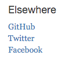

Right now these links aren't leading anywhere, but we want to be able to edit it through the admin panel. The source of this code is modified from [this Settings API tutorial](http://www.sitepoint.com/create-a-wordpress-theme-settings-page-with-the-settings-api/).

First, we're going to add a section on the left hand menu called **Custom Settings**.

```php
// Custom settings
function custom_settings_add_menu() {
	add_menu_page( 'Custom Settings', 'Custom Settings', 'manage_options', 'custom-settings', 'custom_settings_page', null, 99 );
}
add_action( 'admin_menu', 'custom_settings_add_menu' );
```

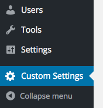

Then we're going to create a basic page.

```php
// Create Custom Global Settings
function custom_settings_page() { ?>
	<div class="wrap">
		<h1>Custom Settings</h1>
		<form method="post" action="options.php">
				<?php
						settings_fields( 'section' );
						do_settings_sections( 'theme-options' );
						submit_button();
				?>
		</form>
	</div>
<?php }
```

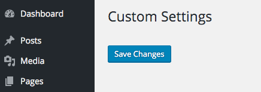

The code contains a form posting to **options.php**, a section and theme-options, and a submit button.

Now we're going to create an input field for Twitter.

```php
// Twitter
function setting_twitter() { ?>
	<input type="text" name="twitter" id="twitter" value="<?php echo get_option( 'twitter' ); ?>" />
<?php }
```

Finally, we're going to set up the page to show, accept and save the option fields.

```php
function custom_settings_page_setup() {
	add_settings_section( 'section', 'All Settings', null, 'theme-options' );
	add_settings_field( 'twitter', 'Twitter URL', 'setting_twitter', 'theme-options', 'section' );

	register_setting('section', 'twitter');
}
add_action( 'admin_init', 'custom_settings_page_setup' );
```

Now I've saved my Twitter URL in the field.

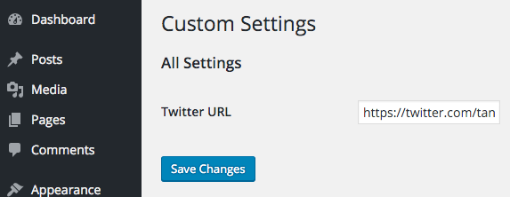

For good measure, I'm going to add another example, this time for GitHub.

```php
function setting_github() { ?>
	<input type="text" name="github" id="github" value="<?php echo get_option('github'); ?>" />
<?php }
```

Now you'll just duplicate the fields in `custom_settings_page_setup`.

```php
add_settings_field( 'twitter', 'Twitter URL', 'setting_twitter', 'theme-options', 'section' );
add_settings_field( 'github', 'GitHub URL', 'setting_github', 'theme-options', 'section' );

register_setting( 'section', 'twitter' );
register_setting( 'section', 'github' );
```

Now back in **sidebar.php**, I'm going to change the links from this:

```php
<li><a href="#">GitHub</a></li>
<li><a href="#">Twitter</a></li>
```

To this:

```php
<li><a href="<?php echo get_option('github'); ?>">GitHub</a></li>
<li><a href="<?php echo get_option('twitter'); ?>">Twitter</a></li>
```

And now the URLs are being dynamically generated from the custom settings panel!

## Featured Image

You might want to have a featured image for each blog post. This functionality is not built into the WordPress core, but is extremely easy to implement. Place this code in your **functions.php**.

```php
// Support Featured Images
add_theme_support( 'post-thumbnails' );
```

Now you'll see an area where you can upload an image on each blog post.

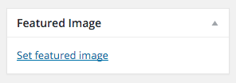

I'm just going to upload something I drew in there for an example. Now, display the image in **content-single.php**.

```php
<?php if ( has_post_thumbnail() ) {
	the_post_thumbnail();
} ?>
```


Now you have an image on your individual post pages! If you wanted the thumbnail to show up on on the main blog page as well, you could do something like this on **content.php** to split the page if a thumbnail is present:

```php
<?php if ( has_post_thumbnail() ) {?>
	<div class="row">
		<div class="col-md-4">
			<?php	the_post_thumbnail('thumbnail'); ?>
		</div>
		<div class="col-md-6">
			<?php the_excerpt(); ?>
		</div>
	</div>
	<?php } else { ?>
	<?php the_excerpt(); ?>
<?php } ?>
```

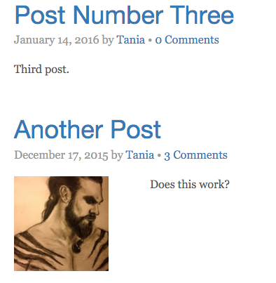

## Custom Post Types

One of the most versatile way to extend your WordPress site as a full blown content management system is with custom post types. A custom post type is the same as **Posts**, except you can add as many of them as you want, and with as much custom functionality as you want.

If you're interested in using plugins, you can download the [Advanced Custom Fields](http://www.advancedcustomfields.com/) plugin, which will add a great deal of customizability to your theme with little effort.

For now, I'm going to show you how to set up a simple custom post type, and call the post in it's own loop. There is much more that can be done with custom post types, but that's a bit more complicated and deserves an article all of its own.

[Custom Post Types](https://codex.wordpress.org/Post_Types) on the WordPress codex will also give you more insight on some of the possibilities available.

In **functions.php**, I'm going to create the custom post type called **My Custom Post**.

```php
// Custom Post Type
function create_my_custom_post() {
	register_post_type( 'my-custom-post',
			array(
			'labels' => array(
	'name' => __( 'My Custom Post' ),
	'singular_name' => __( 'My Custom Post' ),
			),
			'public' => true,
			'has_archive' => true,
			'supports' => array(
	'title',
	'editor',
	'thumbnail',
	'custom-fields'
			)
	));
}
add_action( 'init', 'create_my_custom_post' );
```

In the **create_my_custom_post()**, I've created a post called **My Custom Post** with a slug of `my-custom-post`. If my original URL was _example.com_, the custom post type would appear at _example.com/my-custom-post_.

In `supports`, you can see what I'm adding - title, editor, thumbnail, and custom fields. These translate to the fields on the back end that will be available.

- `title` is the title field that I call with `<?php the_title(); ?>`.
- `editor` is the content editing area that I call with `<?php the_content(); ?>`.
- `thumbnail` is the featured image that I call with `<?php the_post_thumbnail(); ?>`.
- `custom-fields` are custom fields that I can add in and call later.

I've decided I'm going to make a new page for the custom post to loop in. I created a page called **Custom**, which will appear at _example.com/custom_. Right now, my page is pulling from **page.php**, like all the other pages.

I'm going to create **page-custom.php**, and copy the code over from **page.php**. According to the [WordPress template hierarchy](https://developer.wordpress.org/themes/basics/template-hierarchy/), a **page-name.php** will override **page.php**.

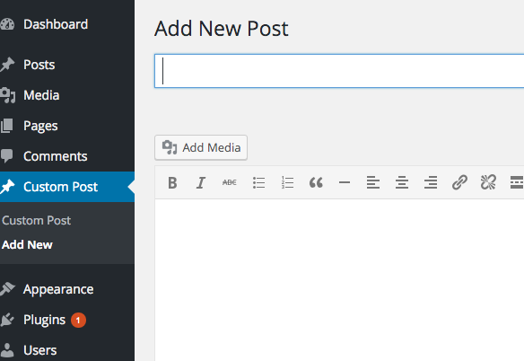

The original loop we used looked like this:

```php
if ( have_posts() ) : while ( have_posts() ) : the_post();
	// Contents of the Loop
endwhile; endif;
```

A custom post type loop will look like this:

```php
$custom_query = new WP_Query( $args );
while ($custom_query->have_posts()) : $custom_query->the_post();
	// Contents of the custom Loop
endwhile;
```

Note that this only a `while`, and does not have an `if` or `endif`.

I'll have to define the `$args` or arguments, before the loop.

```php
$args =  array(
	'post_type' => 'my-custom-post',
	'orderby' => 'menu_order',
	'order' => 'ASC'
);
```

Here I'm defining the post type as `my-custom-post`, and ordering the posts in ascending order.

So here's the entire code for **page-custom.php**.

```php
<?php get_header(); ?>

	<div class="row">
		<div class="col-sm-12">

			<?php
$args =  array(
	'post_type' => 'my-custom-post',
	'orderby' => 'menu_order',
	'order' => 'ASC'
);
	$custom_query = new WP_Query( $args );
						while ($custom_query->have_posts()) : $custom_query->the_post(); ?>

<div class="blog-post">
	<h2 class="blog-post-title"><a href="<?php the_permalink(); ?>"><?php the_title(); ?></a></h2>
	<?php the_excerpt(); ?>
	<?php endwhile; ?>
			</div> <!-- /.col -->
		</div> <!-- /.row -->

	<?php get_footer(); ?>
```

Now _example.com/custom_ will only pull in posts from the custom post type we created. Right now, the custom post type is set up to only do things that the normal posts can do, but the more you fall down the rabbit hole, the more possibilities you discover. If this isn't working, make sure you've successfully updated permalinks.

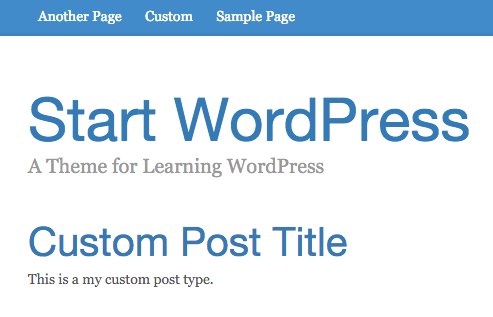

## Conclusion

We covered a lot of ground in this article; you should now be able to...

- Create individual pages for blog posts
- Add pagination to a blog
- Add comments to a blog
- Add WordPress functions
- Enqueue scripts and stylesheets properly
- Have a proper page title
- Create custom global settings
- Create a custom post type

All the source code is [on GitHub](https://github.com/taniarascia/startwordpress) as always. You can download the code and upload it into your themes folder and see it in action. I might set up a demo if there's any interest in that.

There is much more that custom post types can do - and much more that WordPress can do, as well. I haven't touched on [the theme customizer](https://codex.wordpress.org/Theme_Customization_API), which is the most current way of creating themes.

I plan to continue this WordPress series and expand upon custom post types and what they can do. For now, I hope you learned something new, and of course, please feel free to reach out if I made any mistakes or errors or included any wrong or outdated information.

[View on GitHub](https://github.com/taniarascia/startwordpress)

## Part Three

In part three, I discuss how to add custom fields and meta boxes to a post!

- [Go to Part 3](/wordpress-part-three-custom-fields-and-metaboxes/)