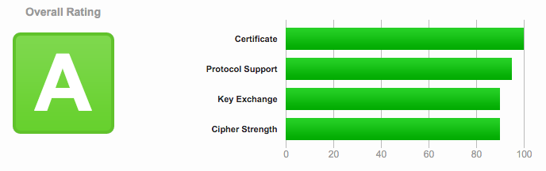

This article begins with the assumption that you're not looking for an in-depth explanation of what HTTPS is, how encryption works, the difference between TLS and SSL, or why you should or shouldn't obtain a certificate. There are [plenty of](https://en.wikipedia.org/wiki/HTTPS) [articles](https://en.wikipedia.org/wiki/Transport_Layer_Security) [about](https://www.instantssl.com/ssl.html) [that](https://tools.ietf.org/html/rfc5246). No, you just want the fancy green padlock in front of your URL, I hear you.

This is not the only way to enable https on your website. There are a lot of use cases for encryption, and I only know what I've done. [Let's Encrypt](https://letsencrypt.org/) is an alternative method that's free, but still in beta, so that might be an option for you. Otherwise, read on.

#### Does This Article Pertain To You?

- You're an individual, not a company
- You have a personal website or blog
- Your website has a domain name
- Your website is running on Apache
- You're not selling stuff
- You can spend 9 dollars

#### What You'll Need

- 9 dollars
- SSH access to your server
- Confirmation that your host supports TLS

#### Steps to HTTPS

- Generate a CSR on your server
- Obtain an SSL Certificate
- Install certificate on your server

#### WordPress?

I'll supply some additional information at the end about making sure HTTPS works properly with WordPress.

> I can't guarantee that this will work for you, or you'll that be approved for a certificate, but it seems to be a common method that works for most people.

## Generate a CSR on Your Server

A **CSR** is a Certificate Signing Request. You need to generate one on your server. This is done with an Open SSL command, which should be available by default from Apache.

SSH into the server, migrate to somewhere that isn't a public directory, and paste the following code, changing YOURDOMAIN.COM to your domain.

```
openssl req -new -newkey rsa:2048 -nodes -keyout YOURDOMAIN.COM.key -out YOURDOMAIN.COM.csr
```

The server will ask you to fill in the following fields:

- Common Name (the domain name)
- Country (two letter code)
- State (spelled out fully)
- City
- Organization
- Organizational Unit (Department)
- E-mail address

For Organization and Organizational Unit, you should type **NA**.

When you've finished, there should be a `.csr` and `.key`.

## Obtain an SSL Certificate

### SSL or TLS?

If you want to read more about the differences between TLS and SSL, [you may do so here](https://luxsci.com/blog/ssl-versus-tls-whats-the-difference.html) or [here](http://security.stackexchange.com/questions/5126/whats-the-difference-between-ssl-tls-and-https).

To over simplify, **SSL** (Secure Sockets Layer) is the old and **TLS** (Transport Layer Security) is the new, but it's often still referred to as an SSL certificate. [Here is a website to test your SSL configuration](https://www.ssllabs.com/ssltest/), which will show you which TLS or SSL you're configured with, and how all browsers are responding (sadly, you will lose IE6 support...).



Look how well I did!

### Pricing

Certificates can vary from free to \$5 to hundreds of dollars and more per year, depending on what type you get and where you shop. You can get a certificate from Comodo or Geotrust or NameCheap or GoDaddy or any number of providers.

[PositiveSSL](https://www.namecheap.com/security/ssl-certificates/domain-validation.aspx) provided by NameCheap is a popular and inexpensive choice with [good documentation](https://www.namecheap.com/support/knowledgebase/article.aspx/794/67/how-do-i-activate-an-ssl-certificate). However, there are plenty of other choices.

### Obtain Certificate

Any party you get your certificate from will require you to purchase, then validate and approve it. This will probably be done through **email validation**, in which they'll send an e-mail to you@YOURDOMAIN.COM, **HTTP**, in which you upload a file to your public directory, or **DNS** based, in which you'll be asked to point a CNAME.

Once validation is complete, you will have your SSL certificate, which you can download.

> A certificate will only be valid for one year, at which point you'll have to renew it.

## Install Certificate on Your Server

The final step will be to install the certificate on your server. If you're using shared hosting or managed hosting, you will need to provide your host with the certificate so that they can install it for you.

If not, you can [follow this nice guide by Digital Ocean](https://www.digitalocean.com/community/tutorials/how-to-install-an-ssl-certificate-from-a-commercial-certificate-authority#install-certificate-on-web-server).

You will need to modify your Virtual Host to be listening on port 443 (HTTPS) instead of port 80 (HTTP), specify your SSL key and certificate files, enable SSL, and restart the server.

Whether your set it up yourself or your host did it for you, going to https://yourdomain.com should work, except it might throw "mixed content" warnings - you'll have to make sure any file being served from your site is from a https URL.

Once you're absolutely certain everything is working properly, you can point a 301 permanent redirect from your HTTP address to the HTTPS address.

## HTTPS and WordPress

There are a few things you'll have to do before WordPress will work properly with HTTPS.

##### Clear Cache and Disable Caching Plugins

Before you begin attempting to serve content from https, make sure to clear the cache and disable any caching plugins so that they don't keep serving the old files.

##### Replace Static Files in the Database

[Better Search Replace](https://wordpress.org/plugins/better-search-replace/) is a reliable plugin that will allow you to replace any string with another string. **Of course, always remember to back up your database before doing anything.** Replacing all instances of _http://yourdomain.com/wp-content/_ with _https://yourdomain.com/wp-content/_ should take care of all uploads and images.

##### Enable HTTPS

Place this in **wp-config.php**.

```php
$_SERVER['HTTPS'] = 'on';
```

##### Prevent Admin Panel Redirect Loop

This one will also go in **wp-config.php**.

```php
define('FORCE_SSL_ADMIN', true);
```

##### Change URL in Database

Either in admin panel settings or from phpMyAdmin or whatever MySQL method you're using, update the two fields in wp_options to contain https.

##### Redirect HTTP to HTTPS

Force https on all files.

```apacheconf
RewriteEngine On
    RewriteCond %{HTTP:X-Forwarded-Proto} !https
    RewriteRule ^ https://%{HTTP_HOST}%{REQUEST_URI} [L,R=301]
```

## Conclusion

Hopefully this article cleared up the process of enabling encryption on your website. It might seem like unnecessary setup if you're not a company or collecting private information; however, if it costs \$9/year and a few hours to make the web just a little safer, to me it's worth it.

[Here is a Coding Horror article](https://blog.codinghorror.com/should-all-web-traffic-be-encrypted/) about web traffic encryption and the future of the web. If nothing else, [it will play a factor in your Google search ranking](https://googlewebmastercentral.blogspot.com/2014/08/https-as-ranking-signal.html).
