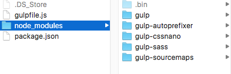
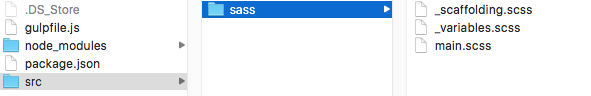
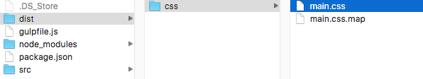
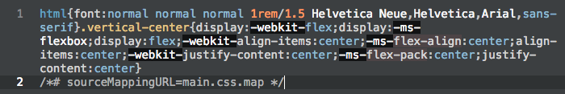

_Can I just have a tutorial that tells me exactly what I need to do and know to set up Gulp, without spiraling into some unrelated discussion about HTML semantics_, you wonder? Yes, you can. Here it is.

#### Is this article for you?

This article is for you if you're looking for a tutorial that makes no assumptions and will list every step to install Gulp - from the beginning, in order, without any gaps.

This guide was also made on a Mac. A few steps will vary for Windows.

#### Prerequisites

- **Basic knowledge of HTML, CSS, and JavaScript**
- **[Basic knowledge of using the command line](/how-to-use-the-command-line-for-apple-macos-and-linux/)**

#### Goals

- **Install everything necessary to get Gulp up and running.**
- **Compile multiple Sass files into one CSS file, apply vendor prefixes, and minify.**

### Brief Overview

[Gulp.js - the streaming build system](http://gulpjs.com/) is a JavaScript task runner that can automatically take care of redundant tasks for you. Like so many other useful tech tools, Gulp has no "getting started for beginners" guide to speak of. Their [getting started guide](https://github.com/gulpjs/gulp/blob/master/docs/getting-started.md), in reality, begins at step 6 or so. If you already know how Node and npm work and have everything installed, it's great - but the beginner is only left more confused and frustrated.

I'm going to quickly summarize a few important concepts. Feel free to scroll back up to this after you've started making some progress for clarification.

- **Node.js** - an environment which enables running server-side JavaScript for the web.
- **npm** - a package manager for Node.js. A tool that allows you to quickly and easily set up local Node environments and plugins.
- **Local vs. Global** - Node.js is installed globally, but Gulp and all of its plugins will be installed locally on a per project basis.
- **Task Runner** - A task runner like Gulp automates all your processes so you don't have to think about them. Gulp requires a **package.json** and **gulpfile.js**.

## List of Steps

For my part, I will attempt to create the lost beginner's guide to Gulp. I'm listing the steps so you know what you're getting into.

1. Install Xcode Command Line Tools
2. Install Homebrew
3. Install Node.js
4. Install Gulp globally
5. Install Node and Gulp locally
6. Install Gulp plugins
7. Set up project

There are plenty of ways to go about this, but this is the way we're going to do it.

> Note: Installing XCode and Command Line Tools is no longer necessary in 2016 - Homebrew will install the necessary CLI for you.

## Install Xcode Command Line Tools

This is a prerequisite to installing Homebrew.

### Install Xcode

[Download Xcode from the Mac App Store](https://itunes.apple.com/us/app/xcode/id497799835?mt=12)

### Install Command Line Tools

Open Xcode, and click the following.

```
Preferences > Downloads > Command Line Tools
```

## Install Homebrew

[Homebrew](http://brew.sh/) makes installing programs and packages insanely easy on a Mac. Open Terminal and type the following, then follow the steps it gives you.

```bash
/usr/bin/ruby -e "$(curl -fsSL https://raw.githubusercontent.com/Homebrew/install/master/install)"

```

## Install Node.js

We'll use Homebrew to install [Node.js](https://nodejs.org/en/), which is the server-side JavaScript environment that Gulp runs in. Node.js comes with [npm](https://www.npmjs.com/), the Node Package Manager. Type this in Terminal.

```bash
brew install node
```

## Install Gulp Globally

This will install the Gulp command line, globally. It's the last global step before we start installing things locally - on a per project basis.

```bash
npm install --global gulp-cli
```

> This is the end of global installation! None of these steps will need to be repeated. From here, we will begin to set up our local project.

## Install Node and Gulp Locally

From this point, you'll have to navigate to the folder in which you keep your web projects. For me, that's **/Users/tania/sites**. Since I start off in Terminal at `/Users/tania`, I'll move to `sites`.

```bash
cd sites
```

Then I'll create a new project directory.

```bash
mkdir startgulp
```

And move to the newly created folder.

```bash
cd startgulp
```

In order to install Node locally, you need a **package.json** file. You can either make that file manually, or generate one. We're going to generate one so you get an idea of how it works.

```bash
npm init
```

This command will walk you through creating a generic **package.json**. It's pretty straightforward, and simply press enter if you're not sure or don't want to fill something in. I just gave it a description, keywords, and author, and the file has been generated.

```js
{
      "name": "startgulp",
      "version": "1.0.0",
      "description": "Getting Started with Gulp",
      "main": "index.js",
      "scripts": {
        "test": "echo \"Error: no test specified\" && exit 1"
      },
      "keywords": [
        "gulp",
        "sass"
      ],
      "author": "Tania Rascia",
      "license": "MIT"
    }
```

Now we'll run a command to install Node and Gulp.

```
npm install --save-dev gulp
```

You'll get a few warnings about deprecations and missing files, but don't worry too much.

```terminal
npm WARN package.json startgulp@1.0.0 No repository field.
    npm WARN package.json startgulp@1.0.0 No README data
```

Once that's complete, you can list your files:

```
ls
```

node_modules package.json

And you'll see a **node_modules** directory has been created. For the sake of your own sanity, don't go down the node_modules rabbit hole; you might never find your way out.

## Install Gulp Plugins

At this point, in our **node_modules** directory, the only devDependency we have installed is Gulp. In order to work the magic, we'll need to install all the Gulp plugins. [There are a lot of Gulp plugins](http://gulpjs.com/plugins/). For the sake of this article, we're going to install four for our front end web development workflow.

- [Gulp Sass](https://www.npmjs.com/package/gulp-sass), to compile SCSS to CSS.
- [Gulp Sourcemaps](https://www.npmjs.com/package/gulp-sourcemaps), which is a lot more useful than you might imagine.
- [Gulp cssnano](https://www.npmjs.com/package/gulp-cssnano), to minify and optimize outputted CSS
- [Gulp Autoprefixer](https://github.com/postcss/autoprefixer), to add vendor prefixers for outputted CSS.

This makes a nice workflow - you can write SCSS without worrying about adding prefixes or manually minifying the code, and sourcemaps will help you find where the CSS originates in your `.scss` files.

> If you have no experience with Sass, I recommend reading [Learn Sass Now: A Guide to Installing, Using and Understanding Sass](/learn-sass-now/) to get a better idea of how it works.

Here is the code to add all four Gulp plugins.

```
npm install --save-dev gulp-sass gulp-cssnano gulp-sourcemaps gulp-autoprefixer
```

If you check your **package.json**, you'll notice a new section has been added.

```js
"devDependencies": {
      "gulp": "^3.9.1",
      "gulp-autoprefixer": "^3.1.0",
      "gulp-cssnano": "^2.1.1",
      "gulp-sass": "^2.2.0",
      "gulp-sourcemaps": "^1.6.0"
    }
```

These are all the Node packages you've installed.

> For future reference, you can simplify the process by inserting the devDependencies in your **package.json** initially. After that, simply typing the command `npm install` will install all the plugins without having to specify it in the command line.

## Set Up Project

The last thing we need to do is set up a file named **gulpfile.js**, which is a JavaScript file that will define the entire task running process.

Create a **gulpfile.js**. Now we have all the pieces of the Gulp puzzle. Here is a graphical representation of how your project should look so far:



> _Edit 4/3/2017_ - you will see many more directories in the **node_modules** folder now, due to npm changing the way they handle dependencies, so don't worry, everything still works the same.

We can begin our Gulpfile by defining a variable for each plugin requirement.

```js
'use strict'

var gulp = require('gulp')
var sass = require('gulp-sass')
var cssnano = require('gulp-cssnano')
var sourcemaps = require('gulp-sourcemaps')
var autoprefixer = require('gulp-autoprefixer')
```

I like to work with all my source files, such as Sass, in an **src/** directory, and all my destination files in a **dist/** directory.

So, I'll begin by creating a Gulp task.

```js
gulp.task('workflow', function() {
  gulp
    .src('./src/sass/**/*.scss')
    // Insert tasks here
    .pipe(gulp.dest('./dist/css/'))
})
```

The path `/**/*.scss` means the task applies to this or any subsequent directory (**src/sass/**), with any filename that ends in **.scss**. The destination will be **dist/css/**.

Inserting all the rest of the plugins is easy.

```js
gulp.task('workflow', function() {
  gulp
    .src('./src/sass/**/*.scss')
    .pipe(sourcemaps.init())
    .pipe(sass().on('error', sass.logError))
    .pipe(
      autoprefixer({
        browsers: ['last 2 versions'],
        cascade: false,
      })
    )
    .pipe(cssnano())
    .pipe(sourcemaps.write('./'))

    .pipe(gulp.dest('./dist/css/'))
})
```

Each plugin will have a corresponding GitHub readme that explains how to use it. However, most of them are quite straightforward. Each Gulp task is in a pipe function. Above, you can see I'm initiating sourcemaps, initiating Sass with error logging, autoprefixing to the last two browsers, minifying, and writing the sourcemaps to the same directory as the output CSS.

Finally, I'm going to define the default Gulp task as a "watch" task - Gulp will watch for any changes in my specified directory, and will run if any changes have been made.

```js
gulp.task('default', function() {
  gulp.watch('./src/sass/**/*.scss', ['workflow'])
})
```

Here is the final **gulpfile.js**:

```js
'use strict'

var gulp = require('gulp')
var sass = require('gulp-sass')
var cssnano = require('gulp-cssnano')
var sourcemaps = require('gulp-sourcemaps')
var autoprefixer = require('gulp-autoprefixer')

gulp.task('workflow', function() {
  gulp
    .src('./src/sass/**/*.scss')
    .pipe(sourcemaps.init())
    .pipe(sass().on('error', sass.logError))
    .pipe(
      autoprefixer({
        browsers: ['last 2 versions'],
        cascade: false,
      })
    )
    .pipe(cssnano())
    .pipe(sourcemaps.write('./'))

    .pipe(gulp.dest('./dist/css/'))
})

gulp.task('default', function() {
  gulp.watch('./src/sass/**/*.scss', ['workflow'])
})
```

Now to test this code, I'm going to create three simple `.scss` files - **main.scss**, **\_variables.scss**, and **\_scaffolding.scss**.

### Main

```js
/* Main SCSS File */

    // Base
    @import "variables";

    // Components
    @import "scaffolding";
```

### Variables

```scss
// Typography

$font-style: normal;
$font-variant: normal;
$font-weight: normal;
$font-color: #222;
$font-size: 1rem;
$line-height: 1.5;
$font-family: Helvetica Neue, Helvetica, Arial, sans-serif;
```

### Scaffolding

```scss
// Define typography
html {
  font: $font-style $font-variant $font-weight #{$font-size}/#{$line-height} $font-family;
}

// Vertically center anything
.vertical-center {
  display: flex;
  align-items: center;
  justify-content: center;
}
```



Alright, that should be enough to get set up and prove that autoprefixer and cssnano are functioning properly. Note that I didn't create a **dist/** folder - Gulp will do that for me.

All you need to do now is type the `gulp` command at the root of your project directory.

```
gulp
```

```terminal
[00:12:04] Using gulpfile ~/Sites/startgulp/gulpfile.js
    [00:12:04] Starting 'default'...
    [00:12:04] Finished 'default' after 16 ms
```

Now, if I save any of the **.scss** files that I've created...

```terminal
[00:12:39] Starting 'workflow'...
    [00:12:39] Finished 'workflow' after 32 ms
```

With lightning fast speed, Gulp has created dist, my main CSS file, and a sourcemap to go along with it.



And here's what the output looks like.



You did it!

## Conclusion

There is much more that Gulp can do - notably, I left out any sort of JavaScript minifying or linting - but as far as a front end Sass workflow goes, this is a very useful and effective one!

If you would like to play around with a real life example of the exact Gulp workflow from this tutorial, feel free to check out [my personal Sass boilerplate](http://taniarascia.github.io/primitive/). [The code is open sourced here](https://github.com/taniarascia/primitive), though I have yet to complete documentation.

Now that all your global dependencies are installed, and you know how to set everything up, it would only require three commands to get up and running. It's a good example of how all the initial set up for Gulp is worth it in the end:

```
git clone https://github.com/taniarascia/primitive.git
```

```
npm install
```

```
gulp
```

(Obviously, you need to [have a basic knowledge of using Git](/getting-started-with-git/) to use this method.)

I encourage you to play around with creating your own framework/boilerplate to learn how the fundamentals work, or integrating with an established framework like [Foundation](http://foundation.zurb.com/sites/docs/installation.html).

If you need a more in depth explanation of how the Gulp stream functions, [read more on the Gulp API docs](https://github.com/gulpjs/gulp/blob/master/docs/API.md).

Please let me know if you experienced any confusion or problems while going through this tutorial, so I can improve any potential issues.
