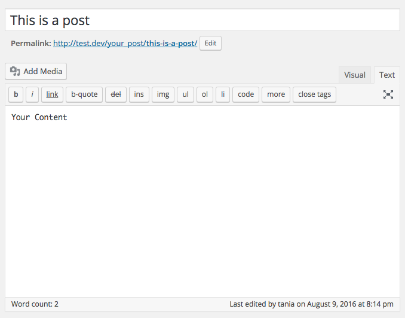
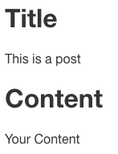
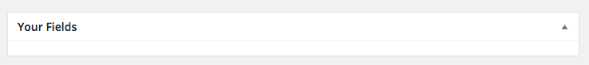
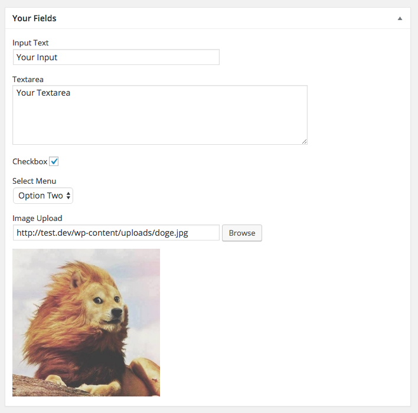
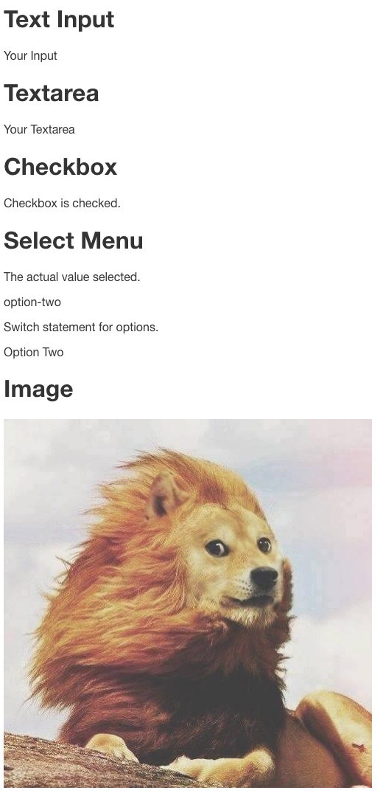

In the [first part](/developing-a-wordpress-theme-from-scratch/) of my WordPress tutorial series, we learned **what WordPress is** and **how to create and use a basic theme**. In [part two](/wordpress-from-scratch-part-two/), we learned more advanced concepts like adding **comments and images**.

In part three, we're going to learn how to add basic **custom fields** to a post, save them in the database, and show them on the front end of the website, without a plugin. And it's going to be easy, you'll love it.

#### Prerequisites

- [Basic knowledge of WordPress](/developing-a-wordpress-theme-from-scratch/) and how to create your own theme.
- [Basic knowledge of WordPress functions and custom post types.](/wordpress-from-scratch-part-two/)

#### Goals

- Create a [**custom post type**](https://codex.wordpress.org/Post_Types).
- Add a [**custom meta box**](https://developer.wordpress.org/reference/functions/add_meta_box/).
- Create the following **custom fields**:

 - Input text field
 - Textarea
 - Checkbox
 - Select Menu
 - Image (and image upload)

> This tutorial is independent of the previous installments. If you've been following along, you can just add this on to what you already have. If not, you can still do this tutorial from scratch as long as you have a basic knowledge of WordPress.

## I'm still confused. What's going on?

There are a lot of WordPress-specific words going around already, and it's more confusing than I'd like. The gist of it is, have you ever wanted to **add an extra field to a WordPress post**? Maybe a date, or a URL, or an e-mail address? We're going to learn how to do that. Have you ever wanted to **add another upload field for images outside of the "Featured Image" thumbnail option**? In this article, we'll also learn how to add an upload button and browse through the media gallery to insert an image.

It's basically a simplified version of what [Advanced Custom Fields](https://www.advancedcustomfields.com/) does, but without any plugins.

I promise I'll make it as simple as possible.

Now we'll begin.

> Anything throughout this article prefixed with `your_` is custom, and you can change the name.

## Create a Custom Post

I'm starting off with a completely empty WordPress theme, just like in part one. I'm going to create a custom post called `Your Post`, with the id `your_post`. You can call it whatever you want, but it might be easiest to practice the first time around with the same names I used.

Here's the code that will go into **functions.php**.

```php

<?php

    function create_post_your_post() {
    	register_post_type( 'your_post',
    		array(
    			'labels'       => array(
    'name'       => __( 'Your Post' ),
    			),
    			'public'       => true,
    			'hierarchical' => true,
    			'has_archive'  => true,
    			'supports'     => array(
    'title',
    'editor',
    'excerpt',
    'thumbnail',
    			),
    			'taxonomies'   => array(
    'post_tag',
    'category',
    			)
    		)
    	);
    	register_taxonomy_for_object_type( 'category', 'your_post' );
    	register_taxonomy_for_object_type( 'post_tag', 'your_post' );
    }
    add_action( 'init', 'create_post_your_post' );
```

You can go more in-depth about all the options of creating a custom post [here](https://codex.wordpress.org/Function_Reference/register_post_type). I made a very simple one. The most important things that it does:

- Registers a post type called `Your Post`, with the id `your_post`.
- Supports a **title** - `the_title()`, **editor** - `the_content()`, **excerpt** - `the_excerpt()`, and **thumbnail**/featured image - `the_post_thumbnail()`. (Must add [theme support for the thumbnail](https://codex.wordpress.org/Post_Thumbnails)).
- Supports [taxonomies](https://codex.wordpress.org/Taxonomies), or ways to group posts, with tags and category.

### Displaying the Custom Post

Now, to display the post on the front end. You can display the contents of a custom post anywhere. I'm just going to put it in **page.php** for testing purposes, so any page I make will display my custom loop.

```php

<?php

    $args = array(
    	'post_type' => 'your_post',
    );
    $your_loop = new WP_Query( $args );

    if ( $your_loop->have_posts() ) : while ( $your_loop->have_posts() ) : $your_loop->the_post();
    $meta = get_post_meta( $post->ID, 'your_fields', true ); ?>

    <!-- contents of Your Post -->

    <?php endwhile; endif; wp_reset_postdata(); ?>
```

The variable `$your_loop` can be anything, I'm just sticking to a common theme of `your_` throughout this article so you know what you can change. `$meta = get_post_meta( $post->ID, 'your_fields', true );` is not necessary right now, but will be essential later.

##### Back End

Updating the title and editor fields like in a regular post...



##### Code

Inserting the template codes like normal...

```php

<h1>Title</h1>
    <?php the_title(); ?>

    <h1>Content</h1>
    <?php the_content(); ?>
```

##### Front End

And here we are. I have no styles or anything, because it's not necessary for the point of the article, and I don't like adding unnecessary complexity.



Alright, so the custom post is all set up now.

## Create a Meta Box

From here, the original source for much of the code comes from [WordPress Meta Boxes: a Comprehensive Developer’s Guide](http://themefoundation.com/wordpress-meta-boxes-guide/) by [Alex Mansfield](https://twitter.com/alexmansfield). I've attempted to simplify some of those processes here.

Here's the code to add a meta box.

```php

function add_your_fields_meta_box() {
    	add_meta_box(
    		'your_fields_meta_box', // $id
    		'Your Fields', // $title
    		'show_your_fields_meta_box', // $callback
    		'your_post', // $screen
    		'normal', // $context
    		'high' // $priority
    	);
    }
    add_action( 'add_meta_boxes', 'add_your_fields_meta_box' );
```

More detail on this function can be found [here](https://developer.wordpress.org/reference/functions/add_meta_box/). The actual function here is `add_meta_box( $id, $title, $callback, $screen, $context, $priority )`. The most important ones are `$title`, which is `Your Fields`, and `$screen` (or page), which is where the meta box will be added. You can add it to a regular post or page, among other things, but I chose to add it to `your_post`, our custom post from earlier.

Now if you go back into your post, you'll see this below the editor.



It's an empty meta box! Additionally, if you click on **Screen Options** at the top of the post, you'll see `Your Fields` in the options.


Neat. Now it's time to start putting stuff in there.

## Save Fields in the Database

First, the function that will display all your custom fields.

```php

function show_your_fields_meta_box() {
    	global $post;
    		$meta = get_post_meta( $post->ID, 'your_fields', true ); ?>

    	<input type="hidden" name="your_meta_box_nonce" value="<?php echo wp_create_nonce( basename(__FILE__) ); ?>">

        <!-- All fields will go here -->

    	<?php }
```

We'll return to `<!-- All fields will go here -->` in a moment. For now, directly below the above function, we're going to paste in this big chunk of code (modified from [Paulund](https://paulund.co.uk/)) that will save all `your_fields` to the database.

```php

function save_your_fields_meta( $post_id ) {
    	// verify nonce
    	if ( !wp_verify_nonce( $_POST['your_meta_box_nonce'], basename(__FILE__) ) ) {
    		return $post_id;
    	}
    	// check autosave
    	if ( defined( 'DOING_AUTOSAVE' ) && DOING_AUTOSAVE ) {
    		return $post_id;
    	}
    	// check permissions
    	if ( 'page' === $_POST['post_type'] ) {
    		if ( !current_user_can( 'edit_page', $post_id ) ) {
    			return $post_id;
    		} elseif ( !current_user_can( 'edit_post', $post_id ) ) {
    			return $post_id;
    		}
    	}

    	$old = get_post_meta( $post_id, 'your_fields', true );
    	$new = $_POST['your_fields'];

    	if ( $new && $new !== $old ) {
    		update_post_meta( $post_id, 'your_fields', $new );
    	} elseif ( '' === $new && $old ) {
    		delete_post_meta( $post_id, 'your_fields', $old );
    	}
    }
    add_action( 'save_post', 'save_your_fields_meta' );
```

Make sure `your_meta_box_nonce` matches the `name` attribute, and you've specified `your_fields` in the meta box function. This code is verifying the [Nonce](https://codex.wordpress.org/WordPress_Nonces) from the first function, making sure the user has the correct permissions to update the fields, and updating the post meta fields.

It's a confusing block of code at first, but fortunately you don't have to do much with this one besides make sure the id of the post matches the custom meta box you created.

## Create Custom Fields

Now we're going to return to `<!-- All fields will go here -->`. This is where we're going to make our **input text field, textbox, checkbox, select menu, and image upload**. Right above that, we created a variable called `$meta`. This reaches into the `your_fields` table in the database and retrieves the information: `$meta = get_post_meta( $post->ID, 'your_fields', true );`. We're going to make an array and put all of our custom fields in it.

You can use custom CSS to make your admin panel look nice, which I can possibly go into further if requested, but getting the basic functionality is more important to me for now, so I'm just going to use the default styles. Wrapping everything in a `<p>` isn't semantically correct, but it's keeping it organized for now.

If you see errors, look at the note at the bottom of the article.

##### Text Input

I'm going to add a regular text input. The `regular-text` class is just a built in WordPress admin style. Whatever you put in the straight brackets will be the code for your custom field. If I wanted to make this text field an e-mail address, for example on a custom post called "Team Members" with contact information for each team member, I might call it `your_fields[email]` instead of `your_fields[text]`.

```php

<p>
    	<label for="your_fields[text]">Input Text</label>
    	<br>
    	<input type="text" name="your_fields[text]" id="your_fields[text]" class="regular-text" value="<?php echo $meta['text']; ?>">
    </p>
```

##### Textarea

The code for the text area is almost the same as the input, except the value is echoed out between the tags instead of as an attribute. The rows, cols, and style placed on it doesn't really matter. It's important to leave no space between the tags, to ensure no extra space ends up in your textbox.

```php

<p>
    	<label for="your_fields[textarea]">Textarea</label>
    	<br>
    	<textarea name="your_fields[textarea]" id="your_fields[textarea]" rows="5" cols="30" style="width:500px;"><?php echo $meta['textarea']; ?></textarea>
    </p>
```

##### Checkbox

There might be several ways to implement the checkbox, but this is one way that worked for me.

```php

<p>
    	<label for="your_fields[checkbox]">Checkbox
    		<input type="checkbox" name="your_fields[checkbox]" value="checkbox" <?php if ( $meta['checkbox'] === 'checkbox' ) echo 'checked'; ?>>
    	</label>
    </p>
```

##### Select Menu

You can include as many options as you want here, but I'm just doing two for the example.

```php

<p>
    	<label for="your_fields[select]">Select Menu</label>
    	<br>
    	<select name="your_fields[select]" id="your_fields[select]">
    			<option value="option-one" <?php selected( $meta['select'], 'option-one' ); ?>>Option One</option>
    			<option value="option-two" <?php selected( $meta['select'], 'option-two' ); ?>>Option Two</option>
    	</select>
    </p>
```

##### Image

The image upload is going to be the most complicated one. The actual display code isn't any more complicated than the other fields have been. It's important to include the `meta-image` class on the text input, and `image-upload` class on the submit button. I just put some quick `max-width` styling on the image for a simple preview.

```php

<p>
    	<label for="your_fields[image]">Image Upload</label><br>
    	<input type="text" name="your_fields[image]" id="your_fields[image]" class="meta-image regular-text" value="<?php echo $meta['image']; ?>">
    	<input type="button" class="button image-upload" value="Browse">
    </p>
    <div class="image-preview">" style="max-width: 250px;"></div>
```

Actually getting this to do anything is the more complicated part. Directly below, you can place this JavaScript snippet (modified from [Theme Foundation](http://themefoundation.com/)).

This code will open the built in WordPress media gallery when you click browse, and insert the selected URL into the input field.

```html
<script>
  jQuery(document).ready(function($) {
    // Instantiates the variable that holds the media library frame.
    var meta_image_frame
    // Runs when the image button is clicked.
    $('.image-upload').click(function(e) {
      // Get preview pane
      var meta_image_preview = $(this)
        .parent()
        .parent()
        .children('.image-preview')
      // Prevents the default action from occuring.
      e.preventDefault()
      var meta_image = $(this)
        .parent()
        .children('.meta-image')
      // If the frame already exists, re-open it.
      if (meta_image_frame) {
        meta_image_frame.open()
        return
      }
      // Sets up the media library frame
      meta_image_frame = wp.media.frames.meta_image_frame = wp.media({
        title: meta_image.title,
        button: {
          text: meta_image.button,
        },
      })
      // Runs when an image is selected.
      meta_image_frame.on('select', function() {
        // Grabs the attachment selection and creates a JSON representation of the model.
        var media_attachment = meta_image_frame
          .state()
          .get('selection')
          .first()
          .toJSON()
        // Sends the attachment URL to our custom image input field.
        meta_image.val(media_attachment.url)
        meta_image_preview.children('img').attr('src', media_attachment.url)
      })
      // Opens the media library frame.
      meta_image_frame.open()
    })
  })
</script>
```

And that's everything that needs to go into the **functions.php** file! As with the CSS styling from earlier, we can place this JavaScript in a separate file and call it on the admin pages, but for simplicity I'm just including it in the **functions.php** file for now. At the end of the article, I'll include the entire code in case you got lost anywhere along the way.

## Display the Output

Now, we have all our fields, and they all appear in the `Your Fields` meta box. I'm going to fill them all out, check the checkbox, select an option, upload an image of the majestic Doge Lion, and publish the post.

These will all go in the `$your_loop` query. Make sure `$meta = get_post_meta( $post->ID, 'your_fields', true );` is in your loop.



##### Text Input

Simple output of the text field.

```php

<h1>Text Input</h1>
    <?php echo $meta['text']; ?>
```

##### Textarea

Simple output of the textarea.

```php

<h1>Textarea</h1>
    <?php echo $meta['textarea']; ?>
```

##### Checkbox

I'm going to check if the checkbox has been checked or not, and display a message based on it.

```php

<h1>Checkbox</h1>
    <?php if ( $meta['checkbox'] === 'checkbox') { ?>
    Checkbox is checked.
    <?php } else { ?>
    Checkbox is not checked.
    <?php } ?>
```

##### Select

I'll show you two things you can do with the select. The basic output will be the `value` attribute.

```php

<h1>Select Menu</h1>
    <p>The actual value selected.</p>
    <?php echo $meta['select']; ?>
```

You can also use a [PHP switch statement](http://www.w3schools.com/php/php_switch.asp) to display a specific message based on the value selected.

```php

<p>Switch statement for options.</p>
    <?php
    	switch ( $meta['select'] ) {
    		case 'option-one':
    			echo 'Option One';
    			break;
    		case 'option-two':
    			echo 'Option Two';
    			break;
    		default:
    			echo 'No option selected';
    			break;
    	}
    ?>
```

##### Image

And finally, displaying the image.

```php

<h1>Image</h1>
    ">
```

Here is the final output of everything I filled out earlier.



## Conclusion

If you had any trouble following along the way, here are the final files for `page.php` and `functions.php` on GitHub Gist.

[Functions](https://gist.github.com/taniarascia/9edee074b04569c00343a6a1045235e7) [Page](https://gist.github.com/taniarascia/412a22c2ad0c500df8e7197571a50db4)

This article only goes over the most basic way to add custom fields and update the database. There are a thousand more ways to do it, and plugins like [ACF](https://www.advancedcustomfields.com/) that will do it for you as well. I think it's useful to know how to interact with the database and learn how to do it without a plugin.

It's also a good idea to [sanitize the output](https://codex.wordpress.org/Data_Validation#Output_Sanitization) of all your fields.

If you've found any errors, or have any additional information that would make this better or more simple to understand, please let me know!

**Edit 2018:**

To get rid of PHP warnings, change any instance of code that looks like this:

```php

<?php echo $meta['textarea']; ?>
```

To this:

```php

<?php  if (is_array($meta) && isset($meta['textarea'])){ echo $meta['textarea']; } ?>
```
