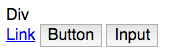
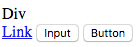
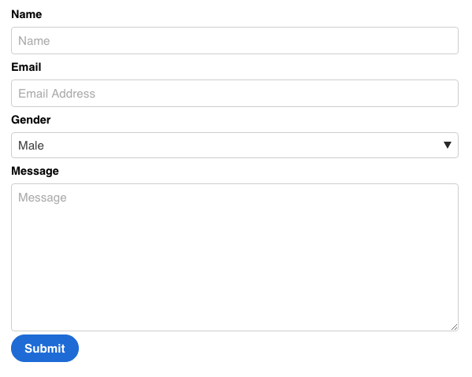
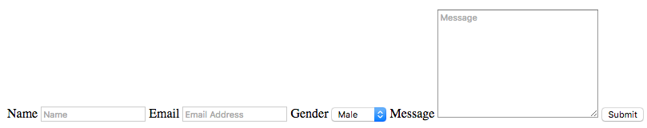
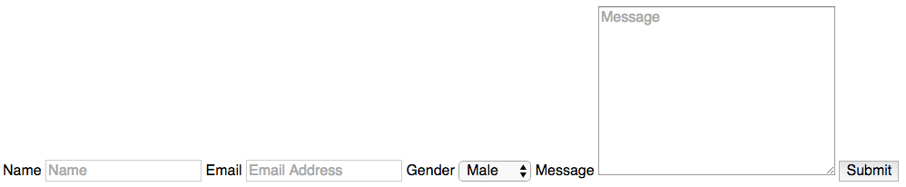
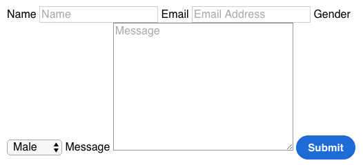
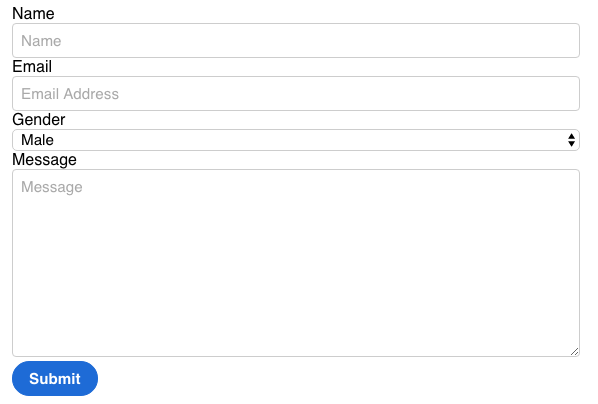
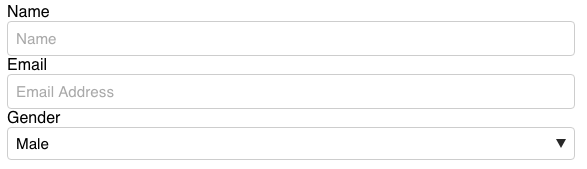
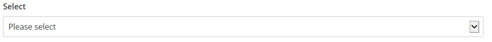
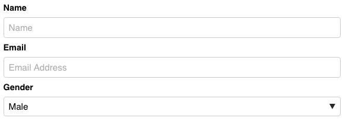

It's hard to style basic web components if you've never done it before. You want your **buttons** and **forms** to look good and also be cross-browser consistent. The easiest solution is to use a framework like Bootstrap or Foundation, but that won't help you understand the fundamentals. It's actually not as hard as it seems, and in this article I'll show you how.

To make life easy for myself, I've compiled all these into my own framework, [Primitive](http://taniarascia.github.io/primitive/) (which also incorporates Sass and Gulp) and I encourage you to make your own as well, even if only for learning purposes.

#### Prerequisites

- Basic knowledge of HTML and CSS
- (Optional) Having some knowledge of the [basics of setting up a responsive website without a framework](/you-dont-need-a-framework/) will be helpful.

#### Goals

- Style buttons, in the form of `div`, link (`a`), `input`, and `button` elements.
- Style forms, including HTML5 `input`, `textarea`, and `select` elements.

## Preparation

I referenced my [fundamentals](/you-dont-need-a-framework/) article from before because it includes a few things I like all my web projects to have: a CSS reset, and `border-box` reset. Basically, these two things will allow you to have a little more consistency and control over your layout.

### CSS Reset

I'm linking to a CDN of [Normalize](https://necolas.github.io/normalize.css/).

```html
<link
  rel="stylesheet"
  href="https://cdnjs.cloudflare.com/ajax/libs/normalize/5.0.0/normalize.min.css"
/>
```

### Border Box

I'm forcing `border-box` on all elements unless explicity stated otherwise.

```css
html {
  box-sizing: border-box;
}
*,
*::before,
*::after {
  box-sizing: inherit;
}
```

And that's it as far as setup goes. I also personally like to put `-webkit-font-smoothing: antialiased;` on the `html` selector to make text appear more crisp and pleasant.

## Buttons

First, we'll style the buttons. Here's our goal:


What exactly is a button? It can be one of the following:

- `<button>` - a button element
- `<input type="button">` - an input element, with the `type` set to either `button`, `submit`, or `reset`.
- `<a class="button">` - a hyperlink, styled to look like a button.

> If you're wondering what the different use-cases are for each type, a hyperlink will go to a URL, a submit `input` will be part of a form, and a `<button>` will often be a JavaScript trigger. A regular `div` with a .button class would simply be for style without functionality.

### HTML

Here's the HTML for them, side by side:

```html
<div class="button">Div</div>
<a class="button" href="#!">Link</a>
<button>Button</button>
<input type="button" value="Input" />
```

### CSS

Here's the CSS selector for all these types of buttons:

```css
.button,
a.button,
button,
[type='button'],
[type='submit'] {
  /* styles go here */
}
```

Here's some examples of how it looks unstyled:




I'm going to set all the basic styles here.

```css
 {
  display: inline-block;
  background: #1e6bd6;
  border: 1px solid #1e6bd6;
  color: white;
  text-decoration: none;
  font-weight: 600;
  font-size: 0.95rem;
  font-family: sans-serif;
  padding: 0.5rem 1rem;
}
```

These styles are somewhat opinionated, but easy to change. I'm setting the display to `inline-block` for links and regular divs. I chose a background color and border. I removed the underlines on links, made the text sans serif (Arial or Helvetica), bold, and added some padding.

If you're using Normalize, it should be relatively consistent across browsers with just this. Here's how Chrome renders it (I've left off the round borders to make it easier to compare):


Safari might do things like add extra margin on inputs, and Firefox might have the text sit on different baselines or have different line heights, causing little issues like these:


```css
 {
  /* previous code */
  vertical-align: middle;
  white-space: nowrap;
  cursor: pointer;
  line-height: 1;
  margin: 0.25rem 0;
}
```

I'm setting the [baseline](https://developer.mozilla.org/en-US/docs/Web/CSS/vertical-align) of the text to be vertically centered, supressing [line breaks](https://developer.mozilla.org/en-US/docs/Web/CSS/white-space) within text, ensuring the cursor is always a pointer, and setting margins and a line-height. This should make most browsers happy. If you're not using Normalize, you'll also need to add this in to make Firefox happy.

```css
button::-moz-focus-inner,
[type='button']::-moz-focus-inner,
[type='submit']::-moz-focus-inner {
  border: 0;
  padding: 0;
}
```

Now I'll just add in my round corners with `border-radius: 18px`, and we're set.


### Sass Optimization

If you're using Sass, you can put all your button selectors in one variable.

```scss
$buttons: (
  'button, 
    .button, 
    a.button, 
    [type=submit],
    [type=button]'
);
```

And call the variable like this:

```scss
#{$buttons} {
  // styles
}
```

Which makes it very easy to add hover and focus styles.

```scss
#{$buttons} {
  // styles
  &:hover {
    // hover styles
  }
}
```

## Forms

Here is an example of the form we're going to make.



Forms are a little tricker than buttons, because there are more elements to consider.

- `<input type="">` - the majority of form elements are types of inputs, from standard text fields, radio buttons, checkboxes, and buttons, to HTML5 elements like number, url, email, and date.
- `<select>` - a dropdown list of options.
- `<textarea>` - a large field for text.
- `<label>` - defines a form element.

There are more form elements like `legend` and `fieldset`, but they're not used as often, so I'm going to leave them out.

### HTML

Here is the basic HTML for the front end of a form that captures your name, email, gender, and a message.

```html
<form>
  <label for="name">Name</label>
  <input type="text" id="name" placeholder="Name" />
  <label for="email">Email</label>
  <input type="email" id="email" placeholder="Email Address" />
  <label for="gender">Gender</label>
  <select id="gender">
    <option value="male">Male</option>
    <option value="female">Female</option>
  </select>
  <label for="message">Message</label>
  <textarea id="message" cols="30" rows="10" placeholder="Message"></textarea>
  <input type="submit" value="Submit" />
</form>
```

### CSS

I don't want to just style the `input` selector, because then it will apply to submit buttons, checkboxes, radios, etc. Instead, I'll style them by type.

If I only wanted to style text fields, selects, and textboxes, I might just use this selector:

```css
[type='text'],
select,
textarea {
  /* styles go here */
}
```

If I wanted to include all HTML5 form elements, this would be my selector.

```css
[type='color'],
[type='date'],
[type='datetime'],
[type='datetime-local'],
[type='email'],
[type='month'],
[type='number'],
[type='password'],
[type='search'],
[type='tel'],
[type='text'],
[type='url'],
[type='week'],
[type='time'],
select,
textarea {
  /* styles go here */
}
```

So you can kind of pick and choose what you want to style. I don't use them all, so I don't include them all.

Here's what the unstyled form looks like, before and after Normalize.





It's pretty far from what we're aiming for, but it won't take much work to get this looking how we want. First I'm going to put the whole form inside of a `.container` class so it doesn't take up the whole screen, and I'm going to add the `border-box` and `button` styles from earlier in the tutorial.

```css
.container {
  max-width: 600px;
  margin: 0 auto;
  padding: 0 1rem;
}
```



It's a little bit better already. Let's add some styles.

```css
 {
  display: block;
  padding: 0.5rem;
  background: transparent;
  vertical-align: middle;
  width: 100%;
  max-width: 100%;
  border: 1px solid #cdcdcd;
  border-radius: 4px;
  font-size: 0.95rem;
}
```

First, I'm making all the elements block level, so they take up the full width of the container. I'm going to give them all some padding, and remove the default background color. Just like with the buttons, the text will be vertically aligned. I'm setting the width and max-width to 100%, to make sure it fills the whole container but doesn't exceed it. Finally, I add my opinionated styles, which consist a thin gray border and rounded corners. Most of the personality of the form will come from the border shape and color.



Now we have a bit more structure to the form, but the select doesn't play nice at all. In it's current state, it's controlled by the browser, and I'm not even able to change the shape of the borders. Here's what I'll do to make it match the other fields.

```css
select {
  -webkit-appearance: none;
  -moz-appearance: none;
  background: url(data:image/png;base64,iVBORw0KGgoAAAANSUhEUgAAABIAAAAJCAYAAAA/33wPAAAAvklEQVQoFY2QMQqEMBBFv7ERa/EMXkGw11K8QbDXzuN4BHv7QO6ifUgj7v4UAdlVM8Uwf+b9YZJISnlqrfEUZVlinucnBGKaJgghbiHOyLyFKIoCbdvecpyReYvo/Ma2bajrGtbaC58kCdZ1RZ7nl/4/4d5EsO/7nzl7IUtodBexMMagaRrs+06JLMvcNWmaOv2W/C/TMAyD58dxROgSmvxFFMdxoOs6lliWBXEcuzokXRbRoJRyvqqqQvye+QDMDz1D6yuj9wAAAABJRU5ErkJggg==)
    100% no-repeat;
  line-height: 1;
}
```

I've removed the default mozilla and webkit appearance of the `select`, and added an encoded png image for the arrow. You can also use an actual image of an arrow, either png or svg, that you've created, but this way I don't have to load anything extra. This works in modern Chrome, Firefox, Safari, Edge, and Opera. Here's how it looks:



Internet Explorer 9, 10, and 11 will render it like this: (you can go to [Microsoft's developer page](https://developer.microsoft.com/en-us/microsoft-edge/tools/screenshots/) to generate IE screenshots if you're on a Mac.)



I don't think it's too bad for a fallback. Now all that's left is styling the labels:

```css
label {
  font-weight: 600;
  font-size: 0.9rem;
  display: block;
  margin: 0.5rem 0;
}
```



### Sass Optimization

Like with the buttons, you can put all your input types into a variable.

```scss
$input-fields: (
	'[type=color], 
	[type=date], 
	[type=datetime], 
	[type=datetime-local], 
	[type=email], 
	[type=month], 
	[type=number],
	[type=password], 
	[type=search], 
	[type=tel], 
	[type=text], 
	[type=url], 
	[type=week],
	[type=time], 
	select, 
	textarea'
);

#{$input-fields} {
  // styles
}
```

### Demos

Here's the full code for HTML and CSS for the forms and buttons.

- [Forms](http://codepen.io/taniarascia/pen/pNJeGG)
- [Buttons](http://codepen.io/taniarascia/pen/vyBRXL)

## Conclusion

Hopefully now you feel confident styling forms and buttons without relying on a CSS framework. As I mentioned at the beginning of the article, I've applied all of this into making [my own small framework](http://taniarascia.github.io/primitive/), which really helped me when I was learning, and I now use for all my own projects. If there is a positive response to this guide, I could also make a follow up for additional components, like navigation, accordions, cards, etc.
