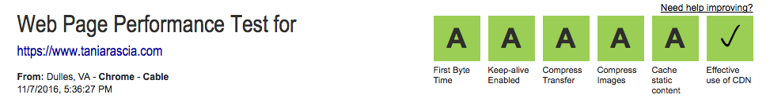

I'm a self-taught web developer who has been working professionally in the field since June, 2015. I'm going to write about the setup, programs, and plugins I use on a daily basis with some brief descriptions and alternate options.

- [View on GitHub](https://github.com/taniarascia/setup)

#### Disclaimer

It doesn't matter what you use: Mac or Windows. Vim or Emacs. Tabs or spaces. PHP or Python. If all the options didn't have merit, there wouldn't be an argument. This list is not meant to be an endorsement for or against anything, just one person's web development workflow. Learn. Be open minded. Try new things. Research. Discover what works best for you. This is not an extensive list; this is my list.

## Contents

- Operating System
- Browser
- Text Editor / IDE
- Stack
- Hosting / Cloud Computing
- Version Control Hosting
- Content Management System (CMS)
- JS Task Runner
- CSS Preprocessor
- CSS Framework
- Content Delivery Network (CDN)
- Analytics
- Performance and Search Engine Optimization (SEO)
- Miscellaneous

## Operating System

> The software a computer runs on.

### **I use:** [macOS (Apple)](http://www.apple.com/macos/sierra/)

**Other Options:** [Windows](https://www.microsoft.com/en-us/windows), [Linux](https://en.wikipedia.org/wiki/Linux)

I used Windows exclusively from 1994 to 2015. Now I work on a Mac, currently running Sierra. One of the biggest game changers for my web development journey was learning how to use the command line, which is done through the Terminal application in macOS.

### Configuration

_Edit 12/29/2016_ - I wrote an entire article dedicated to setting up a development environment for macOS.

[Set up a Mac](/setting-up-a-brand-new-mac-for-development/)

## Browser

> The program used for navigating the internet.

### **I use:** [Google Chrome](https://www.google.com/chrome/)

**Other Options:** [Firefox](https://www.mozilla.org/en-US/firefox/products/), [Opera](http://www.opera.com/), [Safari](http://www.apple.com/safari/) (Mac only), [Edge](https://www.microsoft.com/en-us/windows/microsoft-edge/microsoft-edge) (Windows only)

As a front end web developer, you should have all the browsers downloaded for testing. If you're in an Apple environment, you can download virtual machines or generate screenshots of Edge at the [Microsoft Developer Tools](https://developer.microsoft.com/en-us/microsoft-edge/tools/) website.

### Extensions

- [uBlock Origin](https://chrome.google.com/webstore/detail/ublock-origin/cjpalhdlnbpafiamejdnhcphjbkeiagm?hl=en) - block ads.
- [JSON View](https://chrome.google.com/webstore/detail/jsonview/chklaanhfefbnpoihckbnefhakgolnmc) - format JSON files.
- [Sight](https://chrome.google.com/webstore/detail/sight/epmaefhielclhlnmjofcdapbeepkmggh) - add syntax highlighting to files.
- [Stylish](https://chrome.google.com/webstore/detail/stylish/fjnbnpbmkenffdnngjfgmeleoegfcffe?hl=en) - add stylesheets to websites.
- [Awesome Screenshot Capture](https://chrome.google.com/webstore/detail/awesome-screenshot-screen/nlipoenfbbikpbjkfpfillcgkoblgpmj) - take screenshots of websites.
- [Empty New Tab Page](https://chrome.google.com/webstore/detail/empty-new-tab-page-black/fllomkdgoahjlgcblpldnpjcilipjelp) - clean new tab page.

## Hosting / Cloud Computing

> A service that allows a website to be viewed on the internet.

### **I use:** [NearlyFreeSpeech](https://www.nearlyfreespeech.net/)

**Other Options:** [Amazon Web Services (AWS)](https://aws.amazon.com/), [Digital Ocean](https://www.digitalocean.com/), [MediaTemple](https://www.mediatemple.net/), [Rackspace](https://www.rackspace.com/)

You have a choice between managed hosting, or setting up your own Virtual Private Server (VPS) in the cloud through services like Digital Ocean and AWS. The tradeoff is security and simplicity with managed hosting vs. having complete control and being able to keep prices down with a VPS.

I have some experience with both, and NearlyFreeSpeech has been a great middle ground for me. It's inexpensive, allows me more control than traditional shared hosting, and I don't have to worry about server security and upkeep. I might change my mind in the future, but for now, it works for me.

## Stack

> The software bundle used for web development.

### **I use:** [Linux Apache MySQL PHP (LAMP)](<https://en.wikipedia.org/wiki/LAMP_(software_bundle)>)

**Other Options:** [MEAN](http://mean.io/)

A stack describes the platform used for web development. The server my website runs on and the professional websites I've made have been on the LAMP stack, which has been a stable and popular choice for many years. The LAMP stack is a generalized name, as you can easily change out Linux for Windows, Apache for NGINX, MySQL for MariaDB, PHP for Python, and so on. Every layer in LAMP is free and open source.

For local development, I use [MAMP](https://www.mamp.info/en/) instead of installing everything manually. MAMP is easy to set up and leaves my default system settings alone, creating sandbox environment. This is preferable for me, but might not be for others.

- **Operating System:** Linux (many distributions available)
- **Web Server:** [Apache](https://www.apache.org/)
- **Database:** [MySQL](https://www.mysql.com/)
- **Language:** [PHP](http://php.net/)

## Text Editor / IDE

> The program used to write code and edit text files.

### **I use:** [Brackets](http://brackets.io/)

**Other Options:** [Sublime Text](https://www.sublimetext.com/), [Atom](https://atom.io/), [Visual Studio Code](http://code.visualstudio.com/)

Brackets is not the most popular choice for text editors, but after downloading and playing around with a few different ones, it remains my favorite. VSC and Atom have a delay with syntax highlighting that bothers me too much. I like to refrain from relying on a text editor for doing things like minification, prefixing, and compiling Sass, so I feel comfortable switching it up. I don't currently use an Integrated Development Environment (IDE).

### Extensions

All extensions are installed by going to `File > Extension Manager`.

- [New Moon Color Theme](https://github.com/taniarascia/new-moon) - my color theme.
- [Emmet](https://github.com/emmetio/brackets-emmet) - simplify writing HTML.
- [Beautify](https://github.com/brackets-beautify/brackets-beautify) - formatting and indentation for files.
- [Custom Working Tabs](https://github.com/DH3ALEJANDRO/custom-work-for-brackets) - add tabs.
- [Indent Guides](https://github.com/lkcampbell/brackets-indent-guides) - add indent guides.
- [Color Highlighter](https://github.com/Taraflex/Brackets-Color-Highlighter) - show colors.

### Configuration

```js
 {
  "styleActiveLine": true,
  "themes.theme": "new-moon",
  "brackets-indent-guides.enabled": true,
  "useTabChar": true,
  "spaceUnits": 2,
  "tabSize": 2,
  "closeTags": {
      "whenOpening": false,
      "whenClosing": true,
      "indentTags": []
  },
  "fonts.fontSize": "14.5px",
  "fonts.fontFamily": "'Menlo', monospace"
}
```

## Version Control Hosting

> The Git repository hosting service used for keeping track of revisions and collaboration.

### **I use:** [GitHub](https://github.com/)

**Other Options:** [BitBucket](https://bitbucket.org), [GitLab](https://about.gitlab.com/), [AWS CodeCommit](https://aws.amazon.com/codecommit/)

GitHub is easily the most well-known place to host public and private Git repositories. Depending on what you want to do with private repositories, other options might be better or cheaper. GitHub doubles as a web development portfolio and resume and industry-specific social media.

## Content Management System (CMS)

> The software used to create and manage a website through an admin dashboard.

### **I use:** [WordPress](https://wordpress.org/)

**Other Options:** [Jekyll](https://jekyllrb.com)

Currently, I use the WordPress CMS both for professional projects and my personal website. The alternative option is using a Static Site Generator like Jekyll and countless others, which have many advantages like speed and increased security. WordPress is extremely popular and extendable, and it works for me at the moment. I also like to play around with and learn other systems, so I might update or change my personal site in the future.

### Plugins

- [Akismet](https://akismet.com/) - protect against comment spam.
- [Intuitive Custom Post Order](https://wordpress.org/plugins/intuitive-custom-post-order/) - easily drag and drop to reposition post and pages.
- [Move Login](https://wordpress.org/plugins/sf-move-login/) - disable the `/wp-admin` and `wp-login.php` URLs and replace them with your own, custom URL.
- [WP Performance Score Booster](https://wordpress.org/plugins/wp-performance-score-booster/) - most simple and effective speed and caching plugin I've used.
- [Google XML Sitemaps](https://wordpress.org/plugins/google-sitemap-generator/) - generate a sitemap.
- [WP Smush](https://wordpress.org/plugins/wp-smushit/) - image compression.

## JS Task Runner

> Command line automation for common repetitive tasks.

### **I use:** [Gulp](http://gulpjs.com/)

**Other Options:** [Grunt](http://gruntjs.com/), [Brunch](http://brunch.io/)

Task runners like Gulp are useful for watching changes to files and performing tasks like compiling, minifying, autoprefixing, linting, and more. I use Gulp to automatically watch for changes in my `/src` Sass directory, and output the minified, prefixed, compiled CSS, along with Sourcemaps. I don't currently use Gulp for automatically refreshing the browser with the new content, or JavaScript, as I don't work with very advanced JavaScript at the moment.

### Plugins

- [Sass](https://www.npmjs.com/package/gulp-sass)
- [Sourcemaps](https://www.npmjs.com/package/gulp-sourcemaps)
- [CSS Nano](https://www.npmjs.com/package/gulp-cssnano)
- [Autoprefixer](https://github.com/postcss/autoprefixer)

## CSS Preprocessor

> Extend the features of CSS and compile it back into CSS.

### **I use:** [Sass](http://sass-lang.com/)

**Other Options:** [LESS](http://lesscss.org/), [Stylus](http://stylus-lang.com/)

A preprocessor is a program that takes a bit of code and compiles it into a different bit of code. In the case of CSS preprocessors, we’re compiling the Sass language into regular old CSS that the browser can interpret. I like having the ability to define variables, nest, create loops, and organize my project into multiple files, all of which and more I can do with Sass, specifically the `.scss` extension. I started with LESS, but as Sass grew in popularity, I switched over and now prefer it.

## CSS Framework

> A base stylesheet used as a starting point for designing a website.

### **I use:** [Primitive](https://taniarascia.github.io/primitive/)

**Other Options:** [Bootstrap](http://getbootstrap.com/), [Foundation](http://foundation.zurb.com/)

The first responsive designs I made were with Bootstrap, because I didn't yet understand the underlying concepts of grids, media queries, viewports, and so on. When I realized I didn't feel comfortable making a website without a framework, I sought to teach myself how to make a grid, navigation, and other UI elements from scratch. I started building all my websites that way, but when I realized I was re-writing a lot of the same code, I compiled it all into my own framework. Now I understand how my entire system works, only use exactly what I need, and I save a lot of time, with the added bonus of working on my documentation skills by making a page for it.

This has been my choice because I have the freedom to do so, but I also feel comfortable jumping into any framework if necessary.

## Encryption (TLS/SSL)

> Protocol that increases the security of data transmitted through the internet.

### **I use:** [ComodoSSL](https://comodosslstore.com/)

**Other Options:** [Let's Encrypt](https://letsencrypt.org/)

Encrypted websites are becoming the standard, and there's no reason not to encrypt your site's traffic with a TLS certificate. I got a \$10/year certificate through ComodoSSL, which was before I learned about Let's Encrypt, a free option. Either way, transmitted content through my website is more secure, and my site is more trustworthy.

##### Generate Certificate Request

```apacheconf
openssl req -new -newkey rsa:2048 -nodes -keyout example.com.key -out example.com.csr
```

##### Extra WordPress Configuration

##### wp-config.php

```php

$_SERVER['HTTPS'] = 'on';
    define('FORCE_SSL_ADMIN', true);
```

##### .htaccess

```apacheconf
RewriteEngine On
RewriteCond %{HTTP:X-Forwarded-Proto} !https
RewriteRule ^ https://%{HTTP_HOST}%{REQUEST_URI} [L,R=301]
```

### Testing

- [SSL Server Test](https://www.ssllabs.com/ssltest/)

## Content Delivery Network (CDN)

> Deliver cached website content to geographically dispersed servers.

### **I use:** [Cloudflare](https://www.cloudflare.com/)

**Other Options:** [MaxCDN](https://www.maxcdn.com/), [AWS CloudFront](https://aws.amazon.com/cloudfront/)

I pay for hosting based on bandwidth usage. Utilizing a CDN was as easy as pointing my name servers to Cloudflare's, and my bandwidth usage immediately dropped by at least 60%. My site got a speed and performance boost, I pay less for bandwidth, and it was fast and free to implement.

## Performance and Search Engine Optimization (SEO)

> Improve speed, performance, and search rankings.



I regularly run my site through multiple speed and performance tests to see how well I'm doing and what I can improve. Much of what I've listed above contributes to my positive scores and high search rankings.

- Use a [CDN](https://www.cloudflare.com/) to improve speed and performance.
- Use [SSL/TLS](https://letsencrypt.org/) to improve security.
- [Performance Score Booster](https://wordpress.org/plugins/wp-performance-score-booster/) for WordPress enables GZIP compression, browser caching, and file minification.
- Use [structured data](https://developers.google.com/search/docs/guides/intro-structured-data) to help Google understand your content.
- Add a [sitemap](https://wordpress.org/plugins/google-sitemap-generator/).
- [Compress images](https://wordpress.org/plugins/wp-smushit/)

### Steps to Improve Google Search Ranking

1. Make good content.

### Testing

- [Google PageSpeed](https://developers.google.com/speed/pagespeed/insights/) - 91/100
- [GT Metrix](https://gtmetrix.com/)
- [SEO Site Checkup](http://seositecheckup.com/) - 89/100
- [Pingdom Website Speed Test](https://tools.pingdom.com/)
- [YSlow](http://yslow.org/)
- [Webpage Test](http://www.webpagetest.org/) - A/A/A/A/A Yes

### Analytics

Track and report website traffic.

- [Google Analytics](https://analytics.google.com/)
- [Google Search Console](https://www.google.com/webmasters)

### Miscellaneous

A few other programs I use on a regular basis.

- [Evernote](https://evernote.com/) - for note taking, synced accross multiple devices (well, 2).
- [Slack](https://slack.com/) - for communication between teams.
- [Adobe](http://www.adobe.com/) - I use Photoshop and Illustrator for design.

##### Things I don't know about yet

- Vagrant
- VirtualBox
- Docker
- Composer
- JavaScript frameworks (React, Angular, Vue)
- Programming languages besides PHP
- A lot of other stuff

## Conclusion

There's a lot that goes into being a web developer, and I've hardly even scratched the surface. I've tried to explain and simplify all the layers involved in making a website here, from the operating system you use to the final performance and analytics of the website. You can find tutorials for most of these concepts around the website. I hope this has given you some insight into how one individual puts all the pieces together to design, develop, and maintain a website.
