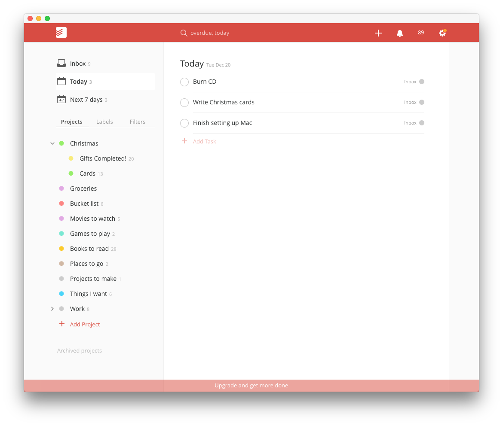
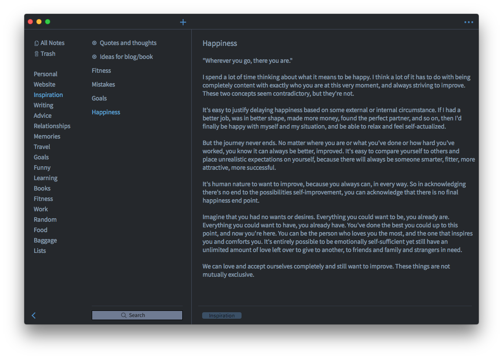
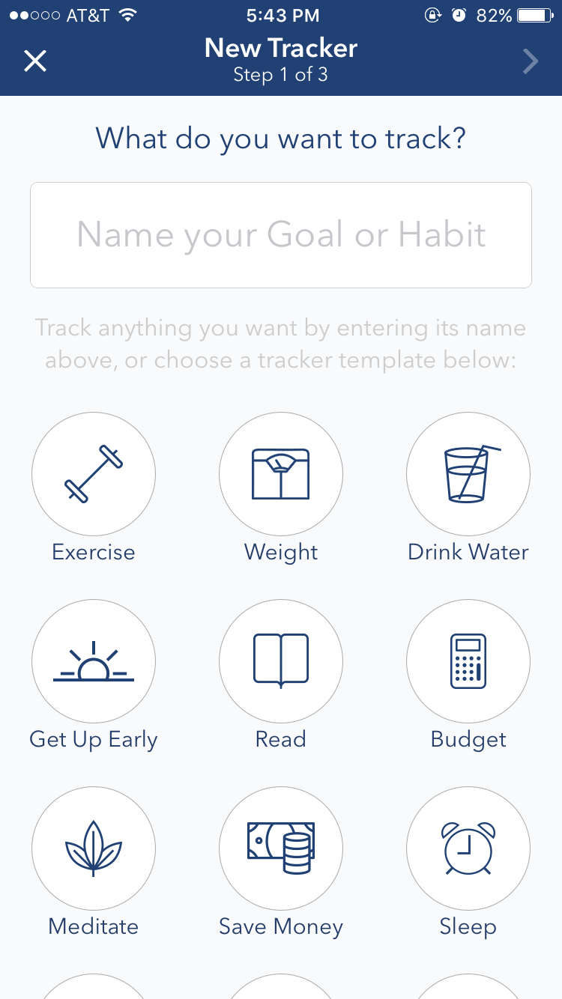
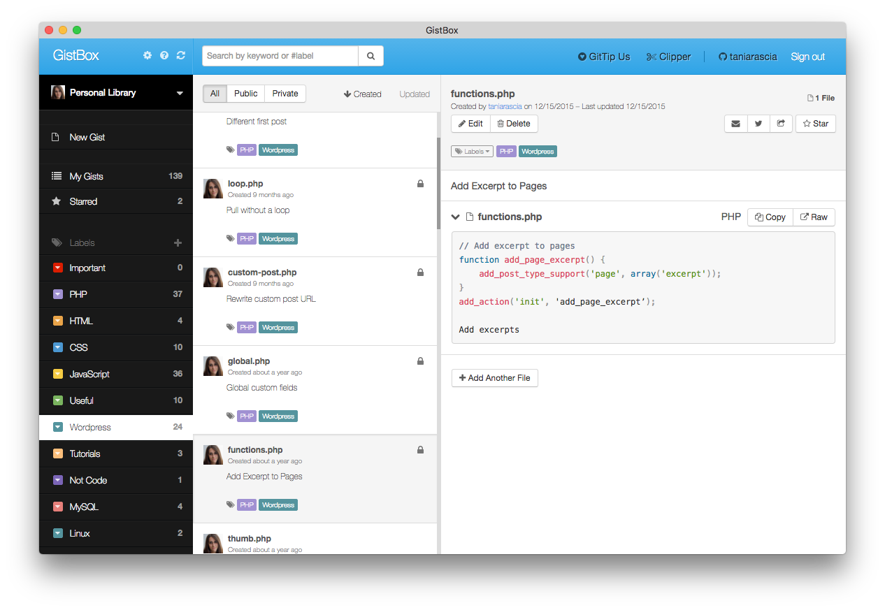
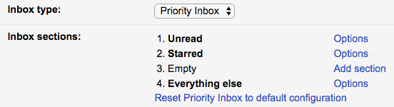
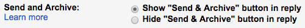

Time is the most valuable asset you have, and depending on how you use technology, it can either drastically hinder or improve your productivity. I'm very much a minimalist, and I've spent a lot of time getting down to the essentials. I'd like to share with you how I use technology to keep my life, goals, and time organized and efficient.

Everyone's personal methods will vary based on their own needs. I encourage you to evaluate yours and build a system that works for you. I've always struggled to keep up in the past, so I'm glad I took the time out to do this for me.

I'll also be going into how I organized my email inbox.

#### Rules

I have a few important rules all the apps I use must follow.

- **Apps must be _free_!** - There are so many amazing free apps out there if you take the time to look.
- **Apps must _sync_ between devices and be accessible from the web** - I want to be able to easily access my information from anywhere, on any ecosystem.
- **Use as _few_ apps as possible** - Everything should have a specific purpose, do that purpose exquisitely. I should never be confused as to where to put any information.
- **Apps must be _fast_** - I don't like waiting. If an app or site takes too long to load, I won't use it.
- **Minimum effort** - I know myself, if something requires more than exactly one step, it will overwhelm me.

#### Needs

I'll list what I use up front and get into the details further along in the article.

- **To-dos** - [Todoist](https://todoist.com)
- **Notes** - [Simplenote](https://simplenote.com)
- **Goal tracking** - [Strides](http://www.stridesapp.com/)
- **Code snippets** - [Gistbox](http://www.gistboxapp.com/) (developers only)
- **Email** - [Gmail](https://www.google.com/gmail)
- **Calendar** - [Google Calendar (TinyCalendar app)](https://www.google.com/calendar)

#### Notifications

I only get push notifications for the following:

- Incoming text messages
- Incoming emails
- Calendar events

That's it. Nothing else bothers me.

## To-dos ([Todoist](https://todoist.com))

I couldn't figure out where to put my to-do lists. In notes? In calendar events? In a Chrome extension? On a piece of paper by my bed? I didn't have any effective way to organize my to-dos, and there's nothing more useless than a completely out-of-date or disorganized to-do list.

Todoist is absolutely fantastic for separating different levels of to-dos, and it has a really pleasant interface. I tried it once before and ended up being frustrated because I couldn't use it as a note-taking or list-making program the way I liked. If you use it just for to-dos and lists that can be _accomplished_ and aren't intended to be saved, then it's great.

There is a premium version and it will prompt you to upgrade, but I personally didn't have any need for the extra features.

Anything in "Today" will have a notification badge, and my aim is always to get rid of notifications on my phone or computer. I find the most effective way to get things done is to write down all your tasks for the next day before bed. That way, you reduce anxiety about what needs to get done tomorrow, and you wake up knowing what you have to do today.

Additionally, I have other little lists - if someone recommends a movie, book, or TV show to me, I'll write it down in the respective list, and I'll keep track of any groceries and shopping as I need it.

## Notes ([Simplenote](https://simplenote.com))

I tried using Evernote. I tried it for my phone, I tried it for my computer, I tried it for web. I read articles on how to organize it, whether through tagging or notebooks. Everyone loves it, it's everywhere. I didn't know what I apparently wasn't getting. I finally realized Evernote is just not for me. I don't like it. It's extremely slow and bulky, the formatting always messes up, it has no clear-cut way to organize notes, they're constantly reducing what you get with the free version, reducing your privacy, and so on. So I realized I needed something else.

Simplenote is a minimalist note-taking app by the Automattic, the same company that owns WordPress. It's cross-platform, so you can have it on Linux, Windows, or Mac, and iPhone or Android, as well as a web version. For me, the best part is that it's basically plain text, so I don't get all sorts of weird formatting discrepancies, and it has a tagging system where you can apply a note to multiple tabs.

There's a dark theme and a light theme, and that's it for options. Exactly what I wanted! Now I have a minimalist note-taking app with a dark theme that allows me to tag and organize my notes in a way that makes sense to me.

I even use it to write these articles, as it's easier for me to write against a dark background than the WordPress default.

Here's a screenshot of how I have it organized currently.

## Goals ([Strides](http://www.stridesapp.com/))

It's really easy to take on too many goals and get overwhelmed. The best way for me to accomplish a goal is to track just a few things every day or week. Strides is perfect for that. Like Todoist, Strides has a premium version, but I haven't found a need for it.

The concept of Strides is to set trackers. I'm only using it for fitness related goals right now, so I have a weight tracker that I have set for once a week, and various exercises that I either do daily or weekly. They conveniently have a lot of pre-set trackers that you define, so it's also great for budgeting, waking up early, and so on. Still, my main recommendation would be to track as few things as possible, and slightly less then what you actually want to do.

For example, I have a "run a mile" tracker that I set to once a week. Last week, I ran a mile four times. I felt accomplished because I completed my goal, and I was able to do more. If I had set it to seven days a week, things may have come up to prevent me from accomplishing it, and I might get discouraged. Always introduce goals slowly.

There will be a progress bar for your goal that's either red or green depending on whether you're on course with your goal or not.

## Code Snippets ([Gistbox](http://www.gistboxapp.com))

As a web developer, I'm constantly learning new things, and most of it I document here. However, not everything deserves its own blog post or tutorial, so I need a place to store all the little bits of code I write or find useful. [GitHub Gist](https://gist.github.com/) is great for storing these (and privately), but it's not very organized. GistboxApp integrates with your GitHub account to allow you to categorize your gists.

## Email ([Gmail](https://www.google.com/gmail))

I've been using email for nearly 20 years, but it was only this year, when I actually started getting emails on a regular basis (through this website) that I realized how bad I was at it. I didn't have any unread emails or spam, but I also didn't have any method of responding to or keeping track of my inbox. When I realized I had over a hundred emails floating around randomly in my inbox that I had never responded to, I knew something had to change. I reduced my inbox from over 5,000 messages to zero, with about 300 archived, and devised a method for labelling and keeping track of everything in the future.

I use Gmail, and I also use the Gmail app on my iPhone (instead of the built-in Apple Mail app).

### Organize your email

This is definitely the one that requires the most amount of effort to get right.

#### Separate personal and signup emails

This one might seem obvious, but it's important. I have a personal email that gets absolutely no spam, promotions, newsletters, anything. I only use it to sign up for things that I will use very often or might be connected to payment in some way, and I **immediately opt-out of all marketing**. This is the only one I'll get notifications for on my phone.

The other one I never check, and I use it to sign up for anything I don't care about, and when they ask for my email at stores. All the promotions and junk will go there, should I ever wish to look at it (I don't).

#### Clean up your inbox

Despite no promotions and marketing, I had over 5,000 emails in my inbox. I had never deleted or achived anything...ever. It was anything from old account login notifications and updates to privacy policies and password resets and so on. So I went through and searched for anything and everything that I didn't need. I searched `from:Facebook`, `from:Bank`, `from:Amazon`, `from:Craigslist`, and so on, and deleted all those non-personal emails. It took a few days.

I sorted through the rest of the personal emails, and archived the ones I wanted to save. I had never used archive before - just left everything in the inbox. Now I had a completely empty inbox!

#### Make a system

Now I had an empty inbox and my personal emails that did not require any attention taken care of and stashed away. At this point, I was going to treat my inbox as an email to-do list. Anything that came in the inbox required sorting.

- Reply
- Delete
- Archive

Anything I don't want gets immediately deleted. Anything that I want to keep but doesn't need a reply gets archived.

So that leaves replying to the messages that require a response. Obviously, I can't reply to all emails right away - so if it needs a reply, I'll star it and sticky it to the top of my inbox.

### Settings

I set my email as minimalist as possible. No extra markers I don't need, and Google doesn't decide what's important to me.

#### Set priority inbox

So here's how my inbox will show up now.

**Unread** is at the very top, and that's what needs to be sorted. **Starred** items are pinned above everything else, and this is my email to-do list. You can organize this however works best for you. The ideal is always to get the inbox to zero.

#### Send and Archive

To make things even easier, any email I reply to gets automatically archived.

#### Labels and filters

One handy label I have is setting a **Personal** label to `from:(myemail)`, so anything I've replied to has "personal" attached to it. I have a label for important things I might want to be able to reference quickly later, and a label for messages that have come to me through this website's contact form, and that's it. Everything else is filters deleting emails that didn't respect my opt-out request.

### Summary

- Have two emails: **personal** and **promotions/signups**.
- Sort all emails immediately - either **delete**, **archive**, or **reply/star**.

## Calendar ([Google Calendar](https://www.google.com/calendar) & [TinyCalendar](http://www.appxy.com/tinycalendar/))

For a long time, I didn't use any calendar at all. Naturally, I would either double-book myself or completely forget about events. I realized if I take the slight effort to mark down every time I have a doctor's appointment, birthday party, get-together, concert, or any event coming up, I'll never have to worry about forgetting. It's not like I didn't try to use a calendar before, but I would always get so confused about how to sync them properly, and I'd have all these holidays and Facebook events filling it up and making it busy and overwhelming, so I would always give up.

I tried the phone apps for Sunrise, Apple Calendar, and Google Calendar, and none of them were minimalistic and simple enough for me. I wanted to see my agenda as a list, I wanted it to load fast, and I wanted it to integrate well Google.

**TinyCalendar** ended up being exactly what I wanted.

- I can set a widget to easily create a new event.
- I can set the agenda as my default view.
- I can load events from Google Calendar and Apple Calendar.

I decided to collect all the birthdays of my friends and family and put it into its own calendar in Google, since I wasn't going to have Facebook to remind me anymore.

Although I didn't want to use Apple Calendar at all, a lot of apps automatically integrate with it on iPhone, so I'm still able to use the "Add to calendar" button from other apps (like Meetup) and have them appear in my calendar.

### Conclusion

Now you know way more about how I organize myself than you ever could have possibly wanted to. Hopefully seeing one person's setup can help you if you need some ideas on productivity and organization. If I had to condense this entire article to a few points, this is what it would be:

- Organize your emails as they come in - either delete them, archive them, reply to them, or put them on a "will reply" list.
- Have a "today" to-do list, and try to update it every night before bed.
- Have as few notification pop ups on your phone and email as possible.
- Find free resources for organization and productivity.
