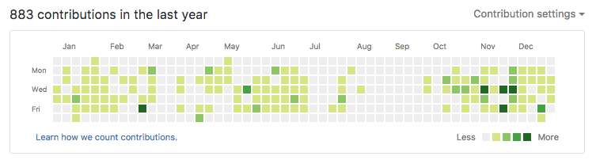
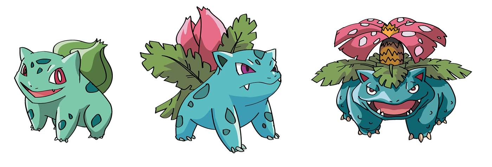
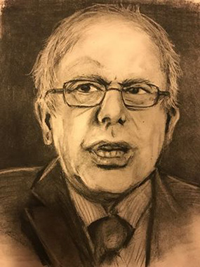
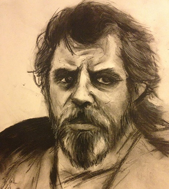
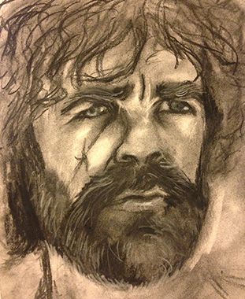

A year is just one thing - one revolution of the Earth around the Sun. Here are a few things I did.

## I wrote 14 articles.

That’s a little over one article per month. I did my best to always focus on quality over quantity, and I only wrote long guides and instructive tutorials. I didn’t write about opinions, or make small posts for snippets.

This blog has been my greatest accomplishment and favorite hobby, thank you all for reading, sharing, and commenting!

- [WordPress functions, comments, and custom posts](/wordpress-from-scratch-part-two/)
- [Certificates for HTTPS](/https-ssl-tls-certificate-how-to/)
- [Gulp](/getting-started-with-gulp/)
- [JavaScript comments, variables, and data types.](/javascript-day-one/)
- [Parallax scroll](/parallax-scroll-effect/)
- [Syntax highlighting](/adding-syntax-highlighting-to-code-snippets/)
- [JavaScript comparisons, math, and logic](/javascript-day-two/)
- [Flexbox image gallery](/how-to-build-a-responsive-image-gallery-with-flexbox/)
- [WordPress custom fields and meta boxes](/wordpress-part-three-custom-fields-and-metaboxes/)
- [Linux cron jobs](/setting-up-a-basic-cron-job-in-linux/)
- [Styling buttons and forms](/styling-ui-components-from-scratch-buttons-forms/)
- [My webdev setup](/my-front-end-web-development-setup/)
- [Organization and productivity](/productivity-how-i-use-technology-to-organize-my-life/)
- [A new MacBook Pro](/setting-up-a-brand-new-mac-for-development/)

## I designed and developed 10 websites.

And I won't mention how many email templates I made. A few of these sites were done in collaboration with a designer, but most of them were my product, from conception to launch. This involves setting up a meeting, sending out a quote and proposal, creating a design in Illustrator, developing an HTML site, integrating a CMS, and migrating to a live server. 2016 was the first full year I spent as a professional web developer.

## I made 883 commits.

This means absolutely nothing. It’s like keeping track of how many lines of code are in your project. Still, it’s fun to look at. I was relatively consistent with how often I worked on projects, with the exception of one vacation in September. I rarely ever commit on weekends, and I like it that way. Some of my commits for personal projects have titles like “did stuff”, “hmm”, “here goes nothing!”, and “EIGHTIES MODE”, but I’m working on getting better.

## I lost 11 pounds.

I started 2016 at 146 pounds, and today I weigh 135. I did this through a lot of running, biking, and lifting, as well as eating healthy. I'd also like to write about how I stay in shape.

## I recorded 8 songs.

Occasionally, I like [warbling into my phone](/music), playing the accordion, and making really bad Photoshops, and I consider this a great accomplishment. Here's a peek at my "unique" taste in music.

- [Winner Takes it All - ABBA](/music/songs/Winner.m4a)
- [You and I - Rhodes](/music/songs/YouAndI.m4a)
- [Something Wild - Lindsey Stirling & Andrew McMahon](/music/songs/SomethingWild.m4a)
- [Truce - twenty one pilots](/music/songs/Truce.m4a)
- [Truly Madly Deeply - Savage Garden](/music/songs/TrulyMadlyDeeply.m4a)
- [Rose Garden - Lynn Anderson](/music/songs/RoseGarden.m4a)
- [Bridge Over Troubled Water - Simon & Garfunkel](/music/songs/Bridge.m4a)
- [El Pasadiscos - Diego Verdaguer](/music/songs/ElPasadiscos.m4a)

## I drew 4 Pokemon.

I enjoyed drawing as a kid, but I stopped around 2007 when I began working as a chef. I thought drawing all 150 Pokemon would be a nice, tangible goal to get back into a drawing hobby. I made four! That’s almost 3%!

(Only 3 Pokemon pictured because I don't know where I put the other one...)

## I drew 3 portraits.

I also attempted to make a few portraits, which has always been a struggle for me.

Can you tell who they are!?

## I deleted Facebook

I've had every method of "staying in touch" via the Internet growing up - Livejournal, MySpace, Facebook. After 10 years, I finally permanently deleted Facebook. Whenever someone asks me why, I just say, _because I'm weird!_, but [Leo Babauta of Zenhabits has a much more eloquent explanation](https://zenhabits.net/fb/) that sums up most of my reasons.

I never had Tumblr, Instagram, or Pinterest to begin with. I do have [Twitter](https://twitter.com/taniarascia) since it's the cool kid developer thing to do.

I also travelled to some places (Arizona, Sweden, Denmark), and biked and hiked, my favorite outdoor activities. I found a method of organization that worked for me. I made it to the front page of Reddit. I made an online game and got a bunch of my friends to play for a while. I wrote an article for SitePoint. I started a small community of programmers and aspiring developers. I designed a framework that I used for all my professional sites. I learned a lot about life and love.

## Goals

My only goal is to be the best person I can be.

Here are just a few things I'd like to accomplish or focus on.

- Improve my JavaScript skills, in both the fundamentals and framework departments, which I've been [documenting here](https://taniarascia.github.io/js/).
- Learn to play [La Noyee](https://www.youtube.com/watch?v=ZaBcs0NEc6w) on accordion.
- Create an outlet for my thoughts outside of web development.
- Remove any and all material posessions that do not add value to my life.
- Continue a routine of hiking, riding, and lifting.
- Be open and flexible no matter what happens in life, and compassionate and empathetic to the people I encounter.

## Article ideas

I have a lot of ideas for design and development articles I want to write in 2017. Here are a few of them.

- Bootstrap 4: how to integrate into the official Grunt and Sass workflow
- How to make a simple PHP contact form
- Design for developers: some simple rules to follow for a clean, professional design
- Basic command line tutorial for Windows and Mac/Linux
- The fundamentals of CSS animations
- The reasons my Google search ranking is so high
- A list of blogs I follow

Some of these I might write, some I might not, and there are infinite new things to learn and document.

## Moving Forward

Life is special. You are special. The possibilities within you are endless. Please, let the people who are important to you know you appreciate them. And have a wonderful day.
