In this tutorial, we're going to learn how to make the beginnings of a very simple database app, using PHP and MySQL. It will be half of a [CRUD](https://en.wikipedia.org/wiki/Create,_read,_update_and_delete) application, which stands for **C**reate, **R**ead, **U**pdate, **D**elete.

A quick example of a CRUD application would be a database of employees for a company. From the control panel, an admin would be about to add a new employee (`create`), view a list of employees (`read`), change an employee's salary (`update`) or remove a fired employee from the system (`delete`). In this lesson, we'll only be creating and reading entries, but if it proves popular I'll make a part two.

Looking up _how to connect to MySQL with PHP_ in Google will lead to a lot of outdated resources using [deprecated](http://stackoverflow.com/questions/8111774/deprecated-meaning) code, and my aim is to create a very simple walkthrough that will leave you will a technically functioning app that uses more modern and secure methods.

That being said, I leave you with the disclaimer that this tutorial is meant for beginner **learning purposes** - there can always be improvements to security and maintainability for code in the real world.

#### Prerequisites

- **A basic knowledge of HTML** - We'll be using [HTML forms](http://marksheet.io/html-forms.html).
- **A basic knowledge of PHP** - I'm going to do my best to simplify as much as possible, but you should already have an idea of how variables and strings work. [Here's a basic guide to some of the fundamentals](https://www.w3schools.com/php/).
- **A local PHP and MySQL environment** - [Click on the link](/local-environment) for a mini-tutorial on how to set one up. You will be using [MAMP](https://www.mamp.info/en/) to install PHP and MySQL on a Windows or Apple computer.
- Alternatively: you can use [Vagrant](/what-are-vagrant-and-virtualbox-and-how-do-i-use-them/) to set up [LAMP on Ubuntu](/how-to-install-apache-php-7-1-and-mysql-on-ubuntu-with-vagrant/) if you're more advanced.
- **A database management app** - You can use [Sequel Pro](https://www.sequelpro.com/) on a Mac, and [SQLYog](https://github.com/webyog/sqlyog-community/wiki/Downloads) on Windows. These are graphical user interfaces (GUI) to view the content of your database.

#### Goals

- Connect to a MySQL database with PHP using the [PDO (PHP Data Objects)](http://php.net/manual/en/book.pdo.php) method.
- Create an installer script that creates a new database and a new table with structure.
- Add entries to a database using an HTML form and [prepared statements](http://php.net/manual/en/mysqli.quickstart.prepared-statements.php).
- Filter database entries and print them to the HTML document in a table.

All the code throughout this article can be found on GitHub.

- [View on GitHub](https://github.com/taniarascia/pdo/tree/feba19a43e63c617c95a1f6e68825f6e3086336c)

### Update: Part Two is here! Learn how to update and delete entries.

- [Part 2: Update and Delete](/create-a-simple-crud-database-app-php-update-delete/)

## Step 1: Building the front end

To start, we have a PHP localhost set up, as mentioned in our prerequisites. I've created one and called it **db.dev**. Let's create a directory called **public/** in the root of our project. This is where I'm going to put all my client-facing code, or what would be pages accessible from the internet.

> Chrome no longer allows **.dev** localhost domains. I recommend to use **.test** instead of **.dev**. Throughout this article, **.dev** will be used in the examples.

Please make sure you read the above note before continuing.

We don't have a database set up or anything, but we're just going to set up the HTML front end in order to be prepared to start interacting with that data.

### Index page and template partials

Our main/home page will be located at **index.php**, so create that file in your **public/** directory.

<div class="filename">public/index.php</div>

```html
<!DOCTYPE html>
<html lang="en">
  <head>
    <meta charset="utf-8" />
    <meta http-equiv="x-ua-compatible" content="ie=edge" />
    <meta name="viewport" content="width=device-width, initial-scale=1" />

    <title>Simple Database App</title>

    <link rel="stylesheet" href="css/style.css" />
  </head>

  <body>
    <h1>Simple Database App</h1>

    <ul>
      <li>
        <a href="create.php"><strong>Create</strong></a> - add a user
      </li>
      <li>
        <a href="read.php"><strong>Read</strong></a> - find a user
      </li>
    </ul>
  </body>
</html>
```

Right now, all we have is a basic HTML skeleton that will link to our **create** and **read** pages. Here's what it looks like:

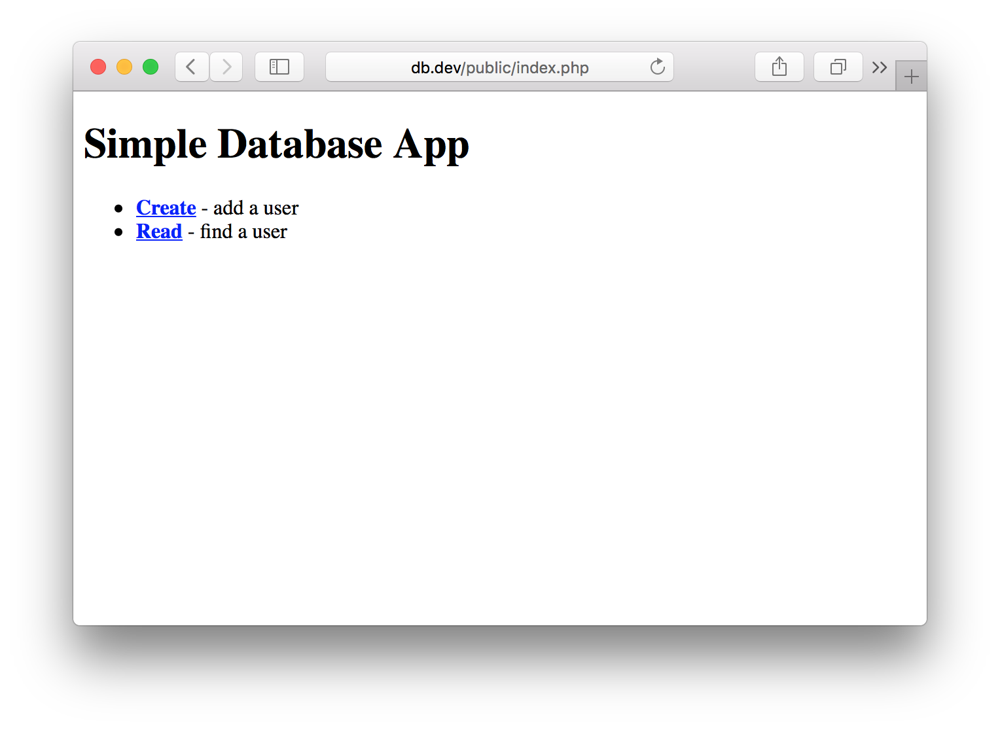

Since we want to keep our application relatively [DRY (don't repeat yourself)](https://en.wikipedia.org/wiki/Don%27t_repeat_yourself), we're going to divide our page into layout sections.

Create a **templates/** directory in public, and make a **header.php** and **footer.php**. You'll take everything from the `<h1>` tag and up and put it in the header.

<div class="filename">public/templates/header.php</div>

```html
<!DOCTYPE html>
<html lang="en">
  <head>
    <meta charset="utf-8" />
    <meta http-equiv="x-ua-compatible" content="ie=edge" />
    <meta name="viewport" content="width=device-width, initial-scale=1" />

    <title>Simple Database App</title>

    <link rel="stylesheet" href="css/style.css" />
  </head>

  <body>
    <h1>Simple Database App</h1>
  </body>
</html>
```

And here's the footer.

<div class="filename">public/templates/footer.php</div>

```php
</body>
</html>
```

All that remains in **index.php** at this point are the links to our two other pages.

<div class="filename">public/index.php</div>

```html
<ul>
  <li>
    <a href="create.php"><strong>Create</strong></a> - add a user
  </li>
  <li>
    <a href="read.php"><strong>Read</strong></a> - find a user
  </li>
</ul>
```

We want to include the header and footer code in all our front end pages, so we'll be using a [PHP include function](http://php.net/manual/en/function.include.php) to pull that code in.

<div class="filename">public/index.php</div>

```php
<?php include "templates/header.php"; ?>

<ul>
  <li>
    <a href="create.php"><strong>Create</strong></a> - add a user
  </li>
  <li>
    <a href="read.php"><strong>Read</strong></a> - find a user
  </li>
</ul>

<?php include "templates/footer.php"; ?>
```

Now the front end of our index file looks the same as before, but we have the reusable layout code that we can use in our other pages.

### Add a new user page

Now we're going to make a file called **create.php** back in our **public/** directory. This will be the page we use to add a new user to the database. We'll start the file with our header and footer loaded in.

<div class="filename">public/create.php</div>

```php
<?php include "templates/header.php"; ?>
    <?php include "templates/footer.php"; ?>
```

I'm going to create a simple form here that gathers the first name, last name, email address, age, and location of a new user.

<div class="filename">public/create.php</div>

```php
<?php include "templates/header.php"; ?><h2>Add a user</h2>

    <form method="post">
    	<label for="firstname">First Name</label>
    	<input type="text" name="firstname" id="firstname">
    	<label for="lastname">Last Name</label>
    	<input type="text" name="lastname" id="lastname">
    	<label for="email">Email Address</label>
    	<input type="text" name="email" id="email">
    	<label for="age">Age</label>
    	<input type="text" name="age" id="age">
    	<label for="location">Location</label>
    	<input type="text" name="location" id="location">
    	<input type="submit" name="submit" value="Submit">
    </form>

    <a href="index.php">Back to home</a>

    <?php include "templates/footer.php"; ?>
```

You'll notice that for each entry, I have a `<label>`, and each `<input>` has a `name` and `id` attribute.

Whenever we create forms with HTML, we need to make sure they're [accessible for all users](https://www.w3.org/WAI/tutorials/forms/labels/), and we do that by creating labels and associating each one to a specific. An input is associated to a label by its id.

So why do I have `name="firstname"` as well as `id="firstname"`, if only the id is necessary to associate the input to the label?

The `name` attribute is how PHP identifies and utilizes the data of the input, which we'll start getting into further on in the article. Therefore both the `name` and `id` attributes are necessary, but for different reasons.

Before I display the front end of the **create.php** code, let's quickly create a **css/** folder and make **style.css**. CSS and style is not a focus of this article, but I'm going to add a line of CSS code to make the forms easier to read.

<div class="filename">public/css/style.css</div>

```css
label {
  display: block;
  margin: 5px 0;
}
```

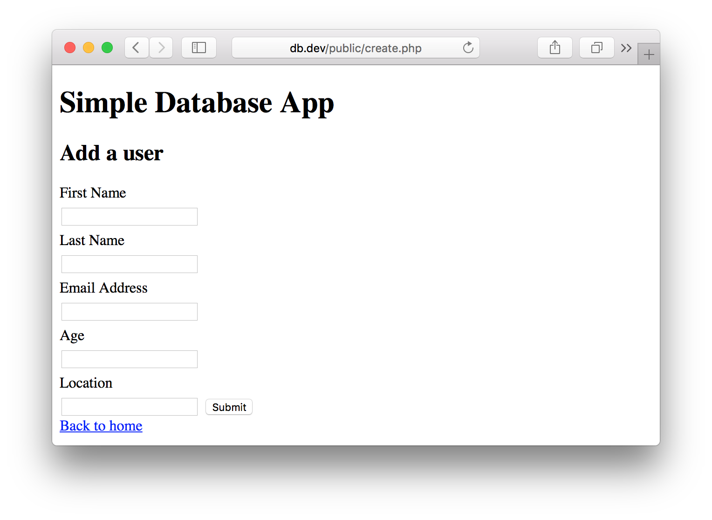

We have not specified a form action, so pressing the `submit` button will perform the action on the same page. Since we haven't written any PHP code to process the form yet, it won't do anything.

### Query users page

Finally, we're going to create our **read.php** file, which will query the list of users by a parameter (in this case, location) and print out the results.

Again, we'll start with the header and footer code.

<div class="filename">public/read.php</div>

```php
<?php include "templates/header.php"; ?>
    <?php include "templates/footer.php"; ?>
```

Then we'll add a small form for searching for users by location.

<div class="filename">public/read.php</div>

```php
<?php include "templates/header.php"; ?>

    <h2>Find user based on location</h2>

    <form method="post">
    	<label for="location">Location</label>
    	<input type="text" id="location" name="location">
    	<input type="submit" name="submit" value="View Results">
    </form>

    <a href="index.php">Back to home</a>

    <?php include "templates/footer.php"; ?>
```

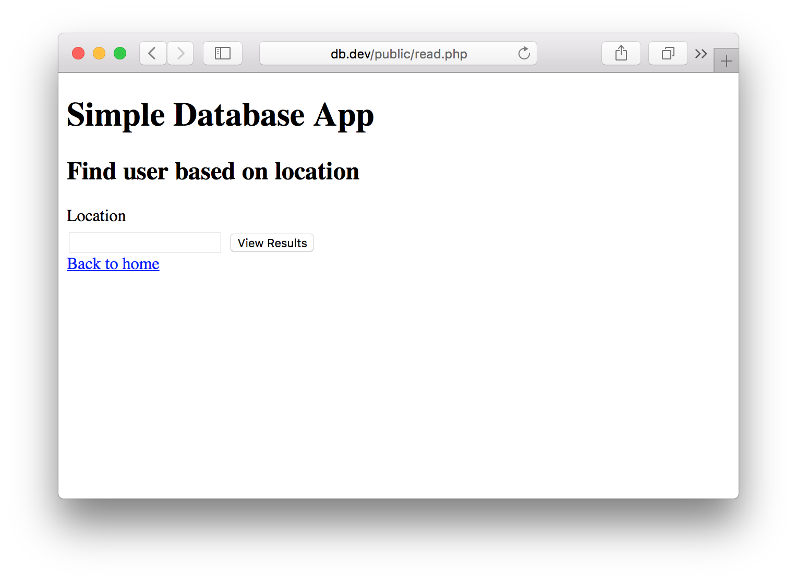

Now you have all the front end code set up and we can start. Here's everything you should have so far.

```
public/
|-- css/
|   |-- style.css
|-- templates/
|   |-- header.php
|   |-- footer.php
|-- index.php
|-- create.php
|-- read.php
```

Here's a more visual representation of that.

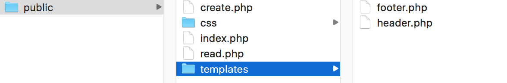

## Step 2: Initializing the database

Now that we have a front end, we're going to create the database. We could do this through the GUI of SequelPro or whatever database manager we're using, but I want to show you how to do it with actual SQL statements and PHP in an installer script.

> SQL (Structured Query Language) is a language used to communicate with a database.

First, let's get into the database. Here's the login page for the front end of our database.

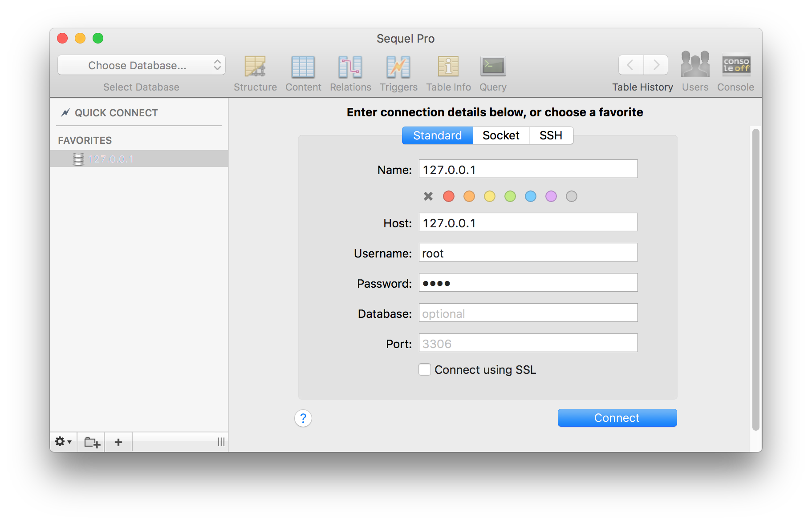

Your host will be `localhost` or `127.0.0.1`, which translate to the same thing for our purposes. Username and password will both be `root`. Entering that information in, you should be able to enter localhost.

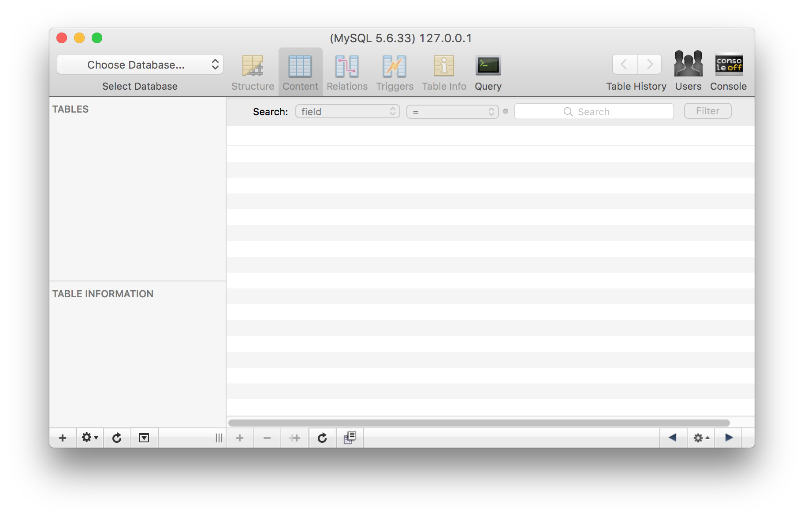

Create a directory called **data/** and create a file called **init.sql**. This will be our database initializing code.

<div class="filename">data/init.sql</div>

```sql
CREATE DATABASE test;

  use test;

  CREATE TABLE users (
    id INT(11) UNSIGNED AUTO_INCREMENT PRIMARY KEY,
    firstname VARCHAR(30) NOT NULL,
    lastname VARCHAR(30) NOT NULL,
    email VARCHAR(50) NOT NULL,
    age INT(3),
    location VARCHAR(50),
    date TIMESTAMP
  );
```

SQL is a relatively straightforward code, so even if you've never seen it before, it should be easy to understand. Here's what the above means in plain English:

We're going to create a database called `test`. Then we're going to make sure we're using `test` for the rest of our code. In the `test` database, we'll create a table called `users` with 7 fields inside - **id**, **firstname**, **lastname**, **email**, **age**, **location**, and **date**. Next to each field is more information, options, and settings for each.

- `INT()` - this is an **Integer**. We specified `INT(11)`, which means up to 11 characters
- `AUTO_INCREMENT` - this is a number that will automatically increase with each entry.
- `VARCHAR()` - meaning **Variable Character**, this is a string that can contain letters and numbers. The number inside is the max amount of characters allowed.
- `TIMESTAMP` - this will add the current time in `YYYY-MM-DD HH:MI:SS` format by default.

### Testing the SQL query

If you really want to see what this code will do before we create the installer, you can paste it into the **Query** section of your database program and **Run Selection**.

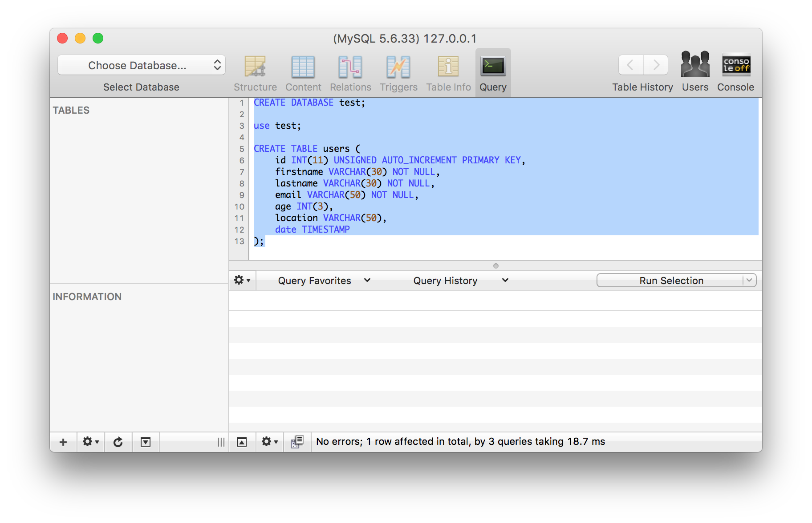

If you did that, you'll see I now have a `test` database, a `users` table, and all the database structure.

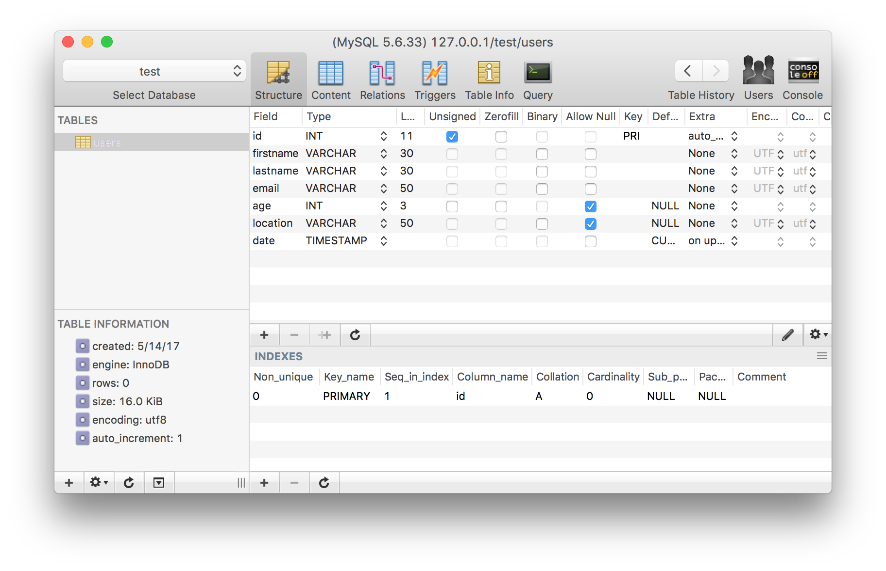

So we know our SQL works properly and has no errors. If you did that, delete the database because we're going to start over and do it through the script.

### Using PDO to connect to a database

We're going to use [PDO (PHP Data Objects)](http://php.net/manual/en/book.pdo.php) to connect to the database. The other major option is [MySQLi](http://php.net/manual/en/book.mysqli.php). The critical difference between the two is that you can use PDO to connect to any number of databases, and `mysqli` code will only work with MySQL. Although we're using a MySQL database, PDO is more extendable in the future, and generally the preferred choice for new projects. So let's create that connection.

Create a file called **install.php** in the root of your directory.

We'll create a new `PDO()` object and place it into a variable named `$connection`.

<div class="filename">install.php</div>

```php
$connection = new PDO();
```

The PDO object will ask for four parameters:

- [DSN (data source name)](http://php.net/manual/en/ref.pdo-mysql.connection.php), which includes type of database, host name, database name (optional)
- Username to connect to host
- Password to connect to host
- Additional options

install.php

```php
$connection = new PDO(data source name, username, password, options);
```

Here's how that ends up looking after we fill in all the parameters.

<div class="filename">install.php</div>

```php
new PDO("mysql:host=localhost", "root", "root",
  array(
      PDO::ATTR_ERRMODE => PDO::ERRMODE_EXCEPTION
  );
);
```

Now we're going to organize it a bit more by putting all our database information into variables.

<div class="filename">install.php</div>

```php
$connection = new PDO("mysql:host=$host", $username, $password, $options);
```

We'll create a **config.php** file that contains all the variables we can refer from.

<div class="filename">config.php</div>

```php
<?php

/**
  * Configuration for database connection
  *
  */

$host       = "localhost";
$username   = "root";
$password   = "root";
$dbname     = "test"; // will use later
$dsn        = "mysql:host=$host;dbname=$dbname"; // will use later
$options    = array(
                PDO::ATTR_ERRMODE => PDO::ERRMODE_EXCEPTION
              );
```

Here's what we have in our installer so far. We're pulling in the database variables via **config.php** using `require`, which is similar to an `include`, except we're explicitly stating that the file is necessary for the script to run.

<div class="filename">install.php</div>

```php
require "config.php";

$connection = new PDO("mysql:host=$host", $username, $password, $options);
```

Now it's time to put that SQL code we created earlier to use. We'll be placing the contents of the **data/init.sql** file into a variable using the `file_get_contents()` function, and executing it with the `exec()` function.

```php
$sql = file_get_contents("data/init.sql");
$connection->exec($sql);
```

At this point, we're going to want to use [Exceptions](http://php.net/manual/en/language.exceptions.php) to attempt to run the script and catch errors. We'll do this by putting all our code in a `try/catch` block, which looks like this:

```php
try {
// code to execute
} catch() {
// exception
}
```

Let's put our database code in the `try` block, and show our `PDOException` error message if something goes wrong trying to set up the database. Here's the final code for the installer.

<div class="filename">install.php</div>

```php
<?php

/**
  * Open a connection via PDO to create a
  * new database and table with structure.
  *
  */

require "config.php";

try {
  $connection = new PDO("mysql:host=$host", $username, $password, $options);
  $sql = file_get_contents("data/init.sql");
  $connection->exec($sql);

  echo "Database and table users created successfully.";
} catch(PDOException $error) {
  echo $sql . "<br>" . $error->getMessage();
}
```

To run the install, just navigate to your **install.php** file on the front end.

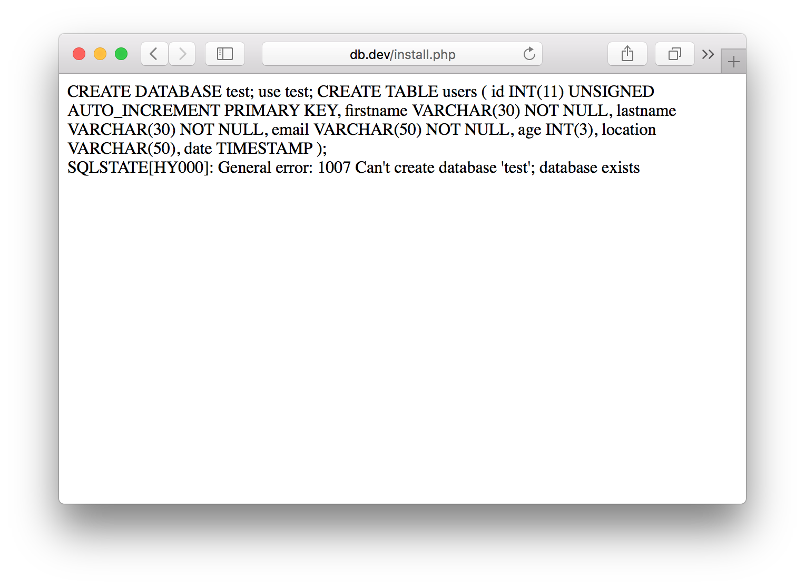

If you didn't delete your database from our test before, you might get this error, in which case you'll need to delete the database for the installer to run.

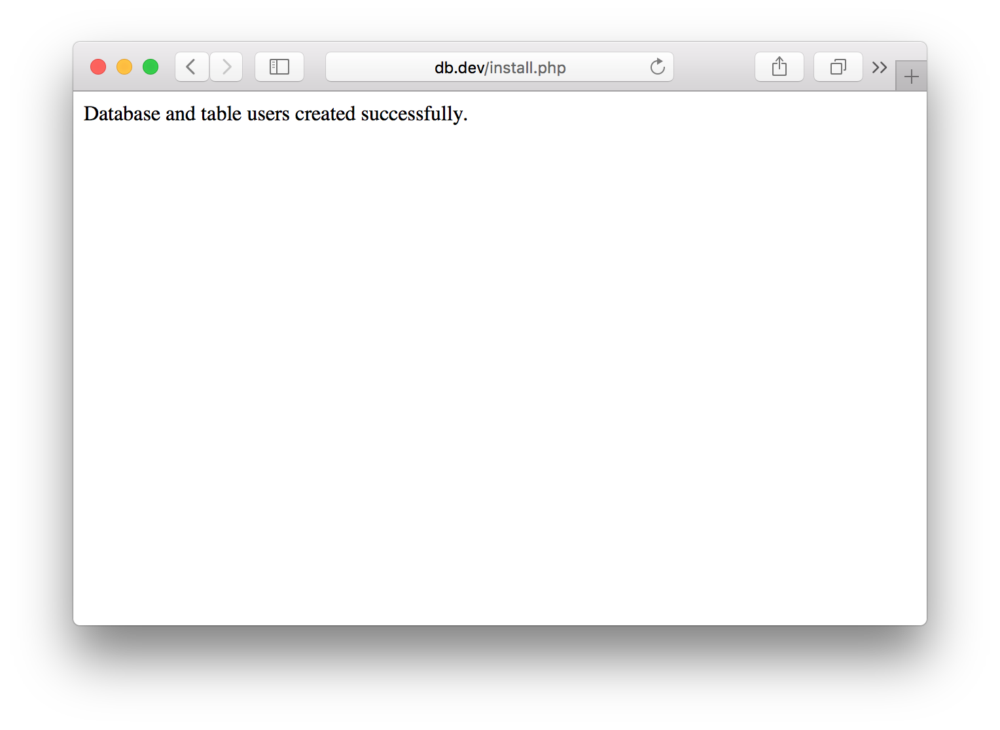

Congratulations, you just made an installer script to set up a new database and table with structure!

## Step 3: Adding a new user

Now, we're finally going to write some code to make those forms do something.

In PHP, when you submit a form, all the inputs are placed into a `$_POST` array. So my `<input type="text" name="firstname">` will translate to `$_POST['firstname']` for us to work with.

We're going to go back to the `public/create.php` file. Right now, it's just a form with a header and footer being pulled in. The new code we write will be added to the top of the file.

First, we're going to tell this code only to run if the form has been submitted.

```php
if (isset($_POST['submit'])) {}
```

Just like with the installer, we're going to `require` our configuration file, and use a `try/catch` Exception to connect to the database.

If you'll notice, in the **install.php** script I was only connecting to `mysql:host=$host` in the first parameter (DSN). I didn't specify a database name, because we were creating the database in the file. Now that the database (named `test`) is created, I'm adding that to the first parameter. `$dsn` is set to `mysql:host=$host;dbname=$dbname`.

```php
if (isset($_POST['submit'])) {
  require "../config.php";

  try {
    $connection = new PDO($dsn, $username, $password, $options);
    // insert new user code will go here

  } catch(PDOException $error) {
    echo $sql . "<br>" . $error->getMessage();
  }

}
```

Let's create an array with all our submitted form values.

```php
$new_user = array(
  "firstname" => $_POST['firstname'],
  "lastname"  => $_POST['lastname'],
  "email"     => $_POST['email'],
  "age"       => $_POST['age'],
  "location"  => $_POST['location']
);
```

> We can use regular `$_POST` variables without further sanitization here because we're submitting to the database with [prepared statements](http://php.net/manual/en/mysqli.quickstart.prepared-statements.php).

Now, the SQL code we're going to want to execute will look like this: `INSERT INTO tablename (n) values (:n)`. In our specific case, it will be the below code.

```sql
INSERT INTO users (firstname, lastname, email, age, location) values (:firstname, :lastname, :email, :age, :location)
```

We could write out that code by hand and add each value every time we add one, but then we're updating things in three places and it becomes a pain. I learned a handy snippet of code from [JeffreyWay](https://github.com/JeffreyWay) of [Laracasts](https://laracasts.com/) to simplify that process.

We're going to use `sprintf`, which allows us to do the following: `INSERT INTO x (y) values (:z)`.

```php
$sql = sprintf(
    "INSERT INTO %s (%s) values (%s)",
    "users",
    implode(", ", array_keys($new_user)),
    ":" . implode(", :", array_keys($new_user))
);
```

That code will print out the exact same thing, without having to write it multiple times. Now we'll just prepare and execute the code.

```php
$statement = $connection->prepare($sql);
$statement->execute($new_user);
```

Here is the full code inside our `try` block.

```php
$connection = new PDO($dsn, $username, $password, $options);

$new_user = array(
  "firstname" => $_POST['firstname'],
  "lastname"  => $_POST['lastname'],
  "email"     => $_POST['email'],
  "age"       => $_POST['age'],
  "location"  => $_POST['location']
);

$sql = sprintf(
    "INSERT INTO %s (%s) values (%s)",
    "users",
    implode(", ", array_keys($new_user)),
    ":" . implode(", :", array_keys($new_user))
);

$statement = $connection->prepare($sql);
$statement->execute($new_user);
```

Now the form is all ready to send. I'm going to fill out my information and submit it.

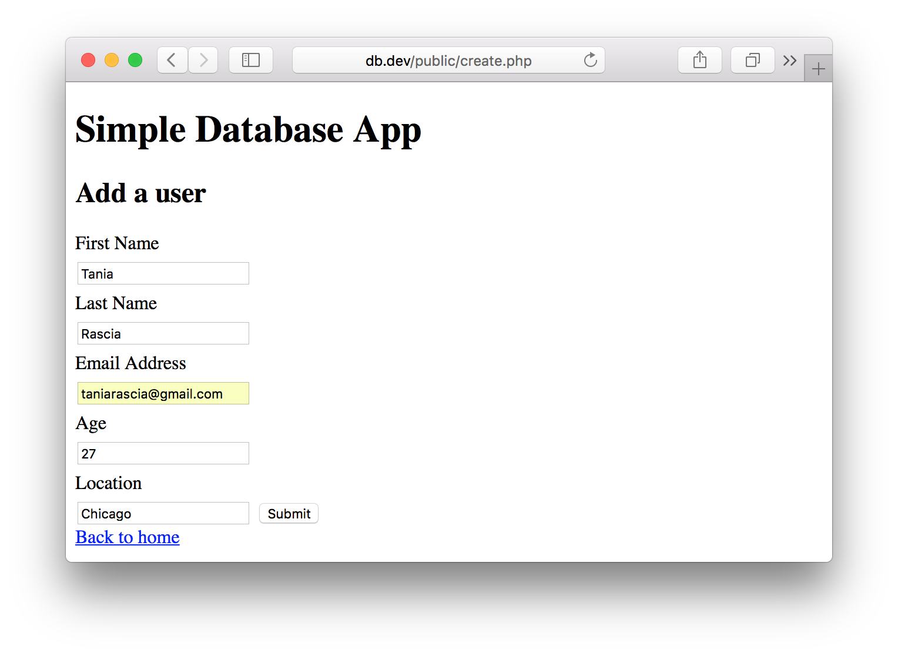

Going into my MySQL, if all went well, I can now view my entry in the database!

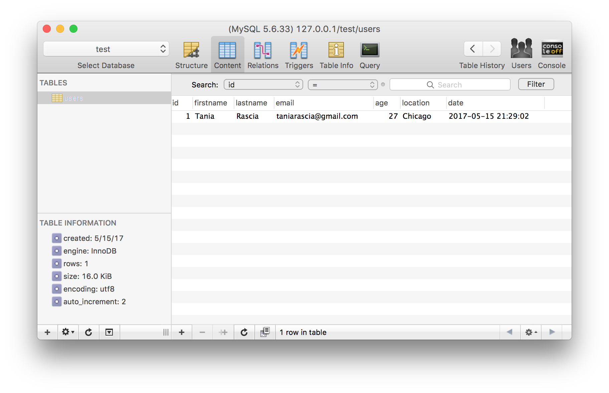

Excellent! There's just one more thing I want to do. Right now, after submitting the form, there's nothing letting me know that the user was submitted successfully.

### Escaping HTML

Since in this case we're going to print out a `$_POST` variable to the HTML, we need to properly [convert the HTML characters](http://php.net/manual/en/function.htmlspecialchars.php), which will aid in preventing XSS attacks.

Let's create a new file called **common.php** in the root of your project. Inspiration for this function and filename came from [Jon's PHP blog tutorial](https://ilovephp.jondh.me.uk/en/tutorial/make-your-own-blog). This is a file that can be used to store functions for later use. I'm only going to use it for one function today - an HTML escaping function.

<div class="filename">common.php</div>

```php
<?php

/**
  * Escapes HTML for output
  *
  */

function escape($html) {
  return htmlspecialchars($html, ENT_QUOTES | ENT_SUBSTITUTE, "UTF-8");
}
```

With this function, we can wrap any variable in the `escape()` function, and the HTML entities will be protected.

Back in **public/create.php**, add a `require "common.php";`. Now I'm just going to add this `if` statement below my header and above the "Add a user" title. It will check to see if a `$_POST` was submitted, and if a `$statement` was successful. If so, it will print a success message that includes the first name of the successfully added user.

```php
<?php if (isset($_POST['submit']) && $statement) { ?>
  <?php echo escape($_POST['firstname']); ?> successfully added.
<?php } ?>
```

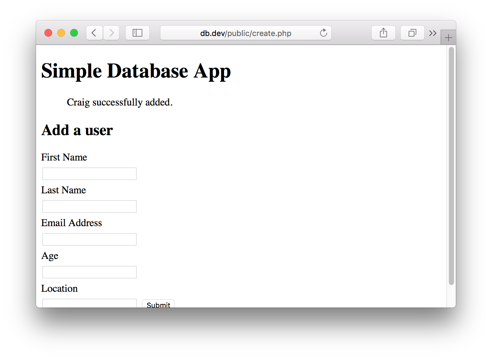

And that's everything! Here's the final code to add a new user.

<div class="filename">public/create.php</div>

```php
<?php

/**
  * Use an HTML form to create a new entry in the
  * users table.
  *
  */


if (isset($_POST['submit'])) {
  require "../config.php";
  require "../common.php";

  try {
    $connection = new PDO($dsn, $username, $password, $options);

    $new_user = array(
      "firstname" => $_POST['firstname'],
      "lastname"  => $_POST['lastname'],
      "email"     => $_POST['email'],
      "age"       => $_POST['age'],
      "location"  => $_POST['location']
    );

    $sql = sprintf(
"INSERT INTO %s (%s) values (%s)",
"users",
implode(", ", array_keys($new_user)),
":" . implode(", :", array_keys($new_user))
    );

    $statement = $connection->prepare($sql);
    $statement->execute($new_user);
  } catch(PDOException $error) {
    echo $sql . "<br>" . $error->getMessage();
  }

}
?>

<?php require "templates/header.php"; ?>

<?php if (isset($_POST['submit']) && $statement) { ?>
  > <?php echo $_POST['firstname']; ?> successfully added.
<?php } ?>

<h2>Add a user</h2>

<form method="post">
  <label for="firstname">First Name</label>
  <input type="text" name="firstname" id="firstname">
  <label for="lastname">Last Name</label>
  <input type="text" name="lastname" id="lastname">
  <label for="email">Email Address</label>
  <input type="text" name="email" id="email">
  <label for="age">Age</label>
  <input type="text" name="age" id="age">
  <label for="location">Location</label>
  <input type="text" name="location" id="location">
  <input type="submit" name="submit" value="Submit">
</form>

<a href="index.php">Back to home</a>

<?php require "templates/footer.php"; ?>
```

## Step 4: Viewing and filtering users

Here's the last step - the "read" of our CRUD app. We already created the front end in **public/read.php**.

Really quickly, let's add a small amount of CSS to our **public/css/style.css** file to make the tables legible once we create them.

<div class="filename">public/css/style.css</div>

```css
table {
  border-collapse: collapse;
  border-spacing: 0;
}

td,
th {
  padding: 5px;
  border-bottom: 1px solid #aaa;
}
```

Now we're going to use the same `require`s from our new user page, as well as the `try/catch` block for connecting to the database.

<div class="filename">public/read.php</div>

```php
if (isset($_POST['submit'])) {
  try {
    require "../config.php";
    require "../common.php";

    $connection = new PDO($dsn, $username, $password, $options);
        // fetch data code will go here
  } catch(PDOException $error) {
    echo $sql . "<br>" . $error->getMessage();
  }
}
?>
```

Now we'll write a `SELECT` SQL query. We're going to select all (`*`) from the users table, and filter by location.

```php
$sql = "SELECT *
  FROM users
  WHERE location = :location";
```

Then we'll put our `$_POST` into a varable.

```php
$location = $_POST['location'];
```

Prepare, bind, and execute the statement.

```php
$statement = $connection->prepare($sql);
$statement->bindParam(':location', $location, PDO::PARAM_STR);
$statement->execute();
```

Finally, we'll fetch the result.

```php
$result = $statement->fetchAll();
```

Here's the full `try` connection code.

```php
$connection = new PDO($dsn, $username, $password, $options);

$sql = "SELECT *
FROM users
WHERE location = :location";

$location = $_POST['location'];

$statement = $connection->prepare($sql);
$statement->bindParam(':location', $location, PDO::PARAM_STR);
$statement->execute();

$result = $statement->fetchAll();
```

Great, now we have the whole process to retrieve the filtered data. All that's left is to print out the result.

Outside of the `try/catch` connection block and below the header, I'm going to insert the code for the table.

We'll check - if this is a POST request, and if the result of our query has more than 0 rows, open the table, loop through all the results, and close the table. If there are no results, display a message.

```php
if (isset($_POST['submit'])) {
    	if ($result && $statement->rowCount() > 0) {
    		// open table
    		foreach ($result as $row) {
    			// table contents
    		}
    		// close table
    	} else 	{
    		// no results
    	}
    }
```

Here is the final code.

<div class="filename">public/read.php</div>

```php
<?php

/**
  * Function to query information based on
  * a parameter: in this case, location.
  *
  */

if (isset($_POST['submit'])) {
  try {
    require "../config.php";
    require "../common.php";

    $connection = new PDO($dsn, $username, $password, $options);

    $sql = "SELECT *
    FROM users
    WHERE location = :location";

    $location = $_POST['location'];

    $statement = $connection->prepare($sql);
    $statement->bindParam(':location', $location, PDO::PARAM_STR);
    $statement->execute();

    $result = $statement->fetchAll();
  } catch(PDOException $error) {
    echo $sql . "<br>" . $error->getMessage();
  }
}
?>
<?php require "templates/header.php"; ?>

<?php
if (isset($_POST['submit'])) {
  if ($result && $statement->rowCount() > 0) { ?>
    <h2>Results</h2>

    <table>
      <thead>
<tr>
  <th>#</th>
  <th>First Name</th>
  <th>Last Name</th>
  <th>Email Address</th>
  <th>Age</th>
  <th>Location</th>
  <th>Date</th>
</tr>
      </thead>
      <tbody>
  <?php foreach ($result as $row) { ?>
      <tr>
<td><?php echo escape($row["id"]); ?></td>
<td><?php echo escape($row["firstname"]); ?></td>
<td><?php echo escape($row["lastname"]); ?></td>
<td><?php echo escape($row["email"]); ?></td>
<td><?php echo escape($row["age"]); ?></td>
<td><?php echo escape($row["location"]); ?></td>
<td><?php echo escape($row["date"]); ?> </td>
      </tr>
    <?php } ?>
      </tbody>
  </table>
  <?php } else { ?>
    > No results found for <?php echo escape($_POST['location']); ?>.
  <?php }
} ?>

<h2>Find user based on location</h2>

<form method="post">
  <label for="location">Location</label>
  <input type="text" id="location" name="location">
  <input type="submit" name="submit" value="View Results">
</form>

<a href="index.php">Back to home</a>

<?php require "templates/footer.php"; ?>
```

After adding a few entries, I can play around with it. I input the city.

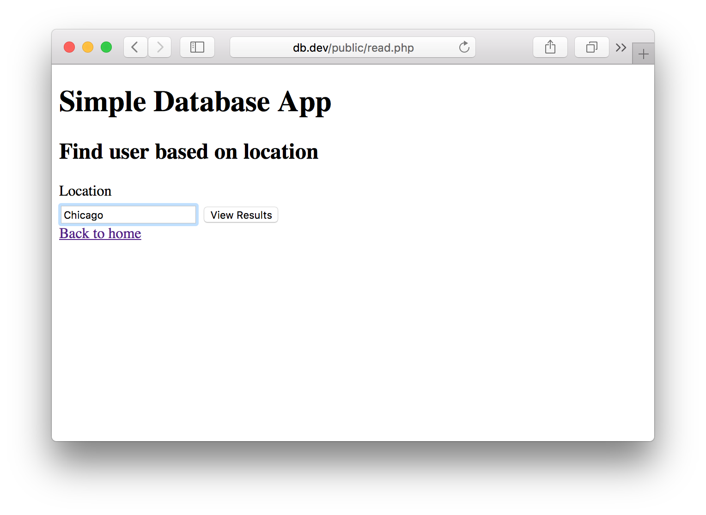

And view the results.

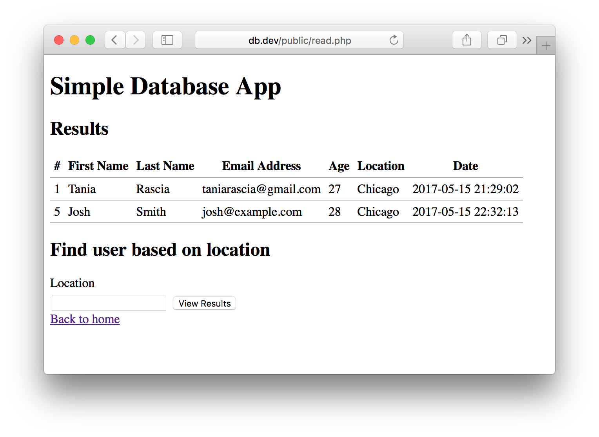

Congratulations, you now have the very beginnings of a simple PHP database app without frameworks.

## Conclusion

Now that you've learned how to create and read entries, check out part two!

[Onto Part 2: Update and Delete](/create-a-simple-crud-database-app-php-update-delete/)

We went over a lot of valuable lessons in this tutorial, including but not limited to: connecting to a MySQL database with PDO, creating an installer script, inserting users into a database, selecting and printing out users from a database, and escaping printed HTML.

If this were a real world app, of course there would be more considerations to make. The backend would have to be password protected, which means you would make a login page and administrative users who are the only ones who have access to the app.

You would also add JavaScript validation to the front end of the site to ensure all required fields were being filled in, and using the correct type of characters for the input. (Although JavaScript validation is important, the most important part is that the back end that is receiving your data is protected).

Again, all the code from this article is available [on GitHub](https://github.com/taniarascia/pdo/tree/feba19a43e63c617c95a1f6e68825f6e3086336c) if you got lost anywhere along the way. If you have suggestions on how to make the tutorial more clear or more secure, please don't hesitate to share! However, take into account this is meant to be a first look at the underlying code of database management, and not a full-fledged app.

- [View on GitHub](https://github.com/taniarascia/pdo/tree/feba19a43e63c617c95a1f6e68825f6e3086336c)
