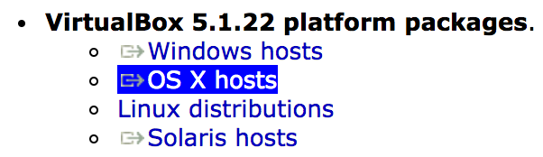
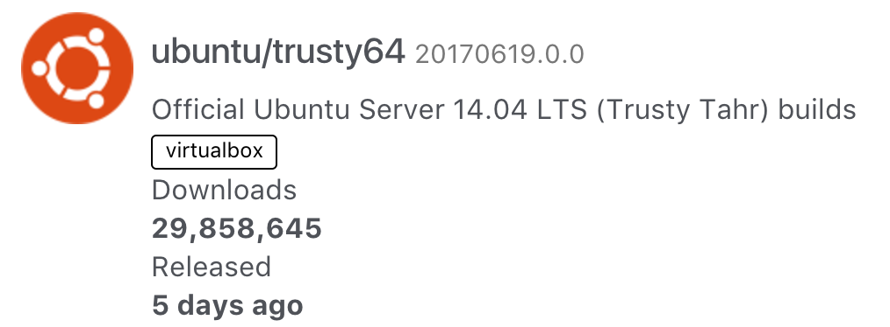
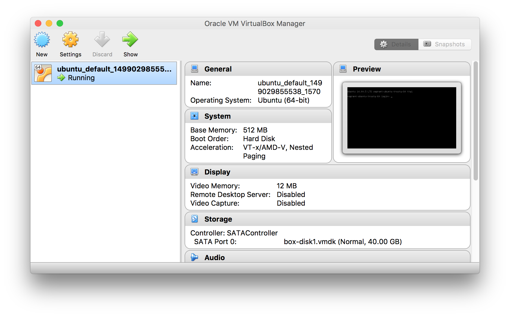

I've gotten to the point in my web development career where I can no longer avoid the words [VirtualBox](https://www.virtualbox.org/), [Vagrant](https://www.vagrantup.com/), and [Docker](https://www.docker.com/). Thanks to my friend Timm Stelzer, I finally got over my fear of the unknown and delved into the world of virtual machines via Vagrant and VirtualBox.

Now that I've finally used them, I can see how fun and useful they are, and since I've just set everything up myself in 2017 with the most up-to-date installations I could find, I can share what I've learned with you.

#### Prerequisites

The only prerequisite to this article is **command line knowledge**, and it is mandatory. This article that I wrote, [How to Use the Command Line](/how-to-use-the-command-line-for-apple-macos-and-linux/), will tell you everything you need to know, from moving around directories, creating files, and `ssh`ing into servers. If you're not familiar with any of that, please read the aforementioned article.

#### Goals

In this tutorial, we will learn:

- What VirtualBox is
- What Vagrant is
- How to use Vagrant and VirtualBox in tandem to set up a local Ubuntu installation
- How to connect to the Ubuntu server we create

## Introduction

**VirtualBox** is basically inception for your computer. You can use VirtualBox to run entire sandboxed operating systems within your own computer.

**Vagrant** is software that is used to manage a development environment. Through the command line, you can grab any available OS, install it, configure it, run it, work inside of it, shut it down, and more.

Using VirtualBox and Vagrant, you can simulate the production environment of your app or website. For example, if you're using Digital Ocean or AWS to run a Virtual Private Server (VPS) in the cloud running Ubuntu, PHP, and MySQL, you can install your local version to have all the same versions of that software, while keeping your own computer's software untouched. This can reduce and eliminate bugs and errors that result from trying to develop code for a production server on an environment that does not match.

In this tutorial, we're going to install Vagrant and VirtualBox, and install [Ubuntu](http://www.makeuseof.com/tag/ubuntu-an-absolute-beginners-guide/) Server. We're going to connect to the Ubuntu server though `ssh` to confirm that everything is running properly.

After this tutorial, learn to [install a LAMP server](/how-to-install-apache-php-7-1-and-mysql-on-ubuntu-with-vagrant/) on the environment we create.

## Step 1 - Install Virtual Box and Vagrant

### Install VirtualBox

Go to the [VirtualBox download page](https://www.virtualbox.org/wiki/Downloads), choose your operating system (Windows or macOS) and download and install the software.

I clicked OS X and the download started.



### Install Vagrant

Go to the [Vagrant download page](https://www.vagrantup.com/downloads.html), choose your operating system (Windows or macOS) and download and install the software.

Again, I chose Mac OS X.


## Step 2 - Install Ubuntu Server with Vagrant

Create a directory for your virtual host to live. I created a **VirtualMachines** directory (which will potentially contain all of my virtual machine installations), and made a new directory within called **ubuntu** for this specific installation to live. The whole path is as follows:

```bash
/Users/taniarascia/dev/virtualmachines/ubuntu
```

Your path will be slightly different for Windows, using `C:/`, but otherwise will be the same idea.

### Install Ubuntu Box

You can [Discover Vagrant Boxes](https://app.vagrantup.com/boxes/search) via the Vagrant Cloud. `ubuntu/trusty64` is the most popular box (machine), with nearly 30 million installs and updated within the last day. This is the one we'll be using.



In **Terminal** (Mac) or **Git Bash** (or whatever shell you're using on Windows), type the following to install Ubuntu Server 14.04.

```bash
vagrant box add ubuntu/trusty64
```

After a few moments, this will be the output to let you know it's successful.

```terminal
==> box: Loading metadata for box 'ubuntu/trusty64'
    box: URL: https://vagrantcloud.com/ubuntu/trusty64
==> box: Adding box 'ubuntu/trusty64' (v20170619.0.0) for provider: virtualbox
    box: Downloading: https://app.vagrantup.com/ubuntu/boxes/trusty64/versions/20170619.0.0/providers/virtualbox.box<div style="color:green;">==> box: Successfully added box 'ubuntu/trusty64' (v20170619.0.0) for 'virtualbox'!
```

Now initialize the new `vagrant` in your **VirtualMachines/ubuntu** directory with the `init` command.

```bash
vagrant init ubuntu/trusty64
```

```terminal
`Vagrantfile` has been placed in this directory. You are now
ready to `vagrant up` your first virtual environment! Please read
the comments in the Vagrantfile as well as documentation on
`vagrantup.com` for more information on using Vagrant.
```

Finally, get Ubuntu up and running with the `vagrant up` command.

```bash
vagrant up
```

```terminal
Bringing machine 'default' up with 'virtualbox' provider...
==> default: Importing base box 'ubuntu/trusty64'...

...

==> default: Machine booted and ready!
```

When you see "Machine booted and ready!", everything is good to go!

### Fixing Guest Additions Error

This is great, and all set up. However, you may have gotten this error:

```terminal
==> default: Checking for guest additions in VM...
    default: The guest additions on this VM do not match the installed version of
    default: VirtualBox! In most cases this is fine, but in rare cases it can
    default: prevent things such as shared folders from working properly. If you see
    default: shared folder errors, please make sure the guest additions within the
    default: virtual machine match the version of VirtualBox you have installed on
    default: your host and reload your VM.
```

This might not be a problem, but let's make sure it doesn't become a problem. First, use the `halt` method to shut down your currently running Vagrant.

```bash
vagrant halt
```

Let's quickly install a plugin called `vbguest` to fix this error.

```bash
vagrant plugin install vagrant-vbguest
```

It will run through some more commands, and most likely the above error will still persist. Let's reload the Vagrant machine with the `reload` command.

```bash
vagrant reload
```

Now the errors will be gone.

```terminal
[default] GuestAdditions 5.1.22 running --- OK.
```

### What about VirtualBox?

Looks like we didn't use VirtualBox for anything at all. But go ahead and open up the VirtualBox application. This is what you will see running:



As you can see, VirtualBox is letting us know that Ubuntu is running properly. We don't really need to know much more about it at this point.

## Step 3 - SSH into Ubuntu

Now we have this Ubuntu operating system set up on our computer, but how do we access it? Just like you would access any remote Linux server through the command line, you will do the same with Vagrant. Run `vagrant ssh` to securely enter the Ubuntu virtual machine.

```bash
vagrant ssh
```

When you login, you will see something along these lines.

```terminal
Welcome to Ubuntu 14.04.5 LTS (GNU/Linux 3.13.0-123-generic x86_64)

  * Documentation:  https://help.ubuntu.com/

  System information as of Sun Jul  2 UTC 2017

  System load:  0.15              Processes:           84
  Usage of /:   3.6% of 39.34GB   Users logged in:     0
  Memory usage: 24%               IP address for eth0: 10.0.2.15
  Swap usage:   0%

  Graph this data and manage this system at:
    https://landscape.canonical.com/

  Get cloud support with Ubuntu Advantage Cloud Guest:
    http://www.ubuntu.com/business/services/cloud

New release '16.04.2 LTS' available.
Run 'do-release-upgrade' to upgrade to it.

vagrant@vagrant-ubuntu-trusty-64:~$
```

You're in! You now have a complete Ubuntu Server installation running through VirtualBox on your computer, and you're connected to it. Type `exit` at any time to exit out of the server, and `vagrant halt` to shut it down.

## Conclusion

Here is a review of the commands we used with Vagrant today.

| Command                   | Purpose                      |
| ------------------------- | ---------------------------- |
| vagrant box add ORG/BUILD | Add a new virtual machine    |
| vagrant init ORG/BUILD    | Initialize virtual machine   |
| vagrant up                | Start up virtual machine     |
| vagrant reload            | Restart virtual machine      |
| vagrant halt              | Shut down virtual machine    |
| vagrant ssh               | SSH into the virtual machine |

> **Note:** All these commands must be done locally from the directory in which you want the virtual machine to be installed, except `vagrant box add`.

As a review, VirtualBox is the software that runs the operating system, and vagrant will give you the methods to manage them. You can also think of vagrant as a package manager that has a repository of different operating systems to use.

Vagrant and VirtualBox can be used to create a local environment that matches the production environment of your server.

Move on to Part 2: [Setting up LAMP (Linux, Apache, MySQL, and PHP)](/how-to-install-apache-php-7-1-and-mysql-on-ubuntu-with-vagrant/) from the Ubuntu Server environment we created, and how to access it from your local computer.
