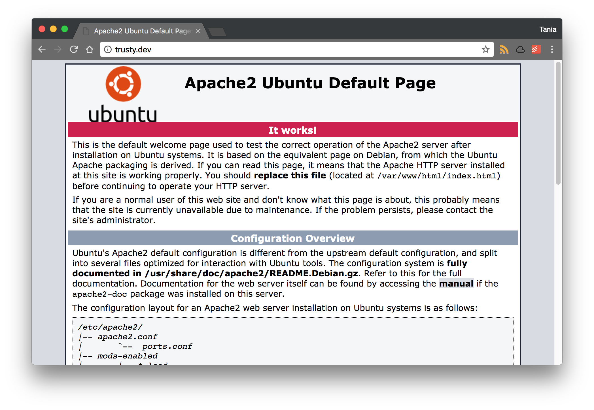
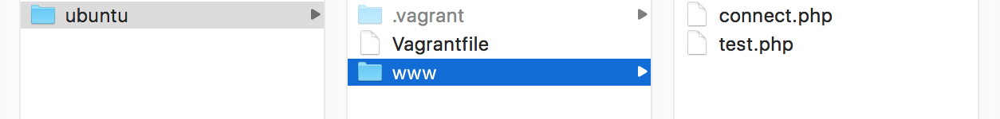
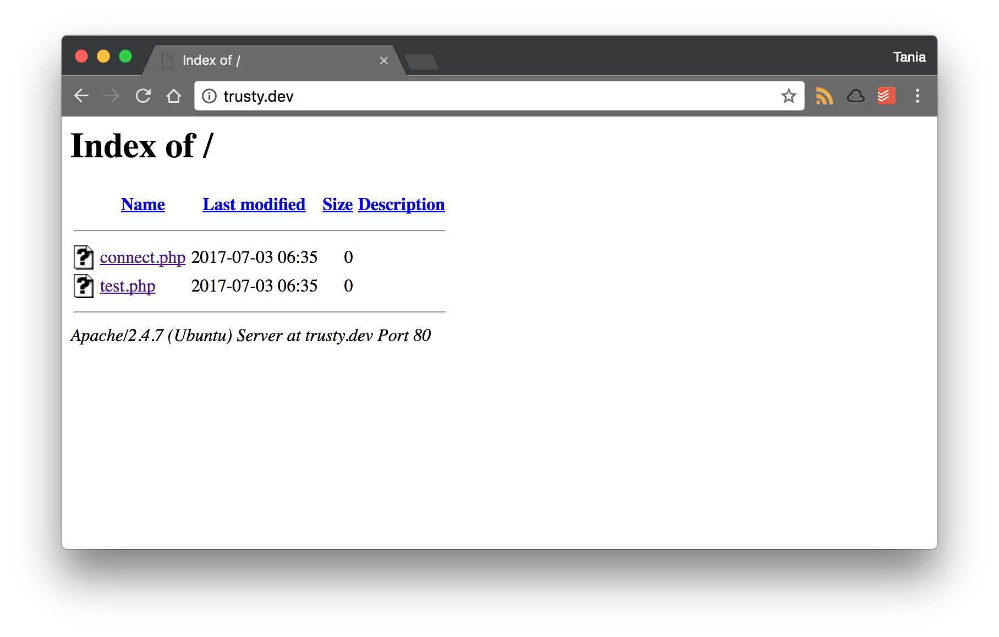
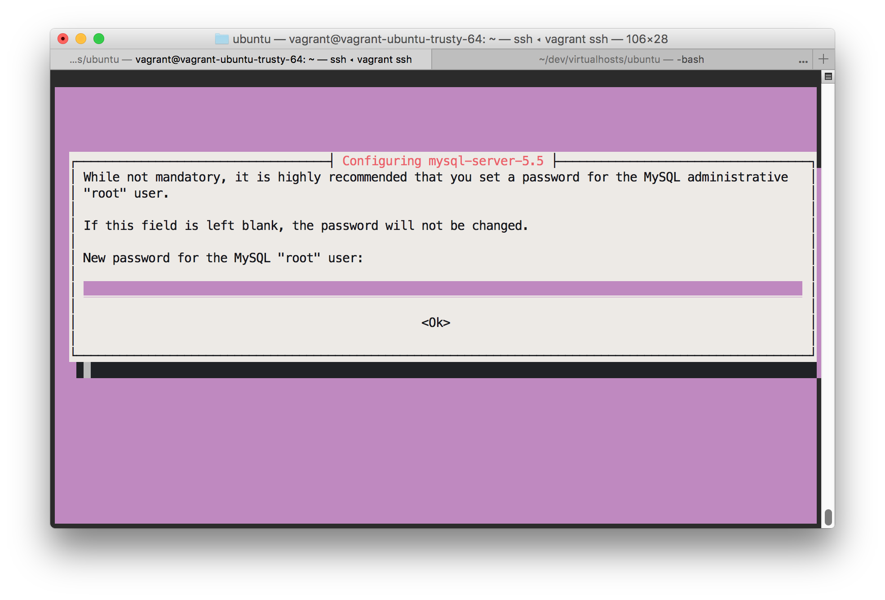
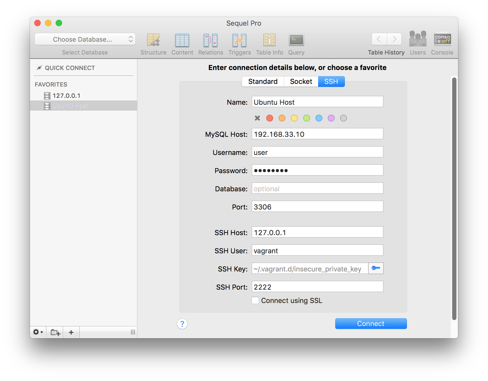
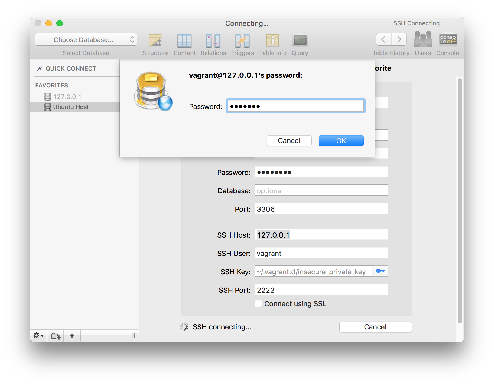
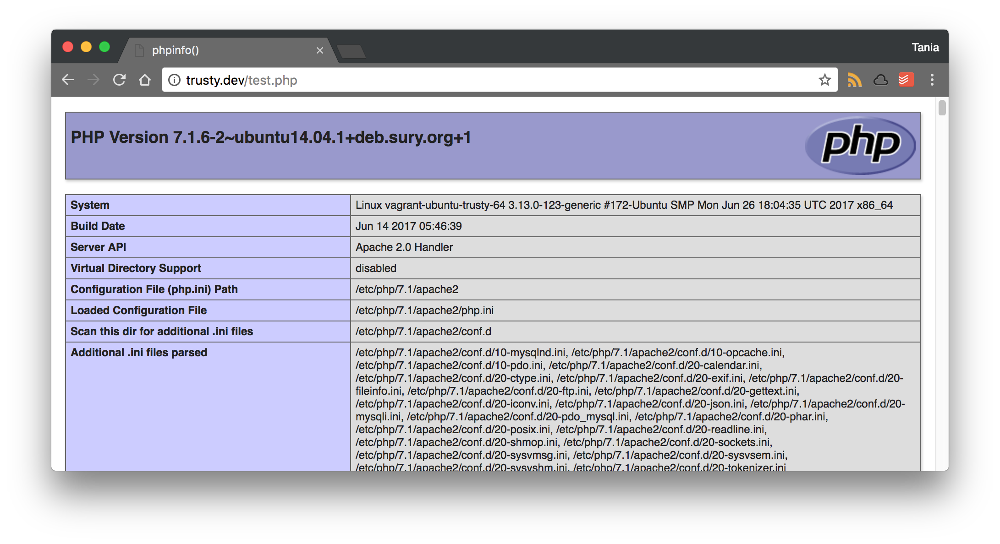
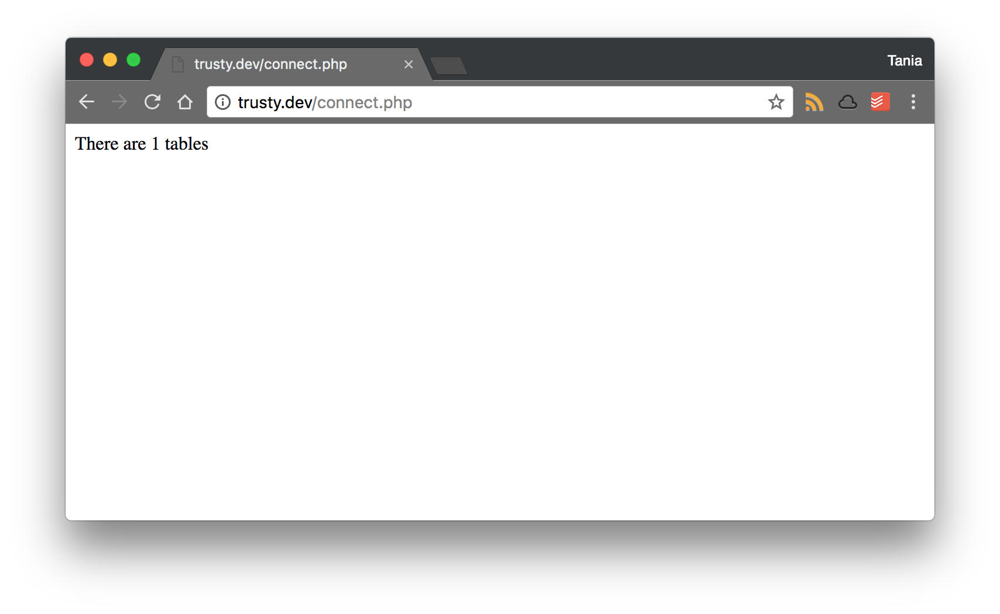

In order to run a server locally, we need to set up an environment for the stack, or server, database, and language, to run in. An easy way for beginners to do that is to set up [MAMP](/local-environment/) on Mac or Windows, which sets up the environment for you.

As you become a more advanced developer, you might need to create a local environment that matches your production server more closely. If you're working locally on Windows or Mac, and your server is on a Linux distribution, you may encounter bugs and errors that are specific to the operating system the server is running and you won't be able to troubleshoot them properly.

Fortunately, we have tools like [Vagrant and VirtualBox](/what-are-vagrant-and-virtualbox-and-how-do-i-use-them/) that allow us to set up a virtual machine locally that can match the production environment. In this tutorial, we'll take an Ubuntu Server operating system that has been set up on Vagrant and install a LAMP stack on it.

#### Prerequisites

There are two prerequisites to complete before reading this tutorial.

- **Knowledge of the command line.** Please read [How to Use the Command Line](/how-to-use-the-command-line-for-apple-macos-and-linux/) to get yourself acquainted if you're not already familiar.
- **A Vagrant/VirtualBox setup with an Ubuntu virtual machine.** You will find instructions on how to do that in this guide to [setting up VirtualBox and Vagrant with Ubuntu Server](/what-are-vagrant-and-virtualbox-and-how-do-i-use-them/).

#### Goals

In this tutorial, we're going to accomplish the following:

- Install LAMP (Apache, PHP 7.1, MySQL) on an Ubuntu Server 14.04 virtual machine
- View the server in a browser via IP address and custom domain name
- Link your local files with the virtual machine to be able to develop on the Vagrant environment from your local computer
- Connect to MySQL via [SequelPro](https://www.sequelpro.com/) (or any database program)

## Step 1 - Install Apache

> The examples in this article use the `.dev` suffix for custom domains. This suffix is no longer allowed. You can use `.test` in place of `.dev` throughout this article.

We're beginning this article where [the last one](/what-are-vagrant-and-virtualbox-and-how-do-i-use-them/) left off - with a brand new Ubuntu virtual machine set up. Navigate to the directory you have your Ubuntu set up in, and `ssh` into the machine.

```bash
vagrant ssh
```

[`apt-get`](https://www.computerhope.com/unix/apt-get.htm) is command line software for installing packages on Ubuntu. Let's run the commands to `update` and `upgrade` the package manager and make sure everything is up to date.

```bash
sudo apt-get update && sudo apt-get upgrade
```

Now we're going to install the latest version of Apache, which is 2.4.7 at the time of this writing.

```bash
sudo apt-get install apache2 -y
```

After installing it you'll get this warning.

```terminal
AH00558: apache2: Could not reliably determine the server's
fully qualified domain name, using 10.0.2.15. Set the 'ServerName'
directive globally to suppress this message
```

Easily fixed. We're just going to set the `ServerName` to `localhost`. Use `nano` (or `vi`, or whatever you feel comfortable with) to edit the apache2 configuration file.

```bash
sudo nano /etc/apache2/apache2.conf
```

> If you're not familiar with `nano`, or editing files through the Terminal, please review the [command line](/how-to-use-the-command-line-for-apple-macos-and-linux/) article.

Navigate all the way to the end of the file, and insert this line at the bottom.

```bash
ServerName localhost
```

Save and close `nano` (cntl + o, cntl + x), then restart Apache to apply the changes.

```bash
sudo service apache2 restart
```

```terminal
* Restarting web server apache2  [ OK ]
```

You can check to make sure the `ServerName` is correct with the following command.

```bash
sudo apache2ctl configtest
```

```terminal
Syntax OK
```

I always like to check the version number to see exactly what I'm running.

```bash
apache2 -v
```

```terminal
Server version: Apache/2.4.7 (Ubuntu)
Server built:   Jun 26 2017
```

Great, Apache is up and running properly! But now we want confirmation of this.

## Step 2 - Map a local domain to the IP and view the server

Now, usually when you set up a production server, you can navigate to the IP address or domain name of the server in your browser and see either the "New Linux installation" page, or your website, if you've already added it. We're going to do the same thing right now, except instead of connecting to a public facing server, we're connecting to our own local virtual machine.

I'm running my virtual machine in the following directory.

```bash
/Users/taniarascia/Dev/VirtualMachines/ubuntu
```

Within this directory, you'll see two files - **.vagrant**, and **Vagrantfile**. Open your **Vagrantfile**, as this is the local configuration file we'll need to edit to make any changes.

Find the "private_network" configuration line, which should look like this.

```bash
# config.vm.network "private_network", ip: "192.168.33.10"
```

And uncomment it.

```bash
config.vm.network "private_network", ip: "192.168.33.10"
```

Reboot Ubuntu to make sure the **Vagrantfile** changes take effect. Run the `reload` command from back in your local computer's terminal.

```bash
vagrant reload
```

We're going to make a custom domain to access this address and view it in our browser. Still in your local computer, edit your local **hosts** file.

```bash
sudo nano /etc/hosts
```

Add a new domain to the bottom with the IP address we were given. I'm calling it **trusty.dev**.

```bash
192.168.33.10  trusty.dev
```

Save and exit `nano`. Now in Google Chrome or whatever browser you're using, go to **trusty.dev**. Now you should see the default Linux success page. **It works!**



You can also navigate to **192.168.33.10** in the browser now, and it will work as well.

## Step 3 - Install PHP 7.1

At this point, we're going to install PHP 7.1. Since 7.1 is new and cutting edge, it is not available in the regular `apt` repository. We're going to use a PPA (Personal Package Archive) to install this non-standard software.

Add the [Onrej](https://launchpad.net/~ondrej/+archive/ubuntu/php) PPA to your machine.

```bash
sudo apt-add-repository ppa:ondrej/php
```

Update `apt-get` with the software from the new repository.

```bash
sudo apt-get update
```

Now you will be able to install PHP 7.1.

```bash
sudo apt-get install php7.1
```

Confirm successful installation of PHP by checking the version.

```bash
php -v
```

```terminal
PHP 7.1.6-2~ubuntu14.04.1+deb.sury.org+1 (cli) (built: Jun 14 2017) ( NTS )
Copyright (c) 1997-2017 The PHP Group
Zend Engine v3.1.0, Copyright (c) 1998-2017 Zend Technologies
with Zend OPcache v7.1.6-2~ubuntu14.04.1+deb.sury.org+1, Copyright (c) 1999-2017, by Zend Technologies
```

## Step 4 - Link a local folder with the virtual machine

Okay, using `nano` or `vi` to edit files is going to start getting tedious. I want to be able to edit the files within the virtual machine from within the comfort of my own computer's environment (currently using [Visual Studio Code](https://code.visualstudio.com/) as a text editor).

In order to do this, we're going to need to link a folder on our local computer to one on the virtual machine.

Right now, the Ubuntu default page exists on **/var/www/html**, the public facing folder on an Apache server. Back in our local (Windows or Mac) computer, let's create a **www** folder in the root directory, and create two files: **connect.php** and **test.php**, which we'll use to test MySQL and PHP in a moment.

Here is how our local directory structure should be set up:



Let's go back to our **Vagrantfile**. We're going to set up a `synced folder`, first inputting our local path, then inputting our virtual machine's path.

```ruby
config.vm.synced_folder "LOCAL", "VIRTUAL"
```

We'll set the **www** folder we just made as the local folder, and the public server directory for Ubuntu.

```ruby
config.vm.synced_folder "www/", "/var/www/html"
```

Now `vagrant reload`, or `vagrant halt` and `vagrant up` to restart Ubuntu. Now when you go to your server you should see this.



Success! Your local folder has now synced with the Ubuntu server, and every change you make there will be reflected in the server.

## Step 5 - Install MySQL

Finally, we're going to install MySQL for database access.

### Installation within Ubuntu

```bash
sudo apt-get install mysql-server php7.1-mysql
```

You can also set up the mysql secure installation. Follow the instructions on the page. Since we're doing a local environment, it doesn't need to be as secure as a production environment. You can leave the ports open for us to access later.

```bash
sudo mysql_secure_installation
```



As far as I can tell, that's a lie. When it came to this point, I just put "root" as the password.

I found some good directions on configuring MySQL with Vagrant [here](https://www.barrykooij.com/connect-mysql-vagrant-machine/). Edit your MySQL configuration file.

```bash
sudo nano /etc/mysql/my.cnf
```

Find `skip-external-locking` and `bind-address` and comment them out.

```bash
# skip-external-locking
# bind-address 0.0.0.0
```

Once that's all done, I restart Apache and MySQL.

```bash
sudo service apache2 restart
```

```bash
sudo service mysql restart
```

At this point, you should be able to login to MySQL with root, using password root.

```bash
mysql -u root -p
```

I found the easiest way to setup MySQL to allow entry via SequelPro or another 3rd party is to set up a new user. I encountered issues connecting with root, [and found some solutions](https://stackoverflow.com/questions/1559955/host-xxx-xx-xxx-xxx-is-not-allowed-to-connect-to-this-mysql-server) on Stack Overflow.

While inside the command line `mysql`, create a new user and password. I literally used "user" and "password" for those fields.

```sql
CREATE USER 'user'@'%' IDENTIFIED BY 'password';
```

Granted all privileges to the new user.

```sql
GRANT ALL PRIVILEGES ON *.* TO 'user'@'%' WITH GRANT OPTION;
```

And flushed privileges.

```sql
FLUSH PRIVILEGES;
```

Now to restart Apache and MySQL once again.

```bash
sudo service apache2 restart
```

```bash
sudo service mysql restart
```

### Local setup to access MySQL

Everything should be set from the Ubuntu side for MySQL setup. We're going to need to do a few things to connect to MySQL via SequelPro now.

First, edit the **VagrantFile** and add this line to recognize the MySQL port, 3306.

```bash
config.vm.network "forwarded_port", guest: 3306, host: 3306
```

You'll need to restart Vagrant for this to take effect.

```bash
vagrant reload
```

Now open up SequelPro, or your database program ([SQLYog for Windows](https://github.com/webyog/sqlyog-community/wiki/Downloads)) to connect.

We'll need to use the **SSH** tab of the connection. There are two connections we'll need to make - MySQL and SSH.

For MySQL, the credentials will be:

- **Host:** 192.168.33.10
- **Username:** user
- **Password:** password
- **Port:** 3306

For SSH, they will be:

- **Host:** 127.0.0.1
- **User:** vagrant
- **Key:** ~/.vagrant.d/insecure_private_key
- **Port:** 2222

> In your home folder, there will be a hidden directory called `.vagrant.d`. Inside is a file called `insecure_private_key`, which is the key the `vagrant ssh` command uses to connect.

Running `vagrant ssh` is the same as running the following:

```bash
ssh -i ~/.vagrant.d/insecure_private_key vagrant@192.168.33.10
```

Inputting all the following credentials, we will be prompted for a password.



The password is "vagrant"



**Update 3/5/2018**: This key may not work in newer versions of Ubuntu. Instead, you will run `vagrant ssh-config` from your local computer, and follow the file path for IdentityFile. Mine was **/Users/my_path/ubuntu/.vagrant/machines/default/virtualbox/private_key**. Use this instead of **~/.vagrant.d/insecure_private_key**.

Now if everything went well, we'll be in! If you had any issues up to this point, please let me know and I'll see if I can make it more clear.

Since I'm in, I'm just going to create a database called `test` and a table called `table1` so I can test MySQL via PHP.

## Step 6 - Testing PHP and MySQL

Using the **connect.php** and **test.php** files we made in **/var/www/html** before, let's test PHP and MySQL from the browser.

In **test.php**, we'll use the `phpinfo()` function to test PHP.

```php
<?php phpinfo();
```



In **connect.php**, I used a quick [MySQL test script](https://gist.github.com/M165437/421cd2d23e53a111541a483971f7368b) to make sure everything is connecting.

```php

<?php

$dbname = 'test';
$dbuser = 'user';
$dbpass = 'password';
$dbhost = '192.168.33.10';

$link = mysqli_connect($dbhost, $dbuser, $dbpass) or die("Unable to Connect to '$dbhost'");
mysqli_select_db($link, $dbname) or die("Could not open the db '$dbname'");

$test_query = "SHOW TABLES FROM $dbname";
$result = mysqli_query($link, $test_query);
$tblCnt = 0;

while($tbl = mysqli_fetch_array($result)) {
  $tblCnt++;
}

if (!$tblCnt) {
  echo "There are no tables<br />\n";
} else {
  echo "There are $tblCnt tables<br />\n";
}
```

And I can see that MySQL is connecting properly.



## Conclusion

We went over a lot in this article. Creating a production environment, installing a LAMP server, accessing a virtual machine server and database from your local computer, and syncing folders between local and virtual machine. Now we have a complete local Ubuntu environment that can match a production environment we might be working on.
