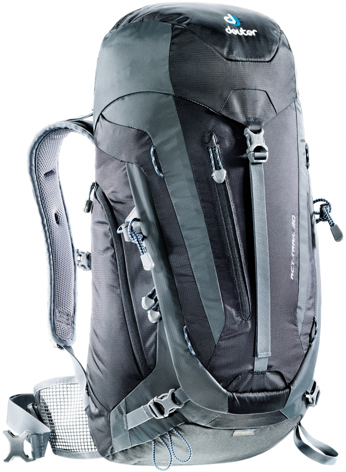
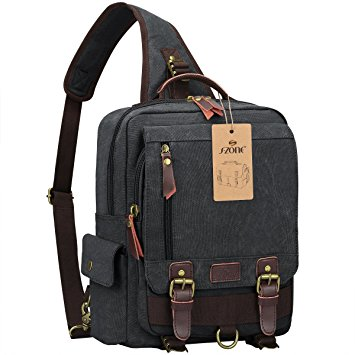

So, I bought a one-way flight to Europe. I'm not much of a planner, to be honest, but some level of planning must be done. I'm going to lay out the most important things I've done and considered here in my typical manner.

Let it be known that I have no affiliates or sponsorships whatsoever to any products, websites, or apps I mention.

## First Steps

First thing to do is figure out a vague idea of where you're going. As long as I plan out most of the big flights between places, I'll know where I'm generally going to be, and I can either find a hostel when I get there, or look up AirBnbs close to the city center.

Here were my aims:

- I want to travel without any luggage - only a backpack and a small personal item.
- I want to stay for about a week in each country/destination.

So first, I decided on the big cities I want to visit. From there, buy the flights to the long destinations. If necessary, buy the train passes to shorter destinations, or I can just do that on arrival.

## Planning

Based on the lovely friends I have, I know I want to go to Edinburgh/Scotland, Braga/Portugal, Seville/Spain, Berlin/Germany, and Sofia/Bulgaria.

### Making a Map

[My Maps](https://www.google.com/mymaps) by Google is a great way to make a map. I put all my flight destinations on markers on one layer, then drew lines between them so I could see the general itinerary I have. This makes it easier for me.

### Consolidating Information

[Google Trips](https://get.google.com/trips/) is an amazing app that creeps through my email history and automatically populates with my reservations. Then it'll give you a bunch of neatly organized information about your destination, from top spots and things to do, to emergency and cultural information, cuisine, and getting around. You can download the whole city so it'll be available when you inevitably don't have service.

Make a trip, add all your cities and dates, and Google Trips gives you the rest. Perfect for someone lazy like me who doesn't want to look up all the things to do, but would prefer to walk around and stumble upon cool things.

## Transportation

### Flights to Europe

[Google Flights](https://www.google.com/flights/) is what I used to find a cheap flight across the pond. I looked using flexible dates. The flexible date option is sometimes hard to find, so I just put `mc=d`on the end of the URL for any flight and it would come up. You can also track a flight and you'll get updates when the price changes. This is how I managed to get a very cheap flight (\$90 USD).

### Flights around Europe

[RyanAir](http://www.ryanair.com/) flies all around Europe for insanely cheap. All my flights were between $30 and $50 USD.

From the airport, I'm sure there will always be a train, bus, Uber, or taxi that will take me to the city center.

### Trains and Buses

[Rome2rio](https://www.rome2rio.com/) has been a great resource for getting connected to different local train, plane, and bus systems ll around the continent. Just put in your origin and destination, and it'll show you all the options and prices.

## Packing

I don't have much stuff laying around, so there were a few things I needed to make sure I got. I won't go into clothes or anything - I'll just bring 3-4 shirts, 3-4 pants, a coat, plenty of underwear and socks, and that's it for clothes. No need to overcomplicate. Like WTF is travel underwear and travel socks? Packing cubes?

### Backpack

I already had a backpack from last year's stint in Sweden. It was fine for two weeks, so it should be fine for two months. I love this backpack! Fits my 5'6" self perfectly. Big enough to fit clothes, toiletries, and a few extra things, small enough to not be a bother. I got this at REI.

[Deuter ACT Trail 30 Liter](http://www.deuter.com/DE/en/hiking/act-trail-30-3440315-blue-red.html) - \$100

### Daypack

I needed something that would fit a 13" laptop, and a few small things. I hate carrying a purse or anything in my hands. I also needed it to be small enough to be considered a purse or personal item on planes, because I do not want to have to check baggage. This was actually insanely difficult to find, until I found this lovely backpack from MANLY HANDBAGS DOT COM. I guess I'm a man now.

The one I got was a regular backpack, not a weird sling thing.

[S Zone 13" Laptop Messenger Bag](http://manlyhandbags.com/s-zone-sling-canvas-cross-body-13-inch-laptop-messenger-bag-shoulder-backpack/) - \$30

### A few more things

- **Small travel umbrella** - I don't want to forget this and end up buying a big one when I need it then forgetting it in a bathroom somewhere.
- **Extra battery pack** - iPhones die pretty quickly.
- **Padlock** - Don't get all your shit stolen in the hostel.
- **Keychain Flashlight** - For getting around the hostel after lights out.
- **Travel towel** - Having long hair and no towel is impossible.
- **Adapters** - For the digital stuff.

All of the above was about $100-$150.

I already had a Kindle, which I'll need to fill up with books for long, boring flights, and I'll need to have access to a lot of data-free music, or I'll go insane.

## Accommodation

Between the [Hostelworld](http://www.hostelworld.com/) app for hostels and [AirBnb](https://www.airbnb.com/), finding accommodation will be pretty simple. Just sort by price, and either view map or list mode, and you'll see plenty of options everywhere you go. Beyond that, [Couchsurfing](http://www.couchsurfing.com/) can be good for meeting people, Meetup for doing stuff, Yelp for finding things.

## Life at home

Things to not have when you travel for long periods of time:

- A full time job
- An apartment
- A spouse

Check, check, check!

Also, call debit and credit card to let them know you'll be away. Turn off all data on the phone when abroad to avoid roaming fees.

## What I still need

I don't have what might be considered an acceptable pair of shoes to wear. Need to find something that isn't a running shoe that's comfortable to walk around in all day long. I'm not bringing two pairs. Also need a burner phone with just text and talk, but I can probably get that when I arrive, because otherwise I'll be relying on Wi-Fi.

## Budget

I dunno. I'd like to ideally spend around $75/day, including food and accommodation, but not counting planes. That adds up to $2250 for a month, which would be basically what I spend living in America, considering food, rent, and utilities. Edinburgh will be more, Bulgaria will be less, so I'm averaging it. I guess in the end I can see how it actually turned out.

## Summary

So, tl;dr:

- Google Maps "My Maps" feature to make an itinerary
- Google Trips to consolidate all information
- Google Flights to find a flight to Europe
- Rynair to fly around Europe
- Rome2rio to find trains and buses around Europe
- Large backpack for carrying all the stuff
- Small daypack for carrying some of the stuff
- A few extra items to remember
- Tidy up things back home
- Hostelworld and AirBnb to stay

That's about it.
