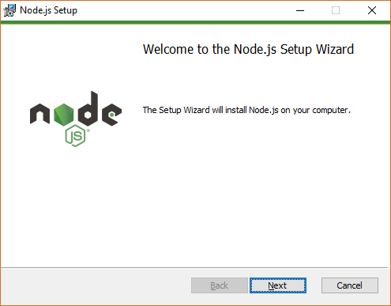
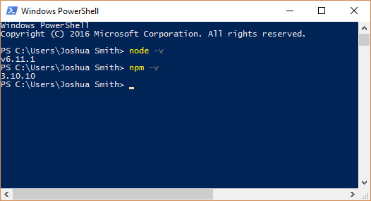
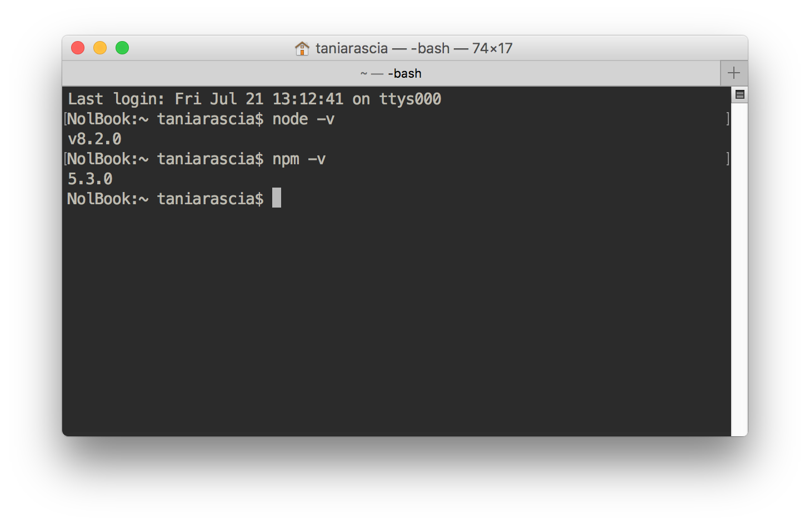
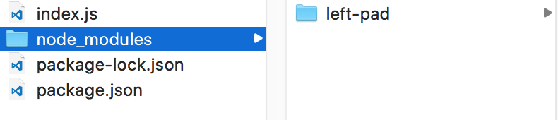

In order to use almost any development tools based in JavaScript, you'll need to know how to use npm and Node.js. [Gulp](/getting-started-with-gulp/), [Grunt](/getting-started-with-grunt-and-sass/), and Webpack are a few examples of popular technologies you may have heard of that require a knowledge of the Node ecosystem.

I find myself writing about this over and over again in the prerequisites of an article I've begun to write. I'd prefer to write one definitive guide to refer to in the future, so here it is.

- [View on GitHub](https://github.com/taniarascia/node-test)

#### Prerequisites

- [Basic command line proficiency](/how-to-use-the-command-line-for-apple-macos-and-linux/). Don't skip this step! If you don't know how to use the command line, you'll be fighting an uphill battle. The provided tutorial has everything you need to know.

#### Goals

- Learn what Node.js and npm are
- Set up Node.js and npm on Windows and Mac

## What is Node.js?

JavaScript is a **client-side** programming language, which means it’s processed in the browser. With the advent of [Node.js](https://nodejs.org/en/), JavaScript can also be used as a **server-side** language.

## What is npm?

[npm](https://www.npmjs.com/) doesn't stand for **Node Package Manager\***, which means it’s the tool to connect to the repository containing all the Node.js programs, plugins, modules and so on.

> *npm actually does not stand for "Node Package Manager" but essentially that's what it is and does, so most people refer to it that way.

## Local vs. Global

This is the most confusing concept to understand at first, so it's important to let this settle in. Traditionally, you're used to globally installing any sort of program or software on your computer. If you want Spotify, you'll download Spotify, and then it will be available to you.

With npm, you will have some global installs, but mostly everything will be done on a local project basis, meaning you'll have to install everything you need for each project in its own directory. If you want to have a project running Gulp and Sass, you'll create a directory, with a new npm install.

For future reference, any global installations will have the `-g` flag.

## Installation on Windows

Installing everything on Windows is a breeze.

### Install Node.js and npm

Node.js and npm can be installed from a download link. Go to the [Node installation page](https://nodejs.org/en/download/), and download the Node installer. I have a 64-bit Windows 10 OS, so I chose that one.



Once it's done, you can test to see both node and npm functioning by opening PowerShell (or any shell) and typing `node -v` and `npm -v`, which will check the version number.



All set.

## Installation on a Mac or Linux

In order to install everything on a Mac, we'll be running commands in Terminal.app, and Linux distributions vary.

### Install Node.js and npm

We’re going to use [Node Version Manager (nvm)](https://github.com/creationix/nvm) to install Node.js and npm.

```bash
curl -o- https://raw.githubusercontent.com/creationix/nvm/v0.33.1/install.sh | bash
```

Open the `~/.bash_profile` file, and make sure `source ~/.bashrc` is written in there somewhere. Restart the terminal.

Run the install command.

```bash
nvm install node
```

Run the use command.

```bash
nvm use node
```

```terminal
Now using node v8.2.0 (npm v5.3.0)
```

Now that Node.js and npm are installed, test them by typing `node -v` and `npm -v`.



All set.

## Create a Project

At this point, you're set to start setting up Gulp, Webpack, Browserify, or whatever your aim is. We can also create a simple project to test that everything is working properly.

### Initialize Project

Navigate to the directory in which you want your project to exist - in my case, **sites/node-test**.

```bash
cd sites/node-test
```

Now initalize a new project with npm.

```bash
npm init
```

The following will pop up in the terminal, and prompt you for a few

```terminal
This utility will walk you through creating a package.json file.
It only covers the most common items, and tries to guess sensible defaults.

See `npm help json` for definitive documentation on these fields
and exactly what they do.

Use `npm install <pkg>` afterwards to install a package and
save it as a dependency in the package.json file.
```

First, it will ask for a package name.

```bash
node-test
```

Version number.

```
1.0.0
```

Description.

```
Creating my first "Hello, World!" Node project.
```

The rest you can just press enter and skip. Now you'll notice we have a **package.json** file that contains all the information we entered.

<div class="filename">package.json</div>

```js
{
  "name": "node-test",
  "version": "1.0.0",
  "description": "Creating my first \"Hello, World!\" Node project.",
  "main": "index.js",
  "scripts": {
    "test": "echo \"Error: no test specified\" && exit 1"
  },
  "author": "Tania Rascia",
  "license": "ISC"
}
```

A **package.json** is a file that contains metadata about the project, and handles the dependencies (additional software and modules) of the project.

Now, we're going to install our first dependency - a very important and useful package called **left-pad**, which will add white space to the left side of a string, adding up to a number.

For example, writing this:

```js
leftPad('String', 10)
```

Will output this:

```terminal
console
```

```js
String
```

[left-pad](https://www.npmjs.com/package/left-pad) is a package on npm, which as we stated previously contains the registry for all publicly available packages.

### Install dependencies

To install a dependency with npm, we use the command `npm install dependency-name-here`. Now, simply running `npm install` will download the dependency, but it won't save it to the project. Since we've already created our **package.json**, we'll use the flag `--save` to install the dependency _and_ add it to **package.json**.

```bash
npm install left-pad --save
```

As long as you ran this command inside the project directory, it will successfully install the dependency by creating a **node_modules** directory. It will also create a **package-lock.json** file, which we can ignore. Finally, it updated our **package.json** file with a new line.

```js
"dependencies": {
  "left-pad": "^1.1.3"
}
```

Now the project recognizes the left-pad dependency as existing

> You can also run `npm install --save-dev` to specify that the dependency will only be used for development (not production) purposes.

### Run Node in the terminal

Let's create **index.js** in the root of our directory. This is everything you should have now:



For future reference, don't bother looking in the **node_modules** rabbit hole. It will get really overwhelming with bigger projects.

In order to use a dependency, we use `require()` and put it in a variable, like so:

```js
const leftPad = require('left-pad')
```

This will be the entirety of our **index.js** file, in which we require left-pad, run a `leftPad()` function, and send it to the console.

<div class="filename">index.js</div>

```js
const leftPad = require('left-pad') // Require left pad
const output = leftPad('Hello, World!', 15) // Define output

// Send output to the console
console.log(output)
```

Since Node.js is not recognized by the browser, we'll be testing this in the console. In your shell, run the `node` command followed by the filename in the root of your project.

```bash
node index.js
```

If everything went well, you should have printed `Hello, World!` to the console, with two spaces on the left.

```terminal
Hello, World!
```

## Conclusion

In this tutorial, we learned the following:

- What Node.js is
- What npm is
- How to install Node.js and npm on Windows or Mac
- How to make a local project
- How to install a dependency with npm
- How to run a file using a **node_modules** dependency in a shell

If you got lost at any point, [view the source on GitHub](https://github.com/taniarascia/node-test).

With this knowledge, you're ready to start using Gulp, Grunt, Webpack, Browserify, or anything else that depends on Node.js or npm.
