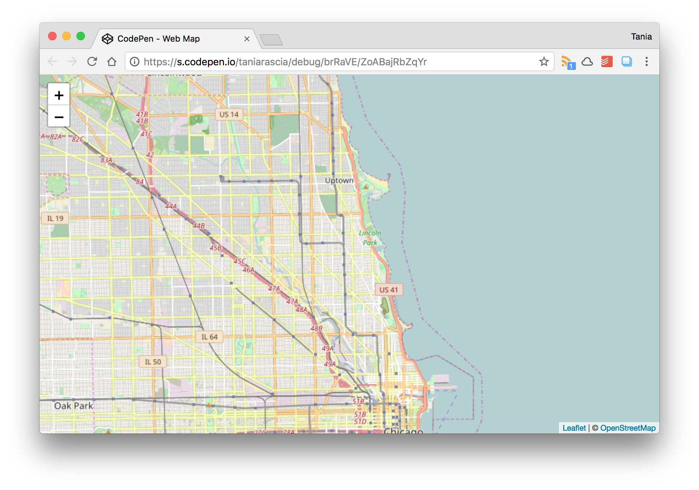
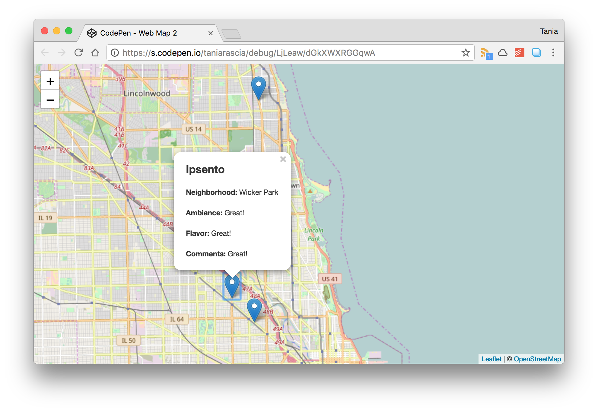

I don't know about you, but it doesn't help me very much to peruse through endless examples of `foo` and `bar` to try to figure out how to use a feature of a programming language. There are some JavaScript/ES6 concepts that are hard to grasp as just standalone snippets without seeing how they work as a piece of a bigger project, so I'm going to cover an example of how I used them in this article.

Recently, I've been exploring Chicago and visiting various local coffeeshops to write with a gentle, pleasant ambiance, à la J.K. Rowling. After I accidentally visited one I didn't like very much but forgot about, I thought it might be a fun little project to map out all the cafes I write at in a web map.

On another occasion, I used Google Maps API to [map out multiple store locations](/google-maps-apis-for-multiple-locations/) for restaurant concepts at my last job. For this project, I decided to use [Leaflet](http://leafletjs.com/), a JavaScript library for interactive maps.

Here's the final map project that I created: [Cafétography](https://taniarascia.github.io/coffee/)

For this article, you can either create your own web map for something in your own neighborhood or the world that you would like to track, or you can simply view my examples of `map()`, `filter()` and `reduce()`.

#### Prerequisies

- Basic knowlegde of HTML, CSS, and JavaScript. A review of [JavaScript Variables and Datatypes](https://www.sitepoint.com/beginners-guide-javascript-variables-and-datatypes/) will have most of the JavaScript knowledge you'd need up to this point.

#### Goals

- Next goal is to use `reduce()` and `map()` in a real world example (the map) to simplify and make our code more efficient and [DRY](https://en.wikipedia.org/wiki/Don%27t_repeat_yourself) (_**D**on't **R**epeat **Y**ourself_). We will use `reduce()` to get the count of coffeeshops per Chicago neighborhood, and we'll use `map()` to pull data from an external JSON feed and show locations on the web map.

Let's do some problem solving.

## Setting up the web map

Here is an [example project on CodePen](https://codepen.io/taniarascia/pen/brRaVE) you can use. All it requires is an html file (**index.html**) with the prerequisite CSS and JavaScript Leaflet files loading in:

<div class="filename">index.html</div>

```html
<link href="https://unpkg.com/leaflet@1.1.0/dist/leaflet.css" />
<script src="https://unpkg.com/leaflet@1.1.0/dist/leaflet.js"></script>
```

An html `div` with an id of `map`:

<div class="filename">index.html</div>

```html
<div id="map"></div>
```

Some basic CSS (**style.css**) to display the map:

<div class="filename">style.css</div>

```css
#map {
  height: 100vh;
  width: 100%;
}
```

And this JavaScript (**scripts.js**) to load in the map and map data.

<div class="filename">scripts.js</div>

```js
// Set the map variable
const myMap = L.map('map')

// Load the basemap
const myBasemap = L.tileLayer('http://{s}.tile.openstreetmap.org/{z}/{x}/{y}.png', {
  maxZoom: 19,
  attribution: '© <a href="http://www.openstreetmap.org/copyright">OpenStreetMap</a>',
})

// Add basemap to map id
myBasemap.addTo(myMap)

// Set view of the map
myMap.setView([41.939948, -87.650673], 12)
```

Once that's all set, here's how your loaded in Leaflet web map will look.



Again, you can find and fork a working version of the whole thing [right here](https://codepen.io/taniarascia/pen/brRaVE) on CodePen, but you'll have to transfer it to your own server or work on it locally.

## Adding location markers with JSON

Now I want to start adding locations as markers to the map. I can do that easily by making a bunch of variables with the latitute and longitude, and using the `addTo()` method. Let's say I want to add El Meson, Wormhole, and Ipsento to my map. I'll keep it to three to keep it short and simple. Here's how I would do it to start.

<div class="filename">scripts.js</div>

```js
const elMeson = L.marker([42.002439, -87.672339]).addTo(myMap)
const wormhole = L.marker([41.908415, -87.674605]).addTo(myMap)
const ipsento = L.marker([41.918639, -87.687247]).addTo(myMap)
```

That doesn't seem too bad - I just have to add a new entry for every new marker. However, it starts to get a little more verbose once I start adding in a popup with more information for each location.

<div class="filename">scripts.js</div>

```js
const elMeson = L.marker([42.002439, -87.672339])
  .bindPopup(
    `
    <h2>El Meson</h2>
    <p><b>Neighborhood:</b> Rogers Park</p>
    <p><b>Ambiance:</b> Great!</p>
    <p><b>Flavor:</b> Great!</p>
    <p><b>Comments:</b> Great!</p>
    `
  )
  .openPopup()
  .addTo(myMap)

const wormhole = L.marker([41.908415, -87.674605])
  .bindPopup(
    `
    <h2>Wormhole</h2>
    <p><b>Neighborhood:</b> Wicker Park</p>
    <p><b>Ambiance:</b> Great!</p>
    <p><b>Flavor:</b> Great!</p>
    <p><b>Comments:</b> Great!</p>
    `
  )
  .openPopup()
  .addTo(myMap)

// And so on...
```

This is how it looks with the markers and popups loaded in.



Now it can start becoming a pain to add a new one of those for every single coffee shop I come across. It would be much easier to create a JSON file, and loop through that. If you've never used JSON before, I would strongly suggest [reading this JSON tutorial](/how-to-use-json-data-with-php-or-javascript/) to learn all about it from scratch and do some practice.

At this point, I will delete all the marker information from **scripts.js** and make a JSON file with an object containing an array containing objects of all my coffee house locations. It can be a bit tricky to keep track of all the square and curly brackets at first.

<div class="filename">map.json</div>

```js
{
  "cafes": [{
      "name": "El Meson",
      "lat": 42.002439,
      "long": -87.672339,
      "neighborhood": "Rogers Park",
      "ambiance": "4/5",
      "flavor": "5/5",
      "comments": "Best cappuccino and croissant I've ever had."
    },
    {
      "name": "Wormhole",
      "lat": 41.908415,
      "long": -87.674605,
      "neighborhood": "Wicker Park",
      "ambiance": "5/5",
      "flavor": "4/5",
      "comments": "Cute ambiance with a Nintendo that actually works properly and the best games (including FF1!)."
    },
    {
      "name": "Ipsento",
      "lat": 41.918639,
      "long": -87.687247,
      "neighborhood": "Wicker Park",
      "ambiance": "4/5",
      "flavor": "5/5",
      "comments": "Really great spicy latte. Nice ambiance."
    }
  ]
}
```

Okay, good. Now we have all the information about each location - name, latitude, longitude, neighborhood, and additional details - placed neatly into a JSON file. Now, how do we get that JSON file onto the page?

We won't be using jQuery - only plain JavaScript - so it's a slightly more involved process. I will refer back to [How to Use JSON Data with PHP or JavaScript](/how-to-use-json-data-with-php-or-javascript/) for a further explanation of the code, but here's how we open and access our **map.json** file.

<div class="filename">scripts.js</div>

```js
// Make an XMLHttpRequest to the JSON data
const request = new XMLHttpRequest()
request.open('GET', 'map.json', true)

request.onload = function() {
  // Begin accessing JSON data here
  const data = JSON.parse(this.response)
}

request.send()
```

Where it says `Begin accessing JSON data here` is where we will begin working with the data from **map.json**, which has been placed in the `data` variable. Make sure **map.json** is not a local file URL. See information below.

> **Warning!** It's not possible to pull an local JSON file in with `XMLHttpRequest`. In other words, if the full URL starts with `file://` or `C:/`, it will not connect properly. You can either [set up a local server with MAMP](/local-environment/), use `http-server` [installed through npm](/how-to-install-and-use-node-js-and-npm-mac-and-windows/), use [Vagrant/VirtualBox](/what-are-vagrant-and-virtualbox-and-how-do-i-use-them/) to run a server, or use an external host.

## Using map() to loop through JSON data

Previously we were creating a new variable for each marker, and placing all the information manually inside that variable. Now we're going to be pulling all the idata from JSON, and we will do that using `map()`.

`map()` takes an array and creates a new array with the result of a function on each element in the original array. For example, you could create an array of `[1, 2, 3]` and apply a function via `map()` that increases each number in an array by one. You would end up with `[2, 3, 4]`.

To get the data found inside `cafes` in JSON, we'll use the `map()` method on `data.cafes` with a function inside.

```js
const cafes = data.cafes.map(function(cafe) {})
```

I'm just going to rewrite that function with an [ES6 arrow function](https://developer.mozilla.org/en-US/docs/Web/JavaScript/Reference/Functions/Arrow_functions) to make it more succinct.

```js
const cafes = data.cafes.map(cafe => {})
```

Now in order to access any property from the JSON feed, we'll use the dot notation on the `cafe` object. So the first iteration of `cafe.name` will return `El Meson`, the second one `Wormhole`, and so on. All I'm doing here is taking the same `L.Marker` function from before, and replacing all the static values with dynamic properties.

<div class="filename">scripts.js</div>

```js
// Print cafe markers
const cafes = data.cafes.map(cafe => {
  L.marker([cafe.lat, cafe.long])
    .bindPopup(
      `
        <h2>${cafe.name}</h2>
        <p><b>Neighborhood:</b> ${cafe.neighborhood}</p>
        <p><b>Ambiance:</b> ${cafe.ambiance}</p>
        <p><b>Flavor:</b> ${cafe.flavor}</p>
        <p><b>Comments:</b> ${cafe.comments}</p>
    `
    )
    .openPopup()
    .addTo(myMap)
})
```

This example is using template literal strings, which use backticks and can span multiple lines as well as include variables with escaping as opposed to concatenation. [Check this out](https://www.digitalocean.com/community/tutorials/how-to-work-with-strings-in-javascript#long-strings-and-newlines) if you're unfamiliar with template literals.

Here is the full **scripts.js** file up to now.

<div class="filename">scripts.js</div>

```js
// Set the map variable
const myMap = L.map('map')

// Load the basemap
const myBasemap = L.tileLayer('http://{s}.tile.openstreetmap.org/{z}/{x}/{y}.png', {
  maxZoom: 19,
  attribution: '© <a href="http://www.openstreetmap.org/copyright">OpenStreetMap</a>',
})

// Add basemap to map id
myBasemap.addTo(myMap)

// Set view of the map
myMap.setView([41.939948, -87.650673], 12)

// Make an XMLHttpRequest to the JSON data
const request = new XMLHttpRequest()

request.open('GET', 'map.json', true)
request.onload = function() {
  // Begin accessing JSON data here
  const data = JSON.parse(this.response)

  // Print cafe markers
  const cafes = data.cafes.map(cafe => {
    L.marker([cafe.lat, cafe.long])
      .bindPopup(
        `
          <h2>${cafe.name}</h2>
          <p><b>Neighborhood:</b> ${cafe.neighborhood}</p>
          <p><b>Ambiance:</b> ${cafe.ambiance}</p>
          <p><b>Flavor:</b> ${cafe.flavor}</p>
          <p><b>Comments:</b> ${cafe.comments}</p>
        `
      )
      .openPopup()
      .addTo(myMap)
  })
}

request.send()
```

Of course, `map()` is capable of much more than what we're doing in this example, but it's a good and practical start.

> This use case of `map()` technically works, but since `cafes` will contain an empty array, `forEach()` would also be a good choice for this situation.

## Using filter() to find matching values

At this point, I had a map with all my markers created. There were three cafes in our reduced example, but I ended up with around a dozen. Each cafe was in a neighborhood, and I had a few neighborhoods that had more than one cafe that I had visited. I wanted to make a count of how many cafes I visited in each neighborhood.

In our example, we have two neighborhoods for the three cafes - one in Rogers Park, and two in Wicker Park. With such a small example, of course it would be very easy to simply write "Rogers Park: 1; Wicker Park: 2", but the longer it gets and the more neighborhoods and cafes get added, the more of a need there will be to automate this process.

We have all the data we need in the JSON file, but I wasn't sure how to succinctly count all the instances. At first, I thought about using `filter()` to find out how many instances of each neighborhood name were found throughout the feed. `filter()` is written similarly to `map()` and it also creates a new array, but its function performs a test and filters out everything that doesn't pass. `filter()` follows the same syntax as `map()`.

```js
const individualNeighborhood = data.cafes.filter(cafe => {})
```

Below, I'm making a test for each neighborhood that will filter out all results that don't match my test.

```js
const rogersPark = data.cafes.filter(cafe => {
  return cafe.neighborhood === 'Rogers Park'
})

const wickerPark = data.cafes.filter(cafe => {
  return cafe.neighborhood === 'Wicker Park'
})
```

Using this method, I would have to make an array of objects linking up the string `"Rogers Park"` to the result of `rogersPark.length`

```js
const neighborhoodsArray = [
  {
    name: 'Rogers Park',
    number: rogersPark.length,
  },
  {
    name: 'Wicker Park',
    number: wickerPark.length,
  },
]
```

And finally I could loop through those values.

```js
for (let neighborhood of neighborhoodsArray) {
  console.log(neighborhood.name, neighborhood.name)
}
```

`for...of` is used for iterating through arrays. Here's the output.

```terminal
Rogers Park 1
Wicker Park 2
```

This technically worked, but now I'm doing what I didn't want to do the first time around - repeating myself. So this turned out to be an inefficient use of the `filter()` method, but that's fine. Not everything you write in your learning journey will be perfect, and now we can refactor it.

## Using reduce() to count instances of values in an object

`reduce()` is written like `map()` and `filter()`, but the inner function will take two parameters. It also has an extra spot at the end where we'll insert an empty object `{}`. This could also be an empty array `[]`, but in our example it will be an object. This extra parameter is the **intial value**, which is `0` by default.

```js
const neighborhoodCount = data.cafes.reduce((sums, value) => {}, {})
```

I encountered this handy snippet which will create an object containing all our final neighborhood counts.

```js
const neighborhoodCount = data.cafes.reduce((sums, cafe) => {
  sums[cafe.neighborhood] = (sums[cafe.neighborhood] || 0) + 1
  return sums
}, {})
```

Now we'll loop through the object we created with `for...in`, which is used for iterating through object keys.

```js
for (let neighborhood in neighborhoodCount) {
  console.log(neighborhood, neighborhoodCount[neighborhood])
}
```

And here's the output.

```terminal
Rogers Park 1
Wicker Park 2
```

We got the same result as our inefficient code from before with just a few short lines.

Once that was finished, I inserted this into the DOM instead of just printing it out to the console. Just added a new id to **index.html**.

```html
<div id="neighborhoods"></div>
```

Then pass the reduced values to the new `div`.

```js
// Create a sidebar
const sidebar = document.getElementById('neighborhoods')

// Print all neighborhoods in sidebar
for (let neighborhood in neighborhoodCount) {
  const p = document.createElement('p')

  p.innerHTML = `<b>${neighborhood}</b> : ${neighborhoodCount[neighborhood]}`
  sidebar.appendChild(p)
}
```

I added some CSS, a coffee cup image as the marker, a different map, and more locations, which I won't go into as they're not the focus of the article. The source for the whole **scripts.js** file that we just created [is right here.](https://github.com/taniarascia/coffee/blob/master/js/scripts.js) Below is what the final version looks like.


You can [view the final source for the map here](https://github.com/taniarascia/coffee), or [view the completed project here](https://taniarascia.github.io/coffee/) if anything was unclear.

## A summary of map(), filter(), and reduce()`

Here's a very brief overview of the differences between `map()`, `filter()`, and `reduce()`, using a very simple array of `[1, 2, 3, 4]`.

```js
const numbers = [1, 2, 3, 4]
```

### map()

Use `map()` to get an array with each value incremented by one.

```js
const numbersIncremented = numbers.map(x => {
  return x + 1
})

numbersIncremented
```

```
[ 2, 3, 4, 5]
```

### filter()

Use `filter()` to get an array of available values greater than 2.

```js
const numbersFiltered = numbers.filter(x => {
  return x > 2
})

numbersFiltered
```

```terminal
[ 3, 4 ]
```

### reduce()

Use `reduce()` to get the sum of the numbers in the array.

```js
const numbersReduced = numbers.reduce((x, y) => {
  return x + y
})

numbersReduced
```

```terminal
10
```

## Conclusion

There you have it. A small project with some problem solving that uses `map()`, `filter()`, and `reduce()` along the way, with succinct snippets for review. Comments and improvements appreciated!

Finally, here is [my musical rendition of Mad World](/music/songs/MadWorld.m4a) by Tears for Fears. Feel free to import this unrefined [Ivory and Ivory](/music/) classic into your music library.
