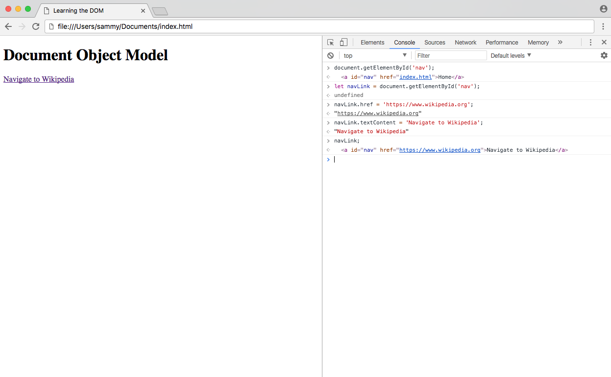
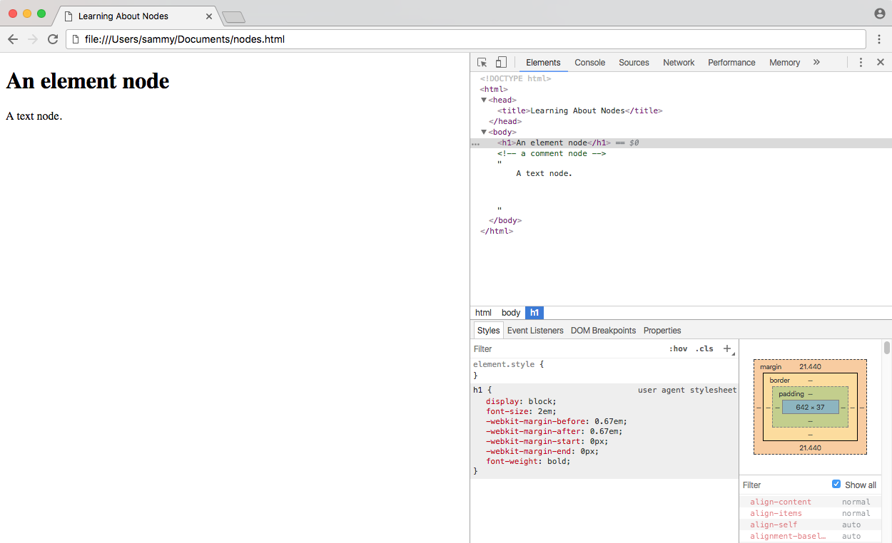
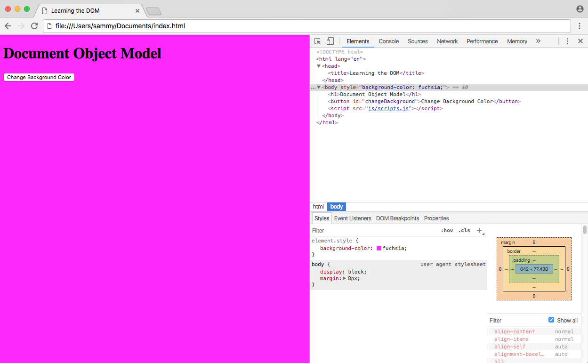

_This post was originally written for [DigitalOcean](https://www.digitalocean.com/community/tutorials/understanding-the-dom-tree-and-nodes)_.

The DOM is often referred to as the **DOM tree**, and consists of a tree of objects called **nodes**. In the [Introduction to the DOM](/introduction-to-the-dom), we went over what the Document Object Model (DOM) is, how to access the `document` object and modify its properties with the [console](https://www.digitalocean.com/community/tutorials/how-to-use-the-javascript-developer-console), and the difference between HTML source code and the DOM.

In this tutorial, we will review HTML terminology, which is essential to working with JavaScript and the DOM, and we will learn about the DOM tree, what nodes are, and how to identify the most common node types. Finally, we will move beyond the console and create a JavaScript program to interactively modify the DOM.

## HTML Terminology

Understanding HTML and JavaScript terminology is essential to understanding how to work with the DOM. Let's briefly review some HTML terminology.

To begin, let's take a look at this HTML element.

```html
<a href="index.html">Home</a>
```

Here we have an anchor element, which is a link to `index.html`.

- `a` is the **tag**
- `href` is the **attribute**
- `index.html` is the **attribute value**
- `Home` is the **text**.

Everything between the opening and closing tag combined make the entire HTML **element**.

We'll be working with the `index.html` from the [previous tutorial](/introduction-to-the-dom):

<div class="filename">index.html</div>

```html
<!DOCTYPE html>
<html lang="en">
  <head>
    <title>Learning the DOM</title>
  </head>

  <body>
    <h1>Document Object Model</h1>
  </body>
</html>
```

The simplest way to access an element with JavaScript is by the `id` attribute. Let's add the link we have above into our `index.html` file with an `id` of `nav`.

<div class="filename">index.html</div>

```html
<a id="nav" href="index.html">Home</a>
```

Load or reload the page in your browser window and look at the DOM to ensure that the code has been updated.

We're going to use the `getElementById()` method to access the entire element. In the console, type the following:

```terminal
document.getElementById('nav');
```

<div class="filename">Console</div>

```html
<a id="nav" href="index.html">Home</a>
```

We have retrieved the entire element using `getElementById()`. Now, instead of typing that object and method every time we want to access the `nav` link, we can place the element into a variable to work with it more easily.

```terminal
let navLink = document.getElementById('nav');
```

The `navLink` variable contains our anchor element. From here, we can easily modify attributes and values. For example, we can change where the link goes by changing the `href` attribute:

```terminal
navLink.href = 'https://www.wikipedia.org';
```

We can also change the text content by reassigning the `textContent` property:

```terminal
navLink.textContent = 'Navigate to Wikipedia';
```

Now when we view our element, either in the console or by checking the _Elements_ tag, we can see how the element has been updated.

```terminal
navLink;
```

```html
[secondary_label Output] <a id="nav" href="https://www.wikipedia.org/">Navigate to Wikipedia</a>
```

This is also reflected on the front-end of the website.



Refreshing the page will revert everything back to their original values.

At this point, you should understand how to use a `document` method to access an element, how to assign an element to a variable, and how to modify properties and values in the element.

## The DOM Tree and Nodes

All items in the DOM are defined as **nodes**. There are many types of nodes, but there are three main ones that we work with most often:

- **Element** nodes
- **Text** nodes
- **Comment** nodes

When an HTML element is an item in the DOM, it is referred to as an **element node**. Any lone text outside of an element is a **text node**, and an HTML comment is a **comment node**. In addition to these three node types, the `document` itself is a **document** node, which is the root of all other nodes.

The DOM consists of a **tree** structure of nested nodes, which is often referred to as the **DOM tree**. You may be familiar with an ancestral family tree, which consists of parents, children, and siblings. The nodes in the DOM are also referred to as parents, children, and siblings, depending on their relation to other nodes.

To demonstrate, create a `nodes.html` file. We'll add text, comment, and element nodes.

<div class="filename">nodes.html</div>

```html
<!DOCTYPE html>
<html>
  <head>
    <title>Learning About Nodes</title>
  </head>

  <body>
    <h1>An element node</h1>
    <!-- a comment node -->
    A text node.
  </body>
</html>
```

The `html` element node is the parent node. `head` and `body` are siblings, children of `html`. `body` contains three child nodes, which are all siblings — the type of node does not change the level at which it is nested.

<$>[note]
**Note:** When working with an HTML-generated DOM, the indentation of the HTML source code will create many empty text nodes, which won't be visible from the DevTools Elements tab. Read about [Whitespace in the DOM](https://developer.mozilla.org/en-US/docs/Web/API/Document_Object_Model/Whitespace_in_the_DOM)
<$>

## Identifying Node Type

Every node in a document has a **node type**, which is accessed through the `nodeType` property. The Mozilla Developer Network has an up-to-date list of [all node type constants](https://developer.mozilla.org/en-US/docs/Web/API/Node/nodeType). Below is a chart of the most common node types that we are working with in this tutorial.

| Node Type      | Value | Example                             |
| -------------- | :---: | ----------------------------------- |
| `ELEMENT_NODE` |   1   | The `<body>` element                |
| `TEXT_NODE`    |   3   | Text that is not part of an element |
| `COMMENT_NODE` |   8   | `<!-- an HTML comment -->`          |

In the _Elements_ tab of Developer Tools, you may notice that whenever you click on and highlight any line in the DOM the value of `== $0` will appear next to it. This is a very handy way to access the currently active element in Developer Tools by typing `$0`.

In the console of **nodes.html**, click on the first element in the `body`, which is an `h1` element.



In the console, get the **node type** of the currently selected node with the `nodeType` property.

```terminal
$0.nodeType;
```

<div class="filename">Console</div>

```js
1
```

With the `h1` element selected, you would see `1` as the output, which we can see correlates to `ELEMENT_NODE`. Do the same for the text and the comment, and they will output `3` and `8` respectively.

When you know how to access an element, you can see the node type without highlighting the element in the DOM.

```terminal
document.body.nodeType;
```

<div class="filename">Console</div>

```js
1
```

In addition to `nodeType`, you can also use the `nodeValue` property to get the value of a text or comment node, and `nodeName` to get the tag name of an element.

## Modifying the DOM with Events

Up until now, we've only seen how to modify the DOM in the console, which we have seen is temporary; every time the page is refreshed, the changes are lost. In the [Introduction to the DOM](/introduction-to-the-dom) tutorial, we used the console to update the background color of the body. We can combine what we've learned throughout this tutorial to create an interactive button that does this when clicked.

Let's go back to our `index.html` file and add a `button` element with an `id`. We'll also add a link to a new file in a new `js` directory `js/scripts.js`.

<div class="filename">index.html</div>

```html
<!DOCTYPE html>
<html>
  <head>
    <title>Learning the DOM</title>
  </head>

  <body>
    <h1>Document Object Model</h1>
    <button id="changeBackground">Change Background Color</button>

    <script src="js/script.js"></script>
  </body>
</html>
```

An **event** in JavaScript is an action the user has taken. When the user hovers their mouse over an element, or clicks on an element, or presses a specific key on the keyboard, these are all types of events. In this particular case, we want our button to listen and be ready to perform an action when the user clicks on it. We can do this by adding an **event listener** to our button.

Create `scripts.js` and save it in the new `js` directory. Within the file, we'll first find the `button` element and assign it to a variable.

<div class="filename">scripts.js</div>

```js
let button = document.getElementById('changeBackground')
```

Using the `addEventListener()` method, we will tell the button to listen for a click, and perform a function once clicked.

<div class="filename">scripts.js</div>

```js
button.addEventListener('click', () => {
  // action will go here
})
```

Finally, inside of the function, we will write the same code from the [previous tutorial](/introduction-to-the-dom) to change the background color to `fuchsia`.

<div class="filename">scripts.js</div>

```js
document.body.style.backgroundColor = 'fuchsia'
```

Here is our entire script:

<div class="filename">scripts.js</div>

```js
let button = document.getElementById('changeBackground')

button.addEventListener('click', () => {
  document.body.style.backgroundColor = 'fuchsia'
})
```

Once you save this file, refresh `index.html` in the browser. Click the button, and the event will fire.



The background color of the page has changed to fuchsia due to the JavaScript event.

## Conclusion

In this tutorial, we reviewed terminology that will allow us to understand and modify the DOM. We learned how the DOM is structured as a tree of nodes that will usually be HTML elements, text, or comments, and we created a script that would allow a user to modify a website without having to manually type code into the developer console.
