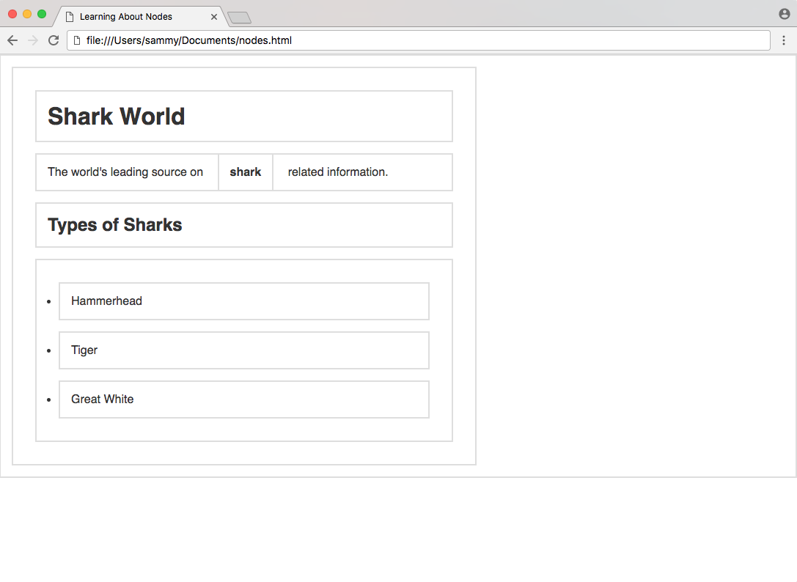
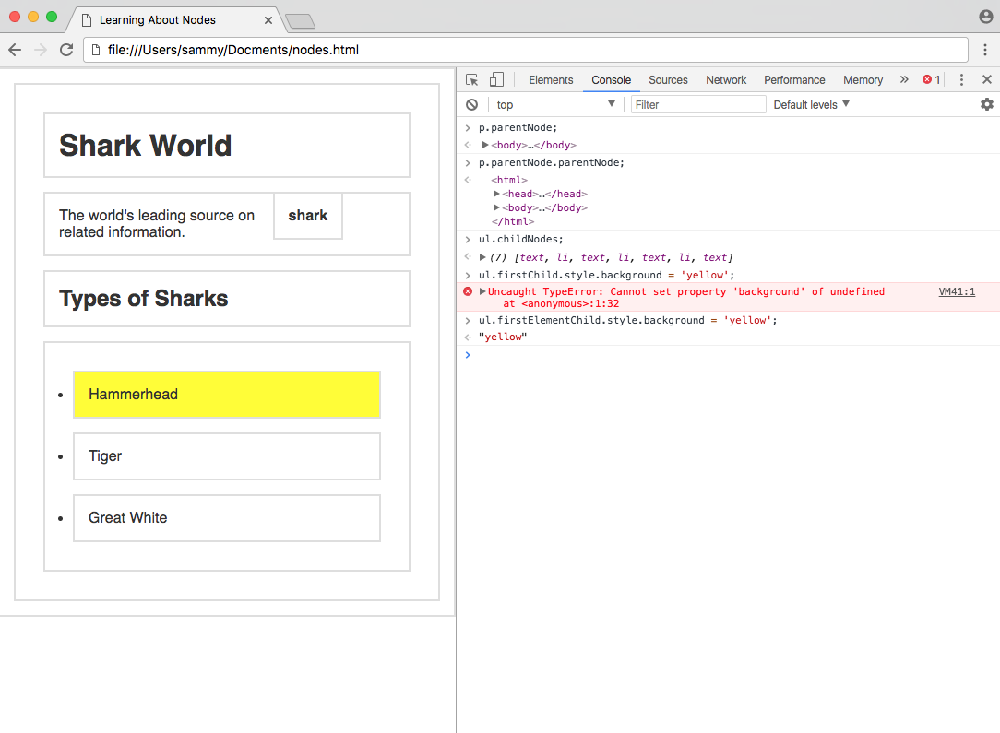
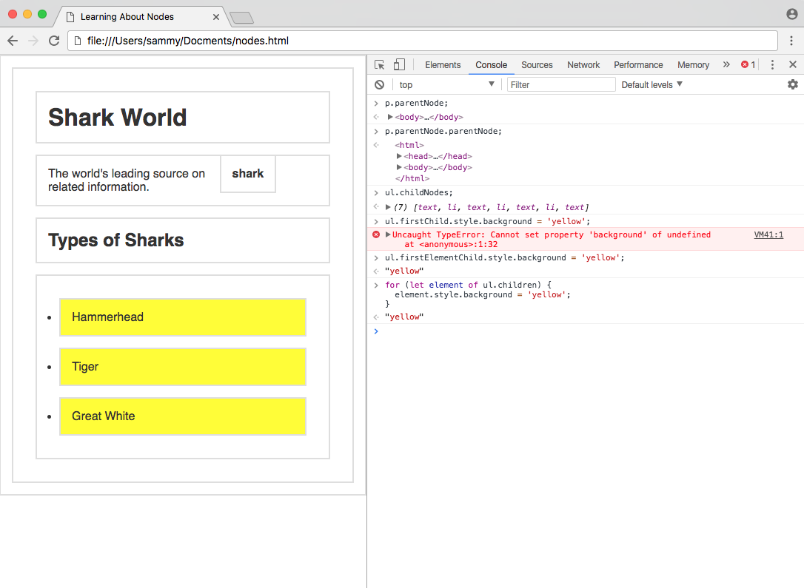
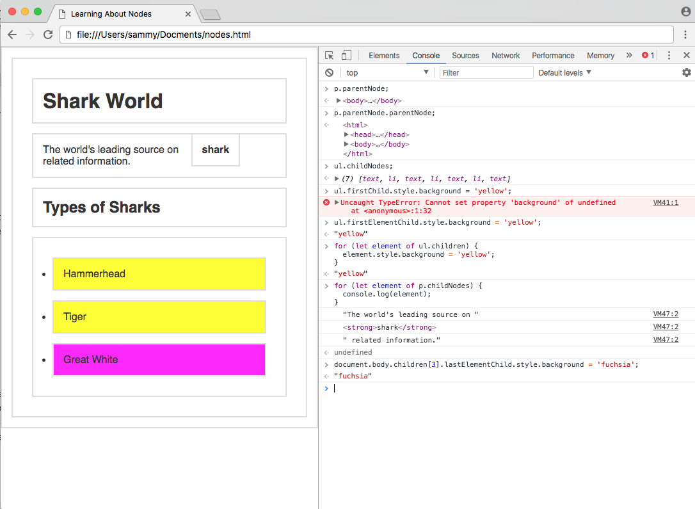
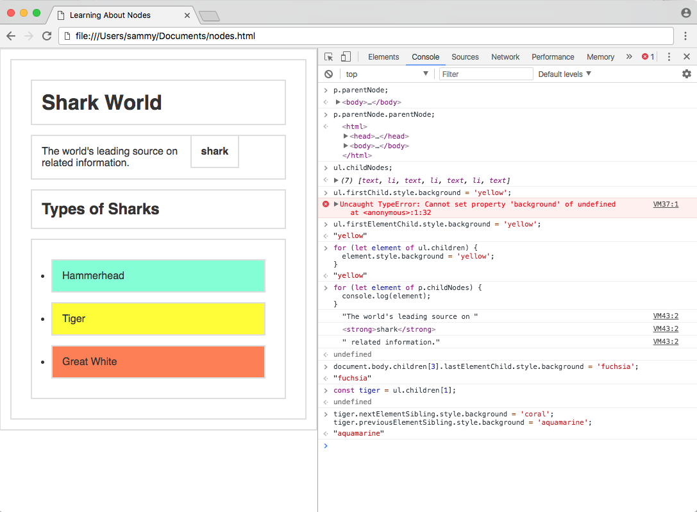

_This post was originally written for [DigitalOcean](https://www.digitalocean.com/community/tutorials/how-to-access-elements-in-the-dom)_.

### Introduction

The previous tutorial in this series, [How to Access Elements in the DOM](/how-to-access-elements-in-the-dom), covers how to use the built-in methods of the `document` object to access HTML elements by ID, class, tag name, and query selectors. We know that the DOM is structured as a [tree of nodes](/understanding-the-dom-tree-and-nodes) with the `document` node at the root and every other node (including elements, comments, and text nodes) as the various branches.

Often, you will want to move through the DOM without specifying each and every element beforehand. Learning how to navigate up and down the DOM tree and move from branch to branch is essential to understanding how to work with JavaScript and HTML.

In this tutorial, we will go over how to traverse the DOM (also known as walking or navigating the DOM) with parent, child, and sibling properties.

## Setup

To begin, we will create a new file called `nodes.html` comprised of the following code.

```html
<!DOCTYPE html>
<html>

<head>
  <title>Learning About Nodes</title>

  <style>
    * { border: 2px solid #dedede; padding: 15px; margin: 15px; }
    html { margin: 0; padding: 0; }
    body { max-width: 600px; font-family: sans-serif; color: #333; }
  </style>
</head>

<body>
  <h1>Shark World</h1>
  <p>The world's leading source on <strong>shark</strong> related information.</p>
  <h2>Types of Sharks</h2>
  <ul>
    <li>Hammerhead</li>
    <li>Tiger</li>
    <li>Great White</li>
  </ul>
</body> 

<script>
  const h1 = document.getElementsByTagName('h1')[0]
  const p = document.getElementsByTagName('p')[0]
  const ul = document.getElementsByTagName('ul')[0]
</script>

</html>
```

When we load the file in a web browser, we'll see rendering that looks like the following screenshot.



In this example website, we have an HTML document with a few elements. Some basic CSS has been added in a `style` tag to make each element obviously visible, and a few variables have been created in the `script` for ease of access of a few elements. Since there is only one of each `h1`, `p`, and `ul`, we can access the first index on each respective `getElementsByTagName` property.

## Root Nodes

The `document` object is the root of every node in the DOM. This object is actually a property of the `window` object, which is the global, top-level object representing a tab in the browser. The [`window`](https://developer.mozilla.org/en-US/docs/Web/API/Window) object has access to such information as the toolbar, height and width of the window, prompts, and alerts. The `document` consists of what is inside of the inner `window`.

Below is a chart consisting of the root elements that every document will contain. Even if a blank HTML file is loaded into a browser, these three nodes will be added and parsed into the DOM.

| Property                   | Node        | Node Type       |
| -------------------------- | ----------- | --------------- |
| `document`                 | `#document` | `DOCUMENT_NODE` |
| `document.documentElement` | `html`      | `ELEMENT_NODE`  |
| `document.head`            | `head`      | `ELEMENT_NODE`  |
| `document.body`            | `body`      | `ELEMENT_NODE`  |

Since the `html`, `head`, and `body` elements are so common, they have their own properties on the `document`.

Open the _Console_ in DevTools and test each of these four properties by submitting them and viewing the output. You can also test `h1`, `p`, and `ul` which will return the elements due to the variables we added in the `script` tag.

## Parent Nodes

The nodes in the DOM are referred to as parents, children, and siblings, depending on their relation to other nodes. The **parent** of any node is the node that is one level above it, or closer to the `document` in the DOM hierarchy. There are two properties to get the parent — `parentNode` and `parentElement`.

| Property                                                                               | Gets                |
| -------------------------------------------------------------------------------------- | ------------------- |
| [`parentNode`](https://developer.mozilla.org/en-US/docs/Web/API/Node/parentNode)       | Parent Node         |
| [`parentElement`](https://developer.mozilla.org/en-US/docs/Web/API/Node/parentElement) | Parent Element Node |

In our `nodes.html` example:

- `html` is the parent of `head`, `body`, and `script`.
- `body` is the parent of `h1`, `h2`, `p` and `ul`, but not `li`, since `li` is two levels down from `body`.

We can test what the parent of our `p` element is with the `parentNode` property. This `p` variable comes from our custom `document.getElementsByTagName('p')[0]` declaration.

```terminal
p.parentNode;
```

<div class="filename">Console</div>

```html
<body>
  ...
</body>
```

The parent of `p` is `body`, but how can we get the grandparent, which is two levels above? We can do so by chaining properties together.

```terminal
p.parentNode.parentNode;
```

<div class="filename">Console</div>

```html
<html>
  ...
</html>
```

Using `parentNode` twice, we retrieved the grandparent of `p`.

There are properties to retrieve the parent of a node, but only one small difference between them, as demonstrated in this snippet below.

```terminal
// Assign html object to html variable
const html = document.documentElement;

console.log(html.parentNode); // > #document
console.log(html.parentElement); // > null
```

The parent of almost any node is an element node, as text and comments cannot be parents to other nodes. However, the parent of `html` is a document node, so `parentElement` returns `null`. Generally, `parentNode` is more commonly used when traversing the DOM.

## Children Nodes

The **children** of a node are the nodes that are one level below it. Any nodes beyond one level of nesting are usually referred to as descendants.

| Property                                                                                             | Gets                     |
| ---------------------------------------------------------------------------------------------------- | ------------------------ |
| [`childNodes`](https://developer.mozilla.org/en-US/docs/Web/API/Node/childNodes)                     | Child Nodes              |
| [`firstChild`](https://developer.mozilla.org/en-US/docs/Web/API/Node/firstChild)                     | First Child Node         |
| [`lastChild`](https://developer.mozilla.org/en-US/docs/Web/API/Node/lastChild)                       | Last Child Node          |
| [`children`](https://developer.mozilla.org/en-US/docs/Web/API/ParentNode/children)                   | Element Child Nodes      |
| [`firstElementChild`](https://developer.mozilla.org/en-US/docs/Web/API/ParentNode/firstElementChild) | First Child Element Node |
| [`lastElementChild`](https://developer.mozilla.org/en-US/docs/Web/API/ParentNode/lastElementChild)   | Last Child Element Node  |

The `childNodes` property will return a live list of every child of a node. You might expect the `ul` element to get three `li` elements. Let's test what it retrieves.

```terminal
ul.childNodes;
```

<div class="filename">Console</div>

```js
(7) [text, li, text, li, text, li, text]
```

In addition to the three `li` elements, it also gets four text nodes. This is because we wrote our own HTML (it was not generated by JavaScript) and the indentation between elements is counted in the DOM as text nodes. This is not intuitive, as the _Elements_ tab of DevTools strips out white space nodes.

If we attempted to change the background color of the first child node using the `firstChild` property, it would fail because the first node is text.

```terminal
ul.firstChild.style.background = 'yellow';
```

<div class="filename">Console</div>

```html
Uncaught TypeError: Cannot set property 'background' of undefined
```

The `children`, `firstElementChild` and `lastElementChild` properties exist in these types of situations to retrieve only the element nodes. `ul.children` will only return the three `li` elements.

Using `firstElementChild`, we can change the background color of the first `li` in the `ul`.

```terminal
ul.firstElementChild.style.background = 'yellow';
```

When you run the code above, your webpage will be updated to modify the background color.



When doing basic DOM manipulation such as in this example, the element-specific properties are extremely helpful. In JavaScript-generated web apps, the properties that select all nodes are more likely to be used, as white-space newlines and indentation will not exist in this case.

A [`for...of`](/how-to-construct-for-loops-in-javascript#forof-loop) loop can be used to iterate through all `children` elements.

```terminal
for (let element of ul.children) {
  element.style.background = 'yellow';
}
```

Now, each child element will have a yellow background.



Since our `p` element has both text and elements inside of it, the `childNodes` property is helpful for accessing that information.

```terminal
for (let element of p.childNodes) {
  console.log(element);
}
```

<div class="filename">Console</div>

```js
"The world's leading source on "
<strong>​shark​</strong>​
" related information."
```

`childNodes` and `children` do not return arrays with all the [Array properties and methods](https://www.digitalocean.com/community/tutorial_series/working-with-arrays-in-javascript), but they appear and behave similarly to JavaScript arrays. You can access nodes by index number, or find their `length` property.

```terminal
document.body.children[3].lastElementChild.style.background = 'fuchsia';
```

The above code will find the last element child (`li`) of the fourth child element (`ul`) of `body` and apply a style.



Using parent and child properties, you can retrieve any node in the DOM.

## Sibling Nodes

The **siblings** of a node are any node on the same tree level in the DOM. Siblings do not have to be the same type of node - text, element, and comment nodes can all be siblings.

| Property                                                                                                                     | Gets                          |
| ---------------------------------------------------------------------------------------------------------------------------- | ----------------------------- |
| [`previousSibling`](https://developer.mozilla.org/en-US/docs/Web/API/Node/previousSibling)                                   | Previous Sibling Node         |
| [`nextSibling`](https://developer.mozilla.org/en-US/docs/Web/API/Node/nextSibling)                                           | Next Sibling Node             |
| [`previousElementSibling`](https://developer.mozilla.org/en-US/docs/Web/API/NonDocumentTypeChildNode/previousElementSibling) | Previous Sibling Element Node |
| [`nextElementSibling`](https://developer.mozilla.org/en-US/docs/Web/API/NonDocumentTypeChildNode/nextElementSibling)         | Next Sibling Element Node     |

Sibling properties work the same way as the children nodes, in that there is a set of properties to traverse all nodes, and a set of properties for only element nodes. `previousSibling` and `nextSibling` will get the next node that immediately precedes or follows the specified node, and `previousElementSibling` and `nextElementSibling` will only get element nodes.

In our `nodes.html` example, let's select the middle element of `ul`.

```terminal
const tiger = ul.children[1];
```

Since we created our DOM from scratch and not as a JavaScript web app, we will need to use the element sibling properties to access the previous and next element nodes, as there is white space in the DOM.

```terminal
tiger.nextElementSibling.style.background = 'coral';
tiger.previousElementSibling.style.background = 'aquamarine';
```

Running this code should have applied `coral` to the background of `Hammerhead` and `aquamarine` to the background of `Great White`.



Sibling properties can be chained together, just like parent and node properties.

## Conclusion

In this tutorial, we covered how to access the root nodes of every HTML document and how to walk the DOM tree through parent, child, and sibling properties.

With what you learned in [How to Access Elements in the DOM](/how-to-access-elements-in-the-dom) and this tutorial, you should be able to confidently access any node in the DOM of any website.
