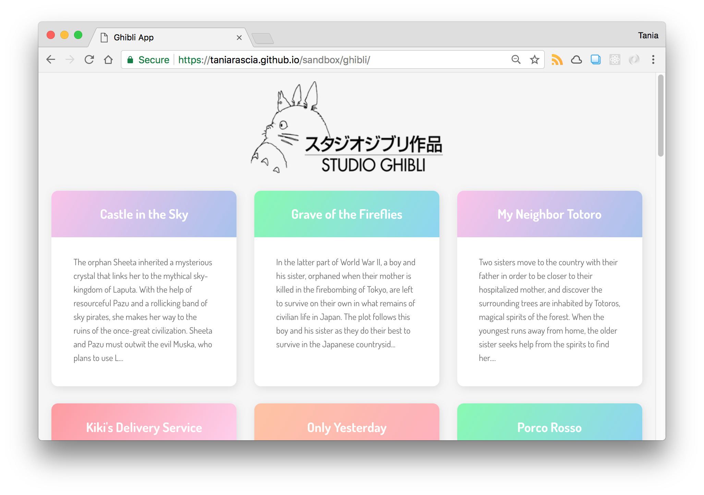
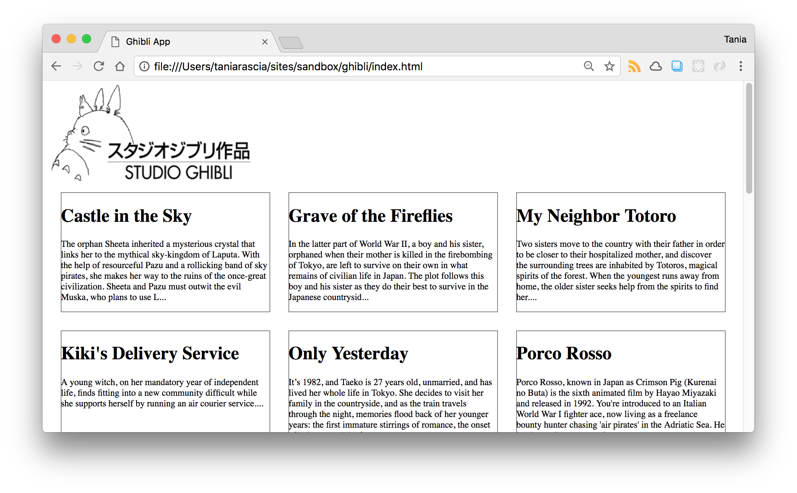

A big part of working with JavaScript is knowing how to connect to APIs. As a fledgling developer, you may have been told at some point to just "play around with some APIs!" to learn what they are and how to work with them. If you've ever taken a look at the documentation for an API and had no idea where to start or what to do and gotten frustrated, this is the article for you.

We're going to make a very simple web app with plain JavaScript that will retrieve information from an API and display it on the page. There will be no server, dependencies, build tools, or anything else to further muddy the waters on an already difficult and confusing topic for beginners.

- [View Demo App](https://taniarascia.github.io/sandbox/ghibli/)
- [Source Code on GitHub](https://github.com/taniarascia/sandbox/tree/master/ghibli)

#### Prerequisites

- Basic knowledge of [HTML and CSS](https://internetingishard.com/html-and-css/).
- Basic knowledge of [JavaScript syntax and datatypes](https://www.sitepoint.com/beginners-guide-javascript-variables-and-datatypes/).
- Basic knowledge of working with [JSON and JavaScript objects](/how-to-use-json-data-with-php-or-javascript/). This brief article will clear it up completely.

Everything else we'll cover along the way.

#### Goals

We are going to write from scratch [this simple web app](https://taniarascia.github.io/sandbox/ghibli/) that connects to a [Studio Ghibli API](https://ghibliapi.herokuapp.com/), retrieves the data with JavaScript, and displays it on the front end of a website. This is _not_ meant to be an extensive resource on APIs or REST - just the simplest possible example to get up and running that you can build from in the future. We'll learn:

- What a Web API is.
- Learn how to use the HTTP request `GET` with JavaScript
- How create and display HTML elements with JavaScript.

It will look like this:



Let's get started.

## Quick overview

**API** stands for Application Program Interface, which can be defined as a set of methods of communication between various software components. In other words, an API allows software to communicate with another software.

We'll be focusing specifically on Web APIs, which allow a web server to interact with third-party software. In this case, the web server is using **HTTP requests** to communicate to a publicly available URL **endpoint** containing JSON data. If this is confusing now, it will make sense by the end of the article.

You may be familiar with the concept of a **CRUD** app, which stands for Create, Read, Update, Delete. Any programming language can be used to make a CRUD app with various methods. A web API uses HTTP requests that correspond to the CRUD verbs.

| Action | HTTP Method   | Description                  |
| ------ | ------------- | ---------------------------- |
| Create | `POST`        | Creates a new resource       |
| Read   | `GET`         | Retrieves a resource         |
| Update | `PUT`/`PATCH` | Updates an existing resource |
| Delete | `DELETE`      | Deletes a resource           |

> If you've heard **REST** and RESTful APIs, that is simply referring to a set of standards that conform to a specific architectural style. Most web apps do, or aim to conform to REST standards. Overall, there are a _lot_ of terms, acronyms and concepts to understand - HTTP, API, REST - so it's normal to feel confused and frustrated, especially when API documentation assumes you already know what to do.

## Setting Up

What is our objective? We want to get the data for all Studio Ghibli films and display the titles and descriptions in a grid. For some background knowledge, Studio Ghibli is a Japanese animation studio that produced several films, such as Spirited Away, which my friend [Craig](https://twitter.com/siliconeidolon) inspired me to use as an example.

We're going to start by creating an **index.html** file in a new directory. The project will only consist of **index.html**, **style.css**, and **scripts.js** at the end. This HTML skeleton just links to a CSS and JavaScript file, loads in a font, and contains a div with a `root` id. This file is complete and will not change. We'll be using JavaScript to add everything from here out.

<div class="filename">index.html</div>

```html
<!DOCTYPE html>
<html lang="en">
  <head>
    <meta charset="utf-8" />
    <meta name="viewport" content="width=device-width, initial-scale=1.0" />

    <title>Ghibli App</title>

    <link href="https://fonts.googleapis.com/css?family=Dosis:400,700" rel="stylesheet" />
    <link href="style.css" rel="stylesheet" />
  </head>

  <body>
    <div id="root"></div>
    <script src="scripts.js"></script>
  </body>
</html>
```

Since this article is focused on the concepts of APIs and JavaScript, I will not be explaining how the CSS works. We will create a **style.css** that will be used to create a grid. For brevity's sake, I only included the most pertinent **structural** CSS below, but you can copy the [full CSS code here](https://raw.githubusercontent.com/taniarascia/sandbox/master/ghibli/style.css).

<div class="filename">style.css</div>

```css
#root {
  max-width: 1200px;
  margin: 0 auto;
}

.container {
  display: flex;
  flex-wrap: wrap;
}

.card {
  margin: 1rem;
  border: 1px solid gray;
}

@media screen and (min-width: 600px) {
  .card {
    flex: 1 1 calc(50% - 2rem);
  }
}

@media screen and (min-width: 900px) {
  .card {
    flex: 1 1 calc(33% - 2rem);
  }
}
```

Now we have HTML and CSS set up, so you can make **scripts.js** and we'll continue from there.

## Connecting to the API

Let's take a look at the [Studio Ghibli API documentation](https://ghibliapi.herokuapp.com/). This API was created to help developers learn how to interact with resources using HTTP requests, which is perfect for us here. Since an API can be accessed by many different methods - JavaScript, PHP, Ruby, Python and so on - the documentation for most APIs doesn't tend to give specific instructions for how to connect.

We can see from this documentation that it tells us we can make requests with `curl` or regular REST calls, but we might not have a clue how to do that yet.

### Obtaining the API endpoint

To get started, let's scroll to the [films section](https://ghibliapi.herokuapp.com/#tag/Films). On the right you'll see `GET /films`. It will show us the URL of our API endpoint, [https://ghibliapi.herokuapp.com/films](https://ghibliapi.herokuapp.com/films). Clicking on that link will display an array of objects in JSON.

> If you do not have an extension on your browser for viewing JSON files, add one now, such as [JSON View](https://chrome.google.com/webstore/category/extensions?hl=en). This will make reading JSON much, much easier. Remember, if you've never worked with JSON, [read this prerequisite article](/how-to-use-json-data-with-php-or-javascript/).

### Retrieving the data with an HTTP request

Before we try to put anything on the front end of the website, let's open a connection the API. We'll do so using `XMLHttpRequest` objects, which is a way to open files and make an HTTP request.

We'll create a `request` variable and assign a new `XMLHttpRequest` object to it. Then we'll open a new connection with the `open()` method - in the arguments we'll specify the type of request as `GET` as well as the URL of the API endpoint. The request completes and we can access the data inside the `onload` function. When we're done, we'll send the request.

<div class="filename">scripts.js</div>

```js
// Create a request variable and assign a new XMLHttpRequest object to it.
var request = new XMLHttpRequest()

// Open a new connection, using the GET request on the URL endpoint
request.open('GET', 'https://ghibliapi.herokuapp.com/films', true)

request.onload = function () {
  // Begin accessing JSON data here
  }
}

// Send request
request.send()
```

### Working with the JSON response

Now we've received a response from our HTTP request, and we can work with it. However, the response is in JSON, and we need to convert that JSON in to JavaScript objects in order to work with it.

We're going to use `JSON.parse()` to parse the response, and create a `data` variable that contains all the JSON as an array of JavaScript objects. Using `forEach()`, we'll console log out the title of each film to ensure it's working properly.

<div class="filename">scripts.js</div>

```js
// Begin accessing JSON data here
var data = JSON.parse(this.response)

data.forEach(movie => {
  // Log each movie's title
  console.log(movie.title)
})
```

Using _Inspect_ on **index.html** and viewing the console, you should see the titles of 20 Ghibli films. Success!

The only thing we're missing here is some way to deal with errors. What if the wrong URL is used, or the URL broke and nothing was being displayed? When an HTTP request is made, the response returns with [HTTP status codes](https://developer.mozilla.org/en-US/docs/Web/HTTP/Status). `404` is the most well-known response, meaning **Not Found**, and `200` **OK** is a successful request.

Let's just wrap our code in an `if` statement, succeeding on any response in the 200-300 range, and log out an error if the request fails. You can mess up the URL to test the error.

<div class="filename">scripts.js</div>

```js
// Begin accessing JSON data here
var data = JSON.parse(this.response)

if (request.status >= 200 && request.status < 400) {
  data.forEach(movie => {
    console.log(movie.title)
  })
} else {
  console.log('error')
}
```

Here is the entire code so far.

scripts.js

```js
var request = new XMLHttpRequest()

request.open('GET', 'https://ghibliapi.herokuapp.com/films', true)
request.onload = function() {
  // Begin accessing JSON data here
  var data = JSON.parse(this.response)

  if (request.status >= 200 && request.status < 400) {
    data.forEach(movie => {
      console.log(movie.title)
    })
  } else {
    console.log('error')
  }
}

request.send()
```

We've successfully used a `GET` HTTP request to retrieve (or consume) the API endpoint, which consisted of data in JSON format. However, we're still stuck in the console - we want to display this data on the front end of the website, which we'll do by modifying the DOM.

> `XMLHttpRequest` is a widely supported built-in method of making requests. There is also a newer [Fetch API](https://developer.mozilla.org/en-US/docs/Web/API/Fetch_API) which can be used for the same purpose, which is simpler but has less browser support.

## Displaying the Data

In order to display information on the front end of a site, we'll be working with the DOM, which is actually an API itself that allows JavaScript to communicate with HTML. If you have no experience at all with the DOM, I wrote [Understanding and Modifying the DOM in JavaScript](https://www.digitalocean.com/community/tutorials/introduction-to-the-dom) for DigitalOcean that will clarify what the DOM is and how the DOM differs from HTML source code.

By the end, our page will consist of a logo image followed by a container with multiple card elements - one for each film. Each card will have a heading and a paragraph, that contains the title and description of each film. Here's what that looks like, with only essential CSS loaded in:



If you remember, our **index.html** just has a root div - `<div id="root">` right now. We'll access it with `getElementById()`. We can briefly remove all the previous code we've written for now, which we'll add back in just a moment.

<div class="filename">scripts.js</div>

```js
const app = document.getElementById('root')
```

If you're not 100% positive what `getElementById()` does, take the above code and `console.log(app)`. That should help clarify what is actually happening there.

The first thing in our website is the logo, which is an `img` element. We'll create the image element with `createElement()`.

```js
const logo = document.createElement('img')
```

An empty `img` is no good, so we'll set the `src` attribute to `logo.png`. (Found [here](https://github.com/taniarascia/sandbox/blob/master/ghibli/logo.png))

```js
logo.src = 'logo.png'
```

We'll create another element, a `div` this time, and set the `class` attribute to `container`.

```js
const container = document.createElement('div')
container.setAttribute('class', 'container')
```

Now we have a logo and a container, and we just need to place them in the website. We'll use the `appendChild()` method to append the logo image and container div to the app root.

```js
app.appendChild(logo)
app.appendChild(container)
```

Here is the full code for that.

<div class="filename">scripts.js</div>

```js
const app = document.getElementById('root')

const logo = document.createElement('img')
logo.src = 'logo.png'

const container = document.createElement('div')
container.setAttribute('class', 'container')

app.appendChild(logo)
app.appendChild(container)
```

After saving, on the front end of the website, you'll see the following.

<div class="filename">Elements</div>

```html
<div id="root">
  
  <div class="container"></div>
</div>
```

This will only be visible in the _Inspect_ Elements tab, not in the HTML source code, as explained in the DOM article I linked.

Now we're going to paste all our code from earlier back in. The last step will be to take what we consoled out previously and make them into card elements.

Paste everything back in, but we'll just be looking at what's inside the `forEach()`.

```js
data.forEach(movie => {
  console.log(movie.title)
  console.log(movie.description)
})
```

Instead of `console.log`, we'll use `textContent` to set the text of an HTML element to the data from the API. I'm using `substring()` on the `p` element to limit the description and keep each card equal length.

<div class="filename">scripts.js</div>

```js
data.forEach(movie => {
  // Create a div with a card class
  const card = document.createElement('div')
  card.setAttribute('class', 'card')

  // Create an h1 and set the text content to the film's title
  const h1 = document.createElement('h1')
  h1.textContent = movie.title

  // Create a p and set the text content to the film's description
  const p = document.createElement('p')
  movie.description = movie.description.substring(0, 300) // Limit to 300 chars
  p.textContent = `${movie.description}...` // End with an ellipses

  // Append the cards to the container element
  container.appendChild(card)

  // Each card will contain an h1 and a p
  card.appendChild(h1)
  card.appendChild(p)
})
```

I'll also replace the console'd error with an error on the front end, using the best HTML element, [`marquee`](https://developer.mozilla.org/en-US/docs/Web/HTML/Element/marquee)! (I'm only doing this as a joke for fun and demonstrative purposes, do not actually use `marquee` in any sort of real application, or take me seriously here.)

```js
const errorMessage = document.createElement('marquee')
errorMessage.textContent = `Gah, it's not working!`
app.appendChild(errorMessage)
```

And we're done! Here is the final **scripts.js** code.

<div class="filename">scripts.js</div>

```js
const app = document.getElementById('root')

const logo = document.createElement('img')
logo.src = 'logo.png'

const container = document.createElement('div')
container.setAttribute('class', 'container')

app.appendChild(logo)
app.appendChild(container)

var request = new XMLHttpRequest()
request.open('GET', 'https://ghibliapi.herokuapp.com/films', true)
request.onload = function() {
  // Begin accessing JSON data here
  var data = JSON.parse(this.response)
  if (request.status >= 200 && request.status < 400) {
    data.forEach(movie => {
      const card = document.createElement('div')
      card.setAttribute('class', 'card')

      const h1 = document.createElement('h1')
      h1.textContent = movie.title

      const p = document.createElement('p')
      movie.description = movie.description.substring(0, 300)
      p.textContent = `${movie.description}...`

      container.appendChild(card)
      card.appendChild(h1)
      card.appendChild(p)
    })
  } else {
    const errorMessage = document.createElement('marquee')
    errorMessage.textContent = `Gah, it's not working!`
    app.appendChild(errorMessage)
  }
}

request.send()
```

And with the full CSS styles, here is what the final product looks like.


Again, here is a link to the live app and the source code.

- [View Demo App](https://taniarascia.github.io/sandbox/ghibli/)
- [Source Code on GitHub](https://github.com/taniarascia/sandbox/tree/master/ghibli)

## Conclusion

Congratulations, you used plain JavaScript to connect to the API using HTTP requests. Hopefully you have a better understanding of what an API endpoint is, how the browser communicates with third-party API data with requests and responses, how to parse JSON into arrays and objects that JavaScript understands, and how to build a front end entirely with JavaScript.

We did this all without having to worry about anything like Node.js, npm, Webpack, React, Angular, build tools, Axios and other popular development terms, dependencies, and frameworks that may confuse you about what is happening under the hood in it's simplest form.

I hope you found this article useful, and please feel free to share, or correct me where I'm wrong in the comments below!
