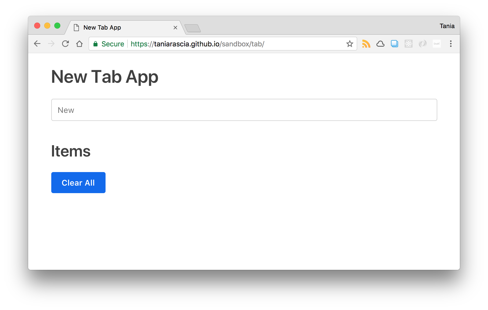
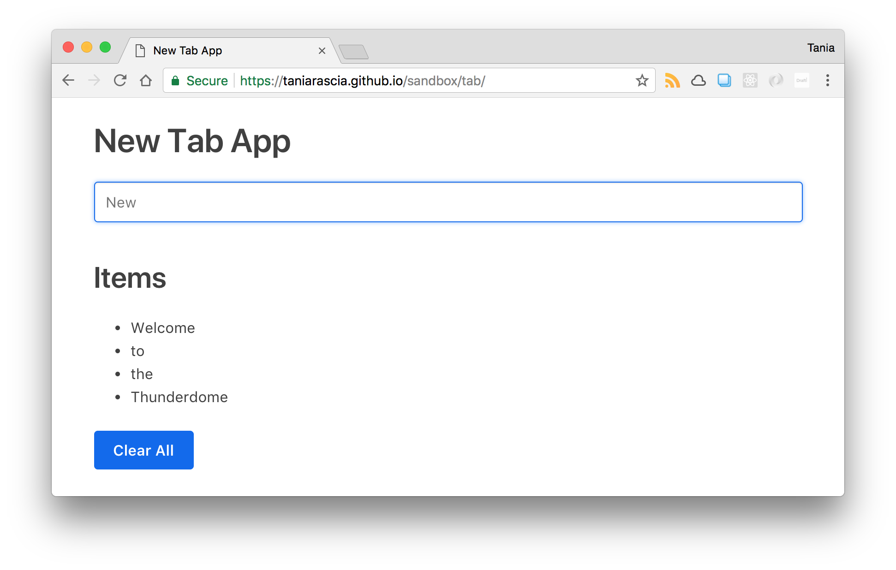

I like making tutorials where you build a small application completely from scratch with plain JavaScript. A to-do list is a common app idea, but without having a database to store the to-dos, it's not particularly useful, and that adds a bit of complexity beyond beginner territory.

However, even without any sort of database, we can use the local storage built into a web browser to save to-do items. This could be actually useful for taking quick notes. Set the app as your "new tab" page in your browser and the to-dos will persist on your local computer as long as you don't clear the cache.

So that's what we're going to learn to do today.

- [View Demo](https://taniarascia.github.io/sandbox/tab/)
- [View Source](https://github.com/taniarascia/sandbox/tree/master/tab)

#### Prerequisites

- Basic knowledge of [HTML and CSS](https://internetingishard.com/html-and-css/).
- Basic knowledge of [JavaScript syntax and datatypes](https://www.sitepoint.com/beginners-guide-javascript-variables-and-datatypes/).
- Basic knowledge of working with the DOM (optional). The [How to Connect to an API](/how-to-connect-to-an-api-with-javascript/) article will teach you how to make a simple web app, otherwise you can learn with this small tutorial as well.

#### Goals

- Create a "new tab page" application that stores to-do items locally in the browser's [local storage](https://developer.mozilla.org/en-US/docs/Web/API/Window/localStorage) and displays them on the front end. [View example](https://taniarascia.github.io/sandbox/tab/).

## Overview of web storage

Web storage is data stored locally in a user's browser. There are two types of web storage:

- [Local storage](https://developer.mozilla.org/en-US/docs/Web/API/Window/localStorage) - data with no expiration date that will persist after the browser window is closed.
- [Session storage](https://developer.mozilla.org/en-US/docs/Web/API/Window/sessionStorage) - data that gets cleared after the browser window is closed.

This is useful for saving data such as user preferences (light or dark color theme on a website), remembering shopping cart items, or remembering a user is logged into a website.

Previously, [cookies](https://developer.mozilla.org/en-US/docs/Web/HTTP/Cookies) were the only option for remembering this type of local, temporary data. Local storage has a significantly higher storage limit (5MB vs 4KB) and doesn't get sent with every HTTP request, so it can be a better option for client-side storage.

Here is an overview of `localStorage` methods.

| Method         | Description                        |
| -------------- | ---------------------------------- |
| `setItem()`    | Add key and value to local storage |
| `getItem()`    | Retrieve a value by the key        |
| `removeItem()` | Remove an item by key              |
| `clear()`      | Clear all storage                  |

You can test out what's in local storage by going to the JavaScript console and typing it in. Actually do this, don't just read it.

```js
localStorage
```

```terminal
Storage {length: 0}
```

Adding some data to `localStorage` is as easy as using the `setItem()` method. I'll use a generic key and value for the names, but they can be any strings.

```js
localStorage.setItem('key', 'value')
```

Now if you test `localStorage` in the console again, you'll find your new key and value.

```terminal
Storage {key: "value", length: 1}
```

If you want to get the value for a particular key, you'll use the `getItem()` method.

```js
localStorage.getItem('key')
```

```terminal
value
```

Finally, you can remove the data with `removeItem()`.

```js
localStorage.removeItem('key')
```

Using `clear()` will clear all local storage.

```js
localStorage.clear()
```

Now we can begin setting up the app.

## Setting up the front end

First, we'll create a simple HTML front end with **index.html**. I'm loading in [Primitive](https://taniarascia.github.io/primitive/) (my minimalist CSS framework) for styles, because that's what I always use when I need a quick front end.

<div class="filename">index.html</div>

```html
<!DOCTYPE html>
<html lang="en">
  <head>
    <meta charset="utf-8" />
    <meta name="viewport" content="width=device-width, initial-scale=1" />

    <title>New Tab App</title>

    <link rel="stylesheet" href="https://taniarascia.github.io/primitive/css/main.min.css" />
  </head>

  <body>
    <div class="small-container">
      <h1>New Tab App</h1>

      <!-- more will go here -->
    </div>
  
    <script src="js/scripts.js"></script>
  </body>
</html>
```

We're going to set up with three things:

- **A text input** - for adding new items.
- **A list** - where the items will be added on the front end.
- **A button** - to clear all items.

Add this code where the "more will go here" comment is.

<div class="filename">index.html</div>

```html
<form>
  <input id="item" type="text" placeholder="New" required />
</form>

<h2>Items</h2>
<ul></ul>

<button>Clear All</button>
```

Here's what it looks like:



And that's all for the front end. From here, we'll focus on adding functionality with JavaScript.

> The HTML presented here is simplified for demonstrative purposes, and does not account for accessibility concerns.

## Setting up JavaScript functionality

Before we integrate this into local storage, let's just get the form and list working - we want anything we submit in the `input` to appear in the `ul`.

First, I'm just going to set up some variables for the elements on the page - the form, the unordered list, the button, and the text input.

<div class="filename">scripts.js</div>

```js
const form = document.querySelector('form')
const ul = document.querySelector('ul')
const button = document.querySelector('button')
const input = document.getElementById('item')
```

Next, I'm going to make a function that creates an `li` element, since I'll be doing that more than once. I'll call the function `liMaker()`. It just creates an `li` element, sets the text of the element to the parameter, and appends the list item to the `ul`.

<div class="filename">scripts.js</div>

```js
const liMaker = text => {
  const li = document.createElement('li')
  li.textContent = text
  ul.appendChild(li)
}
```

I'm going to add an event listener to the form that watches for a submit event - which will be any time you press enter on the form. The `e.preventDefault()` will prevent the form from the default submit action, which we don't want, since we're not sending any data to a server.

Instead, the form will submit the value of the `input`. We're going to call the `liMaker()` function, which will create the item with the text of the `input` value and append it to the DOM. Finally, we'll set the `input` value to an empty string so you don't have to erase the last item entered manually.

<div class="filename">scripts.js</div>

```js
form.addEventListener('submit', function(e) {
  e.preventDefault()

  liMaker(input.value)
  input.value = ''
})
```

Now with paltry few lines of code, we have a little app that adds to-do items to a list.



Since we're not saving the items anywhere, when you close or refresh the browser, the items will be gone. The final step is to integrate it into local storage so that the data persists.

## Integrating local storage

Now we're going to add a few more bits of functionality to the app. First, every time the form is submitted, the `input` value should be added to the `localStorage` as well as appear on the front end. We'll also want to loop through all the existing local storage items and display them at the top of the list. Last, we want the "Clear All" button to remove all items from local storage as well as the front end.

Let's create an empty array to start, and create a `localStorage` key called "items". Now, `localStorage` only supports strings as values, and want to store our to-dos in an array.

We can get around this by using `JSON.stringify()` to convert a data array to a string. We'll use `JSON.parse()` to convert the contents of `localStorage` back into something we can work with later in the `data` variable. Put this code below all the constant declarations we set earlier.

<div class="filename">scripts.js</div>

```js
// other constant declarations here
let itemsArray = []

localStorage.setItem('items', JSON.stringify(itemsArray))
const data = JSON.parse(localStorage.getItem('items'))
```

In the form event listener, let's push any new `input` value into the array, then set the `localStorage` to the new, updated value.

<div class="filename">scripts.js</div>

```js
// form event listener here
e.preventDefault()

itemsArray.push(input.value)
localStorage.setItem('items', JSON.stringify(itemsArray))
```

We're going to loop through everything in our `data` variable above, which contains all the existing `localStorage` data in a form JavaScript can understand and work with, and we'll run the `liMaker()` again. This will display all existing stored information on the front end every time we open the app.

<div class="filename">scripts.js</div>

```js
data.forEach(item => {
  liMaker(item)
})
```

Last, we'll add a click event to the button that will clear all data from `localStorage`, as well as removing every child node from the `ul`.

<div class="filename">scripts.js</div>

```js
button.addEventListener('click', function() {
  localStorage.clear()
  while (ul.firstChild) {
    ul.removeChild(ul.firstChild)
  }
})
```

If all went well, everything will save to storage as well as appear on the front end, which you can check by testing `localStorage` in the console.

```terminal
Storage {items:
"["Welcome","to","the","Thunderdome"]",
  length: 1}
```

There's one final problem: after closing the browser or reloading the page, all the existing information in `localStorage` is gone, and nothing remains on the front end. Why?

Our `itemsArray` is being reset to an empty array every time the script runs. We could fix this by making a conditional statement that checks if `localStorage` already exists, such as in the below example.

<div class="filename">scripts.js</div>

```js
let items

if (localStorage.getItem('items')) {
  items = JSON.parse(localStorage.getItem('items'))
} else {
  items = []
}
```

A little more concise would be to use a [ternary operator](https://www.digitalocean.com/community/tutorials/how-to-write-conditional-statements-in-javascript#ternary-operator) to do the same thing.

<div class="filename">scripts.js</div>

```js
let itemsArray = localStorage.getItem('items') ? JSON.parse(localStorage.getItem('items')) : []
```

With that, our app is complete! Now when you enter in some information and refresh or close the browser window, the data will persist until you manually clear the data in Developer Tools (under Application -> Storage) or by running the `localStorage.clear()` command. Here is the full JavaScript code.

<div class="filename">scripts.js</div>

```js
const form = document.querySelector('form')
const ul = document.querySelector('ul')
const button = document.querySelector('button')
const input = document.getElementById('item')
let itemsArray = localStorage.getItem('items') ? JSON.parse(localStorage.getItem('items')) : []

localStorage.setItem('items', JSON.stringify(itemsArray))
const data = JSON.parse(localStorage.getItem('items'))

const liMaker = text => {
  const li = document.createElement('li')
  li.textContent = text
  ul.appendChild(li)
}

form.addEventListener('submit', function(e) {
  e.preventDefault()

  itemsArray.push(input.value)
  localStorage.setItem('items', JSON.stringify(itemsArray))
  liMaker(input.value)
  input.value = ''
})

data.forEach(item => {
  liMaker(item)
})

button.addEventListener('click', function() {
  localStorage.clear()
  while (ul.firstChild) {
    ul.removeChild(ul.firstChild)
  }
})
```

Here is the demo and source code once again.

- [View Demo](https://taniarascia.github.io/sandbox/tab/) 
- [View Source](https://github.com/taniarascia/sandbox/tree/master/tab)

## Conclusion

In this tutorial, we learned how to make a simple to-do based application that can potentially be used to keep quick notes as a new tab page by using HTML5 web storage. I hope you have a better understanding of local storage and how to integrate it into a simple app now! Please share this article if you found it helpful so that others can benefit as well.
