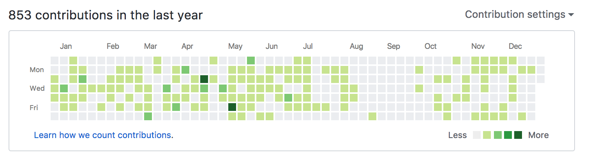

Last year, I wrote [2016 into 2017](/2016-into-2017/), a post summarizing what I felt I accomplished throughout the year and some of my goals for the year to come. I'm continuing that tradition this year,

## I visited 13 countries

This was the big one. I realized a lifelong dream of mine to take an extended, solo travel adventure in foreign lands. I detailed the trip in this [Backpacking Europe](/europe/) post. It's hard to summarize in a sentence or two, but meeting three branches of my extended family and my European friends Craig, Timm, Rose, Esther, and João, as well as making a few new ones along the way.

I also went to New York, San Francisco, Nashville, and D.C., seeing more of my own country.

- Scotland (Edinburgh)
- Portugal (Braga, Porto, Lisbon)
- Spain (Seville, Malaga, Nerja)
- Germany (Berlin, Munich)
- Czechia (Prague, Slavkov U Brna)
- Austria (Vienna)
- Hungary (Budapest)
- Bulgaria (Sofia, Kazanlak)
- Greece (Athens)
- Slovakia (Bratislava, Klin)
- Switzerland (Zurich, Lucerne)
- England (London)
- Ireland (Dublin)

## I wrote 43 articles

This is huge! Last year I wrote 14 - this year, 43! I wrote for DigitalOcean and SitePoint as well as my own website. Writing tutorials is still my preferred method of learning, and I'm glad to be able to share it with you all.

### TaniaRascia.com

- [How to Use JSON Data with PHP or JavaScript](/how-to-use-json-data-with-php-or-javascript/)
- [Simple jQuery Examples with Code and Demos](/simple-jquery-examples-with-code-and-demos/)
- [A Practical Guide to Search Engine Optimization (SEO) with Google](/a-practical-guide-to-search-engine-optimization-seo-with-google/)
- [Create a Simple Database App: Connecting to MySQL with PHP](/create-a-simple-database-app-connecting-to-mysql-with-php/)
- [The Three Types of Can't](/the-three-types-of-cant/)
- [Version 2.0: Website Redesign](/version-2-0-website-redesign-863-commits-later/)
- [The Beginning of the Next Phase](/the-beginning-of-the-next-phase/)
- [Web Developers and Bloggers I Follow](/web-developers-and-bloggers-i-follow-2017/)
- [What are Vagrant and VirtualBox and How Do I Use Them](/what-are-vagrant-and-virtualbox-and-how-do-i-use-them/)
- [How to Install Apache, PHP 7.1, and MySQL on Ubuntu with Vagrant](/how-to-install-apache-php-7-1-and-mysql-on-ubuntu-with-vagrant/)
- [How I Made a Career Change into Web Development](/how-i-made-a-career-change-into-web-development/)
- [Backpacking in Europe: Planning and Packing](/backpacking-in-europe-planning-and-packing/)
- [How to Install and Use Node.js and npm (Mac, Windows, Linux)](/how-to-install-and-use-node-js-and-npm-mac-and-windows/)
- [Real World Examples of Map, Filter and Reduce in JavaScript](/real-world-examples-of-map-filter-and-reduce-in-javascript/)
- [Design for Developers: Specific Steps to Improve Your Website Design](/design-for-developers/)
- [How to Connect to an API with JavaScript](/how-to-connect-to-an-api-with-javascript/)
- [How to Use Local Storage with JavaScript](/how-to-use-local-storage-with-javascript/)

### DigitalOcean

- [An Introduction to jQuery](https://www.digitalocean.com/community/tutorials/an-introduction-to-jquery)
- [How to Write Comments in JavaScript](https://www.digitalocean.com/community/tutorials/how-to-write-comments-in-javascript)
- [Understanding Syntax and Code Structure in JavaScript](https://www.digitalocean.com/community/tutorials/understanding-syntax-and-code-structure-in-javascript)
- [How to Work with Strings in JavaScript](https://www.digitalocean.com/community/tutorials/how-to-work-with-strings-in-javascript)
- [Index, Slice, Split, and Manipulate Strings in JavaScript](https://www.digitalocean.com/community/tutorials/how-to-index-split-and-manipulate-strings-in-javascript)
- [How to Do Math in JavaScript with Operators](https://www.digitalocean.com/community/tutorials/how-to-do-math-in-javascript-with-operators)
- [Understanding Arrays in JavaScript](https://www.digitalocean.com/community/tutorials/understanding-arrays-in-javascript)
- [Working with JavaScript Array Mutator Methods](https://www.digitalocean.com/community/tutorials/how-to-use-array-methods-in-javascript-mutator-methods)
- [Working with JavaScript Array Accessor Methods](https://www.digitalocean.com/community/tutorials/how-to-use-array-methods-in-javascript-accessor-methods)
- [Working with JavaScript Array Iteration Methods](https://www.digitalocean.com/community/tutorials/how-to-use-array-methods-in-javascript-iteration-methods)
- [Understanding Objects in JavaScript](https://www.digitalocean.com/community/tutorials/understanding-objects-in-javascript)
- [How to Write Conditional Statements in JavaScript](https://www.digitalocean.com/community/tutorials/how-to-write-conditional-statements-in-javascript)
- [How to Use the Switch Statement in JavaScript](https://www.digitalocean.com/community/tutorials/how-to-use-the-switch-statement-in-javascript)
- [Using While and Do While Loops in JavaScript](https://www.digitalocean.com/community/tutorials/using-while-and-do-while-loops-in-javascript)
- [How to Construct For Loops in JavaScript](https://www.digitalocean.com/community/tutorials/how-to-construct-for-loops-in-javascript)
- [How to Define Functions in JavaScript](https://www.digitalocean.com/community/tutorials/how-to-define-functions-in-javascript)
- [Understanding Date and Time in JavaScript](https://www.digitalocean.com/community/tutorials/understanding-date-and-time-in-javascript)
- [How to Upload a File to Object Storage with Node.js](https://www.digitalocean.com/community/tutorials/how-to-upload-a-file-to-object-storage-with-node-js)
- [Introduction to the DOM](https://www.digitalocean.com/community/tutorials/introduction-to-the-dom)
- [Understanding the DOM Tree and Nodes](https://www.digitalocean.com/community/tutorials/understanding-the-dom-tree-and-nodes)
- [How to Access Elements in the DOM](https://www.digitalocean.com/community/tutorials/how-to-access-elements-in-the-dom)
- [How to Traverse the DOM](https://www.digitalocean.com/community/tutorials/how-to-traverse-the-dom)
- [How to Make Changes to the DOM](https://www.digitalocean.com/community/tutorials/how-to-make-changes-to-the-dom)

### SitePoint

- [A Beginner’s Guide to JavaScript Variables and Datatypes](https://www.sitepoint.com/beginners-guide-javascript-variables-and-datatypes/)
- [Back to Basics: JavaScript Operators, Conditionals & Functions](https://www.sitepoint.com/javascript-operators-conditionals-functions/)

## I did 1 presentation

This year I did a speech on creating a WordPress theme from scratch for [WordCamp 2017](https://2017.chicago.wordcamp.org/). This was my first presentation ever, and it was a great experience! I hope to do more talks as time goes on.

- [How to Develop a WordPress Theme from Scratch](https://wordpress.tv/2017/08/30/tania-rascia-how-to-develop-a-wordpress-theme-from-scratch/)

## I made 853 commits

This doesn't mean much, but the squares look cool, right? I'm missing a big chunk during my travel adventure.

## I recorded 3 songs

Kind of. I only half-recorded three songs this year, as opposed to the 8 songs from last year, but I'd like to get back into it for 2018.

- [Mad World](/music/songs/MadWorld.m4a)
- [Evermore](/music/songs/Evermore.m4a)
- [I Can See Clearly Now](/music/songs/See.m4a)

## I started an email newsletter

I just set up an email newsletter this year (Tania's List), and it just reached 1,000 subscribers! Thank you, everyone. :)

## What I learned this year

- ES6 concepts such as template literals, arrow functions, implicit returns
- How to work with JSON
- How to consume APIs with JS/PHP
- Plain JavaScript DOM manipulation
- Setting up environments with Vagrant and VirtualBox
- Using PHP PDO object for the create/read half of CRUD
- Getting started in Node.js
- The basics of JavaScript testing with Mocha and assert
- Getting started with Webpack

## What I want to learn next year

- How to create a secure authentication/login system
- How to create a REST API
- How to set up Docker
- How update and delete entries in a database with PHP
- Multiple methods of sending emails with PHP
- How to build a blog engine from scratch with PHP (or Node.js)
- Understand React, components, modules, props, state
- Understand Flux, Redux
- Understand JavaScript prototype-based inheritance/classes, constructors
- Understand MVC concepts
- Learn CSS grid

## Learning

- Finish [JavaScript 30](https://javascript30.com/)

- Do [Road to React](https://leanpub.com/the-road-to-learn-react)

## Goals

- Get a full-time job as a web developer (front end, full-stack, PHP or JS)
- Build 2018 web development crash course (HTML & CSS, with basic Git, command line)
- Begin creating video tutorials - start by doing video versions of all existing written tutorials
- Maintain weight under 140lbs
- Begin drawing or some sort of art again

## And more

If anyone has suggestions for articles, tutorials, course ideas, learning resources, or anything at all, please let me know!
