I was presented with a coding exercise to make a memory game using any language. I decided such a task really doesn't require any libraries like React or jQuery, so I made it with plain JavaScript.

Since the memory game reminded me of the [card game from Super Mario 3](http://www.nesmaps.com/maps/SuperMarioBrothers3/SuperMarioBros3MapMemoryMatch.html), I decided to use that as the basis for the style of my app. You can view the completed demo [here](https://taniarascia.github.io/memory/).

#### Prerequisites

- Basic knowledge of [HTML and CSS](https://internetingishard.com/html-and-css/).
- Basic knowledge of [JavaScript syntax and datatypes](https://www.sitepoint.com/beginners-guide-javascript-variables-and-datatypes/).

We're also going to use some [ES6](https://babeljs.io/learn-es2015/) and some basic [DOM concepts](https://www.digitalocean.com/community/tutorials/introduction-to-the-dom), but you can learn and follow along even if you don't know them yet.

#### Goals

The premise of the game is to have a grid of 24 face-down cards. The card faces consist of pairs of matches. Clicking on cards will flip them over, revealing the value. When two are chosen, if it's a match, both cards will disappear. If it's not, the cards will flip back over to face-down. The game should be different every time the game is refreshed.

Click the demo below to get an understanding of what we'll be creating.

- [View Demo](https://taniarascia.github.io/memory/)
- [View Source](https://github.com/taniarascia/memory)

## Planning

Before writing any code, we need to get an idea of the actual steps to take to go from nothing to finished product. Building this whole game at once might seem a bit overwhelming, but if you break it into small tasks, each task will seem achievable until it's done.

- Display 12 cards.
- Duplicate the cards to have 2 sets of 12.
- Randomize the display of cards.
- Add selected style for selected cards.
- Only allow two cards to be selected at a time.
- Determine if two selected cards are a match and hide them.
- Reset guess count after 2.
- Add delay to selections.
- Show back of card initially and flip on select
- Finished game!

Now, there are probably a million and one ways to create this game. This is the way we're going to do it.

Each instruction will be a version. Version 0.1, 0.2, 0.3, until reaching version 1.0. I will place a link to the JavaScript file at the end of each version so you don't get lost. [All of the versions can be found here](https://gist.github.com/taniarascia/a3b550d568f3e6b693e89786eb333988).

## Setup

First, let's create the setup. We'll create **index.html**, which will just be a regular HTML skeleton putting in JS and CSS. The entirety of the app will be contained in the `game` div, so this file won't change at all.

<div class="filename">index.html</div>

```html
<!DOCTYPE html>
<html lang="en">
  <head>
    <meta charset="urf-8" />
    <meta name="viewport" content="width=device-width, initial-scale=1.0" />
    <meta http-equiv="X-UA-Compatible" content="ie=edge" />

    <title>Memory Game</title>

    <link rel="stylesheet" href="css/style.css" />
  </head>

  <body>
    <div id="game"></div>
  </body>
</html>

    <script src="js/script.js"></script>

  </body>
</html>
```

We'll add some basic styles, just enough for the app to make sense. No frameworks or unnecessary code here, or even any preprocessors. This is not a CSS tutorial so you should have an idea of what's going on here already, but I'm just creating a flex grid with cards. Each card is 150x150, and has background properties because we'll be adding the card images soon as background images. This CSS will be adjusted as we add a few more complex features to the code, like card flipping, but for now it's fine.

<div class="filename">style.css</div>

```css
*,
*::before,
*::after {
  box-sizing: border-box;
}

body {
  margin: 20px 0;
  background: #6589f9;
}

.grid {
  max-width: 960px;
  margin: 0 auto;
  display: flex;
  flex-wrap: wrap;
  justify-content: space-evenly;
}

.card {
  margin: 5px;
  background-color: #6589f9;
  background-size: contain;
  background-repeat: no-repeat;
  background-position: center center;
  height: 150px;
  width: 150px;
}
```

Now our HTML and CSS is set up, we'll focus on going through the steps with JavaScript.

### Display 12 cards

The first step is to display 12 cards, each with a different value. To do this, I'm going to create an array of objects, and put it in the `cardsArray` variable. Each object will contain a name and an image.

<div class="filename">script.js</div>

```js
// Card data
const cardsArray = [
  {
    name: 'shell',
    img: 'img/blueshell.png',
  },
  {
    name: 'star',
    img: 'img/star.png',
  },
  {
    name: 'bobomb',
    img: 'img/bobomb.png',
  },
  {
    name: 'mario',
    img: 'img/mario.png',
  },
  {
    name: 'luigi',
    img: 'img/luigi.png',
  },
  {
    name: 'peach',
    img: 'img/peach.png',
  },
  {
    name: '1up',
    img: 'img/1up.png',
  },
  {
    name: 'mushroom',
    img: 'img/mushroom.png',
  },
  {
    name: 'thwomp',
    img: 'img/thwomp.png',
  },
  {
    name: 'bulletbill',
    img: 'img/bulletbill.png',
  },
  {
    name: 'coin',
    img: 'img/coin.png',
  },
  {
    name: 'goomba',
    img: 'img/goomba.png',
  },
]
```

Now we have 12 cards, but how do we display them? First, we'll grab the element I said would be the root for the entire app - the div with an id of `game`. We'll create a new `section` element, give it the `grid` class, and append it to the DOM inside our `game` root div.

<div class="filename">script.js</div>

```js
// Grab the div with an id of root
const game = document.getElementById('game')

// Create a section with a class of grid
const grid = document.createElement('section')
grid.setAttribute('class', 'grid')

// Append the grid section to the game div
game.appendChild(grid)
```

So far all this did was add a section to the DOM.

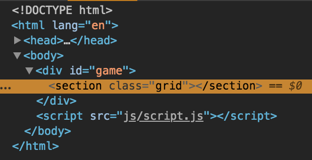

> If none of this makes sense, please read [The Introduction to the DOM](https://www.digitalocean.com/community/tutorials/introduction-to-the-dom) article I wrote. You'll learn the difference between the DOM and HTML source code, and how elements and nodes work.

Now we want to get the images to display on the front end. We'll loop through each item in `cardsArray` with `forEach()`, create a new `card` div for each object, and set the `data-name` attribute and `background-image` style property of the div. We will then append that div to the grid. This will give us 12 divs in total.

<div class="filename">script.js</div>

```js
// For each item in the cardsArray array...
cardsArray.forEach(item => {
  // Create a div
  const card = document.createElement('div')

  // Apply a card class to that div
  card.classList.add('card')

  // Set the data-name attribute of the div to the cardsArray name
  card.dataset.name = item.name

  // Apply the background image of the div to the cardsArray image
  card.style.backgroundImage = `url(${item.img})`

  // Append the div to the grid section
  grid.appendChild(card)
})
```

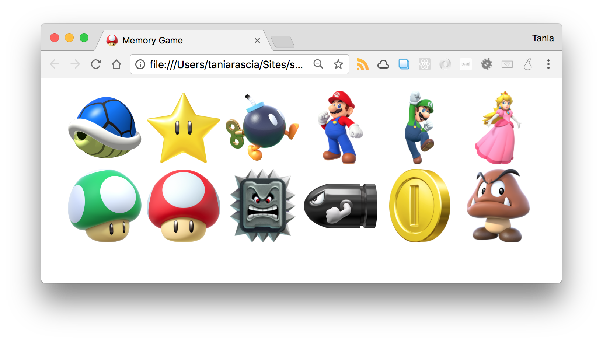

Well, that was a lot of work for step one, but now we have it! You will have 12 divs appended to the grid, and each will look something like this.

```html
<div class="card" data-name="shell" style="background-image: url("img/blueshell.png");"></div>
```

> So, what's the point of the `data-name` attribute? [Data attributes](https://developer.mozilla.org/en-US/docs/Learn/HTML/Howto/Use_data_attributes) allow us to store extra data in an HTML element. Any non-standard attribute should begin with `data-`.

- [Version 0.1 Source](https://gist.githubusercontent.com/taniarascia/a3b550d568f3e6b693e89786eb333988/raw/ee34cc6f77fce6399e954c779b274ffa23327045/memory-0.1.js)

### Duplicate the cards to have 2 sets of 12

Step two is much simpler than step one. Now we're going to duplicate the `cardsArray` array, then loop through that instead. First, below your array, create a `gameGrid` variable, and duplicate the array by using `concat()`.

<div class="filename">script.js</div>

```js
// Duplicate array to create a match for each card
let gameGrid = cardsArray.concat(cardsArray)
```

Then replace `cardsArray` with `gameGrid` in the `forEach()` loop.

<div class="filename">script.js</div>

```js
// For each item in the gameGrid array...
gameGrid.forEach(item => {
  // ...
```

And there you have it.

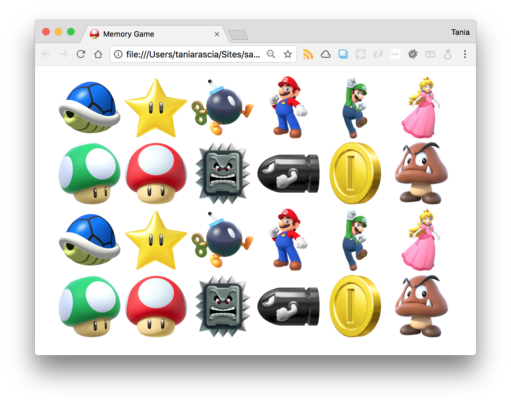

- [Version 0.2 Source](https://gist.githubusercontent.com/taniarascia/a3b550d568f3e6b693e89786eb333988/raw/ee34cc6f77fce6399e954c779b274ffa23327045/memory-0.2.js)

### Randomize the display of cards

Shuffle the array using `sort()` and `Math.random()`. Don't get how that works? [Here](https://forum.freecodecamp.org/t/how-does-math-random-work-to-sort-an-array/151540).

Place this code right after the declaration of `gameGrid`.

<div class="filename">script.js</div>

```js
// Randomize game grid on each load
gameGrid.sort(() => 0.5 - Math.random())
```

Have fun refreshing the grid over and over again.

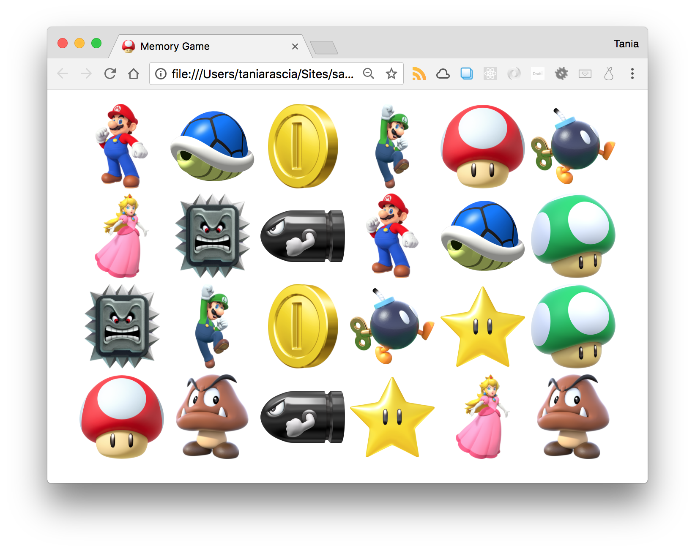

- [Version 0.3 Source](https://gist.githubusercontent.com/taniarascia/a3b550d568f3e6b693e89786eb333988/raw/ee34cc6f77fce6399e954c779b274ffa23327045/memory-0.3.js)

### Add selected style for selected cards

Now we should be able to select cards. I'm just going to add a simple CSS style so we can see selected items easily.

<div class="filename">style.css</div>

```css
.selected {
  border: 4px solid blue;
}
```

We'll add an event listener to the entire grid. Anytime an element is clicked, the `selected` class will be applied to it. Add this code to the bottom of `script.js`

<div class="filename">script.js</div>

```js
// Add event listener to grid
grid.addEventListener('click', function(event) {
  // The event target is our clicked item
  let clicked = event.target

  // Do not allow the grid section itself to be selected; only select divs inside the grid
  if (clicked.nodeName === 'SECTION') {
    return
  }

  // Add selected class
  clicked.classList.add('selected')
})
```

Now every selected div will have a blue border, as defined by the `selected` CSS.

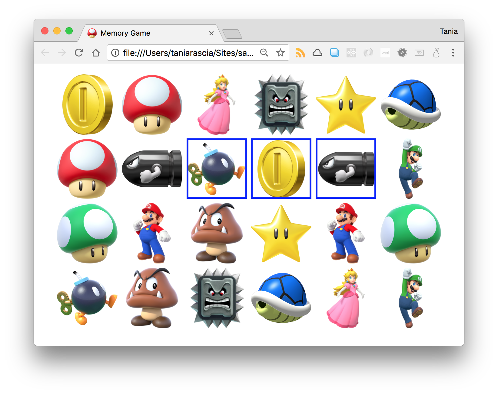

- [Version 0.4 Source](https://gist.githubusercontent.com/taniarascia/a3b550d568f3e6b693e89786eb333988/raw/ee34cc6f77fce6399e954c779b274ffa23327045/memory-0.4.js)

### Only allow two cards to be selected at a time

We need to only allow two selections at a time, because we're testing if two selected cards match. In order to do this, we'll need to store the guesses and counter somewhere. First we'll just store the count.

<div class="filename">script.js</div>

```js
let count = 0
```

Now we'll modify the event listener to have an `if` statement that counts to two, and only adds `selected` to two cards. We'll put our code to add the selected CSS inside the statement.

<div class="filename">script.js</div>

```js
// ...
if (count < 2) {
  count++
  // Add selected class
  clicked.classList.add('selected')
}
```

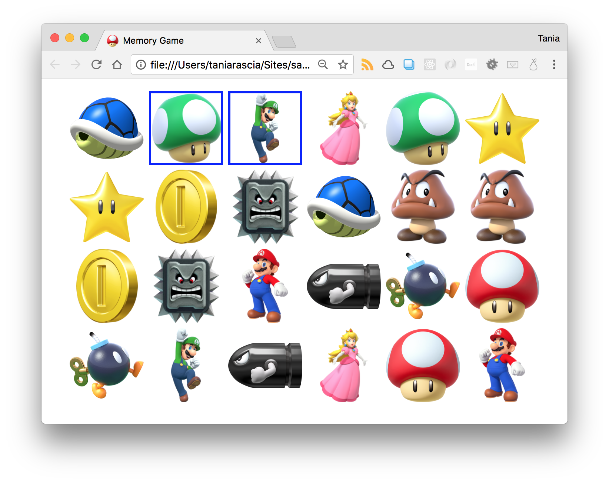

- [Version 0.5 Source](https://gist.githubusercontent.com/taniarascia/a3b550d568f3e6b693e89786eb333988/raw/ee34cc6f77fce6399e954c779b274ffa23327045/memory-0.5.js)

### Determine if two selected cards are a match and hide them

Let's create some CSS for matches. I'm going to give them a red border to differentiate them, and remove the background image. Why would I do that instead of just removing them from the DOM? Because we need to preserve the space they used to be - otherwise, all the elements would shift and it would no longer be a proper memory game.

<div class="filename">style.css</div>

```css
.match {
  border: 4px solid red;
  background-image: none !important;
}
```

Where we just had a `count` variable before, we'll add a place to store the first and second guess as well.

<div class="filename">script.js</div>

```js
let firstGuess = ''
let secondGuess = ''
let count = 0
```

I'm going to make a function for matching elements. This will just loop through all `selected` elements when called, then add the `match` class.

<div class="filename">script.js</div>

```js
// Add match CSS
const match = () => {
  var selected = document.querySelectorAll('.selected')
  selected.forEach(card => {
    card.classList.add('match')
  })
}
```

Now I have to call the `match()` function at the right time in the code. Back in our event listener, I'm going to assign the first and second guess to their respective variables. If they're both not empty and match, the `match()` function will be called.

<div class="filename">script.js</div>

```js
grid.addEventListener('click', function(event) {
  //...
  if (count < 2) {
    count++
    if (count === 1) {
      // Assign first guess
      firstGuess = clicked.dataset.name
      clicked.classList.add('selected')
    } else {
      // Assign second guess
      secondGuess = clicked.dataset.name
      clicked.classList.add('selected')
    }
    // If both guesses are not empty...
    if (firstGuess !== '' && secondGuess !== '') {
      // and the first guess matches the second match...
      if (firstGuess === secondGuess) {
        // run the match function
        match()
      }
    }
  }
})
```

Now, the guesses don't reset, so we can only select or match one thing at a time. But if we select two elements we know match, the proper CSS will be applied.

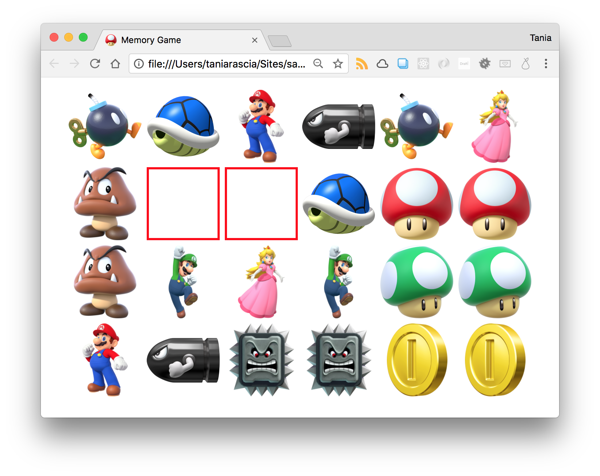

Now there's a problem here - can you guess what it is? If I select the same element twice, it will consider it a match, because they both have the same `data-name` property. I shouldn't be able to select the same element twice, so we'll have to fix this before moving on. First, I'll add a `previousTarget` variable.

<div class="filename">script.js</div>

```js
let previousTarget = null
```

I'll assign the clicked value to `prevousTarget` after the first click.

<div class="filename">script.js</div>

```js
if (firstGuess !== '' && secondGuess !== '') {
    if (firstGuess === secondGuess) {
      match();
    }
  }
  // Set previous target to clicked
  previousTarget = clicked;
}
```

Finally, I'll add that check to our `return` statement at the top of the counter.

<div class="filename">script.js</div>

```js
if (clicked.nodeName === 'SECTION' || clicked === previousTarget) {
  return
}
```

Now a second click on the same element will be ignored.

- [Version 0.6 Source](https://gist.githubusercontent.com/taniarascia/a3b550d568f3e6b693e89786eb333988/raw/ee34cc6f77fce6399e954c779b274ffa23327045/memory-0.6.js)

### Reset guess count after 2

Right now, we only get two guesses. If they're a match, the match style will show. If they're not, the regular selected style will show. We want to allow multiple guesses. We'll have to do this by resetting the guess count after two guesses, whether they matched or not.

First, I'll create a function to reset the guesses. This will set all counts and guesses back to their original values, as well as removing the selected CSS.

<div class="filename">script.js</div>

```js
const resetGuesses = () => {
  firstGuess = ''
  secondGuess = ''
  count = 0

  var selected = document.querySelectorAll('.selected')
  selected.forEach(card => {
    card.classList.remove('selected')
  })
}
```

Then I'll add the `resetGuesses()` function to the match checker, on success or fail.

<div class="filename">script.js</div>

```js
if (firstGuess === secondGuess) {
  match();
  resetGuesses();
} else {
    resetGuesses();
  }
}
```

Now you can make multiple matches. You'll notice that the select style will disappear immediately if it's not a match, but this is fine because we haven't set any delays to allow it to display longer.

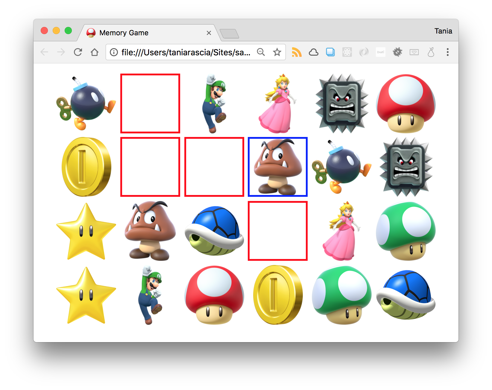

- [Version 0.7 Source](https://gist.githubusercontent.com/taniarascia/a3b550d568f3e6b693e89786eb333988/raw/ee34cc6f77fce6399e954c779b274ffa23327045/memory-0.7.js)

### Add delay to selections

Right now, everything happens immediately. We want a delay after we make a selection so the user can see what their selection was before the card is hidden again. Right now it doesn't matter because everything is visible, but we can just take care of it before putting the final style touches on the cards.

We're going to use `setTimeout()` to make the delays. First I'll set my delay time, which I'm choosing to be 1200 milliseconds, or 1.2 seconds.

<div class="filename">script.js</div>

```js
let delay = 1200
```

All I'm going to do now is put the functions from before in the `setTimeout()`, with the `delay` variable as the amount of time for the timeout to last. The functions become callbacks now, which are functions used as arguments, and they no longer need the parentheses.

<div class="filename">script.js</div>

```js
if (firstGuess === secondGuess) {
  setTimeout(match, delay)
  setTimeout(resetGuesses, delay)
} else {
  setTimeout(resetGuesses, delay)
}
```

Now we can see selections and matches for 1.2 seconds before they disappear.

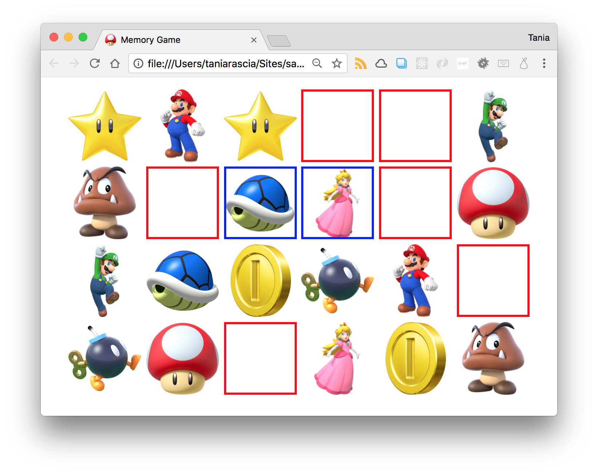

- [Version 0.8 Source](https://gist.githubusercontent.com/taniarascia/a3b550d568f3e6b693e89786eb333988/raw/ee34cc6f77fce6399e954c779b274ffa23327045/memory-0.8.js)

### Show back of card initially and flip on select

When I made this the first time around, I had the cards hidden the whole time, which made testing unnecessarily difficult. This time I decided to hide the cards as one of the last steps, once all the functionality is there.

The game has all the functionality we want, but not the styles. We need to:

- Hide the cards initially
- Flip them over when selected
- Make matches disappear

All of this goes together, and will require a few structural changes to the code. We'll have to add a bit more complicated CSS to get this done.

First, our cards have all consisted of one div right now. In order to implement the flip, each div will need to consist of three divs that will look like this:

```html
<div class="card">
  <div class="front"></div>
  <div class="back"></div>
</div>
```

We'll modify the card creation loop to add the front and back elements.

<div class="filename">script.js</div>

```js
gameGrid.forEach(item => {
  // Create card element with the name dataset
  const card = document.createElement('div')
  card.classList.add('card')
  card.dataset.name = item.name

  // Create front of card
  const front = document.createElement('div')
  front.classList.add('front')

  // Create back of card, which contains
  const back = document.createElement('div')
  back.classList.add('back')
  back.style.backgroundImage = `url(${item.img})`

  // Append card to grid, and front and back to each card
  grid.appendChild(card)
  card.appendChild(front)
  card.appendChild(back)
})
```

Where we had `clicked.dataset.name` and `clicked.classList.add`, we'll have to add `parentNode` now, since we'll be clicking on an inner div (`front` or `back`) and the data-name is still on the outer div (`card`).

<div class="filename">script.js</div>

```js
if (count === 1) {
  firstGuess = clicked.parentNode.dataset.name
  console.log(firstGuess)
  clicked.parentNode.classList.add('selected')
} else {
  secondGuess = clicked.parentNode.dataset.name
  console.log(secondGuess)
  clicked.parentNode.classList.add('selected')
}
```

Now we're going to go back to CSS for a moment. To get the flip to work, we're going to set each `card` as relative, and the `back` and `front` as absolute. All three will have the same height and width.

<div class="filename">style.css</div>

```css
.card {
  position: relative;
  transition: all 0.4s linear;
  transform-style: preserve-3d;
  margin: 5px;
}

.card,
.back,
.front {
  height: 150px;
  width: 150px;
}

.back,
.front {
  position: absolute;
  backface-visibility: hidden;
}
```

The front of each card (technically the back if you're thinking like a deck of cards, but I'm calling it the front because it's the default view) will be a question mark box.

<div class="filename">style.css</div>

```css
.front {
  background: #fab942 url('../img/question.gif') no-repeat center center / contain;
}
```

The back will have all the properties for the background image to style property, and it will be rotated for the flip animation.

<div class="filename">style.css</div>

```css
.back {
  transform: rotateY(180deg);
  background-color: white;
  background-size: contain;
  background-repeat: no-repeat;
  background-position: center center;
}
```

Selected items will be rotated, and matched items will become white, which will override the background image applied through JavaScript.

<div class="filename">style.css</div>

```css
.selected {
  transform: rotateY(180deg);
}

.match .front {
  background: white !important;
}
```

And that's all the CSS.

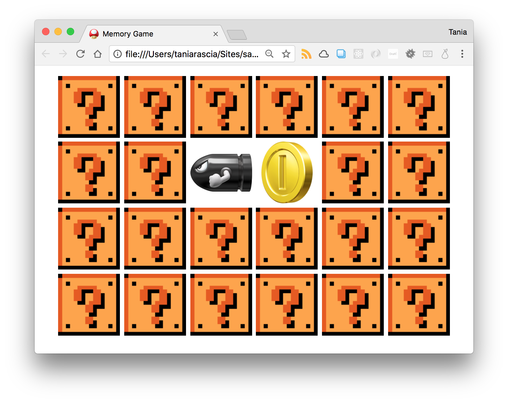

- [Version 0.9 Source](https://gist.githubusercontent.com/taniarascia/a3b550d568f3e6b693e89786eb333988/raw/ee34cc6f77fce6399e954c779b274ffa23327045/memory-0.9.js)

### Finished game!

Can you find any problems with the current game? Right now, I see that I can flip over already matched items, so I'm going to disable that in the return statement at the top.

<div class="filename">script.js</div>

```js
if (
  clicked.nodeName === 'SECTION' ||
  clicked === previousTarget ||
  clicked.parentNode.classList.contains('selected')
) {
  return
}
```

That's the last issue I could find! I added a blue background for a bit of a more Mario-ish style, and now it's done! You could extend this game further by counting and displaying the number of failed attempts, or adding a message upon completion, but I think this is good enough.

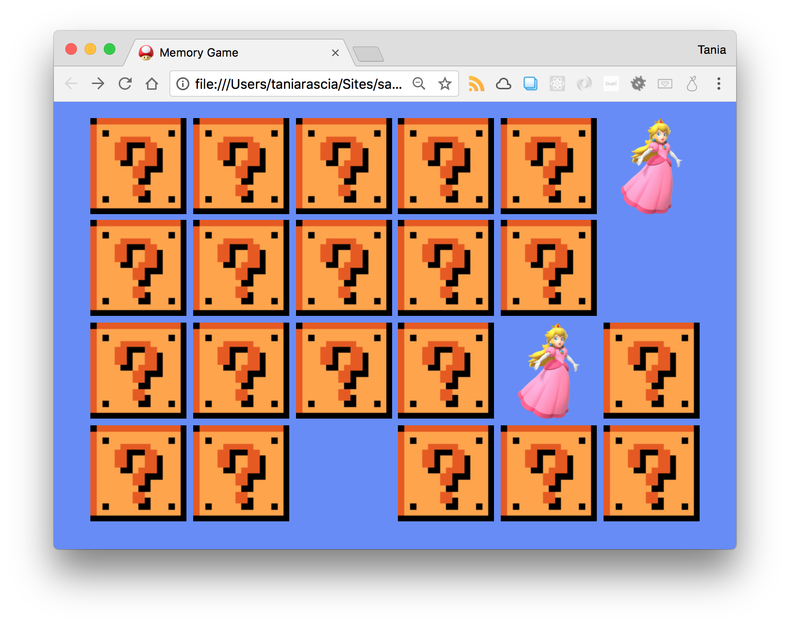

## Conclusion

In this tutorial, we learned a lot about planning out an application before we create it, and breaking it up into small steps to make it easily achievable. We learned how to use plain JavaScript to insert and manipulate elements in the page, which will be helpful for anyone who only knows how to work with a library like jQuery. And we made something fun to play with. Enjoy!

Again, you can view the demo [here](https://taniarascia.github.io/memory/), and view the source [here](https://github.com/taniarascia/memory). Questions, comments, and critiques appreciated.
