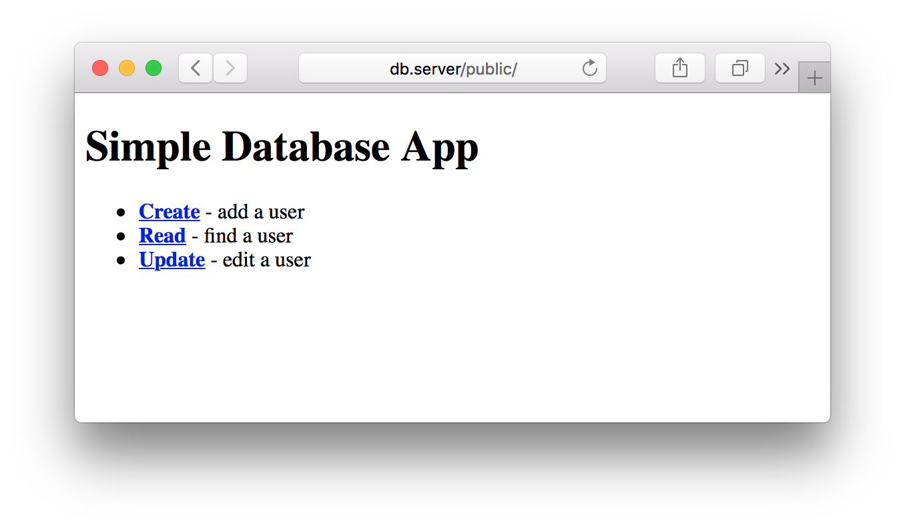
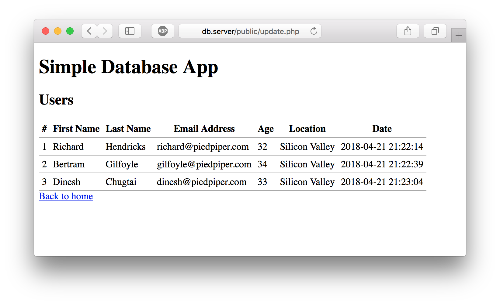
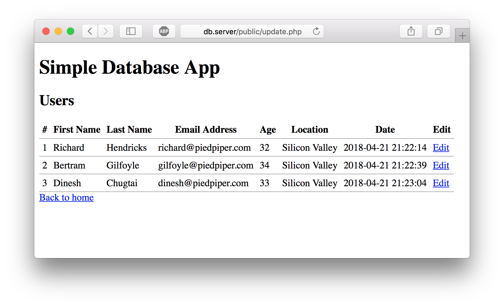
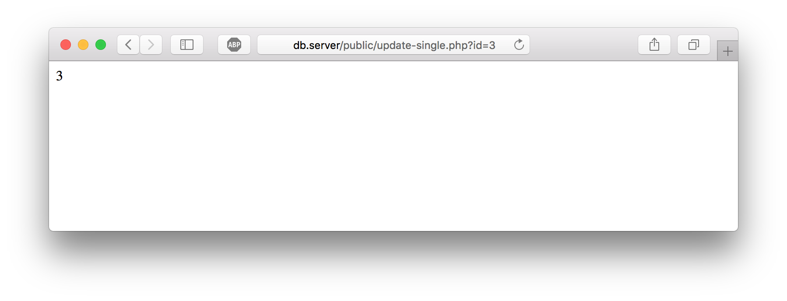
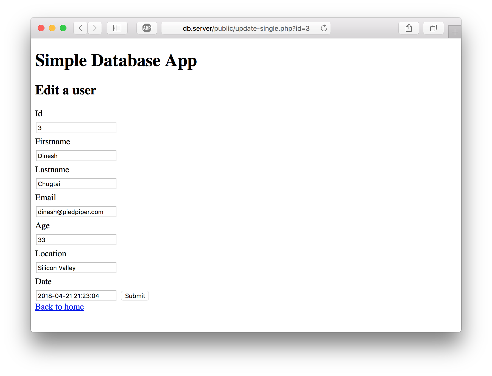
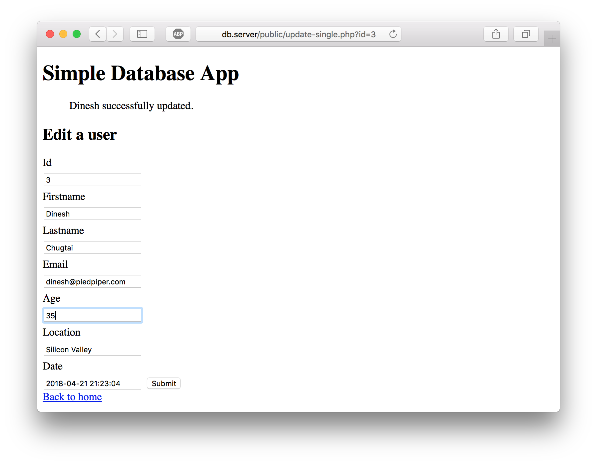
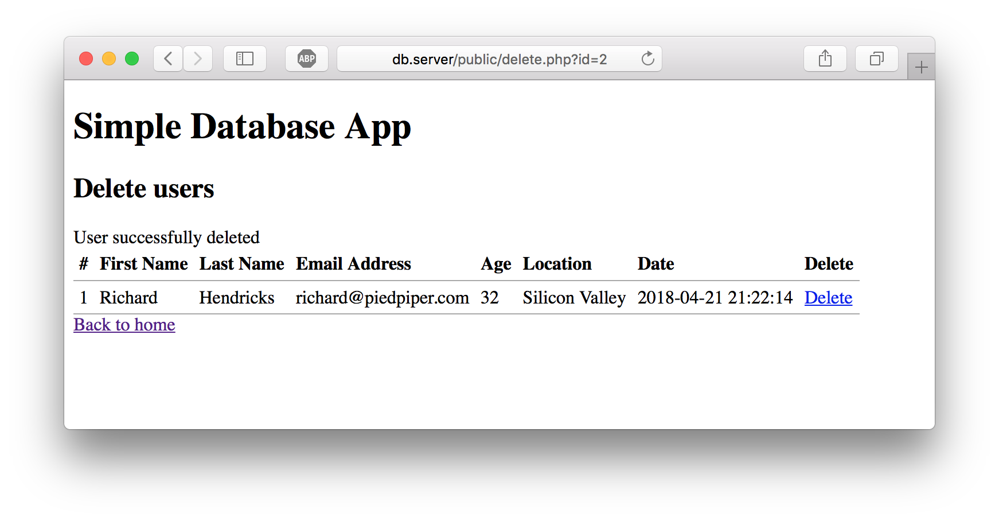

In [the first part of this tutorial series](/create-a-simple-database-app-connecting-to-mysql-with-php/), I taught you how to connect to a MySQL database with PHP using the modern PDO method. We accomplished this by developing the first half of a _very_ simple [CRUD](https://en.wikipedia.org/wiki/Create,_read,_update_and_delete) app. CRUD stands for **C**reate, **R**ead, **U**pdate, **D**elete, and it is a common way to store, view, and modify data.

The goals we completed in part one:

- Write an installer script to initialize a new MySQL database and table with structure.
- Connect to a MySQL database with PHP using the PDO (PHP Data Objects) method.
- **Create** - Add new entries to a database through an HTML form with PHP.
- **Read** - View all entries in a database and print them to an HTML document.

I promised a part two, and here it is! In this tutorial, we will learn how to modify existing entries (`update`) and permanently remove existing entires (`delete`).

If you haven't read part one but you're interested in learning how to manipulate data with PHP and MySQL, I highly recommend you check it out! Onto the tutorial.

#### Prerequisites

Everything you need to know to use and understand this tutorial is in [Create a Simple CRUD Database App: Connecting to MySQL with PHP (Part 1: Create, Read)](/create-a-simple-database-app-connecting-to-mysql-with-php/). To reiterate, you must have:

- A basic knowledge of HTML
- A basic knowledge of PHP syntax and code structure
- A local PHP and MySQL environment (MAMP, XAMPP, Vagrant, or other)
- A database management program (Sequel Pro for Mac, SQLYog for Windows)

- [The codebase](https://github.com/taniarascia/pdo/tree/feba19a43e63c617c95a1f6e68825f6e3086336c) of the PDO App we created. (This link leads to the last commit prior to this article being written)

#### Goals

- Create a page that lists all users with an edit button next to their name
- Dynamically create a unique page for editing any user's data
- Create a page that list all users with a delete button next to their name

## Step 1: Set up the environment

If you're following along directly from part one, you will have all the code you need to start ready and functioning. If you did the tutorial a while ago and need to get everything set up again, it's all available and up to date in this [GitHub repository](https://github.com/taniarascia/pdo). You can either download all the code as a zip and place it in your server root, or clone the repo if you know how to use Git.

Everything we will be editing is in the **public/** folder, as all our initial setup is out of the way. Go ahead and get everything set up and working from the place we left off, and then we can continue.

One note, I'll be using the URL **http://db.server** instead of the **http://db.dev** URL I used the first time around, as `.dev` domains are no longer available locally in Chrome. Everything else will be the same.

## Step 2: Create an editable list of all users

We left off in part one with **create.php** and **read.php**. Now we're going to create **update.php**.

In **index.php**, add a link to **update.php**.

<div class="filename">public/index.php</div>

```php
<?php include "templates/header.php"; ?>

<ul>
    <li><a href="create.php"><strong>Create</strong></a> - add a user</li>
    <li><a href="read.php"><strong>Read</strong></a> - find a user</li>
    <li><a href="update.php"><strong>Update</strong></a> - edit a user</li>
</ul>

<?php include "templates/footer.php"; ?>
```



Now that the main view of our app links to the **update.php**, let's create the file.

The purpose of this file is to list _all_ users in the database, and show an "Edit" link next to each user, which we'll be able to click on and edit each user individually. We will use most of the same code from **read.php**, except more simplified.

We will use a simple `SELECT` statement to get all users.

```php
$sql = "SELECT * FROM users";
```

This is the simplest possible SQL command we can execute with PDO - simply select all users, prepare the statement, and store the result in `$result`.

```php
$sql = "SELECT * FROM users";

$statement = $connection->prepare($sql);
$statement->execute();

$result = $statement->fetchAll();
```

Using that, we can built out our `try/catch` block at the top of **update.php**.

<div class="filename">public/update.php</div>

```php
<?php

/**
  * List all users with a link to edit
  */

try {
  require "../config.php";
  require "../common.php";

  $connection = new PDO($dsn, $username, $password, $options);

  $sql = "SELECT * FROM users";

  $statement = $connection->prepare($sql);
  $statement->execute();

  $result = $statement->fetchAll();

} catch(PDOException $error) {
  echo $sql . "<br>" . $error->getMessage();
}
?>
```

Right below this code, we'll print the HTML table with the data from our `SELECT` statement.

<div class="filename">public/update.php</div>

```php
<?php require "templates/header.php"; ?>

<h2>Update users</h2>

<table>
  <thead>
    <tr>
      <th>#</th>
      <th>First Name</th>
      <th>Last Name</th>
      <th>Email Address</th>
      <th>Age</th>
      <th>Location</th>
      <th>Date</th>
    </tr>
  </thead>
  <tbody>
  <?php foreach ($result as $row) : ?>
    <tr>
      <td><?php echo escape($row["id"]); ?></td>
      <td><?php echo escape($row["firstname"]); ?></td>
      <td><?php echo escape($row["lastname"]); ?></td>
      <td><?php echo escape($row["email"]); ?></td>
      <td><?php echo escape($row["age"]); ?></td>
      <td><?php echo escape($row["location"]); ?></td>
      <td><?php echo escape($row["date"]); ?> </td>
  </tr>
  <?php endforeach; ?>
  </tbody>
</table>

<a href="index.php">Back to home</a>
```

Before anything will show up here, we'll have to go back to **create.php** and add a few users, which I just did for this example.

Here is what we have now in **update.php**:



### Using HTTP query strings

Up until now, this is all the same stuff we covered in **read.php**. The interesting part that we'll add now is how we'll get to a page where we can edit each individual user.

Below Date in the `thead`, let's add a `th` for Edit.

```html
<th>Edit</th>
```

Now in the `tbody`, we'll add a link that corresponds to this header for each user. In just a moment, we'll create a new file called **update-single.php**, which will be an edit page for each user. But how will **update-single.php** know if we're editing Richard or Gilfoyle?

We're going to tell **update-single.php** via a parameter in the URL which user to edit. Since we know `id` of each user is unique, and we can't guarantee other data such as first name and age will be unique, we can safely use `id` to identify each user.

Let's create a link that goes to **update-single.php**, and tack a question mark after the file name, which begins an [HTTP query string](https://en.wikipedia.org/wiki/Query_string). After this question mark, we can insert as many key/value pairs as we want in the URL.

If we want to access Dinesh, the user with an `id` of `3`, our url will be **update-single.php?id=3**. We will get those values dynamically the same way we do to just print them out normally, except we'll embed it in the URL, like so.

```php
<td><a href="update-single.php?id=<?php echo escape($row["id"]); ?>">Edit</a></td>
```

Here is the final code for **update.php**.

<div class="filename">public/update.php</div>

```php
<?php

/**
  * List all users with a link to edit
  */

try {
  require "../config.php";
  require "../common.php";

  $connection = new PDO($dsn, $username, $password, $options);

  $sql = "SELECT * FROM users";

  $statement = $connection->prepare($sql);
  $statement->execute();

  $result = $statement->fetchAll();
} catch(PDOException $error) {
  echo $sql . "<br>" . $error->getMessage();
}
?>
<?php require "templates/header.php"; ?>

<h2>Update users</h2>

<table>
  <thead>
    <tr>
      <th>#</th>
      <th>First Name</th>
      <th>Last Name</th>
      <th>Email Address</th>
      <th>Age</th>
      <th>Location</th>
      <th>Date</th>
      <th>Edit</th>
    </tr>
  </thead>
    <tbody>
    <?php foreach ($result as $row) : ?>
      <tr>
        <td><?php echo escape($row["id"]); ?></td>
        <td><?php echo escape($row["firstname"]); ?></td>
        <td><?php echo escape($row["lastname"]); ?></td>
        <td><?php echo escape($row["email"]); ?></td>
        <td><?php echo escape($row["age"]); ?></td>
        <td><?php echo escape($row["location"]); ?></td>
        <td><?php echo escape($row["date"]); ?> </td>
        <td><a href="update-single.php?id=<?php echo escape($row["id"]); ?>">Edit</a></td>
      </tr>
    <?php endforeach; ?>
    </tbody>
</table>

<a href="index.php">Back to home</a>

<?php require "templates/footer.php"; ?>
```



Now we have a list of all users with links to edit them. If you hover over each edit button, you'll see the `id` in the URL change to correspond to each user. However, the links don't go anywhere yet, so that's what we'll work on next.

## Step 3: Modify an existing user

Editing an existing database entry is the trickiest of all four aspects of CRUD, and it's particularly difficult to find a modern, cohesive tutorial of any sort on how to do this with HTML and PHP, especially using the modern PDO method, so here we go!

First, we'll want to display the data we're going to edit, then we'll need to add functions to modify it.

In **update.php**, we created edit links that detect the `id` of the users and create a unique URL for each user. In **update-single.php**, we have to figure out which `id` is being loaded in, because _all_ the edit pages will load and be routed through this single page.

Just as we've used the superglobal `$_POST` to detect what data has been posted through an HTML form, we'll use `$_GET` to retrieve information from the URL. It's important to note that sensitive data such as passwords should never be passed through the `$_GET` variable; however, for our simple purposes today, it will do just fine.

Let's create **update-single.php**, load in the required files, and make an `if/else` statement. We'll check if `id` is found in the URL, otherwise we'll just show a brief error message and close the script.

<div class="filename">public/update-single.php</div>

```php
<?php

/**
  * Use an HTML form to edit an entry in the
  * users table.
  *
  */

require "../config.php";
require "../common.php";

if (isset($_GET['id'])) {
  echo $_GET['id']; // for testing purposes
} else {
    echo "Something went wrong!";
    exit;
}
?>
```

Now if I click on Dinesh...



The page will print out `3`, as seen in the URL. Great! Now that we know that's working, we can use it to pull the data specifically for user id `3`.

We're still working with `SELECT` statements here, so we're doing exactly what we did previously with the `location` variable in **read.php**. We'll assign `$_GET['id']` to a variable, bind it to the name of `id`, and look for the id with the `WHERE` clause.

<div class="filename">public/update-single.php</div>

```php
if (isset($_GET['id'])) {
  try {
    $connection = new PDO($dsn, $username, $password, $options);
    $id = $_GET['id'];

    $sql = "SELECT * FROM users WHERE id = :id";
    $statement = $connection->prepare($sql);
    $statement->bindValue(':id', $id);
    $statement->execute();

    $user = $statement->fetch(PDO::FETCH_ASSOC);
  } catch(PDOException $error) {
      echo $sql . "<br>" . $error->getMessage();
  }
} else {
  echo "Something went wrong!";
  exit;
}
```

Now we want to display the data, but it's going to be a little different than the previous times we printed out data, because we want to be able to update this data as well. How will we update it? With forms and inputs, just like we `INSERT` and `SELECT` data.

Below the database code, we'll begin our view for **update-single.php**. Now, since I know the data consists of first name, last name, and so on, I can just manually type it all out as we did before, but there's a more efficient way to get all that data. Let's dynamically print out each data column and value as a key/value pair in PHP.

We'll start by writing a `foreach` loop, but instead of returning the entire associative array in the variable, we'll separate the keys and values into their own variables. We'll get the value from the `fetch(PDO::FETCH_ASSOC)` above.

We're going to put the entire loop inside a form with a submit button.

<div class="filename">public/update-single.php</div>

```php
<?php require "templates/header.php"; ?>

<h2>Edit a user</h2>

<form method="post">
  <?php foreach ($user as $key => $value) : ?>
    // print data here
  <?php endforeach; ?>
  <input type="submit" name="submit" value="Submit">
</form>

<a href="index.php">Back to home</a>

<?php require "templates/footer.php"; ?>
```

Inside the `foreach`, we're making a form which will consist of labels and inputs. Each label will be a column name from the database.

```php
<label for="<?php echo $key; ?>">
  <?php echo ucfirst($key); ?>
</label>
```

Each value will be the value of an input. We'll be using the key as the `name` and `id` of the input, and the value as the `value`. I'm also adding a [ternary](http://php.net/manual/en/language.operators.comparison.php) (quick conditional statement) to make the input "readonly" if the key name is `id`, as it should not be editable.

```php
<input
  type="text"
  name="<?php echo $key; ?>"
  id="<?php echo $key; ?>"
  value="<?php echo escape($value); ?>">
  <?php echo ($key === 'id' ? 'readonly' : null); ?>>
```

Now the entire form looks like this.

<div class="filename">public/update-single.php</div>

```php
<form method="post">
    <?php foreach ($user as $key => $value) : ?>
      <label for="<?php echo $key; ?>"><?php echo ucfirst($key); ?></label>
      <input type="text" name="<?php echo $key; ?>" id="<?php echo $key; ?>" value="<?php echo escape($value); ?>" <?php echo ($key === 'id' ? 'readonly' : null); ?>>
    <?php endforeach; ?>
    <input type="submit" name="submit" value="Submit">
</form>
```

Okay, that was quite a bit of work, but now look what we have!



The single edit page now has editable fields for each value. However, our code at this point is only to display the data - we need to add another section to process the code after the submit button has been pressed.

At the top of **update-single.php**, right below the two required files, check if the form has been submitted, and begin the `try/catch` block.

```php
if (isset($_POST['submit'])) {
  try {
    $connection = new PDO($dsn, $username, $password, $options);
    // run update query
  } catch(PDOException $error) {
    echo $sql . "<br>" . $error->getMessage();
  }
}
```

We want to use the `UPDATE` clause to `SET` each value to the new value. The literal code for our case looks like this:

```sql
   UPDATE users
     SET id = :id,
         firstname = :firstname,
         lastname = :lastname,
         email = :email,
         age = :age,
         location = :location,
         date = :date
   WHERE id = :id
```

That's all we need to update the values now! I'm just going to quickly add in some code to display that everything has been updated on the front end.

```php
<?php if (isset($_POST['submit']) && $statement) : ?>
  <?php echo escape($_POST['firstname']); ?> successfully updated.
<?php endif; ?>
```

Here is the entirety of the file we just created.

<div class="filename">public/update-single.php</div>

```php
<?php
/**
  * Use an HTML form to edit an entry in the
  * users table.
  *
  */
require "../config.php";
require "../common.php";
if (isset($_POST['submit'])) {
  try {
    $connection = new PDO($dsn, $username, $password, $options);
    $user =[
      "id"        => $_POST['id'],
      "firstname" => $_POST['firstname'],
      "lastname"  => $_POST['lastname'],
      "email"     => $_POST['email'],
      "age"       => $_POST['age'],
      "location"  => $_POST['location'],
      "date"      => $_POST['date']
    ];

    $sql = "UPDATE users
            SET id = :id,
              firstname = :firstname,
              lastname = :lastname,
              email = :email,
              age = :age,
              location = :location,
              date = :date
            WHERE id = :id";

  $statement = $connection->prepare($sql);
  $statement->execute($user);
  } catch(PDOException $error) {
      echo $sql . "<br>" . $error->getMessage();
  }
}

if (isset($_GET['id'])) {
  try {
    $connection = new PDO($dsn, $username, $password, $options);
    $id = $_GET['id'];
    $sql = "SELECT * FROM users WHERE id = :id";
    $statement = $connection->prepare($sql);
    $statement->bindValue(':id', $id);
    $statement->execute();

    $user = $statement->fetch(PDO::FETCH_ASSOC);
  } catch(PDOException $error) {
      echo $sql . "<br>" . $error->getMessage();
  }
} else {
    echo "Something went wrong!";
    exit;
}
?>

<?php require "templates/header.php"; ?>

<?php if (isset($_POST['submit']) && $statement) : ?>
  <?php echo escape($_POST['firstname']); ?> successfully updated.
<?php endif; ?>

<h2>Edit a user</h2>

<form method="post">
    <?php foreach ($user as $key => $value) : ?>
      <label for="<?php echo $key; ?>"><?php echo ucfirst($key); ?></label>
      <input type="text" name="<?php echo $key; ?>" id="<?php echo $key; ?>" value="<?php echo escape($value); ?>" <?php echo ($key === 'id' ? 'readonly' : null); ?>>
    <?php endforeach; ?>
    <input type="submit" name="submit" value="Submit">
</form>

<a href="index.php">Back to home</a>

<?php require "templates/footer.php"; ?>
```

As a test, I updated the age value to make sure it worked.



Now that we've completed the update process, it's time to move on to deleting, which is much simpler.

## Step 4: Deleting entries from a database

Back in **index.php**, let's add an entry for `delete`. We could put this in the update file, but for the sake of continuity and finishing the acronym, let's just make it into a new file.

<div class="filename">public/index.php</div>

```html
<ul>
  <li>
    <a href="create.php"><strong>Create</strong></a> - add a user
  </li>
  <li>
    <a href="read.php"><strong>Read</strong></a> - find a user
  </li>
  <li>
    <a href="update.php"><strong>Update</strong></a> - edit a user
  </li>
  <li>
    <a href="delete.php"><strong>Delete</strong></a> - delete a user
  </li>
</ul>
```

There's nothing new to learn with the `DELETE` statement. Let's copy the code from **update.php** over, but change "edit" to "delete". We'll have the delete link to to the same URL with a query string added, instead of a single page for deletion.

```php
<td><a href="delete.php?id=<?php echo escape($row["id"]); ?>">Delete</a></td>
```

The `DELETE` statement is just like `SELECT`, and we'll check for the `$_GET` superglobal again. If the proper `id` is loaded into the URL, PHP will delete that user.

public/delete.php

```php
<?php

/**
  * Delete a user
  */

require "../config.php";
require "../common.php";

if (isset($_GET["id"])) {
  try {
    $connection = new PDO($dsn, $username, $password, $options);

    $id = $_GET["id"];

    $sql = "DELETE FROM users WHERE id = :id";

    $statement = $connection->prepare($sql);
    $statement->bindValue(':id', $id);
    $statement->execute();

    $success = "User successfully deleted";
  } catch(PDOException $error) {
    echo $sql . "<br>" . $error->getMessage();
  }
}

try {
  $connection = new PDO($dsn, $username, $password, $options);

  $sql = "SELECT * FROM users";

  $statement = $connection->prepare($sql);
  $statement->execute();

  $result = $statement->fetchAll();
} catch(PDOException $error) {
  echo $sql . "<br>" . $error->getMessage();
}
?>
<?php require "templates/header.php"; ?>

<h2>Delete users</h2>

<?php if ($success) echo $success; ?>

<table>
  <thead>
    <tr>
      <th>#</th>
      <th>First Name</th>
      <th>Last Name</th>
      <th>Email Address</th>
      <th>Age</th>
      <th>Location</th>
      <th>Date</th>
      <th>Delete</th>
    </tr>
  </thead>
  <tbody>
  <?php foreach ($result as $row) : ?>
    <tr>
      <td><?php echo escape($row["id"]); ?></td>
      <td><?php echo escape($row["firstname"]); ?></td>
      <td><?php echo escape($row["lastname"]); ?></td>
      <td><?php echo escape($row["email"]); ?></td>
      <td><?php echo escape($row["age"]); ?></td>
      <td><?php echo escape($row["location"]); ?></td>
      <td><?php echo escape($row["date"]); ?> </td>
      <td><a href="delete.php?id=<?php echo escape($row["id"]); ?>">Delete</a></td>
    </tr>
  <?php endforeach; ?>
  </tbody>
</table>

<a href="index.php">Back to home</a>

<?php require "templates/footer.php"; ?>
```

Here's the page after I deleted two users.



Often, in a real app, data won't be permanently deleted from the database. The users might have a boolean table that defines them as "active" or "inactive" users instead of actually deleting the data. Nonetheless, `DELETE` is important to know, and it can be used along with `SELECT` to delete than insert new data as opposed to updating it with `UPDATE`.

## Adding CSRF Protection

As a final step, we want to take security into consideration. We will generate a CSRF token and add it to the user's session.

CSRF stands for [Cross-Site Request Forgery](https://www.incapsula.com/web-application-security/csrf-cross-site-request-forgery.html), and is a way an attacker can trick a browser into executing a malicious action.

In order to prevent this, we will test the CSRF token in the session against a value in a hidden input. If they match, the code will execute. If not, the code will exit.

To add this in, we'll go back to **common.php**, generate the CSRF and assign it to `$_SESSION['csrf']`.

<div class="filename">common.php</div>

```php
session_start();

if (empty($_SESSION['csrf'])) {
  if (function_exists('random_bytes')) {
    $_SESSION['csrf'] = bin2hex(random_bytes(32));
  } else if (function_exists('mcrypt_create_iv')) {
    $_SESSION['csrf'] = bin2hex(mcrypt_create_iv(32, MCRYPT_DEV_URANDOM));
  } else {
    $_SESSION['csrf'] = bin2hex(openssl_random_pseudo_bytes(32));
  }
}
```

Now at the top of all our **public/** files, we'll add the following code in:

```php
require "../config.php";
require "../common.php";

if (isset($_POST['submit'])) {
  if (!hash_equals($_SESSION['csrf'], $_POST['csrf'])) die();
```

Finally, we'll add the value into the input on each form.

```php
<input name="csrf" type="hidden" value="<?php echo escape($_SESSION['csrf']); ?>">
```

Contribution by [djhayman](https://github.com/taniarascia/pdo/pull/5).

## Conclusion

That was a lot of information. If you got lost somewhere along the way, I don't blame you! There's a reason few tutorials venture into this territory. Fortunately, all the code is up on GitHub. All you have to do is clone or download the entire repository into the root of your server, run the install script, and you're good to go with all the CRUD operations!

- [View on GitHub](https://github.com/taniarascia/pdo)

I really hope you enjoyed this article - I think learning how to make your own CRUD program is tons of fun, and a struggle if you've found the wrong resource. Since I know it needs to be said again, this is _not_ meant to be a complete, secure, production app. However, it's a great introduction and minimum viable product to getting PDO, PHP, and MySQL up and running and playing together nicely.

If you enjoyed it, please share! If you struggled anywhere, let me know.
