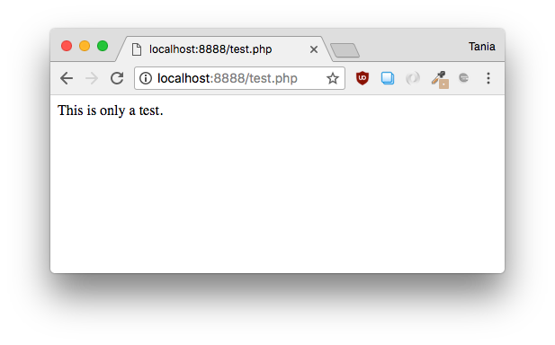
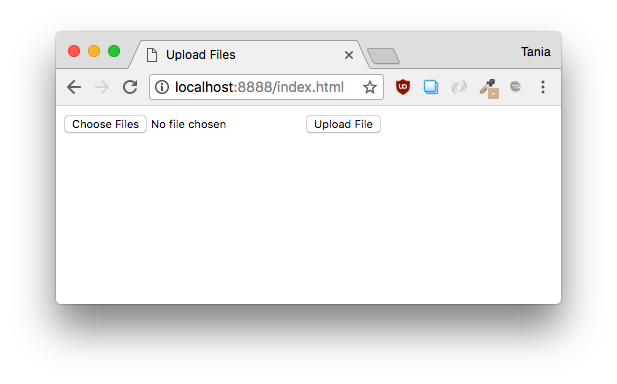

Writing the code to upload images to a server from scratch seems like a very daunting task. I'm going to make a very simple upload form to demonstrate how file data works and can be transferred.

In this tutorial, we're going to build an upload form with **HTML**, send the files with **JavaScript**, and process and upload them with **PHP**.

Note that this is not meant to be fully functional, secure, validated, production code. It is simply meant to demonstrate in a simple and straightforward manner how to make your first upload form.

- [View Source on GitHub](https://github.com/taniarascia/upload)

#### Prerequisites

- A basic knowledge of HTML
- A basic knowledge of PHP syntax and code structure
- An understanding of local PHP environments. If you don't know what that means, please read this guide on [how to set up a MAMP environment](/local-environment/).

#### Goals

- Build the simplest possible form with HTML to take a retrieve files from your local computer.
- Send the data from an HTML form to a PHP script with vanilla JavaScript.
- Process the data in the PHP script and move the local files to an **uploads/** directory on a server.

## Setup

As mentioned in the prerequisites, you must have a basic knowledge of PHP and local server environments.

> If you already know how to use PHP and local environments, skip to the next section.

If you're using a Mac, you can create a server with a single command. To test this, create a file called **test.php** in the directory of your choice. I'm going to create a directory called `local`. The full path will be `Users/tania/local`.

<div class="filename">test.php</div>

```php
<?php echo 'This is only a test.';
```

In the Terminal application, which I'll open by pressing `SPACEBAR` + `COMMAND` and typing Terminal, navigate to the directory you created your file in.

```
cd server

```

```bash
php -S localhost:8888

```

You should now be able to go to **http://localhost:8888/test.php** and see the output of the code.



If you're on Windows, or you don't want to use the command line, [set up MAMP](/local-environment/).

## Building an Upload Form in HTML

In the root of your local server, create an **index.html** file. We'll just create a quick skeleton.

```html
<!DOCTYPE html>
<html lang="en">
  <head>
    <meta charset="UTF-8" />
    <meta name="viewport" content="width=device-width, initial-scale=1.0" />
    <meta http-equiv="X-UA-Compatible" content="ie=edge" />

    <title>Upload Files</title>
  </head>

  <body>
    <!-- form goes here-->
  </body>
</html>
```

Let's add an HTML web form to the `body`.

```html
<form method="post" enctype="multipart/form-data">
  <input type="file" name="files[]" multiple />
  <input type="submit" value="Upload File" name="submit" />
</form>
```

In this form, we're using the [POST](<https://en.wikipedia.org/wiki/POST_(HTTP)>) HTTP method, which how we send data. The `multipart/form-data` value is required for uploading files in forms.

From here, we're creating a file input type that takes an array of files (`files[]`) and we're specifying `multiple` to allow more than one file to be selected. `files[]` can have any name - you could use `uploads[]` or `images[]`, but I called it `files[]` for simplicity.

Finally, we have a submit button. Since the next step will be to add a script, let's just add a link to the JavaScript file we'll create.

```html
<script src="upload.js"></script>
```

And that's all we need for the view.

<div class="filename">index.html</div>

```html
<!DOCTYPE html>
<html lang="en">
  <head>
    <meta charset="UTF-8" />
    <meta name="viewport" content="width=device-width, initial-scale=1.0" />
    <meta http-equiv="X-UA-Compatible" content="ie=edge" />

    <title>Upload Files</title>
  </head>

  <body>
    <form method="post" enctype="multipart/form-data">
      <input type="file" name="files[]" multiple />
      <input type="submit" value="Upload File" name="submit" />
    </form>

    <script src="upload.js"></script>
  </body>
</html>
```



## Sending Form Data via JavaScript

Right now, clicking submit on the form doesn't go anywhere. Since we don't have an `action` that leads to a URL, the form will just post to itself by default. Since **index.html** is an html file, not a PHP file, no form processing can happen on this page. Instead, we'll send the form to PHP through JavaScript.

Create a file called **upload.js**.

First, let's define two variables - the URL where we want to send the data, and the DOM element for the form.

<div class="filename">upload.js</div>

```js
// Define processing URL and form element
const url = 'process.php'
const form = document.querySelector('form')
```

We're going to add an event listener to watch for the form being submitted, but we'll prevent the default action from firing.

```js
// Listen for form submit
form.addEventListener('submit', e => {
  e.preventDefault()

  // ...
})
```

Let's gather the files with the `.files` property, and begin a new [`FormData()`](https://developer.mozilla.org/en-US/docs/Web/API/FormData) interface.

```js
// Gather files and begin FormData
    const files = document.querySelector('[type=file]').files;
    const formData = new FormData();
});

// ...
```

For each file that has been submitted, append it to the `files[]` array.

```js
// Append files to files array
for (let i = 0; i < files.length; i++) {
  let file = files[i]

  formData.append('files[]', file)
}

// ...
```

Finally, use the built-in [Fetch API](https://developer.mozilla.org/en-US/docs/Web/API/Fetch_API) to POST the data to the URL we specified. Print the response to the console (for testing purposes).

```js
fetch(url, {
  method: 'POST',
  body: formData,
}).then(response => {
  console.log(response)
})
```

Here is the completed **upload.js**.

<div class="filename">upload.js</div>

```js
const url = 'process.php'
const form = document.querySelector('form')

form.addEventListener('submit', e => {
  e.preventDefault()

  const files = document.querySelector('[type=file]').files
  const formData = new FormData()

  for (let i = 0; i < files.length; i++) {
    let file = files[i]

    formData.append('files[]', file)
  }

  fetch(url, {
    method: 'POST',
    body: formData,
  }).then(response => {
    console.log(response)
  })
})
```

Now - how can we test if all this data is going through properly? Let's print out the file data.

Create a new file called **process.php**, and print out the contents of the superglobal array `$_FILES`, which will contain the data for all our files.

<div class="filename">process.php</div>

```php
<?php print_r($_FILES);

```

Once you have this file, attempt uploading a few files through the form. I made a **phplogo.png** and **testfile1.txt** to test with, and uploaded the file.

In Developer Tools, under the _Console_, you should see a response like this:

Developer Tools -> Console

```bash
Response {
  type: "basic",
  url: "http://localhost:8888/process.php",
  redirected: false,
  status: 200,
  ok: true, …
}
```

If you see `status: 200`, this means the file hit the proper URL and the URL exists.

Now in Developer tools, click on the _Network_ tab. You should see the filename **process.php**. Click on the file, and click on _Response_. There, you should see the output of `print_r($FILES)`. It will look something like this:

Developer Tools -> Network -> Response

```php
[files] => Array
(
  [name] => Array
  (
    [0] => phplogo.png
    [1] => testfile1.txt
  )

  [type] => Array
  (
    [0] => image/png
    [1] => text/plain
  )

  [tmp_name] => Array
  (
    [0] => /private/var/xxx
    [1] => /private/var/yyy
  )

  [error] => Array
  (
    [0] => 0
    [1] => 0
  )

  [size] => Array
  (
    [0] => 16610
    [1] => 12
  )
)
```

Now we know the proper files, along with all their associated data, have gone through. Success!

## Processing Form Data with PHP

Now that we're gathering all the files from the form and sending them to **process.php** with JavaScript, we have to move the file data with PHP.

First, we'll want to make sure the code only runs when a POST request hits the file.

<div class="filename">process.php</div>

```php
<?php

if ($_SERVER['REQUEST_METHOD'] === 'POST') {
    // ...
}
```

We also want to make sure files have gone through.

```php
if (isset($_FILES['files'])) {
        // ...
    }
```

Create a directory in the root of your project called **uploads**. This directory will need to have `755` permissions to accept incoming files.

At this point, we'll create an array for errors, set the path of the directory where uploads should go, and set the approved extensions.

```php
$errors = [];
$path = 'uploads/';
$extensions = ['jpg', 'jpeg', 'png', 'gif'];

```

Since the user can upload multiple files, we'll create an `$all_files` variable, get the number of files being uploaded, and make a `for` loop.

```php
$all_files = count($_FILES['files']['tmp_name']);

for ($i = 0; $i < $all_files; $i++) {
    // ...
}
```

Now, for each file we'll get the file name, temporary file data, type, size, and extension.

```php
$file_name = $_FILES['files']['name'][$i];
$file_tmp = $_FILES['files']['tmp_name'][$i];
$file_type = $_FILES['files']['type'][$i];
$file_size = $_FILES['files']['size'][$i];
$file_ext = strtolower(end(explode('.', $_FILES['files']['name'][$i])));

$file = $path . $file_name;
```

Now we can set a few rules for the files. If the file type in not in the approved list of extensions, or the file is too large, we'll add it to the error array. I set a file size of 2 megabytes.

```php
if (!in_array($file_ext, $extensions)) {
    $errors[] = 'Extension not allowed: ' . $file_name . ' ' . $file_type;
}

if ($file_size > 2097152) {
    $errors[] = 'File size exceeds limit: ' . $file_name . ' ' . $file_type;
}
```

If there were no errors, we can go ahead and move the file to the **uploads** folder with the `move_uploaded_file` command.

```php
if (empty($errors)) {
    move_uploaded_file($file_tmp, $file);
}
```

Now we can close out the `for` loop, and print out the errors. This will display for us in the network tab we used before to see the output of `$_FILES`.

```php
if ($errors) print_r($errors);
```

Put it all together, and here's **process.php**.

<div class="filename">process.php</div>

```php
<?php

if ($_SERVER['REQUEST_METHOD'] === 'POST') {
    if (isset($_FILES['files'])) {
        $errors = [];
        $path = 'uploads/';
        $extensions = ['jpg', 'jpeg', 'png', 'gif'];

        $all_files = count($_FILES['files']['tmp_name']);

        for ($i = 0; $i < $all_files; $i++) {
            $file_name = $_FILES['files']['name'][$i];
            $file_tmp = $_FILES['files']['tmp_name'][$i];
            $file_type = $_FILES['files']['type'][$i];
            $file_size = $_FILES['files']['size'][$i];
            $file_ext = strtolower(end(explode('.', $_FILES['files']['name'][$i])));

            $file = $path . $file_name;

            if (!in_array($file_ext, $extensions)) {
                $errors[] = 'Extension not allowed: ' . $file_name . ' ' . $file_type;
            }

            if ($file_size > 2097152) {
                $errors[] = 'File size exceeds limit: ' . $file_name . ' ' . $file_type;
            }

            if (empty($errors)) {
                move_uploaded_file($file_tmp, $file);
            }
        }

        if ($errors) print_r($errors);
    }
}
```

Now test it out. If you use the form to upload some files, you'll see them in the **uploads** folder. If you try to upload a file that's too large or of the wrong type, you'll see the errors in the _Network_ response.

## Conclusion

Congratulations, you've successfully created a functioning upload form. This is an exciting little process if you've never successfully uploaded a file or used the `$_FILES` superglobal before.

The complete source is on GitHub.

- [View Source on GitHub](https://github.com/taniarascia/upload)

Note that this is not a complete, secure, production process. Here are a few things to take into consideration:

- There is no JavaScript side validation. The user should be shown an error on the front end if their file is of the wrong type before they submit.
- Dealing with mutiple files with the same name.
- This method of error handling is only for the development process.

Thanks for reading. I can also make one about uploading to Amazon S3 and/or DigitalOcean Spaces if there's interest.
