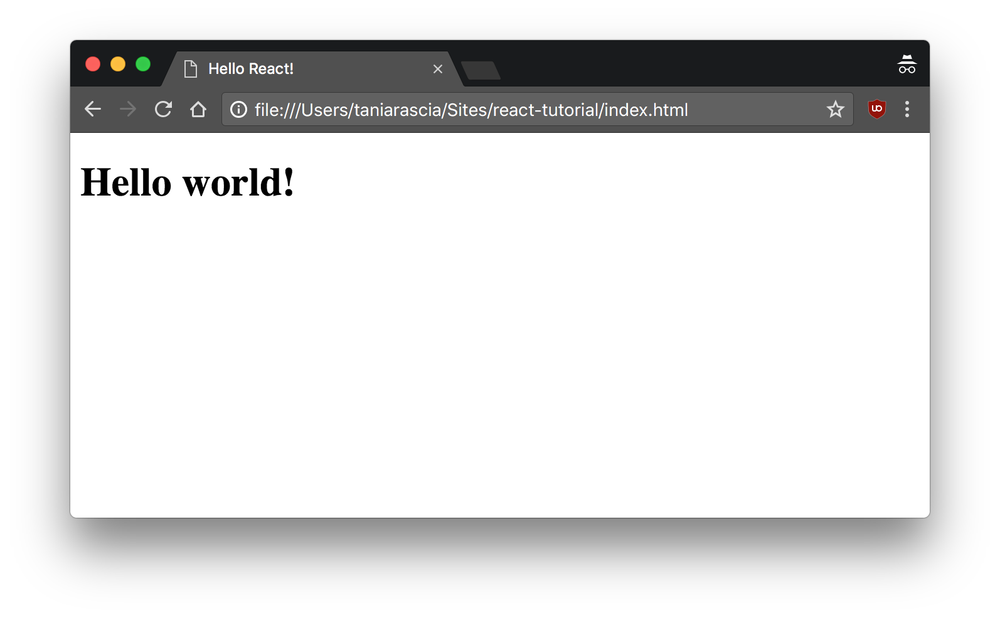
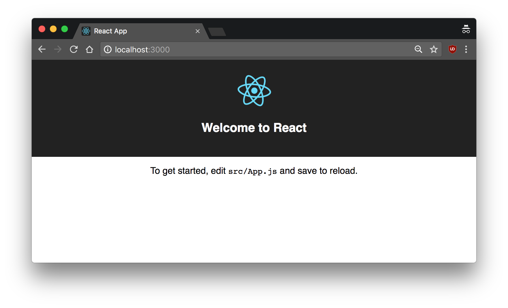
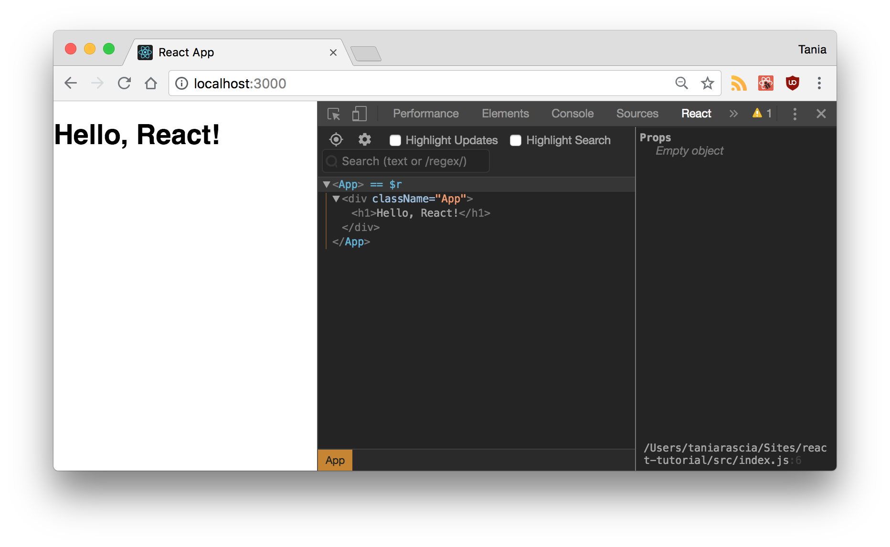
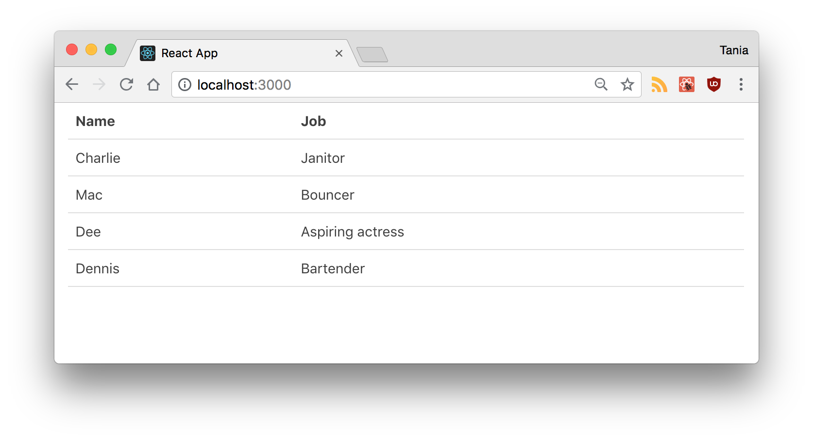
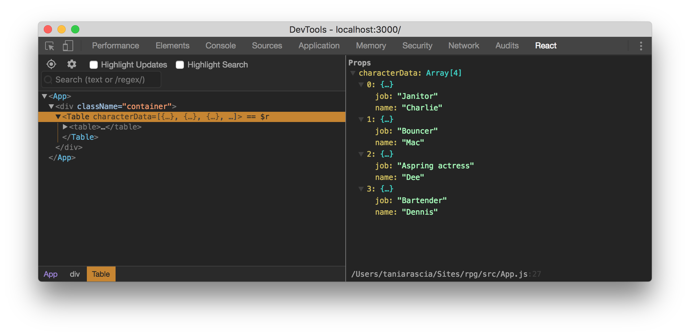
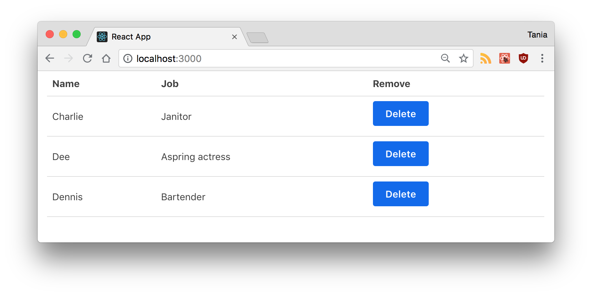
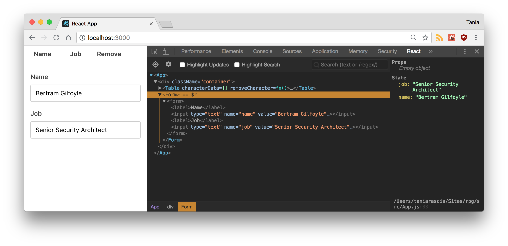
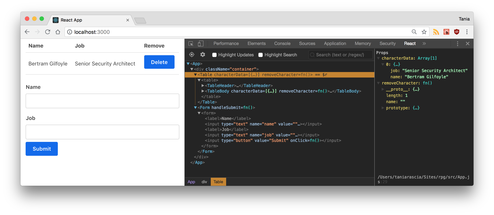
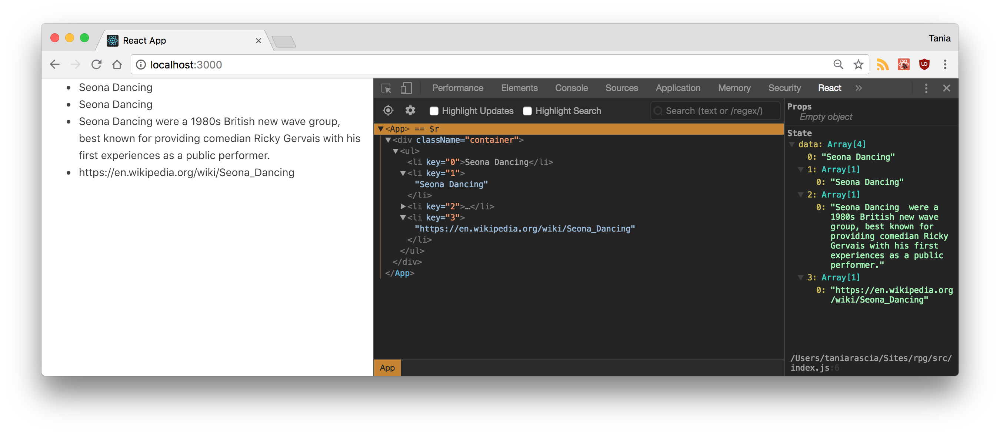

I've been hearing about React since I first started learning JavaScript, but I'll admit I took one look at it and it scared me. I saw what looked like a bunch of HTML mixed with JavaScript and thought, _isn't this what we've been trying to avoid? What's the big deal with React?_

Instead, I focused on just learning vanilla JavaScript and working with jQuery in a professional setting. After a few frustrated, failed attempts to get started with React, I finally started to get it, and I began to see why I might want to use React instead of vanilla JS or jQuery.

I tried to condense everything I've learned into a nice introduction to share with you, so here it is.

#### Prerequisites

There are a few things you should know in advance before you start playing around with React. If you've never used JavaScript or the DOM at all before, for example, I would get more familiar with those before trying to tackle React.

Here are what I consider to be React prerequisites.

- Basic familiarity with [HTML & CSS](https://internetingishard.com/).
- Basic knowledge of [JavaScript](https://www.digitalocean.com/community/tutorial_series/how-to-code-in-javascript) and programming.
- Basic understanding of [the DOM](/introduction-to-the-dom/).
- Familiarity with [ES6 syntax and features](/es6-syntax-and-feature-overview/).
- [Node.js and npm](/how-to-install-and-use-node-js-and-npm-mac-and-windows/) installed globally.

#### Goals

- Learn about essential React concepts and related terms, such as Babel, Webpack, JSX, components, props, state, and lifecycle.
- Build a very simple React app that demonstrates the above concepts.

Here's the source and a live demo of the end result.

- [View Source on GitHub](https://github.com/taniarascia/react-tutorial)
- [View Demo](https://taniarascia.github.io/react-tutorial/)

## What is React?

- React is a JavaScript library - one of the most popular ones, with [over 100,000 stars on GitHub](https://github.com/facebook/react).
- React is not a framework (unlike Angular, which is more opinionated).
- React is an open-source project created by Facebook.
- React is used to build user interfaces (UI) on the front end.
- React is the **view** layer of an MVC application (Model View Controller)

One of the most important aspects of React is the fact that you can create **components**, which are like custom, reusable HTML elements, to quickly and efficiently build user interfaces. React also streamlines how data is stored and handled, using **state** and **props**.

We'll go over all of this and more throughout the article, so let's get started.

## Setup and Installation

There are a few ways to set up React, and I'll show you two so you get a good idea of how it works.

### Static HTML File

This first method is not a popular way to set up React and is not how we'll be doing the rest of our tutorial, but it will be familiar and easy to understand if you've ever used a library like jQuery, and it's the least scary way to get started if you're not familiar with Webpack, Babel, and Node.js.

Let's start by making a basic `index.html` file. We're going to load in three CDNs in the `head` - React, React DOM, and Babel. We're also going to make a `div` with an id called `root`, and finally we'll create a `script` tag where your custom code will live.

<div class="filename">index.html</div>

```html
<!DOCTYPE html>
<html>
  <head>
    <meta charset="utf-8" />

    <title>Hello React!</title>

    <script src="https://unpkg.com/react@16/umd/react.development.js"></script>
    <script src="https://unpkg.com/react-dom@16/umd/react-dom.development.js"></script>
    <script src="https://unpkg.com/babel-standalone@6.26.0/babel.js"></script>
  </head>

  <body>
    <div id="root"></div>

    <script type="text/babel">
      // React code will go here
    </script>
  </body>
</html>
```

I'm loading in the latest stable versions of the libraries as of the time of this writing.

- [React](https://reactjs.org/docs/react-api.html) - the React top level API
- [React DOM](https://reactjs.org/docs/react-dom.html) - adds DOM-specific methods
- [Babel](https://babeljs.io/) - a JavaScript compiler that lets us use ES6+ in old browsers

The entry point for our app will be the `root` div element, which is named by convention. You'll also notice the `text/babel` script type, which is mandatory for using Babel.

Now, let's write our first code block of React. We're going to use ES6 classes to create a React component called `App`.

```jsx
class App extends React.Component {
  //...
}
```

Now we'll add the [`render()`](https://reactjs.org/docs/react-component.html#render) method, the only required method in a class component, which is used to render DOM nodes.

```jsx
class App extends React.Component {
  render() {
      return (
          //...
      );
  }
}
```

Inside the `return`, we're going to put what looks like a simple HTML element. Note that we're not returning a string here, so don't use quotes around the element. This is called `JSX`, and we'll learn more about it soon.

```jsx
class App extends React.Component {
  render() {
    return <h1>Hello world!</h1>
  }
}
```

Finally, we're going to use the React DOM `render()` method to render the `App` class we created into the `root` div in our HTML.

```jsx
ReactDOM.render(<App />, document.getElementById('root'))
```

Here is the full code for our `index.html`.

index.html

```html
<!DOCTYPE html>
<html>
  <head>
    <meta charset="utf-8" />

    <title>Hello React!</title>

    <script src="https://unpkg.com/react@16/umd/react.development.js"></script>
    <script src="https://unpkg.com/react-dom@16/umd/react-dom.development.js"></script>
    <script src="https://unpkg.com/babel-standalone@6.26.0/babel.js"></script>
  </head>

  <body>
    <div id="root"></div>

    <script type="text/babel">
      class App extends React.Component {
        render() {
          return <h1>Hello world!</h1>
        }
      }

      ReactDOM.render(<App />, document.getElementById('root'))
    </script>
  </body>
</html>
```

Now if you view your `index.html` in the browser, you'll see the `h1` tag we created rendered to the DOM.



Cool! Now that you've done this, you can see that React isn't so insanely scary to get started with. It's just some JavaScript helper libraries that we can load into our HTML.

We've done this for demonstration purposes, but from here out we're going to use another method: Create React App.

### Create React App

The method I just used of loading JavaScript libraries into a static HTML page and rendering the React and Babel on the fly is not very efficient, and is hard to maintain.

Fortunately, Facebook has created [Create React App](https://github.com/facebook/create-react-app), an environment that comes pre-configured with everything you need to build a React app. It will create a live development server, use Webpack to automatically compile React, JSX, and ES6, auto-prefix CSS files, and use ESLint to test and warn about mistakes in the code.

To set up `create-react-app`, run the following code in your terminal, one directory up from where you want the project to live. Make sure you have `5.2` or higher in Node.js.

```bash
npx create-react-app react-tutorial
```

Once that finishes installing, move to the newly created directory and start the project.

```bash
cd react-tutorial
npm start
```

Once you run this command, a new window will popup at `localhost:3000` with your new React app.



If you look into the project structure, you'll see a `/public` and `/src` directory, along with the regular `node_modules`, `.gitignore`, `README.md`, and `package.json`.

In `/public`, our important file is `index.html`, which is very similar to the static `index.html` file we made earlier - just a `root` div. This time, no libraries or scripts are being loaded in. The `/src` directory will contain all our React code.

To see how the environment automatically compiles and updates your React code, find the line that looks like this in `/src/App.js`:

```html
To get started, edit `src/App.js` and save to reload.
```

And replace it with any other text. Once you save the file, you'll notice `localhost:3000` compiles and refreshes with the new data.

Go ahead and delete all the files out of the `/src` directory, and we'll create our own boilerplate file without any bloat. We'll just keep `index.css` and `index.js`.

For `index.css`, I just copy-and-pasted the contents of [Primitive CSS](https://taniarascia.github.io/primitive/css/main.css) into the file. If you want, you can use Bootstrap or whatever CSS framework you want, or nothing at all. I just find it easier to work with.

Now in `index.js`, we're importing React, ReactDOM, and the CSS file.

<div class="filename">src/index.js</div>

```jsx
import React from 'react'
import ReactDOM from 'react-dom'
import './index.css'
```

Let's create our `App` component again. Before, we just had an `<h1>`, but now I'm adding in a div element with a class as well. You'll notice that we use `className` instead of `class`. This is our first hint that the code being written here is JavaScript, and not actually HTML.

```jsx
class App extends Component {
  render() {
    return (
      <div className="App">
        <h1>Hello, React!</h1>
      </div>
    )
  }
}
```

Finally, we'll render the `App` to the root as before.

```js
ReactDOM.render(<App />, document.getElementById('root'))
```

Here's our full `index.js`. This time, we're loading the `Component` as a property of React, so we no longer need to extend `React.Component`.

<div class="filename">src/index.js</div>

```jsx
import React, { Component } from 'react'
import ReactDOM from 'react-dom'
import './index.css'

class App extends Component {
  render() {
    return (
      <div className="App">
        <h1>Hello, React!</h1>
      </div>
    )
  }
}

ReactDOM.render(<App />, document.getElementById('root'))
```

If you go back to `localhost:3000`, you'll see "Hello, React!" just like before. We have the beginnings of a React app now.

### React Developer Tools

There is an extension called React Developer Tools that will make your life much easier when working with React. Download [React DevTools for Chrome](https://chrome.google.com/webstore/detail/react-developer-tools/fmkadmapgofadopljbjfkapdkoienihi), or whatever browser you prefer to work on.

After you install it, when you open DevTools, you'll see a tab for React. Click on it, and you'll be able to inspect components as they're written. You can still go to the Elements tab to see the actual DOM output. It may not seem like that much of a deal now, but as the app gets more complicated, it will become increasingly necessary to use.



Now we have all the tools and setup we need to actually begin working with React.

## JSX: JavaScript + XML

As you've seen, we've been using what looks like HTML in our React code, but it's not quite HTML. This is **JSX**, which stands for JavaScript XML.

With JSX, we can write what looks like HTML, and also we can create and use our own XML-like tags. Here's what JSX looks like assigned to a variable.

<div class="filename">JSX</div>

```jsx
const heading = <h1 className="site-heading">Hello, React</h1>
```

Using JSX is not mandatory for writing React. Under the hood, it's running `createElement`, which takes the tag, object containing the properties, and children of the component and renders the same information. The below code will have the same output as the JSX above.

<div class="filename">Non-JSX</div>

```jsx
const heading = React.createElement('h1', { className: 'site-heading' }, 'Hello, React!')
```

JSX is actually closer to JavaScript, not HTML, so there are a few key differences to note when writing it.

- `className` is used instead of `class` for adding CSS classes, as `class` is a reserved keyword in JavaScript.
- Properties and methods in JSX are camelCase - `onclick` will become `onClick`.
- Self-closing tags _must_ end in a slash - e.g. ``

JavaScript expressions can also be embedded inside JSX using curly braces, including variables, functions, and properties.

```jsx
const name = 'Tania'
const heading = <h1>Hello, {name}</h1>
```

JSX is easier to write and understand than creating and appending many elements in vanilla JavaScript, and is one of the reasons people love React so much.

## Components

So far, we've created one component - the `App` component. Almost everything in React consists of components, which can be **class components** or **simple components**.

Most React apps have many small components, and everything loads into the main `App` component. Components also often get their own file, so let's change up our project to do so.

Remove the `App` class from `index.js`, so it looks like this.

<div class="filename">src/index.js</div>

```jsx
import React from 'react'
import ReactDOM from 'react-dom'
import App from './App'
import './index.css'

ReactDOM.render(<App />, document.getElementById('root'))
```

We'll create a new file called `App.js` and put the component in there.

<div class="filename">src/App.js</div>

```jsx
import React, { Component } from 'react'

class App extends Component {
  render() {
    return (
      <div className="App">
        <h1>Hello, React!</h1>
      </div>
    )
  }
}

export default App
```

We export the component as `App` and load it in `index.js`. It's not mandatory to separate components into files, but an application will start to get unwieldy and out-of-hand if you don't.

### Class Components

Let's create another component. We're going to create a table. Make `Table.js`, and fill it with the following data.

<div class="filename">src/Table.js</div>

```jsx
import React, { Component } from 'react'

class Table extends Component {
  render() {
    return (
      <table>
        <thead>
          <tr>
            <th>Name</th>
            <th>Job</th>
          </tr>
        </thead>
        <tbody>
          <tr>
            <td>Charlie</td>
            <td>Janitor</td>
          </tr>
          <tr>
            <td>Mac</td>
            <td>Bouncer</td>
          </tr>
          <tr>
            <td>Dee</td>
            <td>Aspiring actress</td>
          </tr>
          <tr>
            <td>Dennis</td>
            <td>Bartender</td>
          </tr>
        </tbody>
      </table>
    )
  }
}

export default Table
```

This component we created is a custom class component. We capitalize custom components to differentiate them from regular HTML elements. Back in `App.js`, we can load in the Table, first by importing it in:

```jsx
import Table from './Table'
```

Then by loading it into the `render()` of `App`, where before we had "Hello, React!". I also changed the class of the outer container.

```jsx
return (
  <div className="container">
    <Table />
  </div>
)
```

If you check back on your live environment, you'll see the `Table` loaded in.



Now we've seen what a custom class component is. We could reuse this component over and over. However, since the data is hard-coded into it, it wouldn't be too useful at the moment.

### Simple Components

The other type of component in React is the **simple component**, which is a function. This component doesn't use the `class` keyword. Let's take our `Table` and make two simple components for it - a table header, and a table body.

We're going to use ES6 arrow functions to create these simple components. First, the table header.

```jsx
const TableHeader = () => {
  return (
    <thead>
      <tr>
        <th>Name</th>
        <th>Job</th>
      </tr>
    </thead>
  )
}
```

Then the body.

```jsx
const TableBody = () => {
  return (
    <tbody>
      <tr>
        <td>Charlie</td>
        <td>Janitor</td>
      </tr>
      <tr>
        <td>Mac</td>
        <td>Bouncer</td>
      </tr>
      <tr>
        <td>Dee</td>
        <td>Aspiring actress</td>
      </tr>
      <tr>
        <td>Dennis</td>
        <td>Bartender</td>
      </tr>
    </tbody>
  )
}
```

Now our `Table` class will look like this.

```jsx
class Table extends Component {
  render() {
    return (
      <table>
        <TableHeader />
        <TableBody />
      </table>
    )
  }
}
```

Everything should appear as it did before. As you can see, components can be nested in other components, and simple and class components can be mixed.

> A class component must include `render()`, and the `return` can only return one parent element.

As a wrap up, let's compare a simple component with a class component.

<div class="filename">Simple Component</div>

```jsx
const SimpleComponent = () => {
  return <div>Example</div>
}
```

<div class="filename">Class Component</div>

```jsx
class ClassComponent extends Component {
  render() {
    return <div>Example</div>
  }
}
```

Note that if the `return` is contained to one line, it does not need parentheses.

## Props

Right now, we have a cool `Table` component, but the data is being hard-coded. One of the big deals about React is how it handles data, and it does so with properties, referred to as **props**, and with state. First, we'll focus on handling data with props.

First, let's remove all the data from our `TableBody` component.

<div class="filename">Table.js</div>

```jsx
const TableBody = () => {
  return <tbody />
}
```

Then let's move all that data to an array of objects, as if we were bringing in a JSON-based API. We'll have to create this array inside our `render()`.

<div class="filename">App.js</div>

```jsx
class App extends Component {
  render() {
    const characters = [
      {
        name: 'Charlie',
        job: 'Janitor',
      },
      {
        name: 'Mac',
        job: 'Bouncer',
      },
      {
        name: 'Dee',
        job: 'Aspring actress',
      },
      {
        name: 'Dennis',
        job: 'Bartender',
      },
    ]

    return (
      <div className="container">
        <Table />
      </div>
    )
  }
}
```

Now, we're going to pass the data through to the child component (`Table`) with properties, kind of how you might pass data through using `data-` attributes. We can call the property whatever we want, as long as it's not a reserved keyword, so I'll go with `characterData`. The data I'm passing through is the `characters` variable, and I'll put curly braces around it as it's a JavaScript expression.

```jsx
return (
  <div className="container">
    <Table characterData={characters} />
  </div>
)
```

Now that data is being passed through to `Table`, we have to work on accessing it from the other side.

<div class="filename">Table.js</div>

```jsx
class Table extends Component {
  render() {
    const { characterData } = this.props

    return (
      <table>
        <TableHeader />
        <TableBody characterData={characterData} />
      </table>
    )
  }
}
```

If you open up React DevTools and inspect the `Table` component, you'll see the array of data in the property. The data that's stored here is known as the **virtual DOM**, which is a fast and efficient way of syncing data with the actual DOM.



This data is not in the actual DOM yet, though. In `Table`, we can access all props through `this.props`. We're only passing one props through, characterData, so we'll use `this.props.characterData` to retrieve that data.

I'm going to use the ES6 property shorthand to create a variable that contains `this.props.characterData`.

```jsx
const { characterData } = this.props
```

Since our `Table` component actually consists of two smaller simple components, I'm going to pass it through to the `TableBody`, once again through props.

<div class="filename">Table.js</div>

```jsx
class Table extends Component {
  render() {
    const { characterData } = this.props

    return (
      <table>
        <TableHeader />
        <TableBody characterData={characterData} />
      </table>
    )
  }
}
```

Right now, `TableBody` takes no parameters and returns a single tag.

```jsx
const TableBody = () => {
  return <tbody />
}
```

We're going to pass the props through as a parameter, and [map through the array](https://developer.mozilla.org/en-US/docs/Web/JavaScript/Reference/Global_Objects/Array/map) to return a table row for each object in the array. This map will be contained in the `rows` variable, which we'll return as an expression.

```jsx
const TableBody = props => {
  const rows = props.characterData.map((row, index) => {
    return (
      <tr key={index}>
        <td>{row.name}</td>
        <td>{row.job}</td>
      </tr>
    )
  })

  return <tbody>{rows}</tbody>
}
```

If you view the front end of the app, all the data is loading in now.

You'll notice I've added a key index to each table row. You should always use [keys](https://reactjs.org/docs/lists-and-keys.html#keys) when making lists in React, as they help identify each list item. We'll also see how this is necessary in a moment when we want to manipulate list items.

Props are an effective way to pass existing data to a React component, however the component cannot change the props - they're read-only. In the next section, we'll learn how to use state to have further control over handling data in React.

## State

Right now, we're storing our character data in an array in a variable, and passing it through as props. This is good to start, but imagine if we want to be able to delete an item from the array. With props, we have a one way data flow, but with state we can update private data from a component.

You can think of state as any data that should be saved and modified without necessarily being added to a database - for example, adding and removing items from a shopping cart before confirming your purchase.

To start, we're going to create a `state` object.

```jsx
class App extends Component {
  state = {}
}
```

The object will contain properties for everything you want to store in the state. For us, it's `characters`.

```jsx
class App extends Component {
  state = {
    characters: [],
  }
}
```

Move the entire array of objects we created earlier into `state.characters`.

```jsx
class App extends Component {
  state = {
    characters: [
      {
        name: 'Charlie',
        // the rest of the data
      },
    ],
  }
}
```

Our data is officially contained in the state. Since we want to be able to remove a character from the table, we're going to create a `removeCharacter` method on the parent `App` class.

To retrieve the state, we'll get `this.state.characters` using the same ES6 method as before. To update the state, we'll use `this.setState()`, a built-in method for manipulating state. We'll [filter the array](https://developer.mozilla.org/en-US/docs/Web/JavaScript/Reference/Global_Objects/Array/filter) based on an `index` that we pass through, and return the new array.

> You must use `this.setState()` to modify an array. Simply applying a new value to `this.state.property` will not work.

<div class="filename">App.js</div>

```jsx
removeCharacter = index => {
  const { characters } = this.state

  this.setState({
    characters: characters.filter((character, i) => {
      return i !== index
    }),
  })
}
```

`filter` does not mutate but rather creates a new array, and is a preferred method for modifying arrays in JavaScript. This particular method is testing an index vs. all the indices in the array, and returning all but the one that is passed through.

Now we have to pass that function through to the component, and render a button next to each character that can invoke the function. We'll pass the `removeCharacter` function through as a prop to `Table`.

<div class="filename">App.js</div>

```jsx
render() {
  const { characters } = this.state

  return (
    <div className="container">
      <Table characterData={characters} removeCharacter={this.removeCharacter} />
    </div>
  )
}
```

Since we're passing it down to `TableBody` from `Table`, we're going to have to pass it through again as a prop, just like we did with the character data.

<div class="filename">Table.js</div>

```jsx
class Table extends Component {
  render() {
    const { characterData, removeCharacter } = this.props

    return (
      <table>
        <TableHeader />
        <TableBody characterData={characterData} removeCharacter={removeCharacter} />
      </table>
    )
  }
}
```

Here's where that index we defined in the `removeCharacter()` method comes in. In the `TableBody` component, we'll pass the key/index through as a parameter, so the filter function knows which item to remove. We'll create a button with an `onClick` and pass it through.

<div class="filename">Table.js</div>

```jsx
<tr key={index}>
  <td>{row.name}</td>
  <td>{row.job}</td>
  <td>
    <button onClick={() => props.removeCharacter(index)}>Delete</button>
  </td>
</tr>
```

> The `onClick` function must pass through a function that returns the `removeCharacter()` method, otherwise it will try to run automatically.

Awesome. Now we have delete buttons, and we can modify our state by deleting a character.



I deleted Mac.

Now you should understand how state gets initialized and how it can be modified.

## Submitting Form Data

Now we have data stored in state, and we can remove any item from the state. However, what if we wanted to be able to add new data to state? In a real world application, you'd more likely start with empty state and add to it, such as with a to-do list or a shopping cart.

Before anything else, let's remove all the hard-coded data from `state.characters`, as we'll be updating that through the form now.

```jsx
class App extends Component {
  state = {
    characters: [],
  }
}
```

Now let's go ahead and create a `Form` component in a new file called `Form.js`. We're going to create a class component, and within we'll use a `constructor()`, which we haven't done thus far. We'll need the `constructor()` to use `this`, and to receive the `props` of the parent.

We're going to set the initial state of the `Form` to be an object with some empty properties, and assign that initial state to `this.state`.

Form.js

```jsx
import React, { Component } from 'react'

class Form extends Component {
  constructor(props) {
    super(props)

    this.initialState = {
      name: '',
      job: '',
    }

    this.state = this.initialState
  }
}
```

Our goal for this form will be to update the state of `Form` every time a field is changed in the form, and when we submit, all that data will pass to the `App` state, which will then update the `Table`.

First, we'll make the function that will run every time a change is made to an input. The `event` will be passed through, and we'll set the state of `Form` to have the `name` (key) and `value` of the inputs.

```jsx
handleChange = event => {
  const { name, value } = event.target

  this.setState({
    [name]: value,
  })
}
```

Let's get this working before we move on to submitting the form. In the render, let's get our two properties from state, and assign them as the values that correspond to the proper form keys. We'll run the `handleChange()` method as the `onChange` of the input, and finally we'll export the `Form` component.

```jsx
render() {
  const { name, job } = this.state;

  return (
    <form>
      <label>Name</label>
      <input
        type="text"
        name="name"
        value={name}
        onChange={this.handleChange} />
      <label>Job</label>
      <input
        type="text"
        name="job"
        value={job}
        onChange={this.handleChange} />
    </form>
  );
}

export default Form;
```

In `App.js`, we can render the form below the table.

<div class="filename">App.js</div>

```jsx
return (
  <div className="container">
    <Table characterData={characters} removeCharacter={this.removeCharacter} />
    <Form />
  </div>
)
```

Now if we go to the front end of our app, we'll see a form that doesn't have a submit yet. Update some fields and you'll see the local state of `Form` being updated.



Cool. Last step is to allow us to actually submit that data and update the parent state. We'll create a function called `handleSubmit()` on `App` that will update the state by taking the existing `this.state.characters` and adding the new `character` parameter, using the [ES6 spread operator](https://developer.mozilla.org/en-US/docs/Web/JavaScript/Reference/Operators/Spread_syntax).

<div class="filename">App.js</div>

```jsx
handleSubmit = character => {
  this.setState({ characters: [...this.state.characters, character] })
}
```

Let's make sure we pass that through as a parameter on `Form`.

```jsx
<Form handleSubmit={this.handleSubmit} />
```

Now in `Form`, we'll create a method called `submitForm()` that will call that function, and pass the `Form` state through as the `character` parameter we defined earlier. It will also reset the state to the initial state, to clear the form after submit.

<div class="filename">Form.js</div>

```jsx
submitForm = () => {
  this.props.handleSubmit(this.state)
  this.setState(this.initialState)
}
```

Finally, we'll add a submit button to submit the form. We're using an `onClick` instead of an `onSubmit` since we're not using the standard submit functionality. The click will call the `submitForm` we just made.

```jsx
<input type="button" value="Submit" onClick={this.submitForm} />
```

And that's it! The app is complete. We can create, add, and remove users from our table. Since the `Table` and `TableBody` were already pulling from the state, it will display properly.



If you got lost anywhere along the way, you can view [the complete source on GitHub](https://github.com/taniarascia/react-tutorial).

## Pulling in API Data

One very common usage of React is pulling in data from an API. If you're not familiar with what an API is or how to connect to one, I would recommend reading [How to Connect to an API with JavaScript](/how-to-connect-to-an-api-with-javascript/), which will walk you through what APIs are and how to use them with vanilla JavaScript.

As a little test, we can create an `Api.js` file, and create a new `App` in there. A public API we can test with is the [Wikipedia API](https://en.wikipedia.org/w/api.php), and I have a [URL endpoint right here](https://en.wikipedia.org/w/api.php?action=opensearch&search=Seona+Dancing&format=json&origin=*) for a random\* search. You can go to that link to see the API - and make sure you have [JSONView](https://chrome.google.com/webstore/detail/jsonview/chklaanhfefbnpoihckbnefhakgolnmc) installed on your browser.

We're going to use [JavaScript's built-in Fetch](/how-to-use-the-javascript-fetch-api-to-get-json-data/) to gather the data from that URL endpoint and display it. You can switch between the app we created and this test file by just changing the URL in `index.js` - `import App from './Api';`.

I'm not going to explain this code line-by-line, as we've already learned about creating a component, rendering, and mapping through a state array. The new aspect to this code is `componentDidMount()`, a React lifecycle method. **Lifecycle** is the order in which methods are called in React. **Mounting** refers to an item being inserted into the DOM.

When we pull in API data, we want to use `componentDidMount`, because we want to make sure the component has rendered to the DOM before we bring in the data. In the below snippet, you'll see how we bring in data from the Wikipedia API, and display it on the page

<div class="filename">Api.js</div>

```jsx
import React, { Component } from 'react'

class App extends Component {
  state = {
    data: [],
  }

  // Code is invoked after the component is mounted/inserted into the DOM tree.
  componentDidMount() {
    const url =
      'https://en.wikipedia.org/w/api.php?action=opensearch&search=Seona+Dancing&format=json&origin=*'

    fetch(url)
      .then(result => result.json())
      .then(result => {
        this.setState({
          data: result,
        })
      })
  }

  render() {
    const { data } = this.state

    const result = data.map((entry, index) => {
      return <li key={index}>{entry}</li>
    })

    return <ul>{result}</ul>
  }
}

export default App
```

Once you save and run this file in the local server, you'll see the Wikipedia API data displayed in the DOM.



There are other lifecycle methods, but going over them will be beyond the scope of this article. You can [read more about React components here](https://reactjs.org/docs/react-component.html).

_\*Wikipedia search choice may not be random. It might be an article that I spearheaded back in 2005._

## Building and Deploying a React App

Everything we've done so far has been in a development environment. We've been compiling, hot-reloading, and updating on the fly. For production, we're going to want to have static files loading in - none of the source code. We can do this by making a build and deploying it.

Now, if you just want to compile all the React code and place it in the root of a directory somewhere, all you need to do is run the following line:

```bash
npm run build
```

This will create a `build` folder which will contain your app. Put the contents of that folder anywhere, and you're done!

We can also take it a step further, and have npm deploy for us. We're going to build to GitHub pages, so you'll already have to [be familiar with Git](/getting-started-with-git/) and getting your code up on GitHub.

Make sure you've exited out of your local React environment, so the code isn't currently running. First, we're going to add a `homepage` field to `package.json`, that has the URL we want our app to live on.

<div class="filename">package.json</div>

```js
"homepage": "https://taniarascia.github.io/react-tutorial",
```

We'll also add these two lines to the `scripts` property.

```js
"scripts": {
  // ...
  "predeploy": "npm run build",
  "deploy": "gh-pages -d build"
}
```

In your project, you'll add `gh-pages` to the devDependencies.

```bash
npm install --save-dev gh-pages
```

We'll create the `build`, which will have all the compiled, static files.

```bash
npm run build
```

Finally, we'll deploy to `gh-pages`.

```bash
npm run deploy
```

And we're done! The app is now available live at [https://taniarascia.github.io/react-tutorial](https://taniarascia.github.io/react-tutorial).

## Conclusion

This article should have given you a good introduction to React, simple and class components, state, props, working with form data, pulling data in from an API, and deploying an app. There is much more to learn and do with React, but I hope you feel confident delving in and playing around with React yourself now.

- [View Source on GitHub](https://github.com/taniarascia/react-tutorial)
- [View Project](https://taniarascia.github.io/react-tutorial/)

Please let me know if anything was unclear, or if there's anything else you'd like to see in this or a subsequent article.
