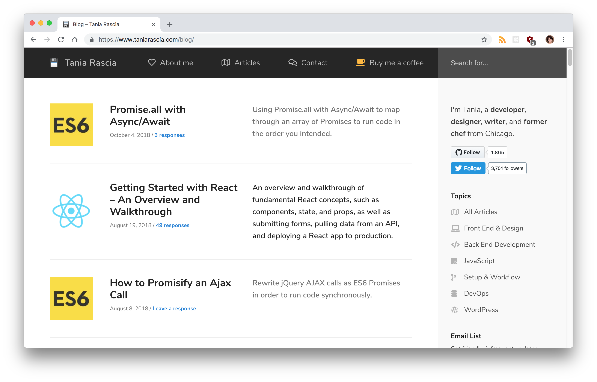
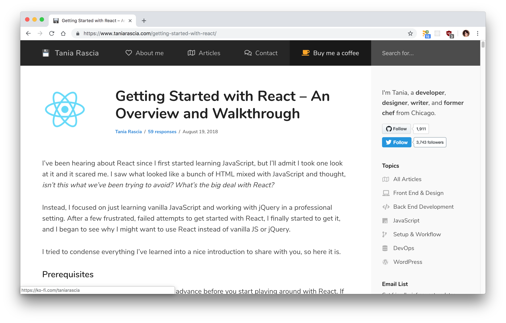
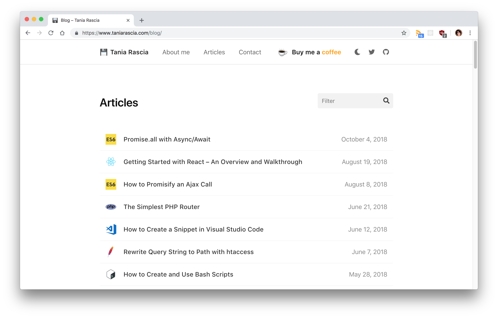
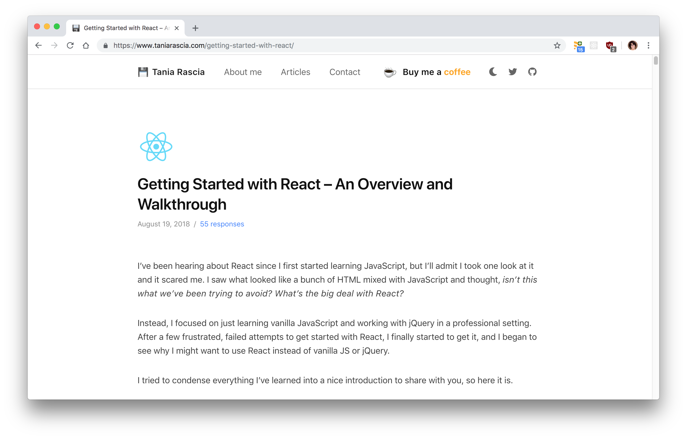
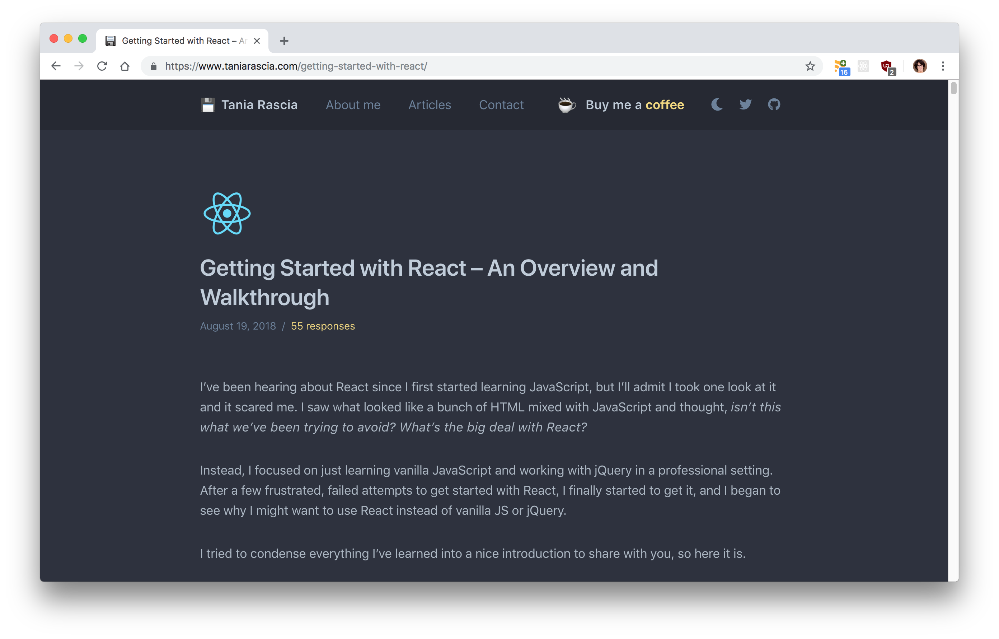
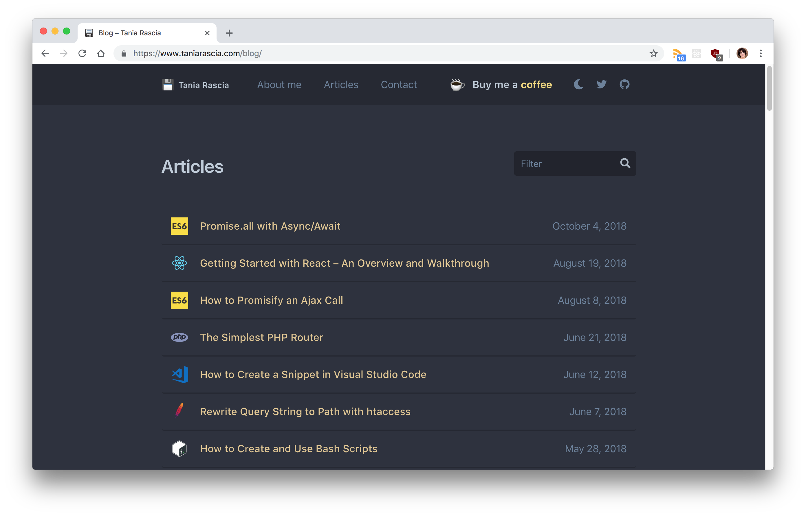

Back in July 2017, I posted about [all the redesigns of taniarascia.com](/version-2-0-website-redesign-863-commits-later/) that happened up to version 2.0. I made many small, incremental changes to the design over the course of two years, because I'm obsessed with tweaking my site's design and always trying to make it better. After making version 2.0, I decided to stop making tiny tweaks to the site and do full-blown redesigns instead. This way I can focus on writing more and still have fun designing every now and then.

A few months ago, I created version 3.0, which is where it was at until today. Below are the screenshots of how it used to look.

In version 3.0, I added a sidebar, and made the newsletter signup and donate button more prominent on the website. I tried to simplify and get rid of the big headers which I felt took up a lot of space for no other reason than that it was trendy. I tried to simplify the color scheme and navigation to only have the most important links, and I wanted to organize all my posts into sections: front end, back end, DevOps, etc.

For a while now, that design has been bothering me. I felt that it was too busy with the sidebar, and too confusing with all the sections. I decided to redo the site and now we have version 4.0, seen below.

In this version of the site, I tried to simplify as much as possible and focus more on function than form. I removed the sidebar, and removed the links to social media, newsletter signups, and donations from the single pages. I consolidated all my information to different sections on the front page, and instead of having a bunch of category and topics in my posts page, I put them all together with a filtering input.

One brand new aspect of this design is night mode, which you can access by clicking on the moon icon in the header.

I'd love any input from those of you who regularly visit my site, and new visitors as well. Is the site pleasant to use? Is it easy to find what you're looking for? Do you like it? If you have an opinion, let me know!
