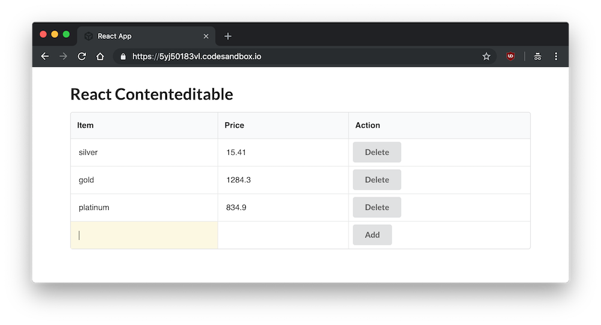
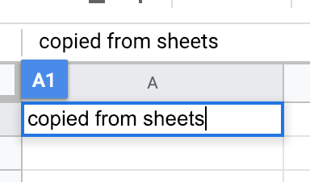
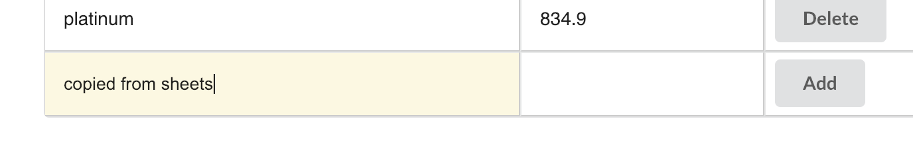
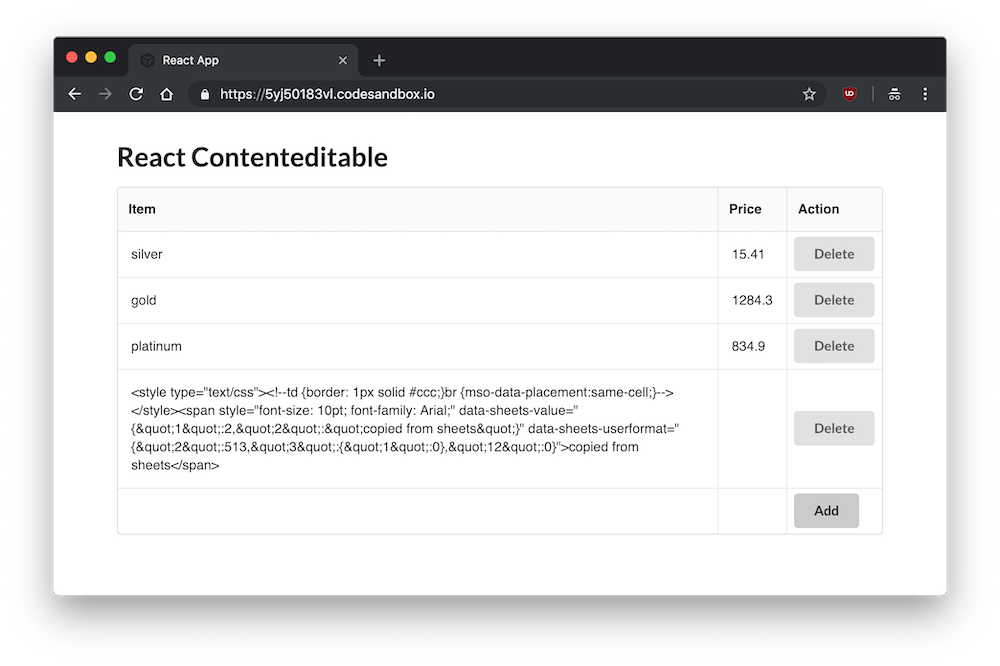
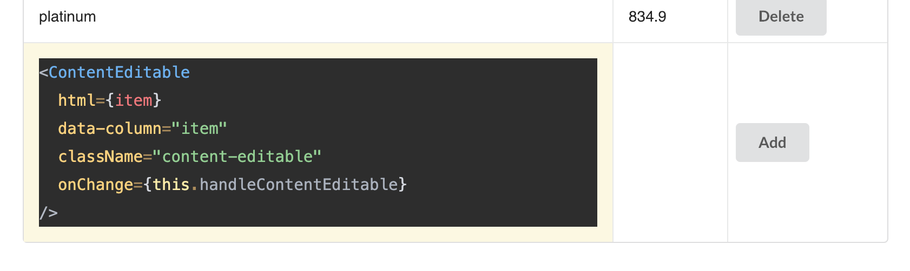
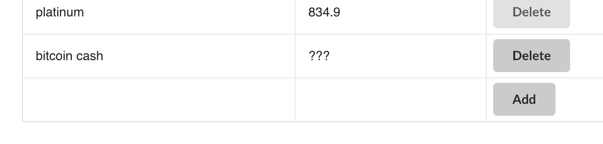
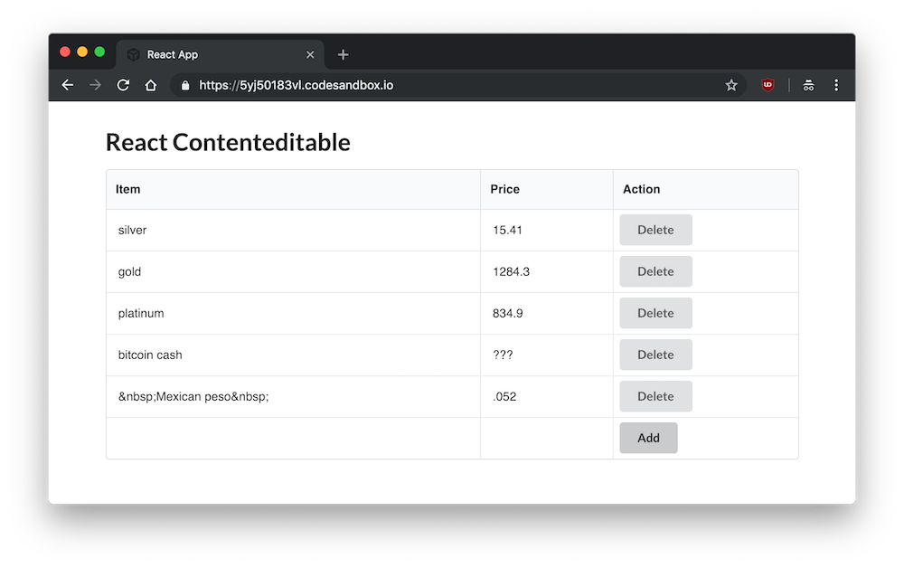
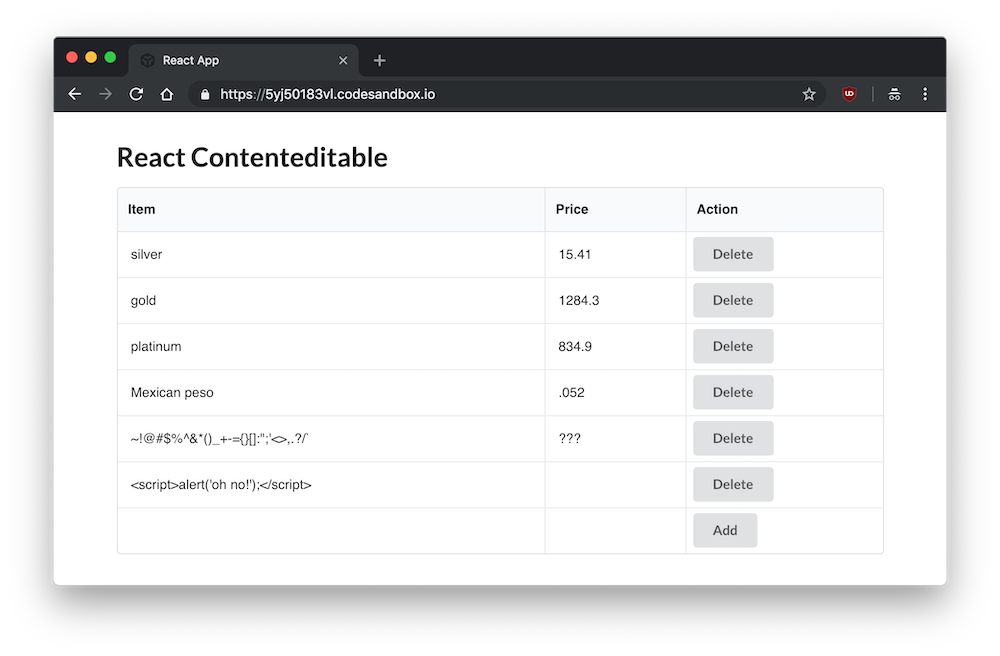
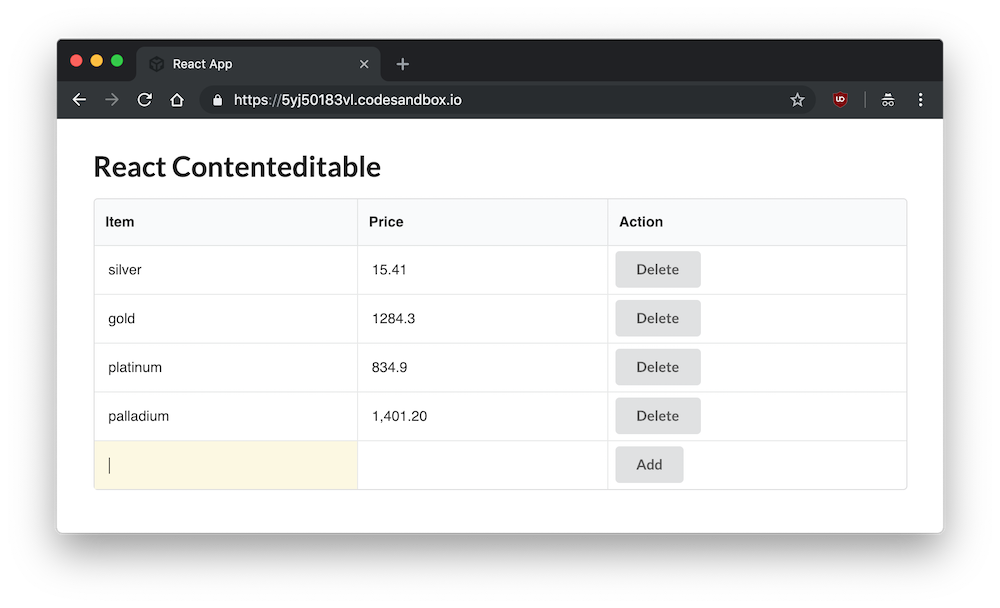
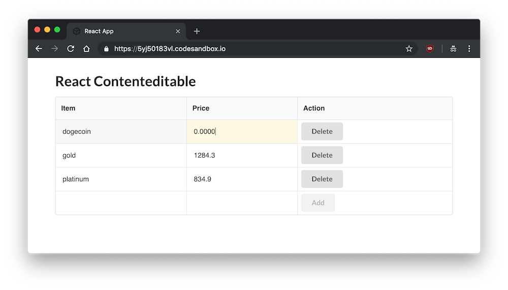

Any element can be made editable with the addition of the `contenteditable` attribute. This attribute is used all over the web, such as in Google Sheets. I'm not going to tell you to use or not to use [`contenteditable`](https://developer.mozilla.org/en-US/docs/Web/Guide/HTML/Editable_content) elements in your app. If you're choosing to use `contenteditable`, you may find this article useful.

I'm going to share a bunch of stuff I figured out while using `contenteditable`, so that someone else can find it all in one place.

#### Prerequisites

You may find something useful in this article if you're doing any sort of JavaScript work with `contenteditable`, but I'm going to use my examples with React. You should already know JavaScript, know about [Node](/how-to-install-and-use-node-js-and-npm-mac-and-windows/), setting up a React project with `create-react-app`, etc.

- [Getting Started with React - an Overview and Walkthrough](/getting-started-with-react/) - if you've never used React.

As ever, I don't care about UI/design when it comes to articles about functionality, so I'm going to use [Semantic UI React](https://react.semantic-ui.com/) elements to plug in simple default styles.

#### Goals

I'm going to make a simple CRUD table in React using the `ContentEditable` component. I'm going to demonstrate a few issues you might run into, and the solutions I used.

Here are the issues:

- Pasting
- Spaces and Special Characters
- Newlines
- Highlighting
- Focusing

And then some stuff about numbers/currency, and editing existing rows.

- [View Completed Demo and Source](https://codesandbox.io/s/5yj50183vl)

## Setup

Here's a [CodeSandbox](https://codesandbox.io/s/ywr1wv41ov) demo of the starting code.

I'm going to set up a React project in `ce-app`.

```bash
npx create-react-app ce-app && cd ce-app
```

Add `react-contenteditable` and `semantic-ui-react` as the dependencies. [react-contenteditable](https://www.npmjs.com/package/react-contenteditable) is a really nice component which makes working with `contenteditable` more bearable.

```bash
yarn add react-contenteditable semantic-ui-react
```

> `npx` is not a typo. Use `npm install -g npx` to install `npx` if you don't have it. If you're using `npm` instead of `yarn`, use `npm i react-contenteditable semantic-ui-react`.

For simplicity's sake, I'm going to put everything in `index.js`. I'm just loading all the dependencies, making the `App` component, putting some fake data in the state,

index.js

```jsx
import React, { Component } from 'react'
import ReactDOM from 'react-dom'
import ContentEditable from 'react-contenteditable'
import { Table, Button } from 'semantic-ui-react'
import './styles.css'

class App extends Component {
  initialState = {
    store: [
      { id: 1, item: 'silver', price: 15.41 },
      { id: 2, item: 'gold', price: 1284.3 },
      { id: 3, item: 'platinum', price: 834.9 },
    ],
    row: {
      item: '',
      price: '',
    },
  }

  state = this.initialState

  // Methods will go here
  render() {
    const {
      store,
      row: { item, price },
    } = this.state

    return (
      <div className="App">
        <h1>React Contenteditable</h1>
        {/* Table will go here */}
      </div>
    )
  }
}

ReactDOM.render(<App />, document.getElementById('root'))
```

The table has Item, Price, and Action as the headers, and maps through the state for each row. Each cell has a `ContentEditable` component, or an action to delete a row or add a new row.

```jsx
<Table celled>
  <Table.Header>
    <Table.Row>
      <Table.HeaderCell>Item</Table.HeaderCell>
      <Table.HeaderCell>Price</Table.HeaderCell>
      <Table.HeaderCell>Action</Table.HeaderCell>
    </Table.Row>
  </Table.Header>
  <Table.Body>
    {store.map(row => {
      return (
        <Table.Row key={row.id}>
          <Table.Cell>{row.item}</Table.Cell>
          <Table.Cell>{row.price}</Table.Cell>
          <Table.Cell className="narrow">
            <Button
              onClick={() => {
                this.deleteRow(row.id)
              }}
            >
              Delete
            </Button>
          </Table.Cell>
        </Table.Row>
      )
    })}
    <Table.Row>
      <Table.Cell className="narrow">
        <ContentEditable
          html={item}
          data-column="item"
          className="content-editable"
          onChange={this.handleContentEditable}
        />
      </Table.Cell>
      <Table.Cell className="narrow">
        <ContentEditable
          html={price}
          data-column="price"
          className="content-editable"
          onChange={this.handleContentEditable}
        />
      </Table.Cell>
      <Table.Cell className="narrow">
        <Button onClick={this.addRow}>Add</Button>
      </Table.Cell>
    </Table.Row>
  </Table.Body>
</Table>
```

We start with three methods: one to add a row, which will update the store with the new row, and empty the existing row; the other to delete an existing row.

```jsx
addRow = () => {
  const { store, row } = this.state

  row.id = store.length + 1

  this.setState({
    store: [...store, row],
    row: this.initialState.row,
  })
}

deleteRow = id => {
  const { store } = this.state

  this.setState({
    store: store.filter(item => id !== item.id),
  })
}
```

Finally, we have the `handleContentEditable` component, which will be invoked every time a change is made to `ContentEditable`, via `onChange`. In order to use one function many possible columns, I added a `data-column` attribute to the component, so I get the key (column) and value of each `ContentEditable`, and set the `row`.

```jsx
handleContentEditable = event => {
  const { row } = this.state
  const {
    currentTarget: {
      dataset: { column },
    },
    target: { value },
  } = event

  this.setState({ row: { ...row, [column]: value } })
}
```

And a small bit of CSS to make it look decent.

```css
.App {
  margin: 2rem auto;
  max-width: 800px;
  font-family: sans-serif;
}

.ui.table td {
  padding: 1rem;
}

.ui.table td.narrow {
  padding: 0;
}

.ui.button {
  margin: 0 0.5rem;
}

.content-editable {
  padding: 1rem;
}

.content-editable:hover {
  background: #f7f7f7;
}

.content-editable:focus {
  background: #fcf8e1;
  outline: 0;
}
```

Again, at this point you can see the completed setup [on this demo](https://codesandbox.io/s/ywr1wv41ov) if you got lost anywhere.

So with the setup complete, you have a table where you can add a new row using `contenteditable`, as opposed to an `input` or `textarea`, and therefore have complete control over the style of the element.



## Issue 1: Pasting

Okay, so now you have your app. The industrious user thinks, oh, I can just copy and paste from Google Sheets or Excel instead of typing everything in by hand!

Let me just copy the thing...



Paste it in...



Looks good. Let's submit that bad boy.



Uh, what? `contenteditable` elements retain the formatting style of the text. Even pasting directly from your text editor doesn't paste plain text. Nothing is safe.



Since obviously we don't want HTML to be submitted here, we need to make a function to only paste the text and not the formatting.

```jsx
pasteAsPlainText = event => {
  event.preventDefault()

  const text = event.clipboardData.getData('text/plain')
  document.execCommand('insertHTML', false, text)
}
```

We can put it on the `onPaste` of the `ContentEditable`.

```jsx
<ContentEditable onPaste={this.pasteAsPlainText} />
```

## Issue 2: Spaces and Special Characters

You might type something with some spaces in it, submit it, and it turns out okay.



Cool, so spaces aren't an issue with `contenteditable`, right?

Let's see what happens when your user pastes it from somewhere and accidentally retains the space before and after the phrase.



Great. `&nsbp;`, the non-breaking space you used to format your website in 1998 gets retained at the beginning and end. Not just that, but also less than, greater than, and ampersand.

So I just made a little find and replace for those characters.

```jsx
const trimSpaces = string => {
  return string
    .replace(/&nbsp;/g, '')
    .replace(/&amp;/g, '&')
    .replace(/&gt;/g, '>')
    .replace(/&lt;/g, '<')
}
```

If I add it to the `addRow` method, I can fix them before they get submitted.

```jsx
addRow = () => {
  const { store, row } = this.state
  const trimSpaces = string => {
    return string
      .replace(/&nbsp;/g, '')
      .replace(/&amp;/g, '&')
      .replace(/&gt;/g, '>')
      .replace(/&lt;/g, '<')
  }
  const trimmedRow = {
    ...row,
    item: trimSpaces(row.item),
  }

  row.id = store.length + 1

  this.setState({
    store: [...store, trimmedRow],
    row: this.initialState.row,
  })
}
```



## Issue 3: Newlines

It's not beyond the realm of possibility to assume your user might try to press enter instead of tab to get to the next item.

Which will create a newline.


Which will be taken literally by `contenteditable`.


So we can disable that. `13` is the key code for enter.

```jsx
disableNewlines = event => {
  const keyCode = event.keyCode || event.which

  if (keyCode === 13) {
    event.returnValue = false
    if (event.preventDefault) event.preventDefault()
  }
}
```

This will go on the `onKeyPress` attribute.

```jsx
<ContentEditable onKeyPress={this.disableNewlines} />
```

## Issue 4: Highlighting

When we tab through a `contenteditable` element that's already there, the cursor goes back to the beginning of the div. This isn't very helpful. Instead, I'll make a function that highlights the entire element when selected, either by tab or mouse.

```jsx
highlightAll = () => {
  setTimeout(() => {
    document.execCommand('selectAll', false, null)
  }, 0)
}
```

This will go on the `onFocus` attribute.

```jsx
<ContentEditable onFocus={this.highlightAll} />
```

## Issue 5: Focusing After Submit

Currently, after submitting a row, the focus is lost, which makes having a nice flow while filling out this table impossible. Ideally, it would focus on the first item in the new row after submitting a row.

First, make a `ref` below state.

```jsx
firstEditable = React.createRef()
```

At the end of the `addRow` function, focus on the `firstEditable` current `div`.

```

this.firstEditable.current.focus()

```

`ContentEditable` conveniently has an `innerRef` attribute we can use for this.

```jsx
<ContentEditable innerRef={this.firstEditable} />
```

Now after submitting a row, we're already focused on the next row.



## Dealing with Numbers and Currency

This is not quite specific to `contenteditable`, but since I'm using price as one of the values, here are some functions for dealing with currency and numbers.

You might use an `<input type="number">` to only allow numbers on the front end in HTML, but we have to create our own function for `ContentEditable`. For the string, we had to prevent newlines on `keyPress`, but for currency, we'll only allow `.`, `,`, and `0-9`.

```jsx
validateNumber = event => {
  const keyCode = event.keyCode || event.which
  const string = String.fromCharCode(keyCode)
  const regex = /[0-9,]|\./

  if (!regex.test(string)) {
    event.returnValue = false
    if (event.preventDefault) event.preventDefault()
  }
}
```

Of course, this will still let incorrectly formatted numbers like `1,00,0.00.00` through, but we're only validating the input of a single key press here.

```jsx
<ContentEditable onKeyPress={this.validateNumber} />
```

## Editing Existing Rows

Finally, right now we can only edit the last row - once a row has been added, the only way to change it is to delete it and make a new one. It would be nice if we could just edit every single row in real time, right?

I'll make a new method just for updating. It's similar to the row, except instead of changing the state of the new row, it maps through the store and updates based on the index. I've added one more `data` attribute - the row.

```jsx
handleContentEditableUpdate = event => {
  const { store } = this.state

  const {
    currentTarget: {
      dataset: { row, column },
    },
    target: { value },
  } = event

  let updatedRow = store.filter((item, i) => parseInt(i) === parseInt(row))[0]
  updatedRow[column] = value

  this.setState({
    store: store.map((item, i) => (item[column] === row ? updatedRow : item)),
  })
}
```

Instead of just displaying the values in the rows, they'll all be `ContentEditable`.

```jsx
{store.map((row, i) => {
  return (
    <Table.Row key={row.id}>
      <Table.Cell className="narrow">
        <ContentEditable
          html={row.item}
          data-column="item"
          data-row={i}
          className="content-editable"
          onKeyPress={this.disableNewlines}
          onPaste={this.pasteAsPlainText}
          onFocus={this.highlightAll}
          onChange={this.handleContentEditableUpdate}
        />
      </Table.Cell>
      <Table.Cell className="narrow">
        <ContentEditable
          html={row.price.toString()}
          data-column="price"
          data-row={i}
          className="content-editable"
          onKeyPress={this.validateNumber}
          onPaste={this.pasteAsPlainText}
          onFocus={this.highlightAll}
          onChange={this.handleContentEditableUpdate}
        />
      </Table.Cell>
      ...
  )
})}
```



Finally, I'm going to add `disabled={!item || !price}` to the `Button` element to prevent empty entries from going through. And we're done!

## Complete Code

[View Completed Demo and Source](https://codesandbox.io/s/5yj50183vl)

Here's everything, in case something didn't make sense. Click the demo above for a CodeSandbox source and front end.

```jsx
import React, { Component } from 'react'
import ReactDOM from 'react-dom'
import ContentEditable from 'react-contenteditable'
import { Table, Button } from 'semantic-ui-react'
import './styles.css'

class App extends Component {
  initialState = {
    store: [
      { id: 1, item: 'silver', price: 15.41 },
      { id: 2, item: 'gold', price: 1284.3 },
      { id: 3, item: 'platinum', price: 834.9 },
    ],
    row: {
      item: '',
      price: '',
    },
  }

  state = this.initialState
  firstEditable = React.createRef()

  addRow = () => {
    const { store, row } = this.state
    const trimSpaces = string => {
      return string
        .replace(/&nbsp;/g, '')
        .replace(/&amp;/g, '&')
        .replace(/&gt;/g, '>')
        .replace(/&lt;/g, '<')
    }
    const trimmedRow = {
      ...row,
      item: trimSpaces(row.item),
    }

    row.id = store.length + 1

    this.setState({
      store: [...store, trimmedRow],
      row: this.initialState.row,
    })

    this.firstEditable.current.focus()
  }

  deleteRow = id => {
    const { store } = this.state

    this.setState({
      store: store.filter(item => id !== item.id),
    })
  }

  disableNewlines = event => {
    const keyCode = event.keyCode || event.which

    if (keyCode === 13) {
      event.returnValue = false
      if (event.preventDefault) event.preventDefault()
    }
  }

  validateNumber = event => {
    const keyCode = event.keyCode || event.which
    const string = String.fromCharCode(keyCode)
    const regex = /[0-9,]|\./

    if (!regex.test(string)) {
      event.returnValue = false
      if (event.preventDefault) event.preventDefault()
    }
  }

  pasteAsPlainText = event => {
    event.preventDefault()

    const text = event.clipboardData.getData('text/plain')
    document.execCommand('insertHTML', false, text)
  }

  highlightAll = () => {
    setTimeout(() => {
      document.execCommand('selectAll', false, null)
    }, 0)
  }

  handleContentEditable = event => {
    const { row } = this.state
    const {
      currentTarget: {
        dataset: { column },
      },
      target: { value },
    } = event

    this.setState({ row: { ...row, [column]: value } })
  }

  handleContentEditableUpdate = event => {
    const { store } = this.state

    const {
      currentTarget: {
        dataset: { row, column },
      },
      target: { value },
    } = event

    let updatedRow = store.filter((item, i) => parseInt(i) === parseInt(row))[0]
    updatedRow[column] = value

    this.setState({
      store: store.map((item, i) => (item[column] === row ? updatedRow : item)),
    })
  }

  render() {
    const {
      store,
      row: { item, price },
    } = this.state

    return (
      <div className="App">
        <h1>React Contenteditable</h1>

        <Table celled>
          <Table.Header>
            <Table.Row>
              <Table.HeaderCell>Item</Table.HeaderCell>
              <Table.HeaderCell>Price</Table.HeaderCell>
              <Table.HeaderCell>Action</Table.HeaderCell>
            </Table.Row>
          </Table.Header>
          <Table.Body>
            {store.map((row, i) => {
              return (
                <Table.Row key={row.id}>
                  <Table.Cell className="narrow">
                    <ContentEditable
                      html={row.item}
                      data-column="item"
                      data-row={i}
                      className="content-editable"
                      onKeyPress={this.disableNewlines}
                      onPaste={this.pasteAsPlainText}
                      onFocus={this.highlightAll}
                      onChange={this.handleContentEditableUpdate}
                    />
                  </Table.Cell>
                  <Table.Cell className="narrow">
                    <ContentEditable
                      html={row.price.toString()}
                      data-column="price"
                      data-row={i}
                      className="content-editable"
                      onKeyPress={this.validateNumber}
                      onPaste={this.pasteAsPlainText}
                      onFocus={this.highlightAll}
                      onChange={this.handleContentEditableUpdate}
                    />
                  </Table.Cell>
                  <Table.Cell className="narrow">
                    <Button
                      onClick={() => {
                        this.deleteRow(row.id)
                      }}
                    >
                      Delete
                    </Button>
                  </Table.Cell>
                </Table.Row>
              )
            })}
            <Table.Row>
              <Table.Cell className="narrow">
                <ContentEditable
                  html={item}
                  data-column="item"
                  className="content-editable"
                  innerRef={this.firstEditable}
                  onKeyPress={this.disableNewlines}
                  onPaste={this.pasteAsPlainText}
                  onFocus={this.highlightAll}
                  onChange={this.handleContentEditable}
                />
              </Table.Cell>
              <Table.Cell className="narrow">
                <ContentEditable
                  html={price}
                  data-column="price"
                  className="content-editable"
                  onKeyPress={this.validateNumber}
                  onPaste={this.pasteAsPlainText}
                  onFocus={this.highlightAll}
                  onChange={this.handleContentEditable}
                />
              </Table.Cell>
              <Table.Cell className="narrow">
                <Button disabled={!item || !price} onClick={this.addRow}>
                  Add
                </Button>
              </Table.Cell>
            </Table.Row>
          </Table.Body>
        </Table>
      </div>
    )
  }
}

ReactDOM.render(<App />, document.getElementById('root'))
```

## Conclusion

So, that's what I got. There are some improvements to be made, and I'm sure someone has an improvement or something to say, so feel free to leave it in the comments.
