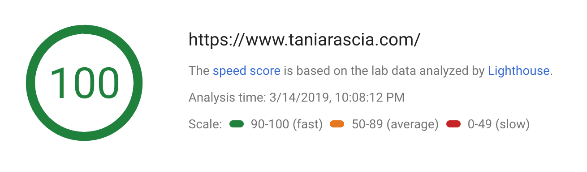

<blockquote class="quotation"><p>This post was featured in <a href="https://www.gatsbyjs.org/blog/2019-03-21-migrating-from-wordpress-to-gatsby/">the official Gatsby blog</a>!</p></blockquote>

On September 24th, 2015, I made the [first post](/getting-started-with-git) on this blog, which was a custom self-hosted WordPress theme. I discovered Git, I discovered WordPress, and I [made 1,039 commits](https://github.com/taniarascia/oblate), in which I obsessively [designed](https://www.taniarascia.com/version-2-0-website-redesign-863-commits-later) and [redesigned](https://www.taniarascia.com/website-redesign-version-4-0) the site.

I've had quite a bit of experience with WordPress. Once I learned how to make the blog, I wrote [Developing a WordPress Theme from Scratch](/developing-a-wordpress-theme-from-scratch), the post that has had millions of hits, hundreds of comments, made me plenty of friends, and launched my blogging career. I also worked as a WordPress developer for two years.

So for the past four years or so, this blog has been running on WordPress. It was as fast, as custom, and as free of plugins as I could possibly make it, but WordPress is cumbersome, and there's only so fast and pleasant to use you can make it.

After 10 days of obsessively working non-stop, I've finally migrated my site over to a [Gatsby](https://www.gatsbyjs.org/)! You may notice the site is a little faster:



## Why Gatsby?

There are [a lot of static site generators](https://www.staticgen.com/) to choose from. Jekyll, Hugo, Next, and Hexo are some of the big ones, and I've heard of some interesting ones like Eleventy as well. At first, I thought I'd just want something that outputs straight HTML, and that a heavy JavaScript app couldn't possibly be better than simple HTML and CSS.

However, I realized that an SSG like Gatsby utilizes the power of code/data splitting, pre-loading, pre-caching, image optimization, and all sorts of performance enhancements that would be difficult or impossible to do with straight HTML.

Since I primarily write JavaScript these days, I definitely wanted an SSG that runs on Node.js, and if it uses React, even better. I tested out a few sites that run on Gatsby and yeah - they were fast. Blazingly fast.

A few things I really like about Gatsby:

- No page reloads - this site is now a SPA (single page app), and clicking on any internal page from within the website doesn't need to load a completely new resource
- Image optimization - all the images are automatically stripped of metadata, optimized, resized, lazy-loaded, and compressed
- Pre-fetch resources - Gatsby detects what links are available on a given page and loads that data into the cache
- Bundling and minification - code is minified, bundled, and served
- Server side rendered at build time
- Anyone can edit my posts! If you see a typo or an error, just fork the repo and make the change!
- Every time I push to the repo, the site gets automatically deployed.

Very little boilerplate code was necessary to get started with Gatsby. I just forked the [Gatsby Advanced Starter](https://github.com/vagr9k/gatsby-advanced-starter/), a very simple, minimalist, completely UI-free foundation after my own heart, and started working with it.

So far, the only thing I don't like is that Gatsby seems to change the zoom of the site after building somehow, so my styles aren't matching up exactly.

I should mention I moved my host from NearlyFreeSpeech.net to [Netlify](https://www.netlify.com/), which is awesome. I really can't say enough about them. I'm highly impressed with how quick and easy it is to set up anything I want.

## My migration process

I've been putting off migrating to a static site for months and months, because I knew it would be a huge time sink, obsession, and a lot of work. But in the end, I was able to move everything in 10 days, so it really wasn't the end of the world. I'll give you the basics of what I did in case you also want to make the switch:

- First, I downloaded the XML from WordPress in the Tools -> Export section.
- Then I used the [ExitWP](https://github.com/thomasf/exitwp) tool to convert the XML to Markdown. This did about 50% of the work of converting the posts.
- I had to go through and use the [HTML to Markdown Table Converter](https://jmalarcon.github.io/markdowntables/) individually, manually indent all code blocks, manually convert all four-indent spaced code blocks to GitHub style fenced codeblocks, and fix all the broken lists.
- I used Prettier on all the markdown files to try to make them consistent.

Here's the code I used to run prettier across all markdown files:

```bash
cd content/posts
prettier
  --print-width 100
  --no-semi
  --single-quote
  --jsx-single-quote
  --trailing-comma es5
  --arrow-parens avoid
  --parser "markdown"  "*.md"
```

- I basically had to re-do all the styles, using [Primitive](https://taniarascia.github.io/primitive) as the base of the style system as I haven't caught on to the idea of using CSS-in-JS yet.
- I `scp`'d the images from the server to an `images` folder.
- I used some regex to delete all WordPress thumbnails, e.g. all images that end in `150x150`, `300x300` and `1024px1024px` or any variation thereof, then do a find/replace all to make sure all files were linking to `../images/file.ext` instead of `wp-content/uploads/file.ext`, then remove the thumbnail url names from all posts.
- I manually saved all my thumbnails and moved them to a thumbnails folder so I could reuse them easily across multiple posts.
- Re-implement night mode and create a new night mode using [React Context API](https://www.gatsbyjs.org/blog/2019-01-31-using-react-context-api-with-gatsby/) as a wrapper.
- Play around with dates a lot until I get it working right.
- Play around with Disqus a lot until I get it working right - use a different Disqus component than the one in the Advanced Starter.

From there it was just a matter of building out all the pages, learning just enough GraphQL to make the proper queries, make some static arrays for my podcast, speaking, and published article data, and then a lot of small cleaning and tweaking.

I'm pretty tired as it's past midnight now, but I was too excited to not make a small post celebrating the next step in the journey of this website. I feel great that all of my posts are now safely saved in version control and markdown. It's actually a huge relief for me to know that they're not a mess inside some clunky MySQL database, but easy to read, write, edit, and share markdown files. Now if I want to move to some other SSG in the future, it'll be very easy.

I can write more about this in the future if anyone has more specific questions about Gatsby, React, or Netlify. If you see anything broken about the new site, please let me know!
