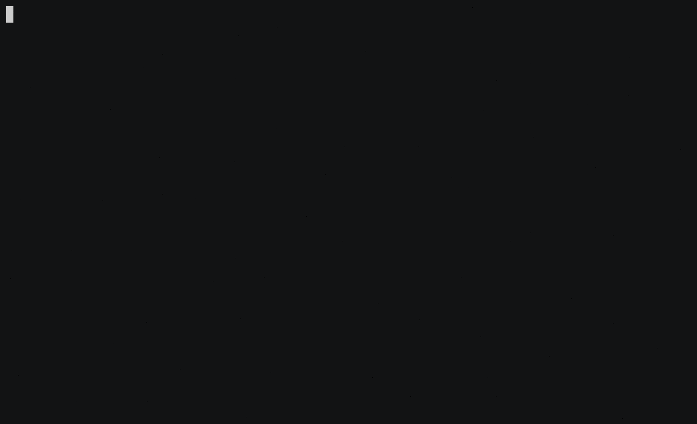

Usually when you think of a JavaScript game, you probably imagine something played in the browser, either rendered to the DOM or in an HTML5 canvas element.

For a recent Node.js project, I wanted to render pixels to a terminal interface instead of a browser. For this, I was going to need to find and learn how to use a terminal UI library like [curses](https://en.wikipedia.org/wiki/Curses_(programming_library)). The most popular one in the JavaScript environment is [blessed](https://github.com/chjj/blessed).

I thought writing the classic Snake game would be a fun and easy project to get used to blessed, so I wrote [🐍 Snek.js](https://github.com/taniarascia/snek).

You can [check out the source](https://github.com/taniarascia/snek), or download it and play it yourself:

```bash
git clone https://github.com/taniarascia/snek
cd snek
yarn && yarn play # or: npm install && npm run play
```

Here's a brief preview gif of the game:



I made the game as I remember it from the old Nokia bricks:

- There's a randomly generated dot
- There's a snake that can go up, down, left, or right
- If the snake eats the dot, it grows and the score goes up by one
- If the snake runs into the wall or itself, the game resets

## Object-Oriented

I made extensive use of the ES6 JavaScript `class` keyword, and divided the game into two classes:

- `Game`, which would track the state of the snake, dot, and score
- `UserInterface`, which would handle all i/o, which means the key input, the screen, and rendering anything to the screen

### User Interface

Blessed uses "boxes" to represent elements, so I had a `gameBox` to represent the entire game play area, `scoreBox` to represent a single line where the score would be set and updated, and `gameOverBox` to display a game over modal.

All the pixels that would be drawn to the screen beyond that - in this case, the dot and each segment of snake - go through the `draw()` method, which is a `1px` x `1px` box.

Since all key input would be detected through the `UserInterface` class, I had to bind all the handler methods so they could be used through the `Game` class.

<div class="filename">UserInterface.js</div>

```js
bindHandlers(keyPressHandler, quitHandler, enterHandler) {
  this.screen.on('keypress', keyPressHandler)
  this.screen.key(['escape', 'q', 'C-c'], quitHandler)
  this.screen.key(['enter'], enterHandler)
}
```

<div class="filename">Game.js</div>

```js
this.ui.bindHandlers(this.changeDirection.bind(this), this.quit.bind(this), this.start.bind(this))
```

### Game

The `Game` tracked the snake, the dot, and the score.

The snake is an array of x/y coordinates that correspond to pixels on the screen. The snake moves in a direction based on the key input (arrow keys and WASD supported!). To move, the last item in the array (the tail) is removed, and a new item (the head) is added to the beginning. If the snake eats a dot, the last item isn't removed, and the snake grows.

A new dot is generated randomly after being eaten. Dots wont generate on an existing snake segment.

The game ends if the snake collides with the edges of the terminal screen (the wall), or with its own tail, and the game over modal is displayed.

Pressing enter will start a new game by calling the `start` method, which resets the game state and starts a timer if one doesn't exist.

```js
start() {
  if (!this.timer) {
    this.reset()

    this.timer = setInterval(this.tick.bind(this), 50)
  }
}
```

Every `50`ms, `tick` is called, which is the game loop. The timer will restart if there's a game over. Otherwise, each tick will clear the screen, draw a dot, move the snake, draw the snake, and render everything to the UI.

```js
tick() {
  if (this.gameOver()) {
    this.showGameOverScreen()
    clearInterval(this.timer)
    this.timer = null

    return
  }

  this.clear()
  this.drawDot()
  this.moveSnake()
  this.drawSnake()
  this.ui.render()
}
```

## Conclusion

Again, you can view the source on GitHub at [🐍 Snek.js](https://github.com/taniarascia/snek).

I learned a lot writing and refactoring this over the past few days. I encountered plenty of bugs in my first iteration, such as the snake being able to collide into all but the last tail segment, and a major issue where the blessed boxes weren't being garbage collected, and the game got slower and slower as it became less efficient and more intensive to run.

[vsergeev](https://sergeev.io) wrote a very clean and much more advanced and extensible [Typescript implementation of Snake](https://github.com/vsergeev/snake.ts), with a mini-game engine and AI monster entity. Studying this helped me find and fix some of the bugs in my first iteration.
