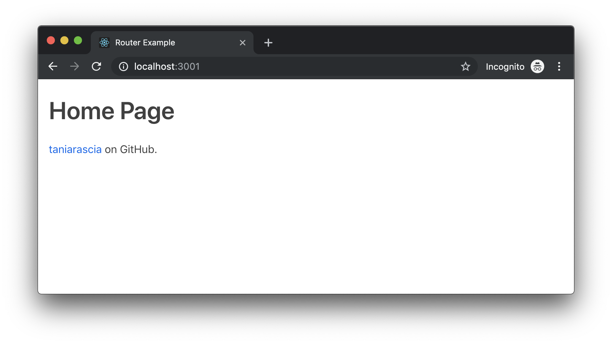
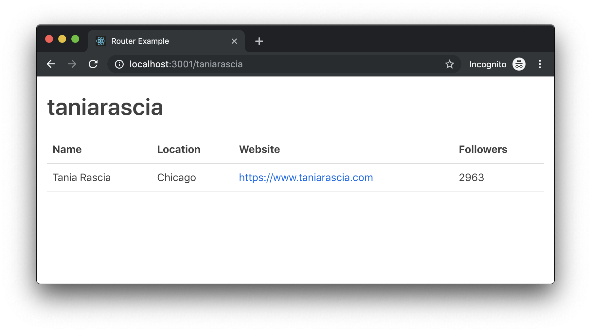

React doesn't come with a built-in router, but we can easily achieve routing with the `react-router-dom` library. **Routing** is how a web applications direct traffic. (If you know what routing is, feel free to skip this section.)

Example: If you go to [taniarascia.com](/), you end up on my home page. If you go to [taniarascia.com/me](/me), you're redirected to my about me page. If you go to [taniarascia.com/categories/javascript](/categories/javascript) or [taniarascia.com/categories/css](/categories/css), you end up on a category listing page. The routes for these pages look something like this:

- `/` - root
- `/:page_id` - page
- `/categories/:category_id` - category

I'm not actually making a folder called `categories` and filling it with a bunch of files like `javascript.html` or `css.html`, I just have one template and the router knows to direct to the proper template. Once it gets to the template, it can pull from the URL to know which variables to display - for example, JavaScript or CSS related posts.

This website also happens to be a **Single Page Application** (or SPA) - only one page is loaded, and every click to a new page loads some additional JSON data, but does not actually request a new resource like loading `index.html` and `about-me.html` would.

I'm going to show you how to set up a simple SPA in React with `react-router-dom`, and pull in data dynamically through the URL. Below is the source of the completed project if you get lost along the way.

- [View Source](https://github.com/taniarascia/router-example)

#### Prerequisites

- Read [Getting Started with React](https://www.taniarascia.com/getting-started-with-react/) or [Build a React App with Hooks](https://www.taniarascia.com/crud-app-in-react-with-hooks/) if you don't know React or React Hooks yet.
- Read [How to Connect to an API in JavaScript](https://www.taniarascia.com/how-to-connect-to-an-api-with-javascript/) if you don't know how to work with APIs at all.

## Installation

Create a new React app.

```bash
npx create-react-app router-example
```

```terminal
Creating a new React app in /Users/taniarascia/dev/sandbox/router-example.

Installing packages. This might take a couple of minutes.
Installing react, react-dom, and react-scripts...
```

Our project has two dependencies - `react-router-dom` for the router, and `axios` for making API calls.

```bash
npm install react-router-dom axios
```

or

```bash
yarn add react-router-dom axios
```

## Browser Router

To use `react-router-dom`, we need to wrap our entire `App` component in [`BrowserRouter`](https://reacttraining.com/react-router/web/api/BrowserRouter). There are two types of routers:

- `BrowserRouter` - makes pretty URLs like `example.com/about`.
- `HashRouter` - makes URLs with the octothorpe (or hashtag, if you will) that would look like `example.com/#about`.

Let's use `BrowserRouter`.

<div class="filename">src/index.js</div>

```jsx
import React from 'react'
import { render } from 'react-dom'
import { BrowserRouter } from 'react-router-dom'
import App from './App'

render(
  <BrowserRouter>
    <App />
  </BrowserRouter>,
  document.querySelector('#root')
)
```

## Route and Switch

Now in `App.js`, we can decide on the routes we want to use and direct accordingly. We'll use `Route` and `Switch` for this task.

- `Switch` - Groups all your routes together, and ensures they take precedence from top-to-bottom.
- `Route` - Each individual route.

<div class="filename">App.js</div>

```jsx
import React from 'react'
import { Route, Switch } from 'react-router-dom'
// We will create these two pages in a moment
import HomePage from './pages/HomePage'
import UserPage from './pages/UserPage'

export default function App() {
  return (
    <Switch>
      <Route exact path="/" component={HomePage} />
      <Route path="/:id" component={UserPage} />
    </Switch>
  )
}
```

We're matching the root route (`/`) to `HomePage`, and dynamically matching any other page to `UserPage`. I only have one route for this simple example, but you could do more like this:

```jsx
<Switch>
  <Route exact path="/" component={HomePage} />
  <Route path="/:id" component={UserPage} />
  <Route path="/categories" component={CategoriesPage} />
  <Route path="/categories/:id" component={IndividualCategoryPage} />
</Switch>
```

This would ensure that `taniarascia.com/categories` would go to a page listing all categories, but `taniarascia.com/categories/javascript` would go to a completely different template for the inidiviual category listing.

## Link

In order to link to a page within the SPA, we'll use [`Link`](https://reacttraining.com/react-router/web/api/Link). If we used the traditional `<a href="/route">`, it would make a completely new request and reload the page, so we have `Link` to help us out.

<div class="filename">src/pages/HomePage.js</div>

```jsx
import React, { Component } from 'react'
import { Link } from 'react-router-dom'

export default function HomePage() {
  return (
    <div className="container">
      <h1>Home Page</h1>
      <p>
        <Link to="/taniarascia">taniarascia</Link> on GitHub.
      </p>
    </div>
  )
}
```

So now I'm going to my first route, the root route which is loading `HomePage`, and I see the content and the link.



## Dynamic Route Parameter

Our `Link` is navigating to `/taniarascia`, which will match the `/:id` parameter in `Route`. In order to dynamically get the content from the URL - in this case, `taniarascia` - we'll use `match.params.id` from the `props`.

I'm going to use that parameter to make a call to the GitHub API and retrieve my data. In this example I'll be using Hooks, so if you're not familiar with them, please read [Building a CRUD App with Hooks](https://www.taniarascia.com/crud-app-in-react-with-hooks/).

<div class="filename">src/pages/UserPage.js</div>

```jsx
import React, { useState, useEffect } from 'react'
import axios from 'axios'

export default function UserPage(props) {
  // Setting initial state
  const initialUserState = {
    user: {},
    loading: true,
  }

  // Getter and setter for user state
  const [user, setUser] = useState(initialUserState)

  // Using useEffect to retrieve data from an API (similar to componentDidMount in a class)
  useEffect(() => {
    const getUser = async () => {
      // Pass our param (:id) to the API call
      const { data } = await axios(`https://api.github.com/users/${props.match.params.id}`)

      // Update state
      setUser(data)
    }

    // Invoke the async function
    getUser()
  }, []) // Don't forget the `[]`, which will prevent useEffect from running in an infinite loop

  // Return a table with some data from the API.
  return user.loading ? (
    <div>Loading...</div>
  ) : (
    <div className="container">
      <h1>{props.match.params.id}</h1>

      <table>
        <thead>
          <tr>
            <th>Name</th>
            <th>Location</th>
            <th>Website</th>
            <th>Followers</th>
          </tr>
        </thead>
        <tbody>
          <tr>
            <td>{user.name}</td>
            <td>{user.location}</td>
            <td>
              <a href={user.blog}>{user.blog}</a>
            </td>
            <td>{user.followers}</td>
          </tr>
        </tbody>
      </table>
    </div>
  )
}
```



## Conclusion

If you got lost anywhere along the way, view the source on GitHub.

- [View Source](https://github.com/taniarascia/router-example)

Also, there is a caveat: if you want to use this on GitHub Pages, it's not smart enough to realize that `you.github.io/repo/:id` should direct to `/:id`. If you want to host on GitHub pages and encounter this issue, [hosting your single page app on GitHub Pages](https://itnext.io/so-you-want-to-host-your-single-age-react-app-on-github-pages-a826ab01e48) will help you out.
