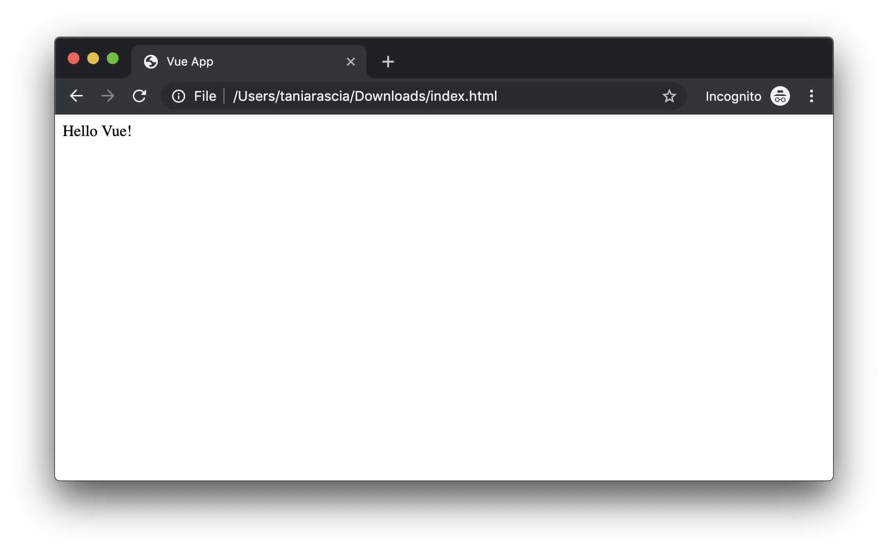
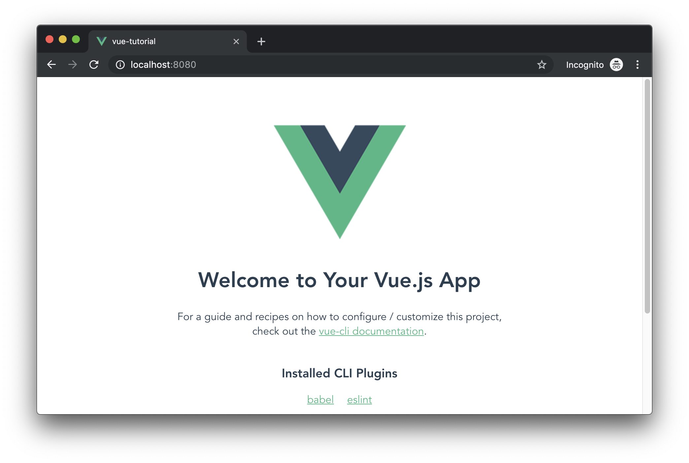
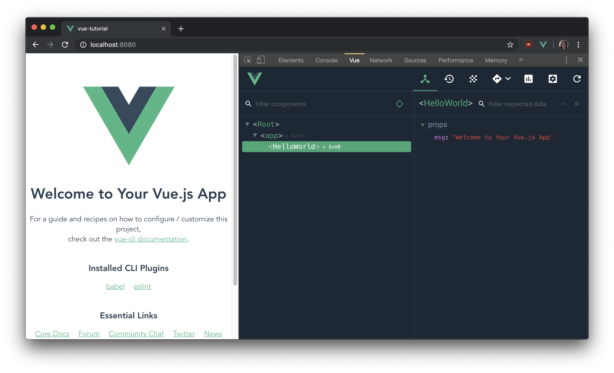
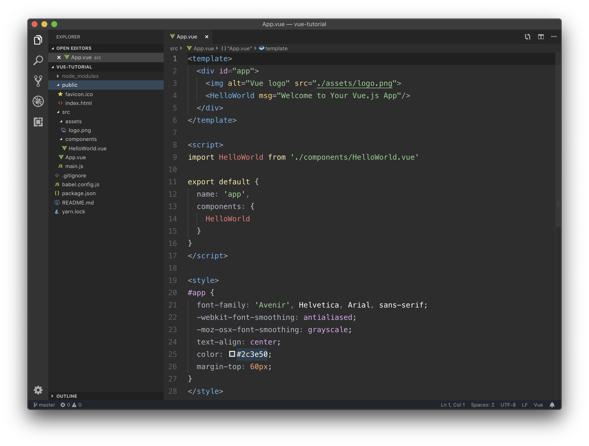
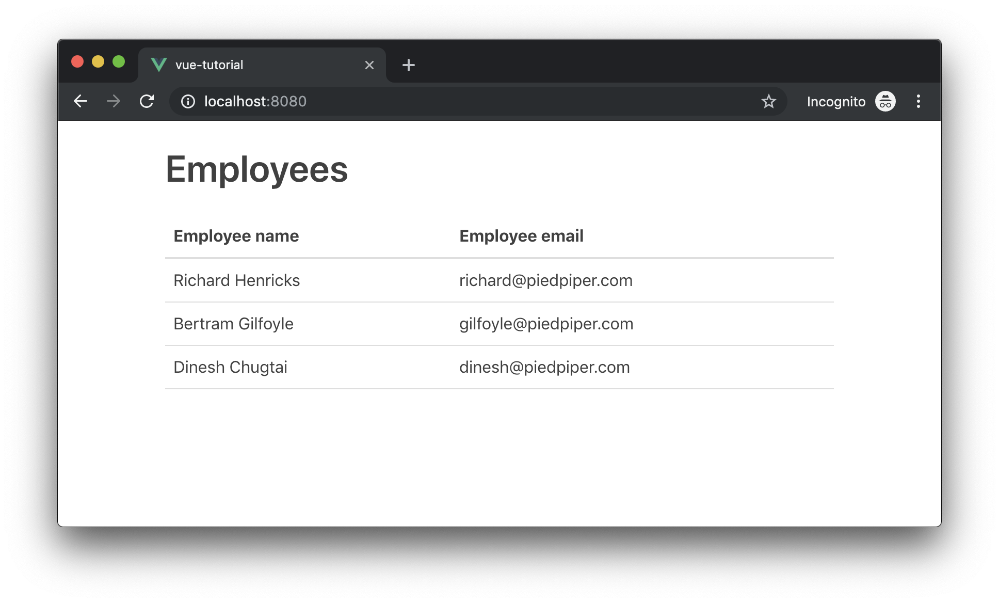

We're in a golden era of JavaScript libraries and frameworks. More and more companies are building out full, dynamic web apps in addition to - or in lieu of - traditional desktop applications. This means things are constantly changing and frameworks are going in and out of vogue, but the core concepts of what we're trying to accomplish remain similar.

Previously, I wrote a [Getting Started with React](/getting-started-with-react) guide helped out a lot of beginner and intermediate developers. [Vue.js](https://github.com/vuejs/vue) is going toe-to-toe with React for popularity among JavaScript developers, so I'd like to offer the same straightforward and concise introduction for those who'd like to learn Vue as well. Let's get started!

#### Prerequisites

- Knowledge of [HTML & CSS](https://internetingishard.com/)
- Knowledge of basic [JavaScript](/javascript-day-one/)
- Familiarity of [ES6+ features and syntax](/es6-syntax-and-feature-overview/)
- [Node.js and npm](/how-to-install-and-use-node-js-and-npm-mac-and-windows/) (or yarn) installed globally

#### Goals

We're going to create a small application with Vue. The app will be a simple employee database and we'll learn:

- How to **set up** Vue
- The **anatomy** of a Vue file
- How to work with **data, methods, conditional statements, and events** in Vue
- How to **create, update, view, and delete** users (employees) from the system
- How to **make API calls** for each of the above actions
- How to use **tables, forms**, and form **validation**
- How to host a Vue build on GitHub pages

I've created a live demo and put the source up on GitHub.

- [View demo](https://taniarascia.github.io/vue-tutorial/)
- [View source](https://github.com/taniarascia/vue-tutorial)

(You can also [view the demo on CodeSandbox](https://codesandbox.io/s/xwj445z6w).)

## What is Vue?

- Vue (or Vue.js) is an open-source front-end JavaScript framework
- Vue is the **view** layer of an MVC application (Model View Controller)
- Vue is currently [one of the most popular](https://github.com/vuejs/vue) JavaScript libraries/frameworks
- Unlike other popular JavaScript projects, Vue is not backed by a large corporation like React (Facebook) or Angular (Google). Vue was originally written by [Evan You](https://github.com/yyx990803) and the open-source community.

## Setup and Installation

There are two main ways to set up Vue - in a Node project, or directly injected into a static HTML file. I'd first like to take a look at setting up Vue in an HTML file, as it's the simplest setup and introduction. Those who have only ever used a library like jQuery will be most familiar with this method. If you've already used React or another JavaScript framework, feel free to skip to the next section.

We can just create a basic HTML file and add a link to a Vue CDN in the head, and create a `<div>` with an id of `app`.

### Static HTML File

<div class="filename">index.html</div>

```html
<!DOCTYPE html>
<html lang="en">
  <head>
    <meta charset="utf-8" />
    <meta http-equiv="X-UA-Compatible" content="IE=edge" />
    <meta name="viewport" content="width=device-width,initial-scale=1.0" />
    <script src="https://cdn.jsdelivr.net/npm/vue/dist/vue.js"></script>

    <title>Vue App</title>
  </head>

  <body>
    <div id="app"></div>
  </body>
</html>
```

We can create a simple "Hello World" with Vue. Using double brackets, we'll render `message` in `app`. In the `<script>` tag, we'll link the data and the DOM. We create a new `Vue`, and the `message` property on `data` will

<div class="filename">index.html</div>

```html
<html lang="en">
  <head>
    <meta charset="utf-8" />
    <meta http-equiv="X-UA-Compatible" content="IE=edge" />
    <meta name="viewport" content="width=device-width,initial-scale=1.0" />
    <script src="https://cdn.jsdelivr.net/npm/vue/dist/vue.js"></script>

    <title>Vue App</title>
  </head>

  <body>
    <div id="app">{{message}}</div>

    <script>
      const App = new Vue({
        el: '#app',
        data: {
          message: 'Hello Vue!',
        },
      })
    </script>
  </body>
</html>
```

We can see the data render.



At this point, it's not very impressive, and it's what you'll learn in [the introduction of the documentation](https://vuejs.org/v2/guide/), but it drives home the important point that Vue is just JavaScript, and there's no need to get nervous about Node, Babel, Webpack, and so on.

### Vue CLI

More often, you won't be injecting Vue into a static HTML file, but you'll be taking advantage of the Node ecosystem. The easiest way we can do this is vue [Vue CLI](https://cli.vuejs.org/), or the Vue Command Line Interface. As mentioned in the prerequisites, you should be familiar with Node and npm/yarn and how to work with local and global packages.

First, we'll install Vue CLI.

```bash
# install with npm
npm i -g @vue/cli @vue/cli-service-global

# install with yarn
yarn global add @vue/cli @vue/cli-service-global
```

Now that we have Vue CLI installed globally, we can use the `vue` command anywhere. We'll use [vue create](https://cli.vuejs.org/guide/creating-a-project.html#vue-create) to start a new project.

> `vue create` is the equivalent to `create-react-app`.

```bash
vue create vue-app
```

You'll be given an option to do default or manual, and we can just select default.

```terminal
Vue CLI v3.7.0
? Please pick a preset: (Use arrow keys)
❯ default (babel, eslint)
  Manually select features
```

Once that's done, you can move to the new app that's been created and `serve` to run the dev server.

```bash
cd vue-app
npm run serve
# or
yarn serve
```

Once that's done, you can navigate to `http://localhost:8080/` to see the default page.



At this point, you're all set up and ready to go with Vue. If you're using Visual Studio Code, install the [Vetur](https://marketplace.visualstudio.com/items?itemName=octref.vetur) plugin for syntax highlighting, formatting, and so on.

### Vue DevTools

One final thing to have in your toolbelt while working with Vue is Vue DevTools. It's an add-on to regular DeveloperTools which will show you all the information about your components - their state, methods, etc.

- [Vue DevTools on Chrome](https://chrome.google.com/webstore/detail/vuejs-devtools/nhdogjmejiglipccpnnnanhbledajbpd?hl=en)
- [Vue DevTools on FireFox](https://addons.mozilla.org/en-US/firefox/addon/vue-js-devtools/)



## Getting Started

Congrats, you're all set up! You have a new Vue boilerplate app. In the project files, you have a `public` folder which contains `index.html`, and an `src` folder with `main.js` as the entry point. We're introduced to `.vue` files, with the `HelloWorld.vue` and `App.vue` components.



### Entry point

In `main.js`, we're bringing in `Vue` and rendering the App to our app div in `index.html`. This file won't need to change.

<div class="filename">src/main.js</div>

```js
import Vue from 'vue'
import App from './App.vue'

Vue.config.productionTip = false

new Vue({
  render: h => h(App),
}).$mount('#app')
```

## Anatomy of a Vue file

Anything else we make will be a `.vue` file, which always consists of three things:

- `<template>`
- `<script>`
- `<style>`

And looks like this:

<div class="filename">example.vue</div>

```html
<template></template>

<script>
  export default {
    name: 'component-name',
  }
</script>

<style scoped></style>
```

This may seem strange to you, as it did to me at first. I originally learned front end coding with a focus on separation of concerns for HTML, CSS, and JavaScript, and here we have all three together. Yet JavaScript and the way we design apps has evolved, and keeping our styles and view and component coupled together is generally considered an advantage and improves maintainability.

The data and logic for the component goes in the `<script>` tag, but only `name` is required. The `<style>` tag is just CSS. We have the advantage of being able to scope the CSS so it only applies to this component and not globally with the `scoped` attribute.

Now let's start actually building this app.

As always, this tutorial is about functionality, not styles, so I'm just going to link to [Primitive UI](https://github.com/taniarascia/primitive) in the `index.html` file to add some easy default styles.

```html
<link rel="stylesheet" href="https://unpkg.com/primitive-ui/dist/css/main.css" />
```

## Creating a Component

Create a file called `EmployeeTable.vue` in `src/components`. We're going to create a table with some static data in here.

<div class="filename">src/components/EmployeeTable.vue</div>

```html
<template>
  <div id="employee-table">
    <table>
      <thead>
        <tr>
          <th>Employee name</th>
          <th>Employee email</th>
        </tr>
      </thead>
      <tbody>
        <tr>
          <td>Richard Henricks</td>
          <td>richard@piedpiper.com</td>
        </tr>
        <tr>
          <td>Bertram Gilfoyle</td>
          <td>gilfoyle@piedpiper.com</td>
        </tr>
        <tr>
          <td>Dinesh Chugtai</td>
          <td>dinesh@piedpiper.com</td>
        </tr>
      </tbody>
    </table>
  </div>
</template>

<script>
  export default {
    name: 'employee-table',
  }
</script>

<style scoped></style>
```

In Vue, the convention is that the filename and import will be in PascalCase, such as `EmployeeTable`, but when used in a template, this will translate to kebab-case, `<employee-table>`. This uses the proper conventions for JavaScript and HTML respectively.

> I'm wrapping the template in a `div` which isn't strictly necessary, but a template can only have one root child element, so this makes it easy to add additional elements going forward.

We're exporting `EmployeeTable` and importing it into `App.vue`. In our `import`, we can use `@` to reference the `src` folder. `App.vue` knows which components it can use via the `components` property. All imported components must be added there. I've also added in some global styles.

<div class="filename">src/App.vue</div>

```html
<template>
  <div id="app" class="small-container">
    <h1>Employees</h1>

    <employee-table />
  </div>
</template>

<script>
  import EmployeeTable from '@/components/EmployeeTable.vue'

  export default {
    name: 'app',
    components: {
      EmployeeTable,
    },
  }
</script>

<style>
  button {
    background: #009435;
    border: 1px solid #009435;
  }

  .small-container {
    max-width: 680px;
  }
</style>
```

So here's what we have so far.



We want to refactor this already to use data in the form of arrays and object as opposed to hard coding all our values into the table. So let's add a `data()` method, and return an `employees` array.

<div class="filename">App.vue</div>

```js
import EmployeeTable from '@/components/EmployeeTable.vue'

export default {
  name: 'app',
  components: {
    EmployeeTable,
  },
  data() {
    return {
      employees: [
        {
          name: 'Richard Henricks',
          email: 'richard@piedpiper.com',
        },
        {
          name: 'Bertram Gilfoyle',
          email: 'gilfoyle@piedpiper.com',
        },
        {
          name: 'Dinesh Chugtai',
          email: 'dinesh@piedpiper.com',
        },
      ],
    }
  },
}
```

> Data is like React state.

Now we have this data on `App.vue`, but we want to pass it to `EmployeeTable`. We can do that by passing the data down as a property. An attribute that begins with a colon `:` will allow you to pass data. The more verbose version would be `v-bind:`. In this case we'll pass our `employees` array.

```html
<employee-table :employees="employees" />

<!-- this is the same thing -->
<employee-table v-bind:employees="employees" />
```

Now on the `EmployeeTable` side, we want to retrieve that data, so we tell the component that it will receive props, in this case an `Array`.

<div class="filename">EmployeeTable.vue</div>

```js
export default {
  name: 'employee-table',
  props: {
    employees: Array,
  },
}
```

> You might also see an array of strings instead of each value and type for props, like `props: [ 'employees' ]`, which also works but is less explicit.

### Loops

Now that we have the data, we want to loop through the data and display the DOM nodes accordingly. We'll do this with the `v-for` attribute. Now that we can retrieve `employees` in `EmployeeTable`, we'll display one table row per employee.

<div class="filename">EmployeeTable.vue</div>

```html
<template>
  <div id="employee-table">
    <table>
      <!-- ...thead... -->
      <tbody>
        <tr v-for="employee in employees" :key="employee.name">
          <td>{{ employee.name }}</td>
          <td>{{ employee.email }}</td>
        </tr>
      </tbody>
    </table>
  </div>
</template>
```

Vue (like React) has a requirement for uniquely identifying any element in an array, so we'll use `:key` on the table row and set it to a unique value.

Now our table hasn't changed from a view perspective, but it is now set up to work with data more efficiently.

## Working with Forms

Now we're successfully accomplishing the "Read" portion of a CRUD app, but the next most important thing to do is add the ability to create a new employee. We're going to create an add employee form.

Make `EmployeeForm.vue` and set it up a field to enter name, email, and a button to submit. Since a te

<div class="filename">src/components/EmployeeForm.vue</div>

```html
<template>
  <div id="employee-form">
    <form>
      <label>Employee name</label>
      <input type="text" />
      <label>Employee Email</label>
      <input type="text" />
      <button>Add Employee</button>
    </form>
  </div>
</template>

<script>
  export default {
    name: 'employee-form',
    data() {
      return {
        employee: {
          name: '',
          email: '',
        },
      }
    },
  }
</script>
```


## Deploying

## Conclusion
