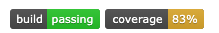
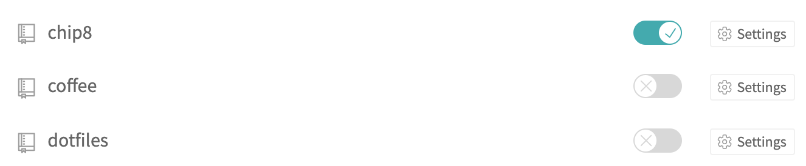
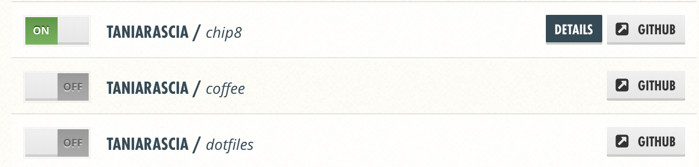
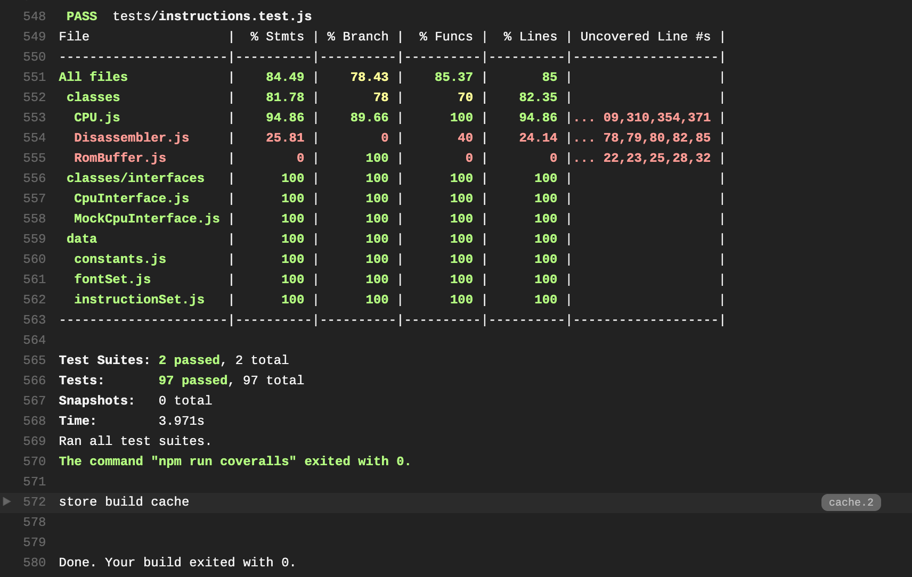

Recently, I wrote a lot of tests for [a project I've been working on](https://github.com/taniarascia/chip8), and after all that work I wanted to put some nice badges on my repo.

I have one badge displaying that my build has passed (hopefully), and another displaying my code coverage percent.



> I'll use my account ([taniarascia](https://github.com/taniarascia/)) and my project's repo ([chip8](https://github.com/taniarascia/chip8)) as examples for the name. I'm assuming you're using GitHub, but it also applied to GitLab or BitBucket.

### Steps

- Set up [Jest](https://jestjs.io/) on your project and install Coveralls
- Create a [Travis CI](https://travis-ci.org) account (integrated with GitHub), enable repo
- Create a [Coveralls](https://coveralls.io) account (integrated with GitHub), enable repo
- Create a `travis.yml` and `coveralls.yml`
- Push and deploy code

## Step 1 - Set up Jest and Coveralls

This tutorial assumes you already have basic familiarity with setting up [Jest](https://jestjs.io/) to test your JavaScript code, and have some tests written already. If not, it's as simple as installing Jest locally into your dev dependencies, and running the `jest` command. We're also going to install Coveralls, which we'll use to host the coverage report.

```
npm i --save-dev jest coveralls
jest
```

```terminal
==> jest
 PASS  tests/instructions.test.js
 PASS  tests/cpu.test.js

Test Suites: 2 passed, 2 total
Tests:       97 passed, 97 total
Snapshots:   0 total
Time:        2.867s, estimated 3s
Ran all test suites.
```

## Step 2 - Create a Travis CI account

Travis CI is a CI/CD (continuous integration/continuous development) tool. It will run your code every time you push to GitHub and determine if the build passed or not, among other tasks. Go to [travis-ci.org](https://travis-ci.org) and create an account. Integrate it with your existing GitHub account. Find the repo you want to display build status for and toggle it on.



The page-specific URL should be https://travis-ci.org/taniarascia/chip8.

## Step 2 - Create a Coveralls account

Coveralls is a service to help you track coverage. Go to [coveralls.io](https://coveralls.io), create an account and integrate with your GitHub account, and enable Coveralls on the repo of your choice.



The page-specific URL should be https://coveralls.io/github/taniarascia/chip8.

## Step 3 - Create scripts

Create a script called `coveralls` in your `package.json`. This will generate the coverage via Jest then deploy to Coveralls.

<div class="filename">package.json</div>

```js
"scripts": {
  "test": "jest",
  "coveralls": "jest --coverage && cat ./coverage/lcov.info | coveralls"
}
```

### Configure Jest coverage (optional)

Jest will automatically configure something decent with no config, but if you want to specifically include or exclude some files from coverage, you can do it by adding this config to `package.json`.

<div class="filename">package.json</div>

```js
"jest": {
  "collectCoverageFrom": [
      "**/*.js",
      "!data/keyMap.js",
      "!/node_modules/",
  ]
}
```

## Step 4 - Create config

Now you'll have to create a `.travis.yml` to set up your Travis configuration, and a `.coveralls.yml` to set your Coveralls token.

Here's what my `travis.yml` looks like: I'm setting the language, the version of node, and telling it which additional script to run.

<div class="filename">.travis.yml</div>

```yaml
language: node_js
node_js:
  - '11'
script:
  - npm run coveralls
```

The `coveralls.yml` file will simply consist of the token they provide you when you create the account and assign the repo.

<div class="filename">.coveralls.yml</div>

```
repo_token: YOUR_TOKEN_HERE
```

## Step 4 - Deploy code and display badges

It does seem like a lot of work just to get some badges up, but it's nice to always know the status and coverage of your project. Here's the code for both of the badges. Both Travis and Coveralls will supply embed links for these.

<div class="filename">Travis CI Build Badge</div>

```md
[](https://travis-ci.org/taniarascia/chip8)
```

<div class="filename">Code Coverage Badge</div>

```md
[](https://coveralls.io/github/taniarascia/chip8?branch=master)
```

Now once you push your code to GitHub with the config files and README badges, it should send the build off to Travis, and Travis should send the coverage off to Coveralls.



That's all! If all went according to plan, you should have a passing build, code coverage, and some functional badges.
