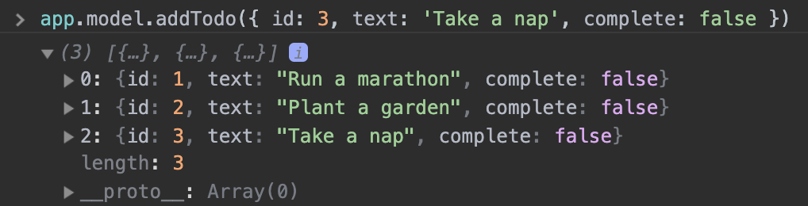

I wanted to write a simple application in plain JavaScript using the [model-view-controller](https://en.wikipedia.org/wiki/Model%E2%80%93view%E2%80%93controller) architectural pattern. So I did, and here it is. Hopefully it helps you understand MVC, as it's a difficult concept to wrap your head around when you're first starting out.

I made [this todo app](https://taniarascia.github.io/mvc), which is a simple little browser app that allows you to CRUD (create, read, update, and delete) todos. It just consists of an `index.html`, `style.css`, and `script.js`, so nice and simple and dependency/framework-free for learning purposes.

#### Prerequisites

Basic JavaScript and HTML.

#### Goals

Create a todo app in the browser with plain JavaScript, and get familiar with the concepts of MVC (and OOP - object-oriented programming).

## What is Model View Controller?

MVC is one possible pattern for organizing your code. It's a popular one.

- **Model** - Manages the data of an application
- **View** - A visual representation of the model
- **Controller** - Links the user and the system

The **model** is the data. In this todo application, that'll be the actual todos, and the methods that will add, edit, or delete them.

The **view** is how the data is displayed. In this todo application, that will be the rendered HTML in the DOM, and CSS.

The **controller** connects the model and the view. It takes user input, such as clicking or typing, and determines when the view should be updated.

The model never touches the view. The view never touches the model. The controller connects them.

> I'd like to mention that doing MVC for a simple todo app is actually a ton of boilerplate. It would really be overcomplicating things if this was the app you wanted to create and you made this whole system. But the point is to try to understand it on a small level so you can understand why a scaled system might use it.

## Initial Setup

This is going to be a fully JavaScript app, which means everything will be handled through JavaScript, and the HTML will only consist of a single root element in the body.

<div class="filename">index.html</div>

```html
<!DOCTYPE html>
<html lang="en">
  <head>
    <meta charset="utf-8" />
    <meta name="viewport" content="width=device-width, initial-scale=1.0" />
    <meta http-equiv="X-UA-Compatible" content="ie=edge" />

    <title>Todos</title>

    <link rel="stylesheet" href="style.css" />
  </head>

  <body>
    <div id="root"></div>

    <script src="script.js"></script>
  </body>
</html>
```

I wrote a small bit of CSS just to make it look acceptable, which you can find [here](https://github.com/taniarascia/mvc/blob/master/style.css) and save to `style.css`. I'm not going to write any more about the CSS, because it's not the focus of this article.

Okay, so now that we have the HTML and CSS, so it's time to actually start writing the app.

## Getting Started

We're going to make this really nice and simple to understand what class pertains to what part of MVC. I'll make a `Model` class, `View` class, and `Controller` class, which takes in the model and view. The app will be an instance of the controller.

> If you're not familiar with how classes work, read [Understanding Classes in JavaScript](/understanding-classes-in-javascript/).

```js
class Model {
  constructor() {}
}

class View {
  constructor() {}
}

class Controller {
  constructor() {
    this.model = new Model()
    this.view = new View()
  }
}

const app = new Controller()
```

Very nice and abstract.

## Model

Let's focus on the model first, as it's the simplest of the three parts. It doesn't involve any events or DOM manipulation. It's just storing and modifying data.

<div class="filename">Model</div>

```js
class Model {
  constructor() {
    // The state of the model, an array of todo objects, prepopulated with some data
    this.todos = [
      { id: 1, text: 'Run a marathon', complete: false },
      { id: 2, text: 'Plant a garden', complete: false },
    ]
  }

  // Append a todo to the todos array
  addTodo(todo) {
    this.todos = [...this.todos, todo]
  }

  // Map through all todos, and replace the text of the todo with the specified id
  editTodo(id, updatedText) {
    this.todos = this.todos.map(todo =>
      todo.id === id ? { id: todo.id, text: updatedText, complete: todo.complete } : todo
    )
  }

  // Filter a todo out of the array by id
  deleteTodo(id) {
    this.todos = this.todos.filter(todo => todo.id !== id)
  }

  // Flip the complete boolean on the specified todo
  toggleTodo(id) {
    this.todos = this.todos.map(todo =>
      todo.id === id ? { id: todo.id, text: todo.text, complete: !todo.complete } : todo
    )
  }
}
```

We have an `addTodo`, `editTodo`, `deleteTodo`, and `toggleTodo`. These should all be very self explanatory - add appends to the array, edit finds the id of the todo to edit and replaces it, delete filters a todo out of the array, and toggle switches the `complete` boolean property.

Since we're doing this all in the browser, and app is accessible from the window (global), you can test these out easily, typing something like:

```js
app.model.addTodo({ id: 3, text: 'Take a nap', complete: false })
```

will add a todo to the list, and you can log the contents of `app.model.todos`.



That's good enough for the model right now. In the end, we'll store the todos in [local storage](h/how-to-use-local-storage-with-javascript/) to make it semi-permanent, but for now the todos will just refresh any time you refresh the page.

As we can see, the model only deals with the actual data, and modifying that data. It doesn't understand or have any knowledge the **input** - what's modifying it, or the **output** - what will end up displaying.

At this point you have everything you need for a fully functioning CRUD app, if you manually type all your actions through the console, and view the output in the console.

## View

We're going to create the view by manipulating the **DOM** - the document object model. Since we're doing this in plain JavaScript without the aid of React's JSX or a templating language, it will be kind of verbose and ugly, but such is the nature of manipulating the DOM directly.

Neither the controller nor the model should know anything about the DOM, HTML elements, CSS, or any of that. Anything relating to it should be in the view.

> If you're not familiar with the DOM or how the DOM is different to HTML source code, read [Introduction to the DOM](/introduction-to-the-dom/).

The first thing I'll do is just make helper methods to retrieve an element and create an element.

<div class="filename">View</div>

```js
class View {
  constructor() {}

  // Create an element with an optional CSS class
  createElement = (tag, className) => {
    const element = document.createElement(tag)
    if (className) element.classList.add(className)

    return element
  }

  // Retrieve an element from the DOM
  getElement = selector => {
    const element = document.querySelector(selector)

    return element
  }
}
```

So far so good. Now in the constructor, I'm going to set up all the things I need for my view. That'll be:

- The root element of the app - `#root`
- The title heading - `h1`
- A form, input and submit button for adding a todo - `form`, `input`, `button`
- The todo list - `ul`

I'll make them all variables in the constructor so we can easily refer to them.

<div class="filename">View</div>

```js
class View {
  constructor() {
    // The root element
    this.app = this.getElement('#root')

    // The title of the app
    this.title = this.createElement('h1')
    this.title.textContent = 'Todos'

    // The form, with a [type="text"] input, and a submit button
    this.form = this.createElement('form')

    this.input = this.createElement('input')
    this.input.type = 'text'
    this.input.placeholder = 'Add todo'
    this.input.name = 'todo'

    this.submitButton = this.createElement('button')
    this.submitButton.textContent = 'Submit'

    // The visual representation of the todo list
    this.todoList = this.createElement('ul', 'todo-list')

    // Append the input and submit button to the form
    this.form.append(this.input, this.submitButton)

    // Append the title, form, and todo list to the app
    this.app.append(this.title, this.form, this.todoList)
  }
  // ...
}
```

Two more small things - a getter and resetter of the input (new todo) value.

<div class="filename">View</div>

```js
class View {
  // ...
  get todoText() {
    return this.input.value
  }

  resetInput() {
    this.input.value = ''
  }
}
```

Alright, all the setup's done, so here's the worst part: displaying the todos.

<div class="filename">View</div>

```js
class View {
  // ...
  displayTodos(todos) {
    // ...
  }
}
```

<div class="filename">View</div>

```js
 // Delete all nodes
    while (this.todoList.firstChild) {
      this.todoList.removeChild(this.todoList.firstChild)
    }

    // Show default message
    if (todos.length === 0) {
      const p = this.createElement('p')
      p.textContent = 'Nothing to do! Add a task?'
      this.todoList.append(p)
    } else {
```
