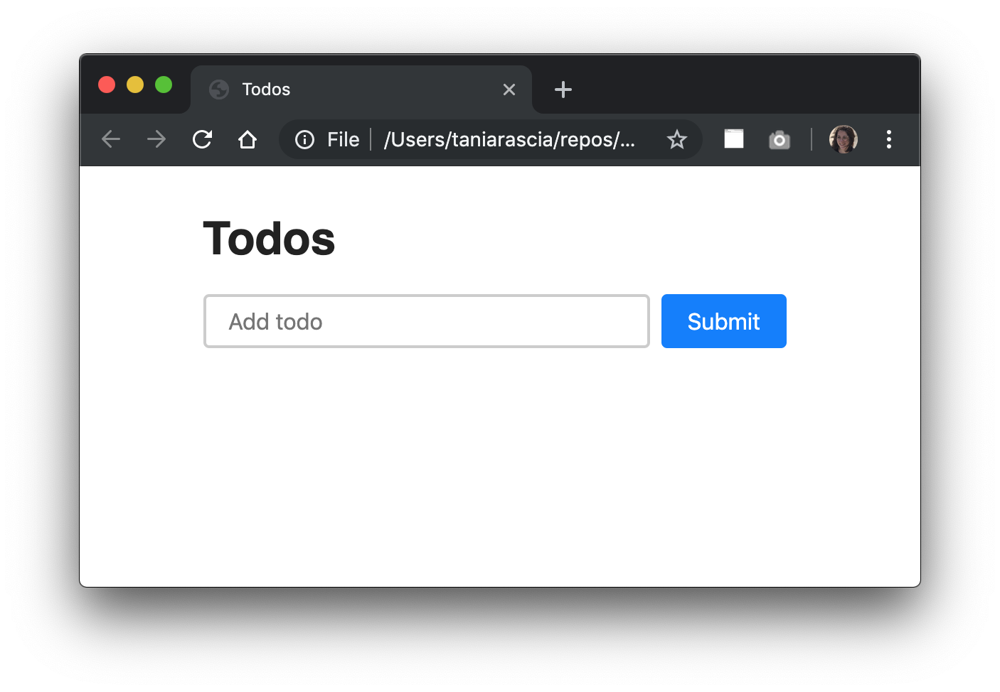
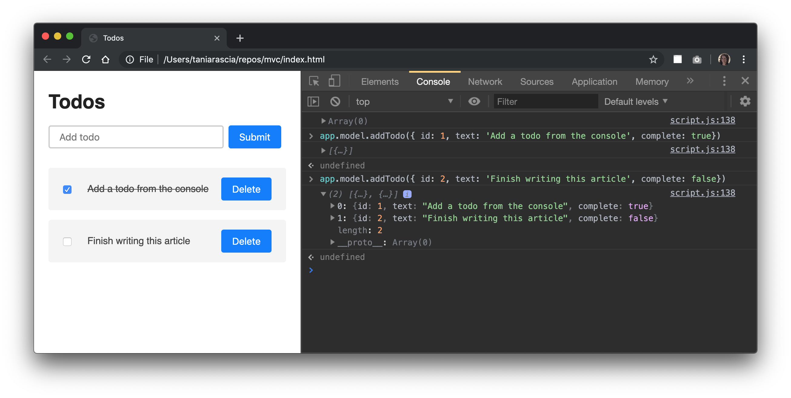

I wanted to write a simple application in plain JavaScript using the [model-view-controller](https://en.wikipedia.org/wiki/Model%E2%80%93view%E2%80%93controller) architectural pattern. So I did, and here it is. Hopefully it helps you understand MVC, as it's a difficult concept to wrap your head around when you're first starting out.

I made [this todo app](https://taniarascia.github.io/mvc), which is a simple little browser app that allows you to CRUD (create, read, update, and delete) todos. It just consists of an `index.html`, `style.css`, and `script.js`, so nice and simple and dependency/framework-free for learning purposes.

#### Prerequisites

- Basic JavaScript and HTML
- Familiarity with [the latest JavaScript syntax](https://www.taniarascia.com/es6-syntax-and-feature-overview/)

#### Goals

Create a todo app in the browser with plain JavaScript, and get familiar with the concepts of MVC (and OOP - object-oriented programming).

- [View demo](https://taniarascia.github.io/mvc)
- [View source](https://github.com/taniarascia/mvc)

> **Note:** Since this app uses the latest JavaScript features (ES2017), it won't work as-is on some browsers like Safari without using Babel to compile to backwards-compatible JavaScript syntax.

## What is Model View Controller?

MVC is one possible pattern for organizing your code. It's a popular one.

- **Model** - Manages the data of an application
- **View** - A visual representation of the model
- **Controller** - Links the user and the system

The **model** is the data. In this todo application, that'll be the actual todos, and the methods that will add, edit, or delete them.

The **view** is how the data is displayed. In this todo application, that will be the rendered HTML in the DOM and CSS.

The **controller** connects the model and the view. It takes user input, such as clicking or typing, and handles callbacks for user interactions.

The model never touches the view. The view never touches the model. The controller connects them.

> I'd like to mention that doing MVC for a simple todo app is actually a ton of boilerplate. It would really be overcomplicating things if this was the app you wanted to create and you made this whole system. The point is to try to understand it on a small level so you can understand why a scaled system might use it.

## Initial Setup

This is going to be a fully JavaScript app, which means everything will be handled through JavaScript, and the HTML will only consist of a single root element in the body.

<div class="filename">index.html</div>

```html
<!DOCTYPE html>
<html lang="en">
  <head>
    <meta charset="utf-8" />
    <meta name="viewport" content="width=device-width, initial-scale=1.0" />
    <meta http-equiv="X-UA-Compatible" content="ie=edge" />

    <title>Todo App</title>

    <link rel="stylesheet" href="style.css" />
  </head>

  <body>
    <div id="root"></div>

    <script src="script.js"></script>
  </body>
</html>
```

I wrote a small bit of CSS just to make it look acceptable, which you can find [here](https://github.com/taniarascia/mvc/blob/master/style.css) and save to `style.css`. I'm not going to write any more about the CSS, because it's not the focus of this article.

Okay, so now that we have the HTML and CSS, so it's time to actually start writing the app.

## Getting Started

We're going to make this really nice and simple to understand what class pertains to what part of MVC. I'll make a `Model` class, `View` class, and `Controller` class, which takes in the model and view. The app will be an instance of the controller.

> If you're not familiar with how classes work, read [Understanding Classes in JavaScript](/understanding-classes-in-javascript/).

```js
class Model {
  constructor() {}
}

class View {
  constructor() {}
}

class Controller {
  constructor(model, view) {
    this.model = model
    this.view = view
  }
}

const app = new Controller(new Model(), new View())
```

Very nice and abstract.

## Model

Let's focus on the model first, as it's the simplest of the three parts. It doesn't involve any events or DOM manipulation. It's just storing and modifying data.

<div class="filename">Model</div>

```js
class Model {
  constructor() {
    // The state of the model, an array of todo objects, prepopulated with some data
    this.todos = [
      { id: 1, text: 'Run a marathon', complete: false },
      { id: 2, text: 'Plant a garden', complete: false },
    ]
  }

  addTodo(todoText) {
    const todo = {
      id: this.todos.length > 0 ? this.todos[this.todos.length - 1].id + 1 : 1,
      text: todoText,
      complete: false,
    }

    this.todos.push(todo)
  }

  // Map through all todos, and replace the text of the todo with the specified id
  editTodo(id, updatedText) {
    this.todos = this.todos.map(todo =>
      todo.id === id ? { id: todo.id, text: updatedText, complete: todo.complete } : todo
    )
  }

  // Filter a todo out of the array by id
  deleteTodo(id) {
    this.todos = this.todos.filter(todo => todo.id !== id)
  }

  // Flip the complete boolean on the specified todo
  toggleTodo(id) {
    this.todos = this.todos.map(todo =>
      todo.id === id ? { id: todo.id, text: todo.text, complete: !todo.complete } : todo
    )
  }
}
```

We have an `addTodo`, `editTodo`, `deleteTodo`, and `toggleTodo`. These should all be very self explanatory - add appends a new todo to the array, edit finds the id of the todo to edit and replaces it, delete filters a todo out of the array, and toggle switches the `complete` boolean property.

Since we're doing this all in the browser, and app is accessible from the window (global), you can test these out easily, typing something like:

```js
app.model.addTodo('Take a nap')
```

will add a todo to the list, and you can log the contents of `app.model.todos`.

That's good enough for the model right now. In the end, we'll store the todos in [local storage](/how-to-use-local-storage-with-javascript/) to make it semi-permanent, but for now the todos will just refresh any time you refresh the page.

As we can see, the model only deals with the actual data, and modifying that data. It doesn't understand or have any knowledge the **input** - what's modifying it, or the **output** - what will end up displaying.

At this point you have everything you need for a fully functioning CRUD app, if you manually type all your actions through the console, and view the output in the console.

## View

We're going to create the view by manipulating the **DOM** - the document object model. Since we're doing this in plain JavaScript without the aid of React's JSX or a templating language, it will be kind of verbose and ugly, but such is the nature of manipulating the DOM directly.

Neither the controller nor the model should know anything about the DOM, HTML elements, CSS, or any of that. Anything relating to it should be in the view.

> If you're not familiar with the DOM or how the DOM is different to HTML source code, read [Introduction to the DOM](/introduction-to-the-dom/).

The first thing I'll do is just make helper methods to retrieve an element and create an element.

<div class="filename">View</div>

```js
class View {
  constructor() {}

  // Create an element with an optional CSS class
  createElement(tag, className) {
    const element = document.createElement(tag)
    if (className) element.classList.add(className)

    return element
  }

  // Retrieve an element from the DOM
  getElement(selector) {
    const element = document.querySelector(selector)

    return element
  }
}
```

So far so good. Now in the constructor, I'm going to set up all the things I need for my view. That'll be:

- The root element of the app - `#root`
- The title heading - `h1`
- A form, input and submit button for adding a todo - `form`, `input`, `button`
- The todo list - `ul`

I'll make them all variables in the constructor so we can easily refer to them.

<div class="filename">View</div>

```js
class View {
  constructor() {
    // The root element
    this.app = this.getElement('#root')

    // The title of the app
    this.title = this.createElement('h1')
    this.title.textContent = 'Todos'

    // The form, with a [type="text"] input, and a submit button
    this.form = this.createElement('form')

    this.input = this.createElement('input')
    this.input.type = 'text'
    this.input.placeholder = 'Add todo'
    this.input.name = 'todo'

    this.submitButton = this.createElement('button')
    this.submitButton.textContent = 'Submit'

    // The visual representation of the todo list
    this.todoList = this.createElement('ul', 'todo-list')

    // Append the input and submit button to the form
    this.form.append(this.input, this.submitButton)

    // Append the title, form, and todo list to the app
    this.app.append(this.title, this.form, this.todoList)
  }
  // ...
}
```

Now the parts of the view that won't change are set up.



Two more small things - a getter and resetter of the input (new todo) value.

> I'm using underscores in the method names to signify that they're private (local) methods that won't be used outside of the class.

<div class="filename">View</div>

```js
get _todoText() {
  return this.input.value
}

_resetInput() {
  this.input.value = ''
}
```

All the setup's done now. The most complex part is displaying the todo list, which is the part that will change every time a change is made to the todos.

<div class="filename">View</div>

```js
displayTodos(todos) {
  // ...
}
```

The `displayTodos` method will create the `ul` and `li`s that the todo list consists of, and display them. Every time a todo is changed, added, or removes, the `displayTodos` method will be called again with the `todos` from the model, resetting the list and redisplaying them. This will keep the view in sync with the model state.

The first thing we'll do is remove all todo nodes every time it's called. Then, we'll check if any todos exist. If they don't, we'll display an empty list message.

<div class="filename">View</div>

```js
// Delete all nodes
while (this.todoList.firstChild) {
  this.todoList.removeChild(this.todoList.firstChild)
}

// Show default message
if (todos.length === 0) {
  const p = this.createElement('p')
  p.textContent = 'Nothing to do! Add a task?'
  this.todoList.append(p)
} else {
  // ...
}
```

Now we'll just loop through the todos and display a checkbox, span, and delete button for every existing todo.

<div class="filename">View</div>

```js
else {
  // Create todo item nodes for each todo in state
  todos.forEach(todo => {
    const li = this.createElement('li')
    li.id = todo.id

    // Each todo item will have a checkbox you can toggle
    const checkbox = this.createElement('input')
    checkbox.type = 'checkbox'
    checkbox.checked = todo.complete

    // The todo item text will be in a contenteditable span
    const span = this.createElement('span')
    span.contentEditable = true
    span.classList.add('editable')

    // If the todo is complete, it will have a strikethrough
    if (todo.complete) {
      const strike = this.createElement('s')
      strike.textContent = todo.text
      span.append(strike)
    } else {
      // Otherwise just display the text
      span.textContent = todo.text
    }

    // The todos will also have a delete button
    const deleteButton = this.createElement('button', 'delete')
    deleteButton.textContent = 'Delete'
    li.append(checkbox, span, deleteButton)

    // Append nodes to the todo list
    this.todoList.append(li)
  })
}
```

Now the view is set up and the model is set up. We just don't have a way to connect them - no events watching for a user to make input, and no handlers to handle the output of such an event.

The console still exists as a temporary controller, and you can add and remove todos through it.



## Controller

Finally, the controller is the link between the model (the data ) and the view (what the user sees). Here's what we have so far in the controller.

<div class="filename">Controller</div>

```js
class Controller {
  constructor(model, view) {
    this.model = model
    this.view = view
  }
}
```

Our first link between the view and model is to make a method that calls `displayTodos` every time a todo changes. We can also call it once in the `constructor` to display the initial todos if there are any.

<div class="filename">Controller</div>

```js
class Controller {
  constructor(model, view) {
    this.model = model
    this.view = view

    // Display initial todos
    this.onTodoListChanged(this.model.todos)
  }

  onTodoListChanged = todos => {
    this.view.displayTodos(todos)
  }
}
```

The controller will handle events after they're fired. When you submit a new todo, or click the delete button, or click on the checkbox of a todo, an event will be fired. The view must listen for those events because they're user input of the view, but it will dispatch the responsibility of what will happen in response to the event to the controller.

We'll create handlers for the events in the controller.

<div class="filename">Controller</div>

```js
handleAddTodo = todoText => {
  this.model.addTodo(todoText)
}

handleEditTodo = (id, todoText) => {
  this.model.editTodo(id, todoText)
}

handleDeleteTodo = id => {
  this.model.deleteTodo(id)
}

handleToggleTodo = id => {
  this.model.toggleTodo(id)
}
```

### Setting up event listeners

Now we have these handlers, but the controller still doesn't know when to call them. We have to put event listeners on the DOM elements in the view. We'll respond to the `submit` event on the form, and `click` and `change` events on the todo list. (I'm skipping "Edit" for now since it's slightly more complicated.)

<div class="filename">View</div>

```js
bindAddTodo(handler) {
  this.form.addEventListener('submit', event => {
    event.preventDefault()

    if (this._todoText) {
      handler(this._todoText)
      this._resetInput()
    }
  })
}

bindDeleteTodo(handler) {
  this.todoList.addEventListener('click', event => {
    if (event.target.className === 'delete') {
      const id = parseInt(event.target.parentElement.id)

      handler(id)
    }
  })
}

bindToggleTodo(handler) {
  this.todoList.addEventListener('change', event => {
    if (event.target.type === 'checkbox') {
      const id = parseInt(event.target.parentElement.id)

      handler(id)
    }
  })
}
```

We need to call the handler from the view, so we're going to bind the methods that are listening for the events to the view.

> We used arrow functions on all the handle events. This allows us to call them from the view using the `this` context of the controller. If we did not use arrow functions, we would have to manually bind them, like `this.view.bindAddTodo(this.handleAddTodo.bind(this))`. Yikes.

<div class="filename">Controller</div>

```js
this.view.bindAddTodo(this.handleAddTodo)
this.view.bindDeleteTodo(this.handleDeleteTodo)
this.view.bindToggleTodo(this.handleToggleTodo)
// this.view.bindEditTodo(this.handleEditTodo) - We'll do this one last
```

Now when a `submit`, `click` or `change` event happens on the specified elements, the corresponding handlers will be invoked.

### Respond to callbacks in the model

There's something we left out - the events are listening, the handlers are invoked, but nothing happens. This is because the model does not know that the view should update, and does not know what to do to make the view update. We have the `displayTodos` method on the view to solve this, but as mentioned earlier, the model and view should not know about each other.

Just like with listening for events, the model should fire back to the controller to let it know that something happened.

We already made the `onTodoListChanged` method on the controller to deal with this, we just have to make the model aware of it. We'll bind it to the model the same way we did with the handlers on the view.

In the model, add `bindTodoListChanged` for `onTodoListChanged`.

<div class="filename">Model</div>

```js
bindTodoListChanged(callback) {
  this.onTodoListChanged = callback
}
```

And you'll bind this in the controller, just like with the view.

<div class="filename">Controller</div>

```js
this.model.bindTodoListChanged(this.onTodoListChanged)
```

Now after every method in the model, you'll call the `onTodoListChanged` callback.

<div class="filename">Model</div>

```js
deleteTodo(id) {
  this.todos = this.todos.filter(todo => todo.id !== id)

  this.onTodoListChanged(this.todos)
}
```

### Add local storage

At this point, the app is mostly complete and all the concepts have been demonstrated. We can make it a little bit more permanent by persisting the data in the local storage of the browser, so it will persist locally after refresh.

> If you aren't aware of how local storage works, read [How to Use Local Storage with JavaScript](/how-to-use-local-storage-with-javascript/).

Now we can set the initial todo value to what's in local storage or an empty array.

<div class="filename">Model</div>

```js
class Model {
  constructor() {
    this.todos = JSON.parse(localStorage.getItem('todos')) || []
  }
}
```

We'll make a `commit` private method to update the value of `localStorage` as well as the model state.

<div class="filename">Model</div>

```js
_commit(todos) {
  this.onTodoListChanged(todos)
  localStorage.setItem('todos', JSON.stringify(todos))
}
```

After every change to `this.todos`, we can call it.

<div class="filename">Model</div>

```js
deleteTodo(id) {
  this.todos = this.todos.filter(todo => todo.id !== id)

  this._commit(this.todos)
}
```

### Add live editing functionality

The last piece in this puzzle is the ability to edit an existing todo. Editing is always a little trickier than adding or deleting. I wanted to make it simple, and not require an edit button or replacing the `span` with an `input` or anything. We also don't want to call the `editTodo` every single time a letter is typed, because it will re-render the whole todo list UI.

I decided to make a method on the view that updates a temporary state variable with the new editing value, and another that calls the `handleEditTodo` method in the controller which updates the model. An `input` event is what gets fired when you type in a `contenteditable` element, and `focusout` fires when you leave a `contenteditable` element.

<div class="filename">View</div>

```js
constructor() {
  // ...
  this._temporaryTodoText
  this._initLocalListeners()
}

// Update temporary state
_initLocalListeners() {
  this.todoList.addEventListener('input', event => {
    if (event.target.className === 'editable') {
      this._temporaryTodoText = event.target.innerText
    }
  })
}

// Send the completed value to the model
bindEditTodo(handler) {
  this.todoList.addEventListener('focusout', event => {
    if (this._temporaryTodoText) {
      const id = parseInt(event.target.parentElement.id)

      handler(id, this._temporaryTodoText)
      this._temporaryTodoText = ''
    }
  })
}
```

Now when you click on any todo item, you'll enter into "editing" mode, which will update the temporary state variable, and when you tab or click away from the todo, it will save in the model and reset the temporary state.

Just make sure to bind the `editTodo` handler.

<div class="filename">Controller</div>

```js
this.view.bindEditTodo(this.handleEditTodo)
```

> The `contenteditable` solution was quickly implemented. There are all sorts of issues you need to consider when using `contenteditable` in a production app, [many of which I've written about here](/content-editable-elements-in-javascript-react/).

## Conclusion

There you have it. A dependency-free todo app in plain JavaScript that demonstrates the concepts of model-view-controller architecture. Here is a link to the completed demo and source once again.

- [View demo](https://taniarascia.github.io/mvc)
- [View source](https://github.com/taniarascia/mvc)

I hope this tutorial helped you understand MVC. Using this loosely-coupled pattern can add a lot of boilerplate and abstraction to an application, but it's also a predictable, familiar pattern that is commonly used across many frameworks, and an important concept to know as a developer.
