Speaking CSS is like speaking English, or any other spoken language - there are many words, but you only end up using a small subset of them on a daily basis. Just like reading a dictionary isn't an efficient way to learn a language, looking at a [big list of properties](https://www.w3.org/Style/CSS/all-properties.en.html) isn't helpful to learn CSS.

Some people think CSS is really hard and it's too much of a hassle to learn. Some people think that since it's not a programming language ([or is it?](https://notlaura.com/is-css-turing-complete/)), it's so easy that you don't even have to bother learning it. Ultimately, there's a lot to CSS, but it doesn't have to be overwhelming. If you learn a few key concepts, you should feel confident looking at or thinking of any design and turning it into reality.

I'm going to go over some of the parts of CSS that are important on a daily basis, and give some of tips and tricks I've come to learn over the years.

> If you just want some hints on how to make your design look pretty or consistent, check out [Design for Developers](https://www.taniarascia.com/design-for-developers/). I also think [Web Design in 4 Minutes](https://jgthms.com/web-design-in-4-minutes/) by [Jeremy Thomas](https://jgthms.com/) has an excellent, interactive introduction to the concepts of web design.

#### Who is this article for?

If you're a seasoned front end developer who already knows everything about CSS, please close this tab immediately and run as fast as you can to the nearest exit. If you've never heard of or used CSS before and don't know how to load CSS into an HTML page, this resource is also not for you.

This article is for the middleground of people who have had to touch CSS a few times here and there but ultimately don't feel like they know what they're doing, or struggle with making basic layouts.

#### Topics covered

##### HTML 101

- [HTML Fundamentals](#html-fundamentals)

##### CSS 101

- [CSS Syntax](#css-syntax)
- [CSS Selectors](#css-selectors)
- [CSS Specificity](#css-specificity)
- [CSS Properties](#css-properties)

##### Working with CSS

- [Spacing Out](#spacing-out-padding-and-margins)
  - `padding`, `margin`, `border`
- [Box Model](#box-model)
  - `content-box` vs. `border-box`
- [Shorthand Properties](#shorthand-properties)
- [Layouts: Display](#layouts-display)
  - `inline`, `inline-block`, `block`
- [Layouts: Positioning](#layouts-positioning)
  - `static`, `fixed`, `absolute`, `relative`
- [Layouts: Flex](#layouts-flex)
  - flex containers (`flex` display), flex items (`flex` property)
- [Responsive: Media Queries](#responsive-media-queries)
  - `min-width`, `max-width`
- [Other Considerations](#other-considerations)

## HTML Fundamentals

Just as a recap, we'll be talking about how CSS applies to HTML a lot, so make sure you're familiar with what everything is referring to in HTML.

- **Tag** - element name (_example:_ `a`)
- **Attribute** - HTML modifiers (_example:_ `href`)
- **Value** - value applied to an attribute (_example:_ `http://tania.dev`)
- **Element** - everything within the HTML tag - attributes, values, and content.

Example:

```html
<tag attribute="value">element contents</tag>
```

A real example:

```html
<a href="http://tania.dev">Tania's WebRing</a>
```

This will link to my awesome WebRing.

### HTML Reference

| Syntax    | Example                                           |
| --------- | ------------------------------------------------- |
| Tag       | `a`, `img`, `h1`                                  |
| Attribute | `href`, `src`, `alt`                              |
| Value     | `http://tania.dev`, `avatar.png`, `Some alt text` |
| Element   | ``                          |

Now we can move on to CSS.

## CSS Fundamentals

I'm just going to go over some of the basics of CSS - syntax, selectors, and specificity.

## CSS Syntax

There are three main parts of CSS - selectors, properties, and values.

- **Selectors** - the element(s) being selected
- **Properties** - the aspect of the element being styled
- **Values** - the style being applied

Example:

```css
selector {
  property: value;
}
```

A real example:

```css
h1 {
  color: blue;
}
```

This will make all `h1` elements blue.

## CSS Selectors

From **least specific** to **most specific** (more about that below), here are the main types of selectors:

- [**Universal selector**](https://developer.mozilla.org/en-US/docs/Web/CSS/Universal_selectors) - selects all elements
- [**Type selector**](https://developer.mozilla.org/en-US/docs/Web/CSS/Type_selectors) - targets element(s) by HTML tag (includes [pseudo elements](https://developer.mozilla.org/en-US/docs/Web/CSS/Pseudo-elements))
- [**Class selector**](https://developer.mozilla.org/en-US/docs/Web/CSS/Class_selectors), [**Attribute selector**](https://developer.mozilla.org/en-US/docs/Web/CSS/Attribute_selectors) - targets element(s) by class or attribute, respectively (includes [pseudo classes](https://developer.mozilla.org/en-US/docs/Web/CSS/Pseudo-classes))
- [**ID selector**](https://developer.mozilla.org/en-US/docs/Web/CSS/ID_selectors) - targets an element by id

```css
* {
  /* Universal selector */
}

tag {
  /* Type selector */
}

tag::before {
  /* Type selector (psuedo element) */
}

.class {
  /* Class selector */
}

.class:hover {
  /* Class selector (pseudo class) */
}

[attr] {
  /* Attribute selector */
}

#id {
  /* ID selector */
}
```

> **Pseudo elements** have two colons (`::`, or `::before`) and **pseudo classes** have one colon (`:`, or `:hover`).

### CSS and JavaScript

Note that even if you don't care much about CSS, learning about selectors will help you write (vanilla) JavaScript, as the DOM selectors in a JavaScript document query are the same.

This query to get all elements that match a selector:

<div class="filename">.js</div>

```js
document.querySelectorAll('article h2')
```

Targets all the same elements as this CSS to style all elements that match a selector:

<div class="filename">.css</div>

```css
article h2 {
}
```

> **Note:** All selectors may target one or more elements except IDs, which can only apply to a single element.

### A space means something

Do you know the difference between these two?

- `.foo.bar`
- `.foo .bar`

The first one targets a `foo` and `bar` on the same element.

<div class="filename">.foo.bar example</div>

```css
.foo.bar {
  /* without a space */
}
```

```html
<div class="foo bar">I'm targeted</div>
```

The second one targets a `bar` that is a descendent of a `foo`.

<div class="filename">.foo .bar example</div>

```css
.foo .bar {
  /* with a space */
}
```

```html
<div class="foo">
  <div class="bar">I'm targeted</div>
</div>
```

There are other selectors that can be used instead of a space to modify the selector, such as `>`, `+`, and `~`. These all have different meanings. They are not used incredibly often so you can learn them as needed.

### Selector Reference

| Selector           | Targets                 | Example                                             |
| ------------------ | ----------------------- | --------------------------------------------------- |
| Universal selector | All elements            | `*`                                                 |
| Type selector      | Tags, pseudo elements   | `h1`, `div`, `li::before`                           |
| Class selector     | Classes, pseudo classes | `.page-header`, `.page-content`, `.list-item:hover` |
| Attribute selector | Attributes              | `[alt]`, `[type="text"]`, `[lang="en"]`             |
| ID selector        | IDs                     | `#toggle`, `#getting-started`, `#about`             |

## CSS Specificity

What does "specificity" mean in CSS?

### Order

First, all things being equal, the order in which you use two selectors in the stylesheet matters. So if we have a stylesheet with two classes:

<div class="filename">Comparing two selectors weighted equally</div>

```css
.foo {
  color: blue;
}

.bar {
  color: red;
}
```

and you have both of those classes on the same element:

<div class="filename">An example of one element using both selectors</div>

```html
<div class="foo bar">What color am I?</div>
```

...then the one closest to the bottom wins. So in this case, the element's color is red, because `.bar` appears closest to the bottom of the stylesheet.

### Calculating specificity

CSS uses a number scale to determine specificity. You can also use [this specificity calculator](https://specificity.keegan.st/) to see how specific an element is.

As we know, there are three sections: `ID`, `Class`, and `Type`. In the scale, all are represented by `0` initially.

| ID  | Class | Type |
| --- | ----- | ---- |
| 0   | 0     | 0    |

Any time your selector contains one of the selectors, you'll increase that bucket by 1.

Add a type selector.

<div class="filename">Only a type selector</div>

```css
h1 {
  /* 001 */
}
```

| ID  | Class | Type |
| --- | ----- | ---- |
| 0   | 0     | 1    |

Add a class selector.

<div class="filename">Type selector plus class selector</div>

```css
.container h1 {
  /* 011 */
}
```

| ID  | Class | Type |
| --- | ----- | ---- |
| 0   | 1     | 1    |

Add an ID selector.

<div class="filename">Type, class, and ID selector</div>

```css
#landing-page .container h1 {
  /* 111 */
}
```

| ID  | Class | Type |
| --- | ----- | ---- |
| 1   | 1     | 1    |

You can think of this scale exactly the same as a base-10 number system. If just a tag is `1` (one), and a class and type is `11` (eleven), and an id, class, and tag is `111` (one-hundred and one), which one is the biggest? In this case, `111` is the biggest and therefore the most specific.

> If you had more than 10 elements in a given bucket, like `1` id, `15` classes, and `30` types, this analogy doesn't work, but you could relate it to semantic numbering systems as well - it would be `1.15.30`. However, if you're using that many selectors, something has most likely gone horribly wrong.

This means a class is an order of magnitude more specific than a type, and an id is an order of magnitude more specific than a class.

In other words, if you had two ids and 0 classes vs. 1 id and 20 classes, the two ids would win. For example:

This selector is more specific: (`200`, or two-hundred)

<div class="filename">Two ID selectors</div>

```css
#landing-page #about-section {
  /* 200 */
}
```

| ID  | Class | Type |
| --- | ----- | ---- |
| 2   | 0     | 0    |

This selector is less specific: (`140`, or one-hundred forty)

<div class="filename">An ID selector and many class selectors</div>

```css
#landing-page .foo.bar.baz.box {
  /* 140 */
}
```

| ID  | Class | Type |
| --- | ----- | ---- |
| 1   | 4     | 0    |

#### Inline styles

An inline style is stronger than any combination of id, class, or type.

<div class="filename">Inline styles on an element</div>

```html
<div style="color: red;">I'm red! No selector can override me!</div>
```

### Important!

Except an `!important` keyword on a property can override even that...

<div class="filename">Important keyword overriding inline styles on an element</div>

```css
div {
  color: blue !important;
}
```

```html
<div style="color: red;">I've been overridden! I'm blue now!</div>
```

Please, make very, very sparing use of `!important`. It becomes really hard to override. `!important` should only be used when absolutely necessary, like styling some third party you have no control over that is using inline styles, and in a few cases with JavaScript toggling display.

To summarize, each level of hierarchy from type to `!important` is an order of magnitude stronger than the previous one. While `!important` is the strongest specificity modifier, an `!important` can be overridden by another `!important` that is otherwise higher (for example, `!important` + ID is stronger than `!important` plus class).

### Specificity hierarchy

From least specific to most specific:

| Selector                   | Example                            | Specificity   |
| -------------------------- | ---------------------------------- | ------------- |
| Type selector              | `h1`                               | `0 0 0 1`     |
| Class, attribute selectors | `.class`, `[type="text"]`          | `0 0 1 0`     |
| ID selector                | `#contact`                         | `0 1 0 0`     |
| Inline style               | `<div style="background: purple">` | `1 0 0 0`     |
| `!important` keyword       | `div { color: green !important }`  | Overrides all |

## CSS Properties

Here's a list of all properties that I think are absolutely essential to knowing CSS. The equivalent of knowing the most basic verbs and nouns in English that you can get by with.

The minimum to be able to do anything:

- `padding`, `margin`, `border`
- `background`
- `color`, `font-family`, `font-weight`, `font-size`, `line-height`
- `width`, `height`, `max-width`, `max-height`

Layout essentials:

- `position`, `z-index`, `top`, `right`, `bottom`, `left`
- `display`, `flex`, `align-items`, `justify-content`
- `@media`

Good to know, but not quite as essential as the rest:

- `grid`, `grid-template-columns`, `grid-template-rows`
- `transform`, `transition`

We'll go into these more in a moment. Now we should have enough of the basics down to discuss some applications of the knowledge.

## Spacing Out: Padding and Margins

All of your spacing needs will be covered by two properties: `padding` and `margin`.

- [**Padding**](https://developer.mozilla.org/en-US/docs/Web/CSS/padding) is used to pad the inside of an element (_inside of the border_)
- [**Margin**](https://developer.mozilla.org/en-US/docs/Web/CSS/margin) is used to separate elements (_outside of the border_)

> In Developer Tools, content is represented by blue, padding is represented by green and margins are represented by orange.

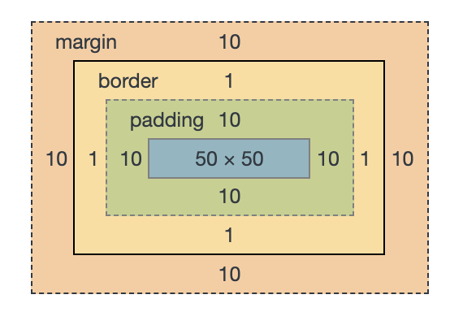

The order of nesting for an element is as follows:

- Element content -> `padding` -> `border` -> `margin`

So if I were to make an element that was a square with padding and margins, it would look like this:

```css
.square {
  border: 1px solid gray;
  padding: 10px;
  margin: 10px;
  height: 50px;
  width: 50px;
}
```

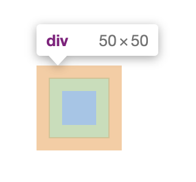

A few important notes:

- **Margin** is always transparent; **padding** can have a background color
- **Margins** collapse into each other; **padding** stacks on top of each other
- **Margin** can have negative values; **padding** cannot have negative values
- **Padding** adds to the area of an element that can be clicked; **margin** does not
- **Padding** (and border) add to the total size of an element; **margin** does not

What this means is that margins overlap each other, and padding never will. This comes up a lot in formatting of headings and paragraphs, for example.

Using an example of an `h2` with a `10px` bottom margin and a `p` with a `10px` top margin, how much of a margin will separate the two elements?

```html
<h2 style="margin-bottom: 10px;">Heading</h2>
<p style="margin-top: 10px;">Paragraph</p>
```

We'll see that there is a total `10px` margin between them, not `20px`.

To use a real example, in [this example MVC todo app](https://taniarascia.github.io/mvc/) I made, each todo item is padded, and they're separated from each other by margins.

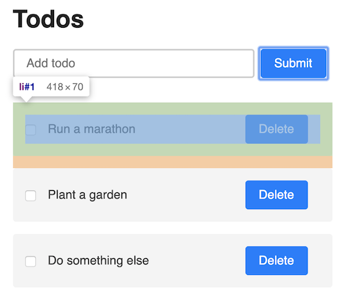

### Padding vs. margin

| Trait             | Margin             | Padding        |
| ----------------- | ------------------ | -------------- |
| Background color  | Always transparent | Set by element |
| Collapse or stack | Collapse           | Stack          |
| Negative values   | Allowed            | Not allowed    |
| Clickable         | No                 | Yes            |

## Box Model

[Box-sizing](https://developer.mozilla.org/en-US/docs/Web/CSS/box-sizing)! It means one thing: do padding and borders count as part of the element's size, or not?

- **Border box** says yes! Borders and padding are part of an element's size!
- **Content box** says no! Borders and padding are not part of an element's size!

My recommendation? Set `box-sizing` to `border-box` on everything (`*`). Always. Don't even think about it! On the rare occasion something needs to be `content-box`, you can override it. This is one of the few things IE got right - making `border-box` the default while the rest of the browsers use `content-box` as the default.

### Border box vs. content box?

Let's use our square example above. With `content-box` applied, the element's total size is `72px * 72px`:

<div class="filename">Content box</div>

```
50px for content
2px (x) and 2px (y) for four 1px borders
20px for 10px padding all around
= 72px square
```

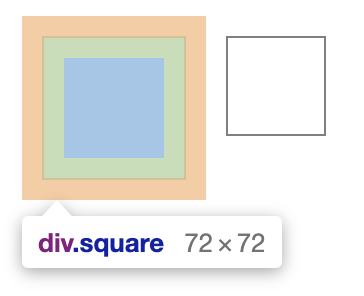

With `border-box` applied, the element's total size is `50px * 50px`.

<div class="filename">Border box</div>

```
28px for content
2px (x) and 2px (y) for four 1px borders
20px for 10px padding all around
= 50px square
```


If you're giving an element a `height` and `width` of `50px` each, would you prefer the element to be `50px` or `72px`? The most likely answer is that you want the height and width to match the size of the element. This will become very important when creating layouts, especially flex/grids that are set by percent.

You can apply `border-box` to all elements like this:

```css
* {
  box-sizing: border-box;
}
```

(Or [this way](https://www.paulirish.com/2012/box-sizing-border-box-ftw/) if you have a specific need for `content-box` somewhere.)

## Shorthand Properties

You see me use `padding: 5px` and `margin: 5px`. The `padding` property, for example, is actually a shorthand for four individual properties:

```css
/* Shorthand property */
div {
  padding: 5px;
}

/* Individual properties */
div {
  padding-top: 5px;
  padding-right: 5px;
  padding-bottom: 5px;
  padding-left: 5px;
}
```

Usually, you won't have to declare each side separately. In design, we like symmetry, so if you ever end up with a different value for all four sides, something has probably gone quite wrong and you might want to rethink your strategy.

- **one** value applies to all four sides (`padding: 5px`)
- **two** values apply to vertical (top and bottom) and horizontal (left and right) respectively (`padding: 10px 0`)
- **four** values are applied **clockwise** from top to left (`padding: 1px 2px 3px 4px`)

This applies to both `padding` and `margin`. The most common usage of an individual side property is when you're overriding something. For example, an element exists with `padding: 5px`, and you want it to have a different padding bottom value.

The next most common shorthand applies to `border`. You will most commonly see border written like this:

```css
div {
  border: border-width border-style border-color;
}
```

These can be written out individually as well.

```css
div {
  border: 1px solid black;
}

/* Can also be written individually */
div {
  border-color: black;
  border-width: 1px;
  border-style: solid;
}
```

And just like `padding` and `margin`, each of these border modifiers has its own side property.

```css
div {
  border-bottom-color: green;
  border-bottom-width: 2px;
  border-bottom-style: dashed;
}
```

So actually when you write `border: 1px solid black` you're writing shorthand for 12 properties combined.

## Layouts: Display

There are many `display` properties ([see this list](https://developer.mozilla.org/en-US/docs/Web/CSS/display)), but I think the most used and important to know are `block`, `inline`, `inline-block`, `flex` and `none`.

Most elements by default are `block`, `inline`, or `inline-block`. The default `block` element is a `div`, and the default inline element is a `span`.

Examples of default elements:

- **Inline**: `span`, `strong`, `em`, `img`
- **Inline-block**: `button`, `select`, (Chrome only: `textarea`, `input`)
- **Block**: `div`, `p`, `nav`, `section`

> There a few other obvious, specific ones, such as `table` elements having the `table` display, and `li` having the `list-item` display, but you will rarely decide to make some other element have that display type.

#### Inline

**Inline** elements are usually text formatting based: `b` or `strong`, which make text bold, or `i` and `em` which make text italic. They are on the same line - they do not create a new line. Inline elements are usually nested within block elements. Horizontal and vertical padding and margins are applied as expected, but vertical margins are not applied at all, and vertical padding is ignored by other elements.

<div class="filename">Inline element behavior</div>

```html
content content...<span>span</span>..content content
```

```css
span {
  /* inline by default */
  padding: 15px;
  margin: 15px;
}
```

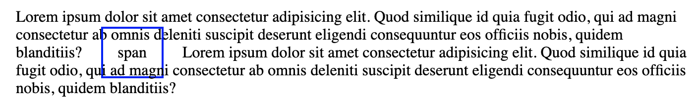

To be safe, inline elements should only be used for text formatting.

#### Inline block

**Inline-block** elements are like inline elements, except they can have vertical and horizontal padding and margins. They also appear next to each other horizontally by default, and do not stack on new lines.

```css
span {
  display: inline-block;
  padding: 15px;
  margin: 15px;
}
```

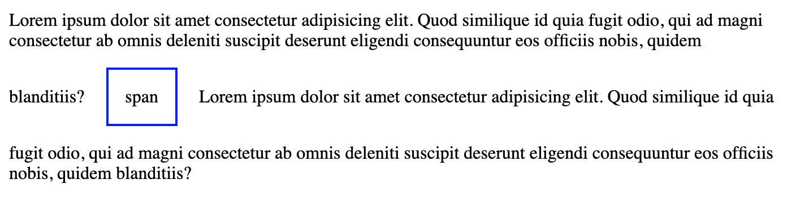

#### Block

**Block** elements span the full width of their containing element, and stack on top of each other in new lines of the document.

<div class="filename">Block element behavior</div>

```html
content content...
<div>div</div>
..content content
```

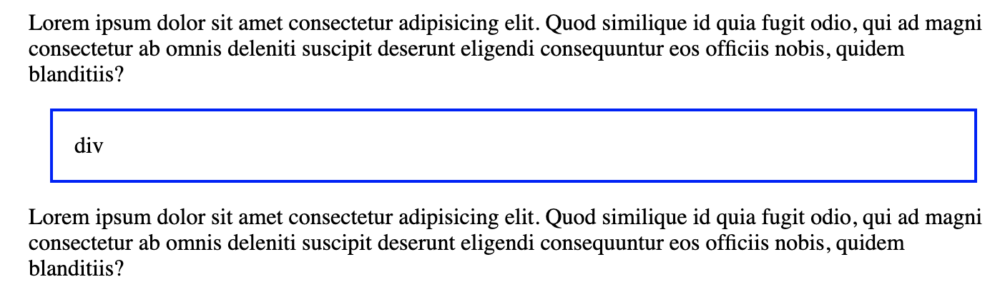

#### None

An element with **none** applied will not appear in the document at all. This is most commonly used for hiding/displaying content for mobile.

### Display Reference

| Display        | Behavior                                                                         |
| -------------- | -------------------------------------------------------------------------------- |
| `inline`       | used primarily for text formatting, appear next to each other horizontally       |
| `inline-block` | appear next to each other horizontally with vertical padding and margins applied |
| `block`        | spans the full width of the container, stack vertically                          |
| `none`         | does not appear in the document                                                  |

## Layouts: Positioning

The `position` property, while important, is not what you should be using for the majority of layout related decisions. Changing `position` from it's default value (`static`) should be reserved for a few specific situations. There are three that are mainly used: `fixed`, `absolute`, and `relative`. A positioned element is affected by `top`, `left`, `right`, `bottom` and `z-index`.

### Normal flow

If you do not modify the `position` of any element, everything pertains to the [Normal flow](https://developer.mozilla.org/en-US/docs/Learn/CSS/CSS_layout/Normal_Flow) of the document. All this means is that:

- block level elements will take up the **full width** of their **container**, and the height of their content
- block level elements will stack on top of each other vertically, from top to bottom
- inline elements are as tall and wide as their content
- all elements are aware of each other, and margins will collapse

### Static

The default state of `position` is `static`. It means your element stays in the normal flow of the document. If you have three static `div`s next to each other, they will all be aware of each other and stack on top of each other.

```html
<div>div</div>
<div>div</div>
<div>div</div>
```

```css
div {
  border: 1px solid black;
  padding: 15px;
  margin: 15px;
}
```

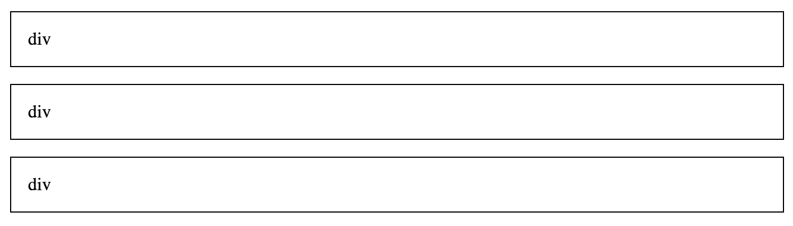

`static` elements are not positioned, and therefore not affected by `top`, `left`, `right`, `bottom`, or `z-index`.

> **Note:** Just because elements have a `static` position does not always mean they will stack each other vertically. The `display` property might modify this, with `inline-block`, `grid`, or `flex`, but they will still be part of the regular document flow and other elements will be aware of them.

### Fixed

A `fixed` element is the easiest position to understand: it is always visible and positioned according to the viewport.

A few common uses of `fixed` positioning:

- a stick-to-top **navigation bar**
- a **back to top** button in the bottom right of the screen
- a **popup modal** that is in the center of the viewport

```css
nav {
  position: fixed;
}
```

A few things to know about `fixed` elements:

- their position on the screen is determined by `top`, `left`, `right`, and `bottom` properties. `top: 0` means it will stick to the top of the viewport, and `top: 10px` means it will be `10px` from the top of the viewport
- other elements are **not aware** of the existence of a `fixed` element. This generally means you must account for the space they would occupy by **adding margins** to the elements around them.
- `fixed` elements are no longer part of the flow and do not have a containing element, and therefore do not expand to fill their container like a normal (block) element would.

This means if all we do is set our `nav` to fixed with no other properties, it will not expand the full width of the viewport.

```html
<nav>nav</nav>
<div>div</div>
<div>div</div>
```

```css
div {
  border: 1px solid black;
  padding: 15px;
  margin: 15px;
  background: white;
}

nav {
  position: fixed;
  background: gray;
}
```

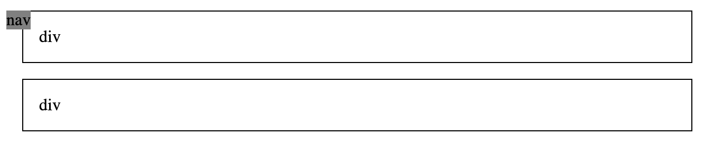

So we can update it to be full width, and stick to the top and left of the viewport:

```css
nav {
  position: fixed;
  top: 0;
  left: 0;
  padding: 20px;
  width: 100%;
  background: gray;
  z-index: 2;
}
```

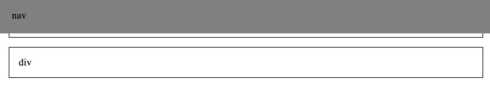

We're adding the `z-index` property, which affects the z-axis of the element. Since we intend this element to always be completely visible, we give it a `z-index` greater than `0` to ensure it's always "above" any element in our document. As we can see, there's one last issue, which is that the `nav` is overlapping the content. As mentioned previously, you _must_ add space (margins) to `static` elements to make space for the `fixed` element. Simply adding a `margin-bottom` to the `nav` won't have any effect.

```html
<nav>nav</nav>

<section>
  <div>div</div>
  <div>div</div>
</section>
```

```css
section {
  margin-top: 80px;
}
```

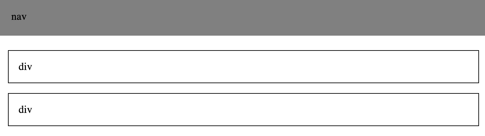

So now we have that all taken care of and `fixed` positioning should make sense.

### Absolute and relative

`absolute` and `relative` positions go hand in hand. Take everything you just learned about `fixed` elements and apply them to `absolute` elements. They behave almost exactly the same: other elements don't know about `absolute` elements, they're affected by the directional properties and `z-index`. The difference is instead of being positioned relative to the viewport (browser window), they're positioned relative to the nearest element that is not `static` - so a `fixed`, `absolute`, or `relative` element.

`relative` elements, on the other hand, behave almost exactly the same as a `static` element - they are part of the document flow, and simply setting `relative` to an element will not change its appearance at all. The difference is a `relative` element _can_ use the directional properties - `top`, `left`, `right`, and `bottom`.

However, the most common usage of `relative` and `absolute` is that a `relative` element is treated as `static`, but as an **anchor point** for some other `absolute` element.

I'll make an example with a `section` (red) that has a nested `div` (blue).

```html
<section>
  section
  <div>div</div>
</section>
```

With no positioning applied, the `div` is contained inside of the `section`.

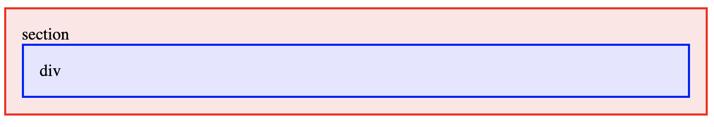

Now imagine I have a bunch of card elements that are always `100px` tall, regardless of the content contained within, and I want a button to always exist at the same spot on the bottom right. Using `relative` and `absolute`, the `div` will always be in the same spot on any card.

```css
section {
  position: relative;
  height: 100px;
}

div {
  position: absolute;
  bottom: 15px;
  right: 15px;
}
```

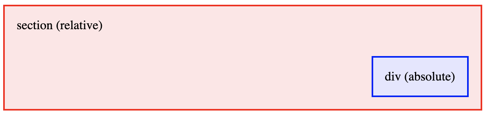

To summarize, use `relative` when you want something else to be anchored to an element but you don't want that element itself to move or be affected at all, and use `absolute` on the element to be anchored. A common usage of this is card-like elements.

This [card element](https://taniarascia.github.io/card/) is an example of absolute coming in handy to make sure they're always the same size but the buttons line up.

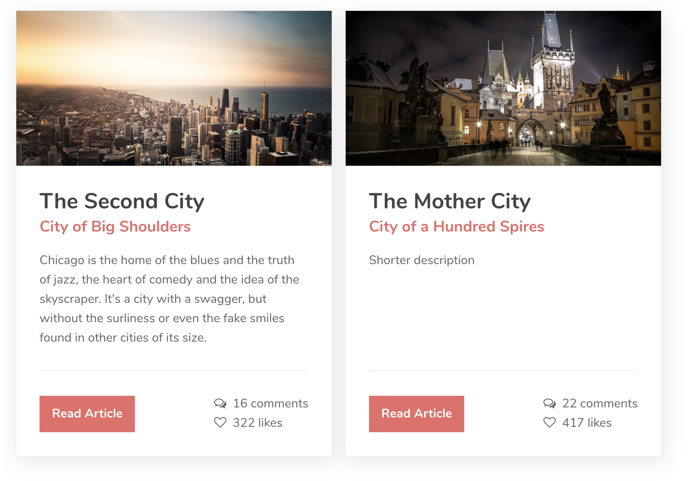

### Positioning Reference

| Position   | Behavior                                                                            | In Document Flow |
| ---------- | ----------------------------------------------------------------------------------- | ---------------- |
| `static`   | default behavior; elements stack in order and are aware of each other               | Yes              |
| `relative` | positioned relative to its original position in the flow                            | Yes              |
| `fixed`    | positioned relative to the viewport                                                 | No               |
| `absolute` | positioned relative to closest non-static (`fixed`, `relative`, `absolute`) element | No               |

## Layouts: Flex

The `block`, `inline-block`, and `inline` display types all apply to the element itself. [Flexbox](https://developer.mozilla.org/en-US/docs/Web/CSS/CSS_Flexible_Box_Layout) is different, because it applies to elements nested within the one that has `display: flex`. There are many resources that go deep into Flexbox and everything it's capable of, but I'm just going to tell you the basic stuff you can always do to easily make layouts.

### History lesson

In the beginning, HTML documents were basically the same as MS Word documents: you had headings, paragraphs, and the occasional image. People started wanting more advanced layouts, so they began using tables to create their layouts. Since the purpose of tables was (and is) only to display tabular data, the HTML people wrote to create layouts became messier and messier.

Eventually, someone discovered that they could use the `float` property to move things to the left and right of the page, instead of tables. This made the markup a little cleaner and easier to understand, but again, this was another attempt to mutate something for a purpose it was never designed to do. CSS floats were (and are) for "floating" images in an article to the left or right (like you might see in a magazine), not for creating a layout. Nonetheless, for years we were stuck with the `float` property to create some semblance of a unique layout without using tables.

Now we have Flexbox and CSS grid for creating layouts, and we basically never have to touch `float` except for its rare, actual purpose. This doesn't apply if you have to support older versions of Internet Explorer, but if you do, there are more than enough resources to understand how floats were used during this time.

### Creating a flex container

We already know that a bunch of default block elements will stack each other:

<div class="filename">Stacked elements</div>

```html
<section>
  <div>div</div>
  <div>div</div>
  <div>div</div>
</section>
```

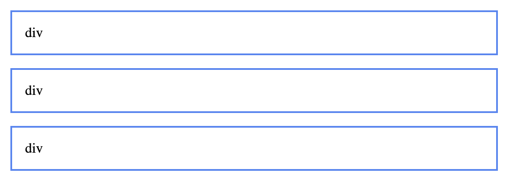

So how do we get elements to be side-by-side? We can make the outer container a flex container.

<div class="filename">Elements in a default flex container</div>

```html
<section class="flex-container">
  <div>div</div>
  <div>div</div>
  <div>div</div>
</section>
```

```css
.flex-container {
  display: flex;
}
```

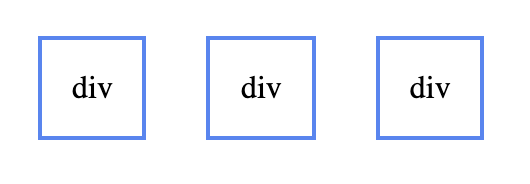

And just like that, all the inner elements are now stacked horizontally in a row. By default, a flex container is set to `flex-direction: row`. Note that only the first layer of elements will be flex items - elements nested further within them will behave normally. You can also update it to `flex-direction: column` and the items will be stacked vertically, as they were originally.

Here are a few cool things flex can do:

- vertically align elements with ease
- space items apart or group them together easily
- create repeating grids

### Alignment: create a navigation bar with flex

Let's make a practical example to demonstrate some of what flex is capable of: a navigation bar. Here's what we want it to look like:

- brand name to the left
- nav links to the right
- all items vertically centered

<div class="filename">navbar.html</div>

```html
<nav>
  <div>Brand name</div>
  <div>
    <a href="#!">About</a>
    <a href="#!">Contact</a>
  </div>
</nav>
```

<div class="filename">navbar.css</div>

```css
nav {
  background: blue;
  height: 80px;
}
```

Without any regard to layout applied, here's how it looks.


We'll make the navbar flex, so the brand name and nav links will be horizontal.

```css
nav {
  display: flex;
}
```


Now we want everything to be vertically aligned. With `align-items: center`, we can vertically align items within a flex container.

```css
nav {
  display: flex;
  align-items: center;
}
```


Now we want the brand and links to be on opposite ends of the navbar. With `justify-content: space-between`, we can tell the items in the flex container to be spaced apart as far as possible.

```css
nav {
  display: flex;
  align-items: center;
  justify-content: space-between;
}
```

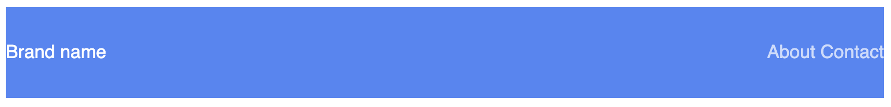

Then just add a little padding and you have an acceptable navbar.

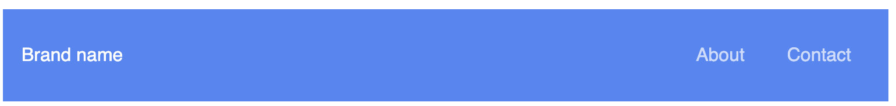

I believe without knowing anything else about flex, you can get pretty far with just those properties. When thinking about any of the other values that can be applied to flex alignment, just think about the navigation bar. The brand and group of links are two items in a flex row.

- `align-items` refers to the **vertical alignment**: `flex-start` would be the top, `flex-end` would be the bottom, and `center` is vertically aligned.
- `justify-content` refers to the **horizontal spacing**: `start` would be all items to the left, `end` would be all items to the right, `center` is everything in the middle, and `space-between` is everything equally spaced apart.

> **Note:** Flex is also capable of reversing rows and columns. In addition to `flex-direction: row`, and `flex-direction: column`, there is also `row-reverse` and `column-reverse`. This would reverse the expectation of `align-items` and `justify-content` as well. For example, `justify-content: start` would be on the right of a `row-reverse` flex container.

**Further reading**: [Flexbox Froggy](https://flexboxfroggy.com/) is a game for learning and practicing Flexbox that might come in handy.

### Flex Container Reference

| Property          | Values                                                                    |
| ----------------- | ------------------------------------------------------------------------- |
| `flex-direction`  | `row`, `column`, `row-reverse`, `column-reverse`                          |
| `flex-wrap`       | `wrap`, `nowrap`                                                          |
| `align-items`     | `flex-start`, `flex-end`, `center`, `stretch`, `baseline`                 |
| `justify-content` | `start`, `center`, `end`, `space-between`, `space-around`, `space-evenly` |

### Wrapping: Create a repeating grid

Often, you might have a bunch of cards or images in a gallery that should be in a repeating grid. By default, with a flex container, the horizontal items will continue forever horizontally.

```html
<section class="flex-container">
  <div>div</div>
  <div>div</div>
  ...
</section>
```

```css
.flex-container {
  display: flex;
}
```

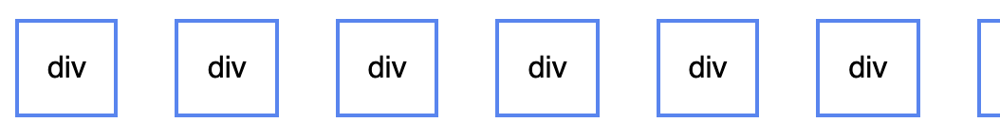

We can make the grid repeat onto as many lines as necessary with `flex-wrap`.

```css
.flex-container {
  display: flex;
  flex-wrap: wrap;
}
```


This is great. But wait...it only works when the elements have no content. What if I fill them with a lot of text?


Now this seems pretty useless. But with a tiny bit of flex magic, we can transform it back to a grid:

```css
div {
  flex: 1;
}
```

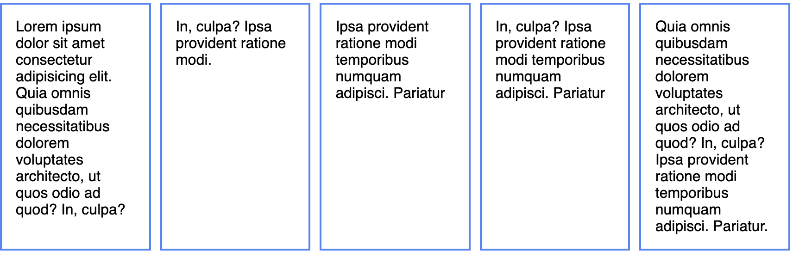

So what does `flex: 1` do? It tells all flex items in a container, if they all have it applied, to automatically have an equal height and width. `flex` is another shorthand for three properties: `flex-grow`, `flex-shrink`, and `flex-basis`.

```css
.element {
  flex: 1;
}

/* is the same as */

.element {
  flex-grow: 1;
  flex-shrink: 1;
  flex-basis: 0%;
}

/* flex shorthand */
.element {
  flex: flex-grow flex-shrink flex-basis;
}
```

Two flex elements set to `flex: 1` will both be 50% of the width of the container. Three will both be 33.3333% of the width of the container, and so on.

But this is still kind of random. Keep adding more divs, and once it decides that no more can fit, and to wrap to the next line (if `flex-wrap` is set). Then the element that gets wrapped will now take up 100% of the row.

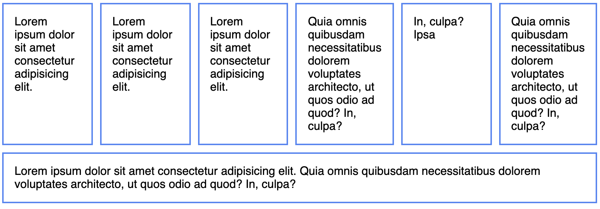

What if you always want each element to take up 1/3 of the available horizontal space, regardless of how many flex items there are and what content they contain? You can set the `flex-basis` only, to the width you desire.

```css
div {
  flex: 0 0 33.3333%;
}
```

Remember the Box Model, from earlier? If you have any padding on your flex items, you _must_ have `box-sizing: border-box` for the percentage to be calculated correctly. If that's taken care of, it will correctly calculate each flex item to the proper 33.33333% width of the screen.

But there is one more consideration - if you want gutters in your grid, you'll use margins to separate each item. Since the margins are calculated separately, you'll need to subtract the outer margins from the `flex-basis`. In this example, there's an extra `10px` margin on both sides, so we'll subtract `20px`.

```css
div {
  padding: 15px;
  margin: 10px;
  flex: 0 0 calc(33.3333% - 20px);
}
```

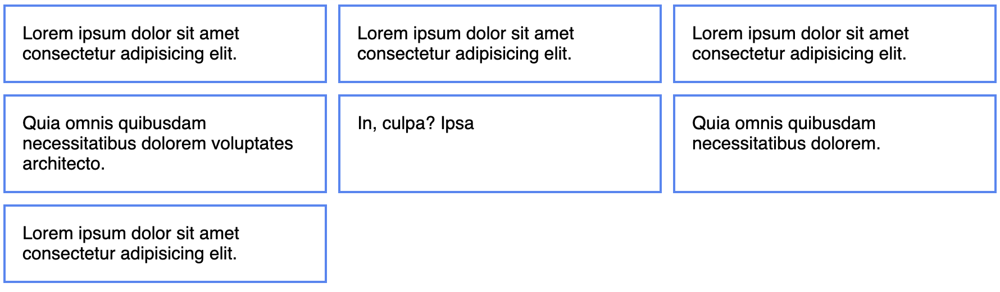

You can easily make simple grids by either setting the `flex-basis` (setting one to `25%` and one to 75%, for example) or with varying `flex-grow`/`flex-shrink` combinations (`flex: 1` on one element and `flex: 2` on another element would result in a `33.3-%` / `66.6-%` split, respectively).

### Flex Property Reference

| Property      | Description                                                                  |
| ------------- | ---------------------------------------------------------------------------- |
| `flex-grow`   | Determines how much a flex item should grow if there's space available       |
| `flex-shrink` | Determines how much a flex item should shrink if there's not space available |
| `flex-basis`  | Defines initial size of flex item                                            |

Finally, there is also an `order` property, in which you can rearrange the order of flex items.

## Responsive: Media Queries

Use [media queries](https://developer.mozilla.org/en-US/docs/Web/CSS/Media_Queries/Using_media_queries) to make your websites responsive, or adaptive to multiple screen sizes. With media queries, you tell CSS to only apply on screen sizes _below_ a certain width (with `max-width` queries) or _above_ a certain width (with `min-width` queries).

```css
@media screen and (min-width: 800px) {
  /* applies styles to any device screen sizes above 800px wide */
}
```

```css
@media screen and (max-width: 800px) {
  /* applies styles to any device screen sizes below 800px wide */
}
```

If you've ever heard the term **mobile-first**, this refers to building a website for mobile first, and creating `min-width` media queries as necessary as the screen sizes go up.

```css
/* Mobile first styles go here */

@media screen and (min-width: 800px) {
  /* Desktop styles go here */
}
```

It is much easier to design a website mobile-first and scale up as needed, than trying to take a website that is only optimized for desktop and making it mobile-friendly with `min-width` media queries. If you're doing it from scratch, I would recommend starting mobile first and using `min-width` queries, but if you have to quickly make a desktop site work for mobile, it's easier and faster to add `max-width` queries here and there as needed.

All CSS frameworks deal with these different queries, or responsive breakpoints, slightly differently. If we look at [Bootstrap's responsive breakpoints](https://getbootstrap.com/docs/4.0/layout/overview/#responsive-breakpoints), we can see they have five breakpoints, from extra small to extra large. Personally, I find that having one breakpoint (no breakpoint for mobile, and one for desktop) or two breakpoints (no breakpoint for mobile, one for tablet, and one for desktop) takes care of most of my responsive needs.

Note that `@media` can be nested within a selector. In this example, an `h1` has font size of `28px` by default, but `32px` on larger screen sizes.

```css
h1 {
  font-size: 28px;

  @media screen and (min-width: 800px) {
    font-size: 32px;
  }
}
```

## Other Considerations

This article is getting incredibly long, and there's still plenty I haven't covered. Here's a few quick answers and additional resources to the holes in my attempt to cover everything at once.

To get an idea of how I generally like to style my CSS, take a look at [Primitive CSS](https://taniarascia.github.io/primitive/), the CSS/Sass framework I designed a few years ago, which contains a clean Sass setup and sensible defaults. Creating your own CSS framework and grid is a fun, challenging way to really learn CSS, and I highly recommend it!

### When should I style ids, classes, or tags?

My rules are as follows: IDs are exclusively used for JavaScript purposes. To easily target an individual element with JavaScript, you can use an ID, and know that it has no affect on the style. If you wish, you could also "scope" sections of content by nesting everything in an ID, though I don't personally do that.

For tags, _never_ style elements like `main`, `article`, `div`, `section`, `aside`, etc. You should always feel secure that these elements will be unstyled and only denote the type of content they contain. If you wish to add styling to them, create classes like `.container`. I usually give some default styling to `h1` through `h5`, `p`, `ul`, `ol`, `li`, `a`, and `table`.

For most other styling, I use classes. Try to make classes "semantic" by describing what they are, not what they do. For example, having a class called `.app-sidebar` would be acceptable, but having `.bg-white`, `.blue-border`, `.large-text` ultimately becomes difficult to maintain. (A few helper classes, such as the Bootstrap [spacing utilities](https://getbootstrap.com/docs/4.3/utilities/spacing/) can come in handy).

**Further reading**: [The Difference Between ID and Class](https://css-tricks.com/the-difference-between-id-and-class/)

### What should I use for font size - px vs. em vs. rem?

I use pixels (`px`) on borders, and `rem` on all font sizes, padding, and margins. I don't use `em` at all, as using it has more possible unintended consequences on nested elements (although I used `px` on all examples throughout this resource for simplicity and familiarity).

**Further reading**: [Responsive Typography: rem, em, and px](https://www.element84.com/blog/responsive-typography), [Comprehensive Guide: When to Use Em vs Rem](https://webdesign.tutsplus.com/tutorials/comprehensive-guide-when-to-use-em-vs-rem--cms-23984)

### What about Sass? Or LESS?

I prefer to use Sass for all CSS preprocessing, much like the popular CSS framework, [Bootstrap](https://getbootstrap.com/). It also works fantastically out-of-the-box with the JavaScript framework, [Vue](https://vuex.vuejs.org/). LESS is generally less popular and I don't prefer it, but [Ant Design](https://ant.design/) and [Semantic UI](https://semantic-ui.com/) do. You can also use tools like [PostCSS](https://postcss.org/) to compile the latest CSS to something most browsers can understand (much like Babel with ES6).

**Further reading**: [Learn Sass Now: A Guide to Installing and Understanding Sass](/learn-sass-now/)

### What about prefixes?

Browsers have been known to have inconsistencies with each other regarding CSS, and you might see `-webkit`, `-moz`, `-ms`, and `-o` prefixes for various properties that might not work on all browsers, or may have been experimental in some earlier browsers, like so:

```css
.flex {
  display: -webkit-box;
  display: -moz-box;
  display: -ms-flexbox;
  display: -webkit-flex;
  display: flex;
}
```

Use something like [Autoprefixer](https://github.com/postcss/autoprefixer) with [Webpack](https://webpack.js.org/), [Gulp](https://gulpjs.com/) or [Grunt](https://gruntjs.com/), whatever you may be using for bundling or task running. You should never have to write out or remember prefixes.

### What about CSS grid?

I'll be honest, almost every time I create something in CSS grid, I end up converting it to Flexbox because I find it easier to work with and more intuitive. I didn't cover grid in this article because it's too big of a subject to just tack on at the end. See the further reading for many examples you can play around with.

**Further reading**: [Grid by Example - the examples](https://gridbyexample.com/examples/)

### BEM, OOCSS, SMACSS...how should I structure my CSS?

A lot of people have come up with a lot of solutions on how to structure your CSS - [BEM](http://getbem.com/introduction/), [OOCSS](http://oocss.org/), [SMACSS](http://smacss.com/)...BEM (Block-Element-Modifier) seems to be one of the more popular and prevailing. I personally prefer not to use any of these in specific (and I don't like using underlines in CSS at all).

### What else?

Use numbers (as percents) on `line-height`. I prefer `line-height: 1.2` for headings, and `line-height: 1.6` for font (using the [Golden Ratio](https://pearsonified.com/golden-ratio-typography-intro/)).

You can use the pseudo class/function `:not()` to target every element that doesn't match what you input. Here's a useful one for ensuring all headings, except for the first one in a section, have some extra spacing.

```css
h1:not(:first-child),
h2:not(:first-child),
h3:not(:first-child) {
  margin-top: 2.5rem;
}
```

Always have a `.container` element handy, that looks something like this (`max-width` and `padding` can be changed up to whatever you want).

```css
.container {
  max-width: 1200px;
  padding: 0 15px;
  margin-left: auto;
  margin-right: auto;
}
```

This will make your content pretty responsive by default. You'll have padding around the content on mobile, and the content won't expand too far on desktop screens, and will be horizontally centered (this is what happens when `auto` is applied to both margins).

Don't spread text out too wide. Think about a page in a book; you wouldn't want one page to be too wide, or reading it is oddly stressful. I like to make a small container for text-only, to ensure articles and text aren't too wide.

```css
.small-container {
  max-width: 800px;
  padding: 0 15px;
  margin-left: auto;
  margin-right: auto;
}
```

Use `max-width: 100%` and `height: auto` for responsive images. This way, the image will retain it's original aspect ratio, but resize according to the width of its container.

```css
img.responsive-image {
  max-width: 100%;
  height: auto;
}
```

Finally, I didn't get into transitions and animations, but I think those are overall less important than the concepts I laid out here today.

## Conclusion

I hope this was a useful introduction to all things CSS, from the fundamentals of selectors and specificity, to layouts and positioning. No matter how much you read about and study CSS, I don't think it can feel natural without a lot of practice. I recommend looking at some designs of websites you like and trying to replicate them without looking at the source code.
