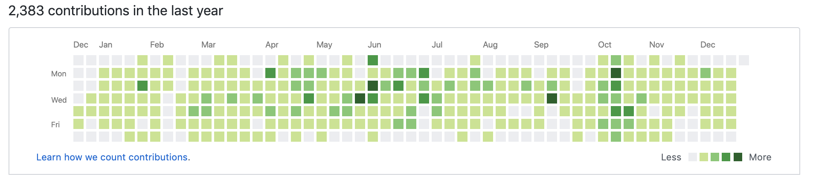
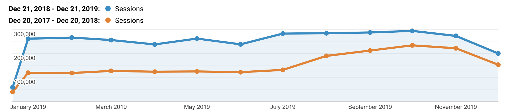
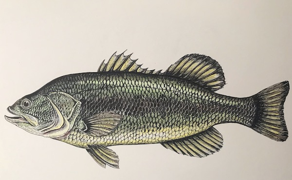

It's that time again. Another revolution around the sun, another year in review. Here are the previous years.

- [2016 into 2017](/2016-into-2017)
- [2017 into 2018](/2017-into-2018)
- [2018 into 2019](/2018-into-2019)

A year is a pretty long time, and sometimes it doesn't feel like you've learned or accomplished that much because you can't remember it all. I find these posts really helpful to look back and realize just how much I learned over the course of a year.

Unfortunately - or fortunately - I'm learning so much, so fast, that I haven't been able to write about it all. But at least I can track it here, and try my best to get a resource out into the world for my own reference and to help others.

## I wrote 17 articles

Generally, I write an article a month, with a few others thrown in here and there. It doesn't seem like that much, but they're are often long and informative walkthrough tutorials or deep-dives into a subject, and I don't have many small, snippet-style articles.

- **2016** - 14
- **2017** - 43
- **2018** - 25
- **2019** - 17

Note that 2017 is high because I was writing and travelling full-time for several months. Here's the list ascending by date.

- [Understanding Bits, Bytes, Bases, and Writing a Hex Dump in JavaScript (Node)](/bits-bytes-bases-and-a-hex-dump-javascript/)
- [Using Content Editable Elements in JavaScript (React)](/content-editable-elements-in-javascript-react/)
- [Everything I Know as a Software Developer Without a Degree](/everything-i-know-as-a-software-developer-without-a-degree/)
- [The End of an Era: Migrating from WordPress to Gatsby](/migrating-from-wordpress-to-gatsby/)
- [Writing a Snake Game for the Terminal in Object-Oriented JavaScript (Node.js)](/snake-game-in-javascript/)
- [Using React Router for a Single Page Application](/using-react-router-spa/)
- [Using Context API in React (Hooks and Classes)](/using-context-api-in-react/)
- [Getting Started with Vue - An Overview and Walkthrough Tutorial](/getting-started-with-vue/)
- [Display Build Status and Test Coverage Badges for a JavaScript Project](/display-build-status-and-test-coverage/)
- [Making API Requests with Postman or cURL](/making-api-requests-postman-curl/)
- [Writing a Simple MVC App in Plain JavaScript](/javascript-mvc-todo-app/)
- [Create and Deploy a Node.js, Express, & PostgreSQL REST API to Heroku](/node-express-postgresql-heroku/)
- [Roll Your Own Comment System for a Static Site](/add-comments-to-static-site/)
- [Developer Blogs to Follow (2019)](/developer-blogs-to-follow-2019/)
- [Understanding This, Bind, Call, and Apply in JavaScript](/this-bind-call-apply-javascript/)
- [Full Stack Authentication: Cookies and Local Storage](/full-stack-cookies-localstorage-react-express/)
- [CSS - An Art, a Science, a Nightmare (Everything You Should Know)](/overview-of-css-concepts/)

Not having any comments, likes, upvotes, or user interaction on my website is a double-edged sword. I like how clean it is, how fast it is, how I don't have to spend any time or mental energy moderating comments. However, to the average or new visitor, it's hard to know you should trust my resource, because there's no social confirmation.

I only wrote one article for another entity this year, this one for DigitalOcean which got posted on [dev.to](https://dev.to).

- [Understanding This, Bind, Call, and Apply in JavaScript - on Dev.to](https://dev.to/digitalocean/understanding-this-bind-call-and-apply-in-javascript-dla)

I have one more on Map/Set that's awaiting publication, so it'll go on next year's list. I'm planning to write more next year on advanced JS topics.

## I started 2 open-source projects

I started two projects - [TakeNote](https://github.com/taniarascia/takenote) and [Chip8](https://github.com/taniarascia/chip8). Both are works in progress, almost complete.

### TakeNote

[TakeNote](https://github.com/taniarascia/takenote) is my biggest, most ambitious project yet - a Markdown note-taking app for the web, written in TypeScript with functional React and Redux. What makes it unique? Ultimately, it will store all your notes in a GitHub repo. Therefore, the app has no backend - just authentication and storage through GitHub. Right now, the app is about 90% complete, with all the functionality ready, but it's using local storage to store all the data until the sync with GitHub's APIs are complete.

TakeNote is huge for me, as it's been my first large-scale collaborative effort. It has been built with the help of [30 contributors](https://github.com/taniarascia/takenote/graphs/contributors)! At one point it even reached the top spot on GitHub trending, and I was overwhelmed with pull requests for a week or two. I'm excited to get this finished, and I learned a ton about TypeScript, Redux, and Hooks while building it.

Here is the current example site: [TakeNote.dev](https://takenote.dev/).

### Chip8.js

[Chip8.js](https://github.com/taniarascia/chip8) is very different from everything else I've done, and pretty different from what most people do in JavaScript. It's an emulator that interprets Chip8 roms, which were used in some 1970s microcomputers. It plays simple games like Pong, Tetris, Space Invaders, and so on.

While Chip8 emulators have been done before in JavaScript, what makes this one unique is the generic CPU interface it uses to hook up to multiple different graphical interfaces. There's a browser version, a terminal version, and a native GUI version of Chip8.js, all of which share the same CPU. I learned a ton while writing this, and I plan to write about the whole process once it's totally finished. It's at about 90% complete at the moment as well.

You can view the browser version here: [Chip8 Web](https://taniarascia.github.io/chip8/) (However, it only uses key input and they're not listed, so doing anything might be difficult until I add those instructions).

### Miscellaneous

I made a few small other projects.

- [MVC Todo](https://taniarascia.github.io/mvc) ([Source](https://github.com/taniarascia/mvc))
- [Snake (Terminal)](https://github.com/taniarascia/snek)
- [Webpack Boilerplate](https://github.com/taniarascia/webpack-boilerplate)

## I moved from WordPress to Gatsby

It's hard to believe that this site was on WordPress from 2015 to 2019, and it wasn't until the middle of 2019 that I finally moved to Gatsby. I wrote [The End of an Era: Migrating from WordPress to Gatsby](/migrating-from-wordpress-to-gatsby/) as I migrated to help others wanting to make the switch. It was time consuming, but incredibly worth it. Being able to write my posts in Markdown is amazing, and I can't imagine having it any other way.

## I did 2 presentations

Public speaking is not my strong suit, but I like doing at least one per year to keep in practice. This year, I did [Getting Started with Vue](https://www.youtube.com/watch?v=FPVI1wd7Uo0) and [An Introduction to React](https://www.youtube.com/watch?v=35-WmqaQCj8&t=) at [JavaScript Chicago](https://www.meetup.com/js-chi/).

## I made 2,383 commits

This statistic doesn't really matter, but it's a fun little graph to make this page a little more visual.

- **2015** - 383
- **2016** - 715
- **2017** - 655
- **2018** - 856
- **2019** - 2,383

Why such a discrepancy between this year and all the rest? My current job is the only one that has had their organization on GitHub, so it's the only one in which the contributions I make at work have counted towards my GitHub contributions - explaining why nearly every Monday to Friday is green. Weekends are open-source projects.

## I have 18 Patrons

- [My Patreon page](https://patreon.com/taniarascia)

Wow. You are all amazing. It's humbling to have so much support. I haven't started using Patreon until recently, and I'm really happy that people have decided to support me. Right now, the system is just a voluntary supporter basis, as I'm not sure what I should offer Patrons for signing up. If you have any ideas on that, please [let me know](mailto:hello@taniarascia.com)!

I have also received a lifetime amount of **878** coffee donations on [Ko-Fi](https://ko-fi.com/taniarascia). Thank you all so much!

## Email newsletter

As of my [2018 into 2019](/2018-into-2019) article, my newsletter had **2,609** subscribers. Now it has **8,430**! I hate spam, and I basically never want to receive any email that isn't directly from a person to me, so I send as few emails as possible. Usually around one per month, when I write something new.

So far, my newsletter journey has been [MailChimp](https://mailchimp.com/) to [Sendy](https://sendy.co/) to [Substack](https://substack.com/). MailChimp was good, but their prices become obnoxiously high after you reach the limit (which is 1k or 2k subscribers, something along those lines). The lowest tier was way beyond my budget, since my newsletter is simple a subscription service that does not sell anything and does not make me any money. I then bought Sendy for about \$60 and set it up on an AWS EC2 server with SES for email. Unfortunately, AWS kept sending all my emails directly to spam for no reason, and after about 15-20 emails back and forth with their support, I finally switched. Then a week later, they sent me an email acknowledging that the issue was on their end and it was fixed now, but by then I had already moved on.

So now I use [Substack](https://substack.com/), which is awesome! It seems too good to be true, because I get to send my simple emails for free. Hopefully they stick around.

## I had 3.2 million sessions

From **December 21, 2018** to **December 21, 2019**, there were **3,199,780** sessions on this website, compared to **1,910,587** from the previous year. **85%** of that traffic comes from organic search (Google).

## I drew a few things

I drew a few things, including this goat and fish, both as gifts for my boyfriend.

### Fish

Pen and watercolor pencils.

### Goat

Charcoal.

I didn't draw nearly enough, so hopefully I get more into drawing and painting next year.

## What I learned in 2019

I learned so much this year. Here are the major ones.

### Security and authentication

I'm paranoid about security, and a good amount of my research and projects are built around my desire to improve my understanding of security and best practices. In my [authentication](/full-stack-cookies-localstorage-react-express/) article, I laid out how to save authentication state on the front end in a secure way. This is huge for me, because it allows me to be comfortable creating the entire architecture for projects, which moves me out of the junior/mid-level developer category, and makes me feel confident about my work.

### Underlying concepts of how a CPU works

In my ongoing [Chip8.js](https://github.com/taniarascia/chip8) project, I created a CPU and learned about memory, registers, stacks, instructions, working with binary, hex, big and little endian, masking, buffers, and bitwise operators. I have tons I want to write about on this subject, and so far I've written about [bits, bytes, and bases (2, 10, 16)](/bits-bytes-bases-and-a-hex-dump-javascript/).

### Webpack

Webpack was always something I tried to avoid at all costs, and didn't entirely understand how to use. I decided that I needed to learn it very well, as Webpack comes up often in basically any front end project. I wrote [the Webpack 4 Boilerplate](https://github.com/taniarascia/webpack-boilerplate), which is a well-commented and very good starting point and is suitable for production. I learned about modules, loaders, plugins, and all the major Webpack concepts. This boilerplate has all the necessities, and any other add-ons (TypeScript, React) will just require adding a single loader. I'm now comfortable setting up my own Webpack config for production (instead of using Create React App) and I have a lot more control.

### Advanced testing

Before this year, I hadn't done much with testing beyond setting up a few unit tests in [Jest](https://jestjs.io/), but this year I got a ton of practice using [Supertest](https://www.npmjs.com/package/supertest) in Node/Express and [React Testing Library](https://github.com/testing-library/react-testing-library) for React component tests. I learned about mocking API calls, simulating user interactions, and much more. I hope to write a more in-depth article about testing next year.

### Vue and VueX

I spent much of 2019 on a team at work building an enterprise scale app in Vue, giving me a lot of experience with Vue and VueX. I can't decide if I like Vue or React more (though I really wish React had something like `$emit`) but I feel comfortable using both equally at this point. I wrote [Getting Started with Vue](/getting-started-with-vue/).

### More React (Hooks, Context)

I ended 2018 by writing [Building a CRUD App in React with Hooks](/crud-app-in-react-with-hooks/) to teach myself React Hooks, as they were brand new at the time. I wrote some more articles on React, about [Context](/using-context-api-in-react/) and [Routing](/using-react-router-spa/). I built TakeNote entirely with functional React Hooks and Redux, though I still find React Classes to be more intuitive, personally. React is ever-evolving and I use it on a daily basis, so I'm sure I'll end up learning a bunch more about React next year, too.

### Redux

I put off learning Redux for a long time. Every time I looked at it, it just seemed very overwhelming and different than anything else I'd done. I built [TakeNote](https://github.com/taniarascia/takenote) with Redux, so I was learning something alongside building it, and alongside learning TypeScript. It was a bit of a challenge, but now I understand why Redux is so useful, and at what point an app might need it. (For example, I built an app in plain Context recently, and it has become large enough that I feel like I should convert it to Redux soon.)

### TypeScript

I had never used TypeScript before this year, so I decided to write [Tic Tac Toe](https://github.com/taniarascia/tictactoe) in TypeScript to teach myself, then applied that to [TakeNote](https://github.com/taniarascia/takenote). I'm not sure if I'm quite the TypeScript evangelist that some people are yet, but I do find it interesting and useful to learn, and it's helpful for catching a certain class of bugs. I want to write an overview of TypeScript soon.

### Gatsby

I moved to Gatsby, which I chose as my static site generator because of how fast it is, and the fact that it uses React, which I'm most familiar with. I got a small amount of GraphQL experience doing this, but I still feel like I need to learn much more about it.

## What I want to learn in 2020

There are a few things I've learned that I want to write down before I forget, and new things I want to learn.

### Write

Here are a few things I know I want to write about next year.

- **Bitwise operators** in JavaScript
- **Generators** in JavaScript
- A deep dive into **callbacks, promises, and async/await**
- An overview of **TypeScript**
- Using **Webpack**
- Building a **Redux** + React application
- **Testing** with React Testing Library
- Setting up **Swagger** for API docs with Node
- Using **VueX**
- **File uploads** in JavaScript (Browser + Node)
- Building a dynamic step wizard
- Writing **Chip8**

I'd also like to write about real-world debugging and learning new concepts.

### Learn

I have my [learning in public](/learn) page, which is an overview of a bunch of topics I've learned already and ones I want to learn. Here's a summary.

- **GraphQL**
- **Data structures** - linked lists, stacks, queues, hash tables, binary trees, heaps, graphs
- **Algorithms** - sorting (bubble, insertion, selection, merge, heap, quick), searching (linear, binary)
- **Web APIs** - WebSockets, Drag and Drop
- **Web Components**
- Improve my knowledge of **scroll**
- Improve my knowledge of the **event loop**
- **Another language** - I haven't decided on Lua, Python, Go, or something else, but I'd like to get experience with another language outside of JavaScript (and PHP).

## Other notes

I did a lot with code this year, but not as much with my other hobbies. I didn't record any songs, and I didn't draw and paint enough. Here's a few things I hope to do next year.

- Abstract chess set on the 3D printer (pawn, bishop, knight, rook, king, queen)
- Settlers of Catan coaster set on the CNC machine (brick, trees, sheep, wheat, stone, desert)
- Make at least 3 paintings for the wall

This will involve getting Inkscape or Illustrator and learning how to properly make SVGs. I also want to make more art and paintings, but I need to figure out how to get back into it. Music has really dropped off for me in the last year as well, so I'd like to buy a keyboard and get back into learning songs on the piano.

A few health goals:

- Get 500 miles on the bike odometer
- Run an 8-minute mile
- Lose 8 lbs

Finally, I really would like to translate all my JavaScript learning into a book, but that's a huge task that needs to be broken down. I'll be working on refining these non-coding goals a bit more.

## Conclusion

All in all, it was a great year, and I learned a ton! It went by too fast. I'm excited for 2020. Thank you all for reading, contributing, emailing, and donating! Please don't hesitate to send me an email at [hello@taniarascia.com](mailto:hello@taniarascia.com) if you have any questions or comments or ideas. Have a great rest of the year!
