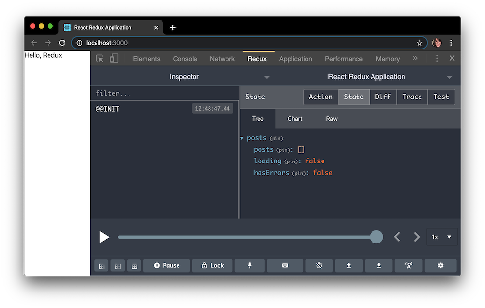
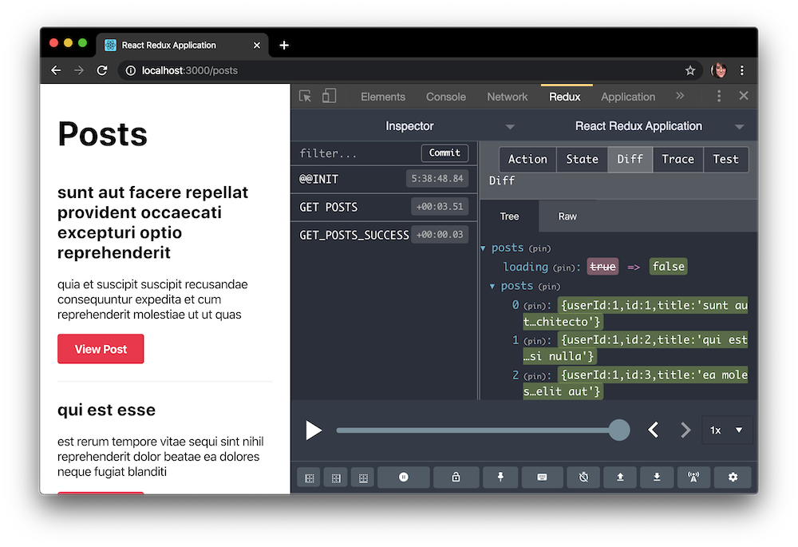

Do you have experience using [React](https://reactjs.org/)? Have you heard of [Redux](https://redux.js.org/), but you've put off learning it because it looks very complicated and all the guides seem overwhelming? If that's the case, this is the article for you! Contain your fear of containing state and come along with me on this relatively painless journey.

#### Prerequisites

You must already know how to use React for this tutorial, as I will not be explaining any aspects of React itself.

- Familiarity with [HTML & CSS](https://internetingishard.com/).
- Familiarity with [ES6 syntax and features](/es6-syntax-and-feature-overview/).
- Knowledge of React terminology: [JSX, State, Components, Props, Lifecycle](/getting-started-with-react/) and [Hooks](/crud-app-in-react-with-hooks)
- Knowledge of [React Router](/using-react-router-spa/)
- Knowledge of asynchronous JavaScript and [making API calls](/how-to-connect-to-an-api-with-javascript)

Also, download Redux DevTools [for Chrome](https://chrome.google.com/webstore/detail/redux-devtools/lmhkpmbekcpmknklioeibfkpmmfibljd?hl=en) or [for FireFox](https://addons.mozilla.org/en-US/firefox/addon/reduxdevtools/).

#### Goals

In this tutorial, we will build a small blog app. It will fetch posts and comments from an API. I've created the same app with both plain Redux, and [Redux Toolkit](https://redux-toolkit.js.org/) (RTK), the officially sanctioned toolset for Redux. Here are the links to the source and demos of both the plain and RTK versions.

##### React + Redux Application (Plain Redux)

- [Source](https://codesandbox.io/s/react-redux-application-hewdb)
- [Demo Application](https://hewdb.csb.app/)

##### React + Redux Toolkit Application

- [Source](https://codesandbox.io/s/react-redux-toolkit-application-cbb6s)
- [Demo Application](https://cbb6s.csb.app/)

> Note: The applications are pulling from a real API via [JSON Placeholder API](https://jsonplaceholder.typicode.com/). Due to rate limiting on CodeSandbox, the API may appear slow, but it has nothing to do with the Redux application itself. You can also clone the repository locally.

##### We will learn:

- **What** is Redux and **why** you might want to use it
- The **terminology** of Redux: actions, reducers, store, dispatch, connect, and container
- Making asynchronous API calls with [Redux Thunk](https://github.com/reduxjs/redux-thunk)
- How to make a small, real-world application with React and Redux
- How to use Redux Toolkit to simplify Redux app development

## What is Redux?

Redux is a state container for JavaScript applications. Normally with React, you manage state at a component level, and pass state around via props. With Redux, the entire state of your application is managed in one immutable object. Every update to the Redux state results in a copy of sections of the state, plus the new change.

Redux was originally created by [Dan Abramov](https://overreacted.io/) and [Andrew Clark](https://github.com/acdlite).

## Why should I use Redux?

- **Easily manage global state** - access or update any part of the state from any Redux-connected component
- **Easily keep track of changes with Redux DevTools** - any action or state change is tracked and easy to follow with Redux. The fact that the entire state of the application is tracked with each change means you can easily do time-travel debugging to move back and forth between changes.

The downside to Redux is that there's a lot of initial boilerplate to set up and maintain (especially if you use plain Redux without Redux Toolkit). A smaller application [may not need Redux](https://medium.com/@dan_abramov/you-might-not-need-redux-be46360cf367) and may instead benefit from simply using [the Context API](/using-context-api-in-react/) for global state needs.

In my personal experience, I set up an application with Context alone, and later needed to convert everything over to Redux to make it more maintainable and organized.

## Terminology

Usually I don't like to just make a list of terms and definitions, but Redux has a few that are likely unfamiliar, so I'm just going to define them all up front to make it easy to refer back to them. Although you can [skip to the beginning of the tutorial section](#getting-started), I think it would be good to read through all the definitions just to get exposure and an idea of them in your head first.

- [Actions](#actions)
- [Reducers](#reducers)
- [Store](#store)
- [Dispatch](#dispatch)
- [Connect](#connect)

I'll just use the typical todo application, and the action of deleting a todo, for the examples.

### Actions

An **action** sends data from your application to the Redux store. An action is conventionally an object with two properties: `type` and (optional) `payload`. The type is generally an uppercase string (assigned to a constant) that describes the action. The payload is additional data that may be passed.

<div class="filename">Action Type</div>

```js
const DELETE_TODO = 'DELETE_TODO'
```

<div class="filename">Action</div>

```js
{
  type: DELETE_TODO,
  payload: id,
}
```

### Action creators

An **action creator** is a function that returns an action.

<div class="filename">Action Creator</div>

```js
const deleteTodo = id => ({ type: DELETE_TODO, payload: id })
```

### Reducers

A **reducer** is a function that takes two parameters: `state` and `action`. A reducer is immutable and always returns a copy of the entire state. A reducer typically consists of a `switch` statement that goes through all the possible action types.

<div class="filename">Reducer</div>

```js
const initialState = {
  todos: [
    { id: 1, text: 'Eat' },
    { id: 2, text: 'Sleep' },
  ],
  loading: false,
  hasErrors: false,
}

function todoReducer(state = initialState, action) {
  switch (action.type) {
    case DELETE_TODO:
      return {
        ...state,
        todos: state.todos.filter(todo => todo.id !== action.payload),
      }
    default:
      return state
  }
}
```

### Store

The Redux application state lives in the **store**, which is initialized with a reducer. When used with React, a `<Provider>` exists to wrap the application, and anything within the Provider can have access to Redux.

<div class="filename">Store</div>

```jsx
import { createStore } from 'redux'
import { Provider } from 'react-redux'
import reducer from './reducers'

const store = createStore(reducer)

render(
  <Provider store={store}>
    <App />
  </Provider>,
  document.getElementById('root')
)
```

### Dispatch

`dispatch` is a method available on the store object that accepts an object which is used to update the Redux state. Usually, this object is the result of invoking an action creator.

```jsx
const Component = ({ dispatch }) => {
  useEffect(() => {
    dispatch(deleteTodo())
  }, [dispatch])
}
```

### Connect

The `connect()` function is one typical way to connect React to Redux. A connected component is sometimes referred to as a **container**.

Okay, that about covers it for the major terms of Redux. It can be overwhelming to read the terminology without any context, so let's begin.

## Getting Started

For ease of getting started quickly, my example uses [Create React App](https://reactjs.org/docs/create-a-new-react-app.html) to set up the environment.

```bash
npx create-react-app redux-tutorial
cd redux-tutorial
```

Redux requires a few dependencies.

- [Redux](https://github.com/reduxjs/redux) - Core library
- [React Redux](https://github.com/reduxjs/react-redux) - React bindings for Redux
- [Redux Thunk](https://github.com/reduxjs/redux-thunk) - Async middleware for Redux
- [Redux DevTools Extension](https://github.com/reduxjs/redux-devtools-extension) - Connects Redux app to Redux DevTools

You can `yarn add` or `npm i` them, and I'll be using `react-router-dom` as well, but that's it for extra dependencies.

```bash
yarn add \ # or npm i
redux \
react-redux \
redux-thunk \
redux-devtools-extension \
react-router-dom
```

And delete all the boilerplate. We'll add everything we need from scratch instead.

```bash
# move to src and delete all files within
cd src && rm *
```

We'll make directories for Redux [`reducers`](#reducers) and Redux [`actions`](#actions), as well as `pages` and `components` which you should already be familiar with from React.

```bash
mkdir actions components pages reducers
```

And we'll bring back `index.js`, `App.js`, and `index.css`.

```bash
touch index.js index.css App.js
```

So at this point your project directory tree looks like this.

```
└── src/
    ├── actions/
    ├── components/
    ├── pages/
    ├── reducers/
    ├── App.js
    ├── index.css
    └── index.js
```

For the `index.css` file, just take the contents of [this gist](https://gist.githubusercontent.com/taniarascia/b0ca2e2c165390f8678e1346514e143d/raw/bed873301fd1c71261a05ec02ca152d908f49463/index.css) and paste it. I intend only to go over functionality and not anything about style, so I just wrote some very basic styles to ensure the site looks decent enough.

Now we have enough boilerplate to get started, so we'll begin working on the entrypoint.

## Setting up the Redux Store

When I first started learning Redux, it seemed so overwhelming because every app I looked at had `index.js` set up a bit differently. After looking at a lot of the more up-to-date apps and taking the aspects that were common across all of them, I got a good feel for what should really be in a Redux app, and what is just people moving things around to be unique.

There are plenty of tutorials out there that show you how to get a very basic Redux store with todos set up, but I don't find that very useful for knowing how to make a production level setup, so I'm going to set it up with everything you need from the get-go. Even so, there will be some opinionated aspects because Redux is very flexible.

In `index.js`, we'll be bringing in a few things.

- `createStore`, to create the store that will maintain the Redux state
- `applyMiddleware`, to be able to use middleware, in this case `thunk`
- `Provider`, to wrap the entire application in Redux
- `thunk`, a middleware that allows us to make asynchronous actions in Redux
- `composeWithDevTools`, code that connects your app to Redux DevTools

<div class="filename">index.js</div>

```jsx
// External imports
import React from 'react'
import { render } from 'react-dom'
import { createStore, applyMiddleware } from 'redux'
import { Provider } from 'react-redux'
import thunk from 'redux-thunk'
import { composeWithDevTools } from 'redux-devtools-extension'

// Local imports
import App from './App'
import rootReducer from './reducers'

// Assets
import './index.css'

const store = createStore(rootReducer, composeWithDevTools(applyMiddleware(thunk)))

render(
  <Provider store={store}>
    <App />
  </Provider>,
  document.getElementById('root')
)
```

Put a component in `App.js`. We'll modify this later, but we just want to get the app up and running for now.

<div class="filename">App.js</div>

```jsx
import React from 'react'

const App = () => {
  return <div>Hello, Redux</div>
}

export default App
```

### Bringing in reducers

The last thing to do is bring in the reducer. A **reducer** is a function that determines changes to Redux state. It is a pure function that returns a copy of the state with the new change.

A neat feature of Redux is that we can have many reducers, and combine them all into one root reducer that the store uses, using `combineReducers`. This leads to us being able to easily organize our code while still having everything in one root state tree.

Since this app will be like a blog, it will have a list of posts, and we'll put that in the `postsReducer` in a moment. Having this `combineReducers` method allows us to bring whatever we want in - a `commentsReducer`, an `authReducer`, and so on.

In `reducers/index.js`, create the file that will combine all reducers.

<div class="filename">reducers/index.js</div>

```js
import { combineReducers } from 'redux'

import postsReducer from './postsReducer'

const rootReducer = combineReducers({
  posts: postsReducer,
})

export default rootReducer
```

Finally, we'll make the `postsReducer`. We can set it up with an initial state. Just like you might expect from a regular React component, we'll have a `loading` and `hasErrors` state, as well as a `posts` array, where all the posts will live. First we'll set it up with no actions in the switch, just a default case that returns the entire state.

<div class="filename">reducers/postsReducer.js</div>

```js
export const initialState = {
  posts: [],
  loading: false,
  hasErrors: false,
}

export default function postsReducer(state = initialState, action) {
  switch (action.type) {
    default:
      return state
  }
}
```

Now we at least have enough setup that the application will load without crashing.

### Redux DevTools

With the application loading and the Redux `<Provider>` set up, we can take a look at Redux DevTools. After downloading it, it'll be a tab in your Developer Tools. If you click on **State**, you'll see the entire state of the application so far.



There's not much in here yet, but Redux DevTools is amazing once you get to having a lot of reducers and actions.
It keeps track of all changes to your app and makes debugging a breeze compared to plain React.

## Setting up Redux Actions

So now we have a reducer for posts, but we don't have any actions, meaning the reducer will only return the state without modifying it in any way. **Actions** are how we communicate with the Redux store. For this blog app, we're going to want to fetch posts from an API and put them in our Redux state.

Since fetching posts is an asynchronous action, it will require the use of Redux thunk. Fortunately, we don't have to do anything special to use thunk beyond setting it up in the store, which we already did.

Create a `actions/postsActions.js`. First, we'll define the **action types** as constants. This is not necessary, but is a common convention, and makes it easy to export the actions around and prevent typos. We want to do three things:

- `getPosts` - begin telling Redux we're going to fetch posts from an API
- `getPostsSuccess` - pass the posts to Redux on successful API call
- `getPostsFailure` - inform Redux that an error was encountered during Redux on failed API call

<div class="filename">actions/postsActions.js</div>

```js
// Create Redux action types
export const GET_POSTS = 'GET POSTS'
export const GET_POSTS_SUCCESS = 'GET_POSTS_SUCCESS'
export const GET_POSTS_FAILURE = 'GET_POSTS_FAILURE'
```

Then create **action creators**, functions that return an **action**, which consists of the type and an optional payload containing data.

<div class="filename">actions/postsActions.js</div>

```js
// Create Redux action creators that return an action
export const getPosts = () => ({
  type: GET_POSTS,
})

export const getPostsSuccess = posts => ({
  type: GET_POSTS_SUCCESS,
  payload: posts,
})

export const getPostsFailure = () => ({
  type: GET_POSTS_FAILURE,
})
```

Finally, make the asynchronous thunk action that combines all three of the above actions. When called, it will dispatch the initial `getPosts()` action to inform Redux to prepare for an API call, then in a `try/catch`, do everything necessary to get the data, and dispatch a success or failure action as necessary.

<div class="filename">actions/postsActions.js</div>

```js
// Combine them all in an asynchronous thunk
export function fetchPosts() {
  return async dispatch => {
    dispatch(getPosts())

    try {
      const response = await fetch('https://jsonplaceholder.typicode.com/posts')
      const data = await response.json()

      dispatch(getPostsSuccess(data))
    } catch (error) {
      dispatch(getPostsFailure())
    }
  }
}
```

Great, we're all done with creating actions now! All that's left to do is tell the reducer what to do with the state on each action.

### Responding to actions

Back at our post reducer, we have a switch that isn't doing anything yet.

<div class="filename">reducers/postsReducer.js</div>

```js
export default function postsReducer(state = initialState, action) {
  switch (action.type) {
    default:
      return state
  }
}
```

Now that we have actions, we can bring them in from the `postsActions` page.

```js
// Import all actions
import * as actions from '../actions/postsActions'
```

For each action, we'll make a `case`, that returns the entire state plus whatever change we're making to it. For `GET_POSTS`, for example, all we want to do is tell the app to set `loading` to `true` since we'll be making an API call.

```js
case actions.GET_POSTS:
  return { ...state, loading: true }
```

- `GET_POSTS` - begin loading
- `GET_POSTS_SUCCESS` - the app has posts, no errors, and should stop loading
- `GET_POSTS_FAILURE` - the app has errors and should stop loading

Here's the whole reducer.

<div class="filename">reducers/postsReducer.js</div>

```js
import * as actions from '../actions/postsActions'

export const initialState = {
  posts: [],
  loading: false,
  hasErrors: false,
}

export default function postsReducer(state = initialState, action) {
  switch (action.type) {
    case actions.GET_POSTS:
      return { ...state, loading: true }
    case actions.GET_POSTS_SUCCESS:
      return { posts: action.payload, loading: false, hasErrors: false }
    case actions.GET_POSTS_FAILURE:
      return { ...state, loading: false, hasErrors: true }
    default:
      return state
  }
}
```

Now our actions and reducers are ready, so all that's left to do is connect everything to the React app.

## Connecting Redux to React Components

Since the demo app I've created uses React Router to have a few routes - a dashboard, a listing of all posts, and an individual posts page, I'll bring React Router in now. I'll just bring in the dashboard and all posts listing for this demo.

<div class="filename">App.js</div>

```jsx
import React from 'react'
import { BrowserRouter as Router, Switch, Route, Redirect } from 'react-router-dom'

import DashboardPage from './pages/DashboardPage'
import PostsPage from './pages/PostsPage'

const App = () => {
  return (
    <Router>
      <Switch>
        <Route exact path="/" component={DashboardPage} />
        <Route exact path="/posts" component={PostsPage} />
        <Redirect to="/" />
      </Switch>
    </Router>
  )
}

export default App
```

We can create the dashboard page, which is just a regular React component.

<div class="filename">pages/DashboardPage.js</div>

```jsx
import React from 'react'
import { Link } from 'react-router-dom'

const DashboardPage = () => (
  <section>
    <h1>Dashboard</h1>
    <p>This is the dashboard.</p>

    <Link to="/posts" className="button">
      View Posts
    </Link>
  </section>
)

export default DashboardPage
```

For each post, let's make a `Post` component that will display the title and an excerpt of the text of the article. Make a `Post.js` in the `components` subdirectory.

<div class="filename">components/Post.js</div>

```jsx
import React from 'react'

export const Post = ({ post }) => (
  <article className="post-excerpt">
    <h2>{post.title}</h2>
    <p>{post.body.substring(0, 100)}</p>
  </article>
)
```

> Components that do not connect to Redux are still important and useful for smaller, reusable areas, such as this Post component.

Now the interesting part comes in for the posts page - bringing Redux into React. To do this we'll use `connect` from `react-redux`. First, we'll just make a regular component for the page.

<div class="filename">pages/PostsPage.js</div>

```jsx
import React from 'react'

const PostsPage = () => {
  return (
    <section>
      <h1>Posts</h1>
    </section>
  )
}

export default PostsPage
```

Then we'll bring in `connect`. The [connect function](https://react-redux.js.org/api/connect) is a higher-order function that connects the Redux store to a React component. We'll pass a parameter called `mapStateToProps` to `connect`. This aptly named function will take any state from the Redux store and pass it to the props of the React component. We'll bring in `loading`, `posts`, and `hasErrors` from the Redux `postsReducer`.

<div class="filename">pages/PostsPage.js</div>

```jsx
import React from 'react'
import { connect } from 'react-redux' // highlight-line

// Redux state is now in the props of the component
const PostsPage = ({ loading, posts, hasErrors }) => {
  return (
    <section>
      <h1>Posts</h1>
    </section>
  )
}

// highlight-start
// Map Redux state to React component props
const mapStateToProps = state => ({
  loading: state.posts.loading,
  posts: state.posts.posts,
  hasErrors: state.posts.hasErrors,
})

// Connect Redux to React
export default connect(mapStateToProps)(PostsPage)
// highlight-end
```

> Since this component uses state from the same reducer, we could also write `state => state.posts`. However, learning how to write it the long way is useful to know in case you need to bring multiple reducers into the same component.

Finally, we'll bring in the asynchronous `fetchPosts` from the actions, which is the action that combines the whole lifecycle of fetching all posts into one. Using `useEffect` from React, we'll `dispatch` `fetchPosts` when the component mounts. `dispatch` will automatically be available on a connected component.

<div class="filename">pages/PostsPage.js</div>

```jsx
import React, { useEffect } from 'react' // highlight-line
import { connect } from 'react-redux'

// highlight-start
// Bring in the asynchronous fetchPosts action
import { fetchPosts } from '../actions/postsActions'
// highlight-end

// highlight-start
const PostsPage = ({ dispatch, loading, posts, hasErrors }) => {
  useEffect(() => {
    dispatch(fetchPosts())
  }, [dispatch])
  // highlight-end

  return (
    <section>
      <h1>Posts</h1>
    </section>
  )
}

const mapStateToProps = state => ({
  loading: state.posts.loading,
  posts: state.posts.posts,
  hasErrors: state.posts.hasErrors,
})

export default connect(mapStateToProps)(PostsPage)
```

All that's left to do at this point is display all three possible states of the page - whether it's loading, has an error, or successfully retrieved the posts from the API.

<div class="filename">pages/PostsPage.js</div>

```jsx
import React, { useEffect } from 'react'
import { connect } from 'react-redux'

import { fetchPosts } from '../actions/postsActions'
// highlight-start
import { Post } from '../components/Post'
// highlight-end

const PostsPage = ({ dispatch, loading, posts, hasErrors }) => {
  useEffect(() => {
    dispatch(fetchPosts())
  }, [dispatch])

  // highlight-start
  // Show loading, error, or success state
  const renderPosts = () => {
    if (loading) return <p>Loading posts...</p>
    if (hasErrors) return <p>Unable to display posts.</p>

    return posts.map(post => <Post key={post.id} post={post} />)
  }
  // highlight-end

  return (
    <section>
      <h1>Posts</h1>
      // highlight-next-line
      {renderPosts()}
    </section>
  )
}

const mapStateToProps = state => ({
  loading: state.posts.loading,
  posts: state.posts.posts,
  hasErrors: state.posts.hasErrors,
})

export default connect(mapStateToProps)(PostsPage)
```

And that's all - we now have a connected component, and are bringing in data from an API to our Redux store. Using Redux DevTools, we can see each action as it happens, and the changes (diff) after each state change.



## The End

This is where the tutorial for creating an application with plain Redux ends. If you look at the [source code of the demo application](https://codesandbox.io/s/react-redux-application-hewdb), you'll see a lot has been added - a reducer and actions for a single post, and for comments.

I would recommend completing your project so that it matches the demo app. There are no new concepts to be learned, but you will create two more reducers and actions, and see how to bring two states into one component for the single post page, which brings in one post as well as comments for that post.

## Redux Toolkit

There is one more thing I want to cover - [Redux Toolkit](https://redux-toolkit.js.org/). Redux Toolkit, or RTK, is a newer and easier official way to use Redux. You may notice that Redux has a _lot_ of boilerplate for setup and requires many more folders and files than plain React would. Some patterns have emerged to attempt to mitigate all that, such as [Redux ducks pattern](https://github.com/erikras/ducks-modular-redux), but we can simplify it even more.

View the [source of the demo Redux Toolkit application](https://codesandbox.io/s/react-redux-toolkit-application-cbb6s), which is the same application we just created with Redux, but using RTK. It is much simpler, with a drastic reduction in lines of code for all the same functionality.

Using RTK just requires one dependency, [@reduxjs/toolkit](https://github.com/reduxjs/redux-toolkit).

```bash
@reduxjs/toolkit
```

And no longer requires you to install the `redux-thunk` or `redux-devtools-extension` dependencies.

### Advantages to Redux Toolkit

The main advantages to using RTK are:

- Easier to set up (less dependencies)
- Reduction of boilerplate code (one slice vs. many files for actions and reducers)
- Sensible defaults (Redux Thunk, Redux DevTools built-in)
- The ability to use [direct state mutation](https://redux-toolkit.js.org/api/createreducer#direct-state-mutation), since RTK uses [immer](https://github.com/immerjs/immer) under the hood. This means you no longer need to return `{ ...state }` with every reducer.

### Store

Since Redux Toolkit comes with a lot built-in already, like Redux DevTools and Redux Thunk, we no longer have to bring them into the `index.js` file. Now we only need `configureStore`, instead of `createStore`.

<div class="filename">index.js</div>

```jsx
import React from 'react'
import { render } from 'react-dom'
import { configureStore } from '@reduxjs/toolkit' // highlight-line
import { Provider } from 'react-redux'

import App from './App'
import rootReducer from './slices'

import './index.css'

// highlight-next-line
const store = configureStore({ reducer: rootReducer })

render(
  <Provider store={store}>
    <App />
  </Provider>,
  document.getElementById('root')
)
```

### Slices

Instead of dealing with reducers, actions, and all as separate files and individually creating all those action types, RTK gives us the concept of **slices**. A [slice](https://redux-toolkit.js.org/api/createSlice) automatically generates reducers, action types, and action creators. As such, you'll only have to create one folder - `slices`.

`initialState` will look the same.

<div class="filename">slices/posts.js</div>

```js
import { createSlice } from '@reduxjs/toolkit'

export const initialState = {
  loading: false,
  hasErrors: false,
  posts: [],
}
```

The names of the reducers in the slice will also be the same - `getPosts`, `getPostsSuccess`, and `getPostsFailure`. We'll make all the same changes, but note that we're no longer returning the entire state - we're just mutating state. It's still immutable under the hood, but this approach may be easier and faster for some. If preferred, you can still return the whole state as an object.

<div class="filename">slices/posts.js</div>

```js
// A slice for posts with our three reducers
const postsSlice = createSlice({
  name: 'posts',
  initialState,
  reducers: {
    getPosts: state => {
      state.loading = true
    },
    getPostsSuccess: (state, { payload }) => {
      state.posts = payload
      state.loading = false
      state.hasErrors = false
    },
    getPostsFailure: state => {
      state.loading = false
      state.hasErrors = true
    },
  },
})
```

The actions that get generated are the same, we just don't have to write them out individually anymore. From the same file, we can export all the actions, the reducer, the asynchronous thunk, and one new thing - a `selector`, which we'll use to access any of the state from a React component instead of using `connect`.

<div class="filename">slices/posts.js</div>

```jsx
// Three actions generated from the slice
export const { getPosts, getPostsSuccess, getPostsFailure } = postsSlice.actions

// A selector
export const postsSelector = state => state.posts

// The reducer
export default postsSlice.reducer

// Asynchronous thunk action
export function fetchPosts() {
  return async dispatch => {
    dispatch(getPosts())

    try {
      const response = await fetch('https://jsonplaceholder.typicode.com/posts')
      const data = await response.json()

      dispatch(getPostsSuccess(data))
    } catch (error) {
      dispatch(getPostsFailure())
    }
  }
}
```

### Selecting Redux state in a React component

The traditional approach, as we just learned, is to use `mapStateToProps` with the `connect()` function. This is still common in codebases and therefore worth learning. You can still use this approach with RTK, but the newer, React Hooks way of going about it is to use `useDispatch` and `useSelector` from `react-redux`. This approach requires less code overall as well.

As you can see in the updated `PostsPage.js` file below, the Redux state is no longer available as props on the connected component, but from the selector we exported in the slice.

<div class="filename">pages/PostsPage.js</div>

```jsx
import React, { useEffect } from 'react'
import { useDispatch, useSelector } from 'react-redux' // highlight-line

import { fetchPosts, postsSelector } from '../slices/posts' // highlight-line

import { Post } from '../components/Post'

const PostsPage = () => {
  const dispatch = useDispatch() // highlight-line
  const { posts, loading, hasErrors } = useSelector(postsSelector) // highlight-line

  useEffect(() => {
    dispatch(fetchPosts())
  }, [dispatch])

  const renderPosts = () => {
    if (loading) return <p>Loading posts...</p>
    if (hasErrors) return <p>Unable to display posts.</p>

    return posts.map(post => <Post key={post.id} post={post} excerpt />)
  }

  return (
    <section>
      <h1>Posts</h1>
      {renderPosts()}
    </section>
  )
}

export default PostsPage
```

Now we have the same app as before with a few updates from Redux Toolkit, and a lot less code to maintain.

## Conclusion

We did it! If you followed along with me through this whole tutorial, you should have a really good feel for Redux now, both the old-fashioned way and using Redux Toolkit to simplify things. To summarize, Redux allows us to easily manage global state in a React application. We can access and update the state from anywhere, and easily debug the entire state of an application with Redux Devtools.

You can place most of the state of your application in Redux, but certain areas of an app, such as forms as they are being updated, still make sense to keep in the React component state itself until the form is officially submitted.

I hope you enjoyed this article! It was a lot of work to put together two complete demo applications and run through the whole thing here, and the article ran pretty long, but hopefully this is your one-stop shop for learning all beginner and intermediate Redux concepts. Please let me know what you think and share the article if it helped you out, and donations are always welcome!
