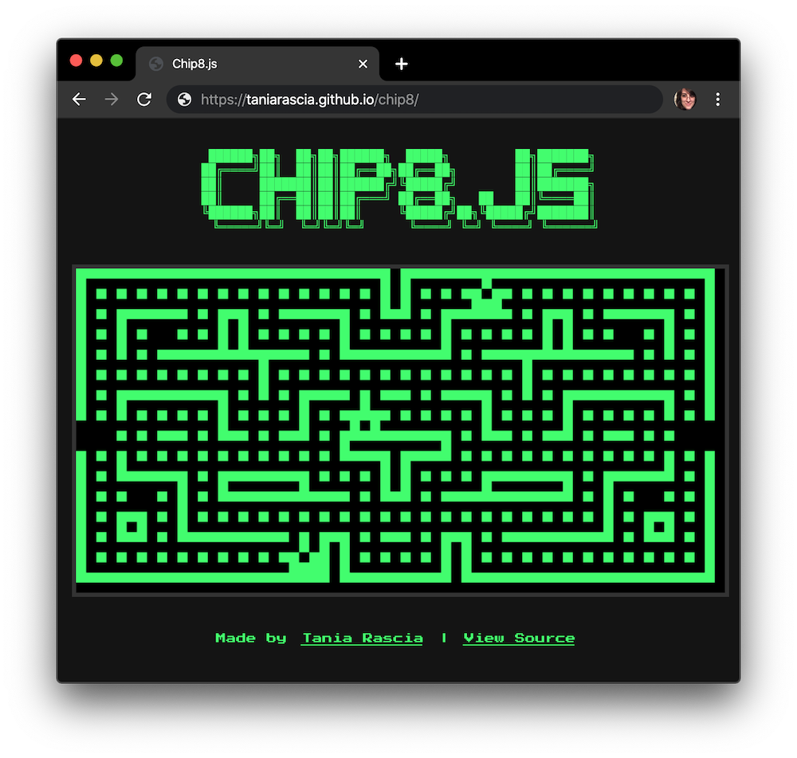
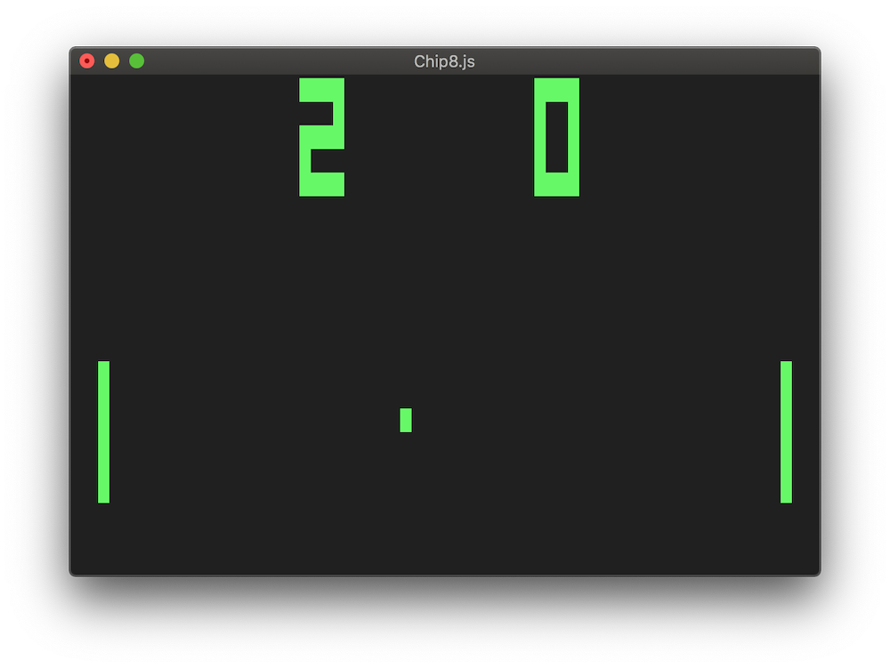
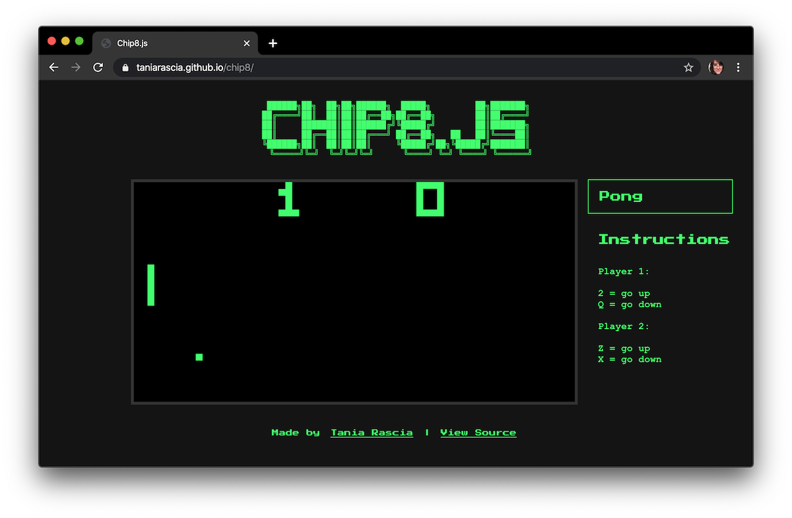
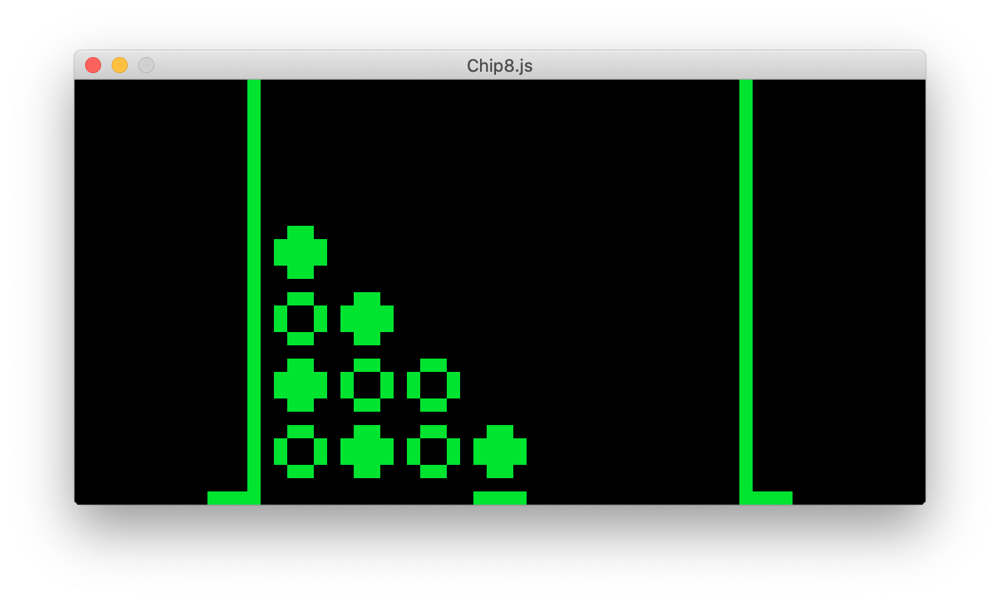

I spent a good portion of my childhood playing emulated NES and SNES games on my computer, but I never imagined I'd write an emulator myself one day. However, my boyfriend Vanya challenged me to write a [Chip-8](https://en.wikipedia.org/wiki/CHIP-8) interpreter to learn some of the basic concepts of lower-level programming languages and how a CPU works, and the end result is a Chip-8 emulator in JavaScript that I wrote with his guidance.

Although there are endless implementations of the Chip-8 interpreter in every programming language imaginable, this one is a bit unique. My Chip8.js code interfaces with not just one but three environments, existing as a web app, a CLI app, and a native app.

You can take a look at the web app demo and the source here:

- [Demo](https://taniarascia.github.io/chip8/)
- [Source code](https://github.com/taniarascia/chip8)

There are plenty of guides on how to make a Chip-8 emulator, such as [Mastering Chip8](http://mattmik.com/files/chip8/mastering/chip8.html), [How to Write an Emulator](http://www.multigesture.net/articles/how-to-write-an-emulator-Chip-8-interpreter/), and most importantly, [Cowgod's Chip-8 Technical Reference](http://devernay.free.fr/hacks/chip8/C8TECH10.HTM), the primary resource used for my own emulator, and a website so old it ends in `.HTM`. As such, this isn't intended to be a how-to guide, but an overview of how I built the emulator, what major concepts I learned, and some JavaScript specifics for making a browser, CLI, or native app.



#### Contents

- [What is Chip-8](#what-is-chip-8)
- [What Goes Into a Chip-8 Interpreter?](#what-goes-into-a-chip-8-interpreter)
- [Decoding Chip-8 Instructions](#decoding-chip-8-instructions)
- [Reading the ROM](#reading-the-rom-data-buffer)
- [The Instruction Cycle - Fetch, Decode, Execute](#the-instruction-cycle---fetch-decode-execute)
- [Creating a CPU Interface for I/O](#creating-a-cpu-interface-for-i-o)
  - [CLI App - Interfacing with the Terminal](#cli-app---interfacing-with-the-terminal)
  - [Web App - Interfacing with the Browser](#web-app---interfacing-with-the-browser)
  - [Native App - Interfacing with the Native Platform](#native-app---interfacing-with-the-native-platform)

## What is Chip-8?

I had never heard of Chip-8 before embarking on this project, so I assume most people haven't either unless they're already into emulators. Chip-8 is a very simple interpreted programming language that was developed in the 1970s for hobbyist computers. People wrote basic Chip-8 programs that mimicked popular games of the time, such as Pong, Tetris, Space Invaders, and probably other unique games lost to the annuls of time.

A virtual machine that plays these games is actually a Chip-8 [_interpreter_](<https://en.wikipedia.org/wiki/Interpreter_(computing)>), not technically an [_emulator_](https://en.wikipedia.org/wiki/Emulator), as an emulator is software that emulates the hardware of a specific machine, and Chip-8 programs aren't tied to any hardware in specific. Often, Chip-8 interpreters were used on graphing calculators.

Nonetheless, it's close enough to being an emulator that it's usually the starting project for anyone who wants to learn how to build an emulator, since it's significantly more simple than creating an NES emulator or anything beyond that. It's also a good starting point for a lot of CPU concepts in general, like memory, stacks, and I/O, things I deal with on a daily basis in the infinitely more complex world of a JavaScript runtime.

## What Goes Into a Chip-8 Interpreter?

There was a lot of pre-learning I had to do to even get started understanding what I was working with, since I had never learned about computer science basics before. So I wrote [Understanding Bits, Bytes, Bases, and Writing a Hex Dump in JavaScript](https://www.taniarascia.com/bits-bytes-bases-and-a-hex-dump-javascript/) which goes over much of that.

To summarize, there are two major takeaways of that article:

- **Bits and Bytes** - A bit is a binary digit - `0` or `1`, `true` or `false`, on or off. Eight bits is a byte, which is the basic unit of information that computers work with.
- **Number Bases** - Decimal is the base number system we're most used to dealing with, but computers usually work with binary (base 2) or hexadecimal (base 16). `1111` in binary, `15` in decimal, and `f` in hexadecimal are all the same number.
- **Nibbles** - Also, 4 bits is a nibble, which is cute, and I had to deal with them a bit in this project.
- **Prefixes** - In JavaScript, `0x` is a prefix for a hex number, and `0b` is a prefix for a binary number.

I also wrote [a CLI snake game](https://www.taniarascia.com/snake-game-in-javascript/) in preparation of figuring out how to work with pixels in the terminal for this project.

A **CPU** is the main processor of a computer that executes the instructions of a program. In this case, it consists of various bits of state, described below, and an instruction cycle with **fetch, decode, and execute** steps.

- [Memory](#memory)
- [Program counter](#program-counter)
- [Registers](#registers)
- [Index register](#index-register)
- [Stack](#stack)
- [Stack pointer](#stack-pointer)
- [Key input](#key-input)
- [Graphical output](#graphical-output)
- [Timers](#timers)

### Memory

Chip-8 can access up to **4 kilobytes of memory** (RAM). (That's `0.002%` of the storage space on a floppy disk.) The vast majority of data in the CPU is stored in memory.

4kb is `4096` bytes, and JavaScript has some helpful [typed arrays](https://developer.mozilla.org/en-US/docs/Web/JavaScript/Typed_arrays), like [Uint8Array](https://developer.mozilla.org/en-US/docs/Web/JavaScript/Reference/Global_Objects/Uint8Array) which is a fixed-size array of a certain element - in this case 8-bits.

```js
let memory = new Uint8Array(4096)
```

You can access and use this array like a regular array, from `memory[0]` to `memory[4095]` and set each element to a value up to `255`. Anything above that will fall back to that (for example, `memory[0] = 300` would result in `memory[0] === 255`).

### Program counter

The program counter stores the address of the current instruction as an **16-bit integer**. Every single instruction in Chip-8 will update the program counter (PC) when it is done to go on to the next instruction, by accessing memory with PC as the index.

In the Chip-8 memory layout, `0x000` to `0x1FF` in memory is reserved, so it starts at `0x200`.

```js
let PC = 0x200 // memory[PC] will access the address of  the current instruvtion
```

<small><em>\*You'll notice the memory array is 8-bit and the PC is a 16-bit integer, so two program codes will be combined to make a big endian opcode.</em></small>

### Registers

Memory is generally used for long-term storage and program data, so registers exist as a kind of "short-term memory" for immediate data and computations. Chip-8 has **16 8-bit registers**. They're referred as `V0` through `VF`.

```js
let registers = new Uint8Array(16)
```

### Index register

There is a special **16-bit register** that accesses a specific point in memory, referred to as `I`. The `I` register exists mostly for reading and writing to memory in general, since the addressable memory is 16-bit as well.

```js
let I = 0
```

### Stack

Chip-8 has the ability to go into [subroutines](https://en.wikipedia.org/wiki/Subroutine), and a stack for keeping track of where to return to. The stack is **16 16-bit values**, meaning the program can go into 16 nested subroutines before experiencing a "stack overflow".

```js
let stack = new Uint16Array(16)
```

### Stack pointer

The stack pointer (SP) is an `8-bit` integer that points to a location in the stack. It only needs to be 8-bit even though the stack is 16-bit because it's only referencing the index of the stack, so only needs to be `0` thorough `15`.

```js
let SP = -1

// stack[SP] will access the current return address in the stack
```

### Timers

Chip-8 is capable of a glorious single beep as far as sound goes. To be honest, I didn't bother implementing an actual output for the "music", though the CPU itself is all set up to interface properly with it. There are two timers, both **8-bit registers** - a sound timer (ST) for deciding when to beep and a delay timer (DT) for timing some events throughout the game. They count down at **60 Hz**.

```js
let DT = 0
let ST = 0
```

### Key input

Chip-8 was set up to interface with the amazing hex keyboard. It looked like this:

```terminal
┌───┬───┬───┬───┐
│ 1 │ 2 │ 3 │ C │
│ 4 │ 5 │ 6 │ D │
│ 7 │ 8 │ 9 │ E │
│ A │ 0 │ B │ F │
└───┴───┴───┴───┘
```

In practice, only a few of the keys seem to be used, and you can map them to whatever 4x4 grid you want, but they're pretty inconsistent between games.

### Graphical output

Chip-8 uses a monochromatic `64x32` resolution display. Each pixel is either on or off.

Sprites that can be saved in memory are `8x15` - eight pixels wide by fifteen pixels high. Chip-8 also comes with a font set, but it only contains the characters in the hex keyboard, so not overall the most useful font set.

### CPU

Put it all together, and you get the CPU state.

<div class="filename">CPU</div>

```js
class CPU {
  constructor() {
    this.memory = new Uint8Array(4096)
    this.registers = new Uint8Array(16)
    this.stack = new Uint16Array(16)
    this.ST = 0
    this.DT = 0
    this.I = 0
    this.SP = -1
    this.PC = 0x200
  }
}
```

## Decoding Chip-8 Instructions

Chip-8 has 36 instructions. All the instructions [are listed here](http://devernay.free.fr/hacks/chip8/C8TECH10.HTM#3.1). All instructions are 2 bytes (16-bits) long. Each instruction is encoded by an opcode (operation code) and operand, the data being operated on.

An example of an instruction could be like this operation on two variables:

```
x = 1
y = 2

ADD x, y
```

In which `ADD` is the `opcode` and `x`, `y` are the operands. This type of language is known as an assembly language. This instruction would map to:

```js
x = x + y
```

With this instruction set I'll have to store this data in 16-bits, so every instrution ends up being a number from `0x0000` to `0xffff`. Each digit position in these sets is a nibble (4-bit).

So how can I get from `nnnn` to something like `ADD x, y`, that is a little more understandable? Well, I'll start by looking at one of the instructions from Chip-8, which is basically the same as the above example:

| Instruction | Description  |
| ----------- | ------------ |
| `8xy4`      | `ADD Vx, Vy` |

So what are we dealing with here? There's one keyword, `ADD`, and two arguments, `Vx` and `Vy`, which we've established above are registers.

There are several opcode mnemonics (which are like keywords), such as:

- `ADD` (add)
- `SUB` (subtract)
- `JP` (jump)
- `SKP` (skip)
- `RET` (return)
- `LD` (load)

And there are several type of operand values, such as:

- Address (`I`)
- Register (`Vx`, `Vy`)
- Constant (`N` or `NN` for nibble or byte)

The next step is to find a way to interpret the 16-bit opcode as these more understandable instructions.

### Bit Masking

Each instruction contains a pattern that will always be the same, and variables that can change. For `8xy4`, the pattern is `8__4`. The two nibbles in the middle are the variables. By creating a [bitmask](<https://en.wikipedia.org/wiki/Mask_(computing)>) for that pattern, I can determine the instruction.

To mask, you use the bitwise AND (`&`) with a mask and match it to a pattern. So if the instruction `8124` came up, you would want to make sure the nibble in position 1 and 4 are on (passed through) and the nibble in position 2 and 3 are off (masked out). The mask then becomes `f00f`.

```js
const opcode = 0x8124
const mask = 0xf00f
const pattern = 0x8004

const isMatch = (opcode & mask) === pattern // true
```

```
  8124
& f00f
  ====
  8004
```

Similarly, `0f00` and `00f0` will mask the variables, and right-shifting (`>>`) them will access the correct nibble.

```js
const x = (0x8124 & 0x0f00) >> 8 // 1

// (0x8124 & 0x0f00) is 100000000 in binary
// right shifting by 8 (>> 8) will remove 8 zeroes from the right
// This leaves us with 1

const y = (0x8124 & 0x00f0) >> 4 // 2
// (0x8124 & 0x00f0) is 100000 in binary
// right shifting by 4 (>> 4) will remove 4 zeroes from the right
// This leaves us with 10, the binary equivalent of 2
```

So for each of the 36 instructions, I made an object with a unique identifier, mask, pattern, and arguments.

```js
const instruction = {
  id: 'ADD_VX_VY',
  name: 'ADD',
  mask: 0xf00f,
  pattern: 0x8004,
  arguments: [
    { mask: 0x0f00, shift: 8, type: 'R' },
    { mask: 0x00f0, shift: 4, type: 'R' }
  ]
}
```

Now that I have these objects, each opcode can be disassembled into a unique identifier, and the values of the arguments can be determined. I made an `INSTRUCTION_SET` array containing all these instructions and a disassembler. I also wrote [tests for every one](https://github.com/taniarascia/chip8/blob/master/tests/cpu.test.js) to ensure they all worked correctly.

<div class="filename">Disassembler</div>

```js
function disassemble(opcode) {
  // Find the instruction from the opcode
  const instruction = INSTRUCTION_SET.find(
    instruction => (opcode & instruction.mask) === instruction.pattern
  )
  // Find the argument(s)
  const args = instruction.arguments.map(arg => (opcode & arg.mask) >> arg.shift)

  // Return an object containing the instruction data and arguments
  return { instruction, args }
}
```

## Reading the ROM

Since we're considering this project an emulator, each Chip-8 program file can be considered a ROM. The ROM is just binary data, and we're writing the program to interpret it. We can imagine the Chip8 CPU to be a virtual console, and a Chip-8 ROM to be a virtual game cartridge.

The ROM buffer will take the raw binary file and translate it into 16-bit big endian words (a word is a unit of data consisting of a set amount of bits). This is where that [hex dump article](/bits-bytes-bases-and-a-hex-dump-javascript/) comes in handy. I'm collecting the binary data and converting it into blocks that I can use, in this case the 16-bit opcodes. Big endian means that the most significant byte will be first in the buffer, so when it encounters the two bytes `12 34`, it will create a `1234` 16-bit code. A little endian code would look like `3412`.

<div class="filename">RomBuffer.js</div>

```js
class RomBuffer {
  /**
   * @param {binary} fileContents ROM binary
   */
  constructor(fileContents) {
    this.data = []

    // Read the raw data buffer from the file
    const buffer = fileContents

    // Create 16-bit big endian opcodes from the buffer
    for (let i = 0; i < buffer.length; i += 2) {
      this.data.push((buffer[i] << 8) | (buffer[i + 1] << 0))
    }
  }
}
```

The data returned from this buffer is the "game".

The CPU will have a `load()` method - like loading a cartridge into a console - that will take the data from this buffer and place it into memory. Both the buffer and memory act as arrays in JavaScript, so loading the memory is just a matter of looping through the buffer and placing the bytes into the memory array.

## The Instruction Cycle - Fetch, Decode, Execute

Now I have the instruction set and game data all ready to be interpreted. The CPU just needs to do something with it. The [instruction cycle](https://en.wikipedia.org/wiki/Central_processing_unit#Operation) consists of three steps - fetch, decode, and execute.

- **Fetch** - Get the data stored in memory using the program counter
- **Decode** - Disassemble the 16-bit opcode to get the decoded instruction and argument values
- **Execute** - Perform the operation based on the decoded instruction and update the program counter

Here's a condensed and simplified version of how load, fetch, decode, and execute work in the code. These CPU cycle methods are private and not exposed.

The first step, `fetch`, will access the current opcode from memory.

<div class="filename">Fetch</div>

```js
// Get address value from memory
function fetch() {
  return memory[PC]
}
```

The next step, `decode`, will disassemble the opcode into the more understandable instruction set I created earlier.

<div class="filename">Decode</div>

```js
// Decode instruction
function decode(opcode) {
  return disassemble(opcode)
}
```

The last step, `execute`, will consist of a switch with all 36 instructions as cases, and perform the relevant operation for the one it finds, then update the program counter so the next fetch cycle finds the next opcode. Any error handling will go here as well, which will halt the CPU.

<div class="filename">Execute</div>

```js
// Execute instruction
function execute(instruction) {
  const { id, args } = instruction

  switch (id) {
    case 'ADD_VX_VY':
      // Perform the instruction operation
      registers[args[0]] += registers[args[1]]

      // Update program counter to next instruction
      PC = PC + 2
      break
    case 'SUB_VX_VY':
    // etc...
  }
}
```

What I end up with is the CPU, with all the state and the instruction cycle. There are two methods exposed on the CPU - `load`, which is the equivalent of loading a cartridge into a console with the `romBuffer` as the game, and `step`, which is the three functions of the instruction cycle (fetch, decode, execute). `step` will run in an infinite loop.

<div class="filename">CPU.js</div>

```js
class CPU {
  constructor() {
    this.memory = new Uint8Array(4096)
    this.registers = new Uint8Array(16)
    this.stack = new Uint16Array(16)
    this.ST = 0
    this.DT = 0
    this.I = 0
    this.SP = -1
    this.PC = 0x200
  }

  // Load buffer into memory
  load(romBuffer) {
    this.reset()

    romBuffer.forEach((opcode, i) => {
      this.memory[i] = opcode
    })
  }

  // Step through each instruction
  step() {
    const opcode = this._fetch()
    const instruction = this._decode(opcode)

    this._execute(instruction)
  }

  _fetch() {
    return this.memory[this.PC]
  }

  _decode(opcode) {
    return disassemble(opcode)
  }

  _execute(instruction) {
    const { id, args } = instruction

    switch (id) {
      case 'ADD_VX_VY':
        this.registers[args[0]] += this.registers[args[1]]
        this.PC = this.PC + 2
        break
    }
  }
}
```

Only one aspect of the project is missing now, and a pretty important one - the ability to actually play and see the game.

## Creating a CPU Interface for I/O

So now I have this CPU that's interpreting and executing instructions and updating all its own state, but I can't do anything with it yet. In order to play a game, you have to see it and be able to interact with it.

This is where [input/output](https://en.wikipedia.org/wiki/Input/output), or I/O, comes in. I/O is the communication between the CPU and the outside world.

- **Input** is data received by the CPU
- **Output** is data sent from the CPU

So for me, the input will be through the keyboard, and the output will be graphics onto the screen.

I could just mix the I/O code in with the CPU directly, but then I would be tied to one environment. By creating a generic CPU interface to connect the I/O and the CPU, I can interface with any system.

The first thing to do was look through the instructions and find any that have to do with I/O. A few examples of those instructions:

- `CLS` - Clear the screen
- `LD Vx, K` - Wait for a key press, store the value of the key in Vx.
- `DRW Vx, Vy, nibble` - Display n-byte sprite starting at memory location I

Based on that, we'll want the interface to have methods like:

- `clearDisplay()`
- `waitKey()`
- `drawPixel()` (`drawSprite` would have been 1:1, but it ended up to be easier doing it pixel-by-pixel from the interface)

JavaScript doesn't really have a concept of an abstract class as far as I could find, but I created one by making a class that could not itself be instantiated, with methods that can only be used from classes that extend it. Here are all the interface methods on the class:

<div class="filename">CpuInterface.js</div>

```js
// Abstract CPU interface class
class CpuInterface {
  constructor() {
    if (new.target === CpuInterface) {
      throw new TypeError('Cannot instantiate abstract class')
    }
  }

  clearDisplay() {
    throw new TypeError('Must be implemented on the inherited class.')
  }

  waitKey() {
    throw new TypeError('Must be implemented on the inherited class.')
  }

  getKeys() {
    throw new TypeError('Must be implemented on the inherited class.')
  }

  drawPixel() {
    throw new TypeError('Must be implemented on the inherited class.')
  }

  enableSound() {
    throw new TypeError('Must be implemented on the inherited class.')
  }

  disableSound() {
    throw new TypeError('Must be implemented on the inherited class.')
  }
}
```

Here's how it will work: the interface will be loaded into the CPU on initialization, and the CPU will be able to access methods on the interface.

```js
class CPU {
  // Initialize the interface
  constructor(cpuInterface) {
    this.interface = cpuInterface
  }

  _execute(instruction) {
    const { id, args } = instruction

    switch (id) {
      case 'CLS':
        // Use the interface while executing an instruction
        this.interface.clearDisplay()
  }
}
```

Before setting up the interface with any real environment (web, terminal, or native) I created a mock interface for tests. It doesn't actually hook up to any I/O but it helped me to set up the state of the interface and prepare it for real data. I'll ignore the sound ones, because that was never implemented with actual speaker output, so that leaves the keyboard and screen.

### Screen

The screen has a resolution of 64 pixels wide by 32 pixels tall. So as far as the CPU and interface is concerned, its a 64x32 grid of bits that are either on or off. To set up an empty screen, I can just make a 3D array of zeroes to represent all pixels being off. A [frame buffer](https://en.wikipedia.org/wiki/Framebuffer) is a portion of memory containing a bitmapped image that will be rendered to a display.

<div class="filename">MockCpuInterface.js</div>

```js
// Interface for testing
class MockCpuInterface extends CpuInterface {
  constructor() {
    super()

    // Store the screen data in the frame buffer
    this.frameBuffer = this.createFrameBuffer()
  }

  // Create 3D array of zeroes
  createFrameBuffer() {
    let frameBuffer = []

    for (let i = 0; i < 32; i++) {
      frameBuffer.push([])
      for (let j = 0; j < 64; j++) {
        frameBuffer[i].push(0)
      }
    }

    return frameBuffer
  }

  // Update a single pixel with a value (0 or 1)
  drawPixel(x, y, value) {
    this.frameBuffer[y][x] ^= value
  }
}
```

So I end up with something like this to represent the screen (when printing it as a newline-separated string):

```terminal
0000000000000000000000000000000000000000000000000000000000000000
0000000000000000000000000000000000000000000000000000000000000000
0000000000000000000000000000000000000000000000000000000000000000
...etc...
```

In the `DRW` function, the CPU will loop through the sprite it pulled from memory and update each pixel in the sprite (some details left out for brevity).

```js
case 'DRW_VX_VY_N':
  // The interpreter reads n bytes from memory, starting at the address stored in I
  for (let i = 0; i < args[2]; i++) {
    let line = this.memory[this.I + i]
      // Each byte is a line of eight pixels
      for (let position = 0; position < 8; position++) {
        // ...Get value, x, and y...
        this.interface.drawPixel(x, y, value)
      }
    }
```

The `clearDisplay()` function is the only other method that will be used for interacting with the screen. This is all the CPU interface needs for interacting with the screen.

### Keys

For keys, I mapped the original hex keyboard to the following 4x4 grid of keys:

```terminal
┌───┬───┬───┬───┐
│ 1 │ 2 │ 3 │ 4 │
│ Q │ W │ E │ R │
│ A │ S │ D │ F │
│ Z │ X │ C │ V │
└───┴───┴───┴───┘
```

I put the keys in an array.

```js
// prettier-ignore
const keyMap = [
  '1', '2', '3', '4',
  'q', 'w', 'e', 'r', 
  'a', 's', 'd', 'f', 
  'z', 'x', 'c', 'v'
]
```

And create some state to store the currently pressed keys.

```js
this.keys = 0
```

In the interface, `keys` is a binary number consisting of 16 digits where each index represents a key. Chip-8 just wants to know at any given time which keys are pressed out of the 16 and makes a decision based on that. A few examples below:

```js
0b1000000000000000 // V is pressed (keyMap[15], or index 15)
0b0000000000000011 // 1 and 2 are pressed (index 0, 1)
0b0000000000110000 // Q and W are pressed (index 4, 5)
```

Now if, for example, `V` is pressed (`keyMap[15]`) and the operand is `0xf` (decimal `15`), the key is pressed. Left shifting (`<<`) with `1` will create a binary number with a `1` followed by as many zeroes as are in the left shift.

```js
case 'SKP_VX':
  // Skip next instruction if key with the value of Vx is pressed
  if (this.interface.getKeys() & (1 << this.registers[args[0]])) {
   // Skip instruction
  } else {
    // Go to next instruction
  }
```

There is one other key method, `waitKey`, where the instruction is to wait for a keypress and return the key once pressed. 

## CLI App - Interfacing with the Terminal

The first interface I made was for the terminal. This was less familiar to me than working with the DOM as I have never made any sort of graphical app in terminal, but it wasn't too difficult.



[Curses](<https://en.wikipedia.org/wiki/Curses_(programming_library)>) is a library used to create text user interfaces in the terminal. [Blessed](https://github.com/chjj/blessed) is a library wrapping curses for Node.js.

### Screen

The frame buffer that contains the bitmap of the screen data is the same for all implementations, but the way the screen interfaces with each environment will be different.

With `blessed`, I just defined a screen object:

```js
this.screen = blessed.screen({ smartCSR: true })
```

And used `fillRegion` or `clearRegion` on the pixel with a full unicode block to fill it out, using the frameBuffer as the data source.

```js
drawPixel(x, y, value) {
  this.frameBuffer[y][x] ^= value

  if (this.frameBuffer[y][x]) {
    this.screen.fillRegion(this.color, '█', x, x + 1, y, y + 1)
  } else {
    this.screen.clearRegion(x, x + 1, y, y + 1)
  }

  this.screen.render()
}
```

### Keys

The key handler was not too different from what I would expect with the DOM. If a key is pressed, the handler passes the key along, which I can then use to find the index and update the keys object with any new additional keys that have been pressed.

```js
this.screen.on('keypress', (_, key) => {
  const keyIndex = keyMap.indexOf(key.full)

  if (keyIndex) {
    this._setKeys(keyIndex)
  }
})
```

The only particularly weird thing was that `blessed` didn't have a any keyup event that I could use, so I had to just simulate one by setting an interval that would periodically clear the keys.

```js
setInterval(() => {
  // Emulate a keyup event to clear all pressed keys
  this._resetKeys()
}, 100)
```

### Entrypoint

Everything is set up now - the rom buffer to convert the binary data to opcodes, the interface to connect I/O, the CPU containing state, the instruction cycle, and two exposed methods - one to load the game, and one to step through a cycle. So I create a `cycle` function which will run the CPU instructions in an infinite loop.

<div class="filename">terminal.js</div>

```js
const fs = require('fs')
const { CPU } = require('../classes/CPU')
const { RomBuffer } = require('../classes/RomBuffer')
const { TerminalCpuInterface } = require('../classes/interfaces/TerminalCpuInterface')

// Retrieve the ROM file
const fileContents = fs.readFileSync(process.argv.slice(2)[0])

// Initialize the terminal interface
const cpuInterface = new TerminalCpuInterface()

// Initialize the CPU with the interface
const cpu = new CPU(cpuInterface)

// Convert the binary code into opcodes
const romBuffer = new RomBuffer(fileContents)

// Load the game
cpu.load(romBuffer)

function cycle() {
  cpu.step()

  setTimeout(cycle, 3)
}

cycle()
```

<small><em>There is also a delay timer in the cycle function, but I removed it from the example for clarity.</em></small>

Now I can run a script of the terminal entrypoint file and pass a ROM as the argument to play the game.

```bash
npm run play:terminal roms/PONG
```

## Web App - Interfacing with the Browser

The next interface I made was for the web, communicating with the browser and the DOM. I made this version of the emulator a bit more fancy, since the browser is more of my familiar environment and I can't resist the urge to make retro looking websites. This one also allows you to switch between games.



### Screen

For the screen, I used the [Canvas API](https://developer.mozilla.org/en-US/docs/Web/API/Canvas_API), which uses [CanvasRenderingContext2D](https://developer.mozilla.org/en-US/docs/Web/API/CanvasRenderingContext2D) for the drawing surface. Using `fillRect` with canvas was basically the same as `fillRegion` in blessed.

```js
this.screen = document.querySelector('canvas')
this.context = this.screen.getContext('2d')
this.context.fillStyle = 'black'
this.context.fillRect(0, 0, this.screen.width, this.screen.height)
```

One slight difference I made here is I multiplied all the pixels by 10 so the screen would be more visible.

```js
this.multiplier = 10
this.screen.width = DISPLAY_WIDTH * this.multiplier
this.screen.height = DISPLAY_HEIGHT * this.multiplier
```

This made the `drawPixel` command more verbose, but otherwise the same concept.

```js
drawPixel(x, y, value) {
  this.frameBuffer[y][x] ^= value

  if (this.frameBuffer[y][x]) {
    this.context.fillStyle = COLOR
    this.context.fillRect(
      x * this.multiplier,
      y * this.multiplier,
      this.multiplier,
      this.multiplier
    )
  } else {
    this.context.fillStyle = 'black'
    this.context.fillRect(
      x * this.multiplier,
      y * this.multiplier,
      this.multiplier,
      this.multiplier
    )
  }
}
```

### Keys

I had access to a lot more key event handlers with the DOM, so I was able to easily handle the keyup and keydown events without any hacks.

```js
// Set keys on key down
document.addEventListener('keydown', event => {
  const keyIndex = keyMap.indexOf(event.key)

  if (keyIndex) {
    this._setKeys(keyIndex)
  }
})

// Reset keys on keyup
document.addEventListener('keyup', event => {
  this._resetKeys()
})
}
```

### Entrypoint

I handled working with the modules by importing all of them and setting them to the global object, then using [Browserify](http://browserify.org/) to use them in the browser. Setting them to the global makes them available on the window so I could use the code output in a browser script. Nowadays I might use Webpack or something else for this, but it was quick and simple.

<div class="filename">web.js</div>

```js
const { CPU } = require('../classes/CPU')
const { RomBuffer } = require('../classes/RomBuffer')
const { WebCpuInterface } = require('../classes/interfaces/WebCpuInterface')

const cpuInterface = new WebCpuInterface()
const cpu = new CPU(cpuInterface)

// Set CPU and Rom Buffer to the global object, which will become window in the
// browser after bundling.
global.cpu = cpu
global.RomBuffer = RomBuffer
```

The web entrypoint uses the same `cycle` function as the terminal implementation, but has a function to fetch each ROM and reset the display every time a new one is selected. I'm used to working with json data and fetch, but in this case I fetched the raw `arrayBuffer` from the response.

```js
// Fetch the ROM and load the game
async function loadRom() {
  const rom = event.target.value
  const response = await fetch(`./roms/${rom}`)
  const arrayBuffer = await response.arrayBuffer()
  const uint8View = new Uint8Array(arrayBuffer)
  const romBuffer = new RomBuffer(uint8View)

  cpu.interface.clearDisplay()
  cpu.load(romBuffer)
}

// Add the ability to select a game
document.querySelector('select').addEventListener('change', loadRom)
```

The HTML includes a `canvas` and a `select`.

```html
<canvas></canvas>
<select>
  <option disabled selected>Load ROM...</option>
  <option value="CONNECT4">Connect4</option>
  <option value="PONG">Pong</option>
</select>
```

Then I just deployed the code onto GitHub pages because it's static.

## Native App - Interfacing with the Native Platform

I also made an experimental native UI implementation. I used [Raylib](https://www.raylib.com/), a programming library for programming simple games that had bindings for [Node.js](https://github.com/RobLoach/node-raylib).



I consider this version experimental just because it's really slow compared to the other ones, so it's less usable, but everything works correctly with the keys and screen. 

### Entrypoint

Raylib works a bit differently than the other implementations because Raylib itself runs in a loop, meaning I won't end up using the `cycle` function.

```js
const r = require('raylib')

// As long as the window shouldn't close...
while (!r.WindowShouldClose()) {
  // Fetch, decode, execute
  cpu.step()

  r.BeginDrawing()
  // Paint screen with amy changes
  r.EndDrawing()
}

r.CloseWindow()
```

### Screen

Within the `beginDrawing()` and `endDrawing()` methods, the screen will update. For the Raylib implementation I accessed the interface directly from the script instead of keeping everything contained in the interface, but it works.

```js
r.BeginDrawing()

cpu.interface.frameBuffer.forEach((y, i) => {
  y.forEach((x, j) => {
    if (x) {
      r.DrawRectangleRec({ x, y, width, height }, r.GREEN)
    } else {
      r.DrawRectangleRec({ x, y, width, height }, r.BLACK)
    }
  })
})

r.EndDrawing()
```

### Keys

Getting the keys to work on Raylib was the last thing I worked on. It was more difficult to figure out because I had to do everything in the `IsKeyDown` method - there was a `GetKeyPressed` method, but it had side effects and caused problems. So instead of just waiting for a keypress like the other implementations, I had to loop through all keys and check if they were down, and append them to the key bitmask if so.

```js
let keyDownIndices = 0
// Run through all possible keys
for (let i = 0; i < nativeKeyMap.length; i++) {
  const currentKey = nativeKeyMap[i]
  // If key is already down, add index to key down map
  // This will also lift up any keys that aren't pressed
  if (r.IsKeyDown(currentKey)) {
    keyDownIndices |= 1 << i
  }
}

// Set all pressed keys
cpu.interface.setKeys(keyDownIndices)
```

That's it for the native implementation. It was more of a challenge than the other ones, but I'm glad I did it to round out the interface and see how well it would work on drastically different platforms.

## Conclusion

So that's my Chip-8 project! Once again, you can [check out the source](https://github.com/taniarascia/chip8) on GitHub. I learned a lot about lower level programming concepts and how a CPU operates, and also about the capabilities of JavaScript outside of a browser app or REST API server. I still have a few things left to do in this project, like attempt to make a (very) simple game, but the emulator is complete, and I'm proud to have finished it.